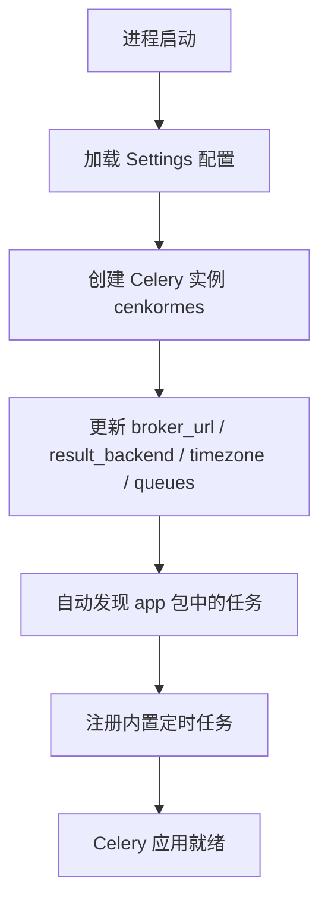
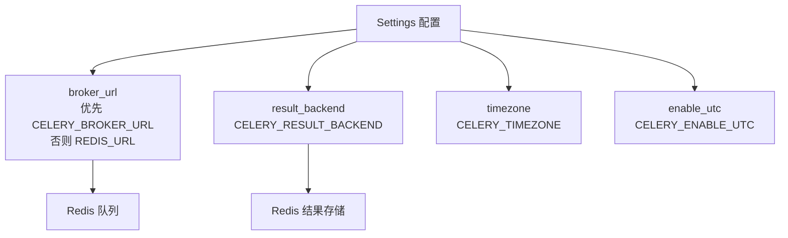
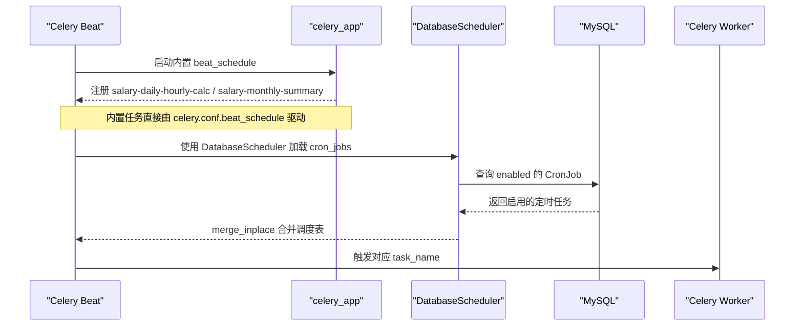
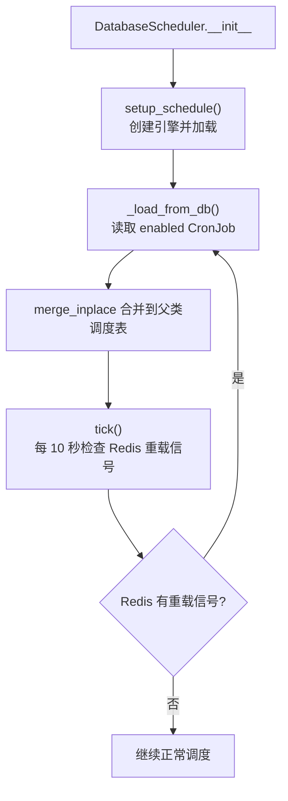
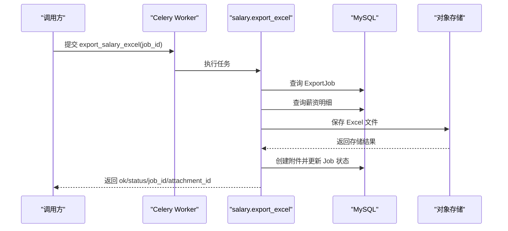
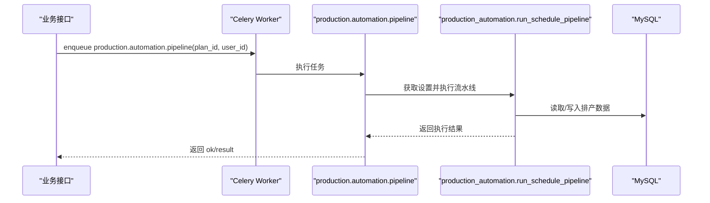
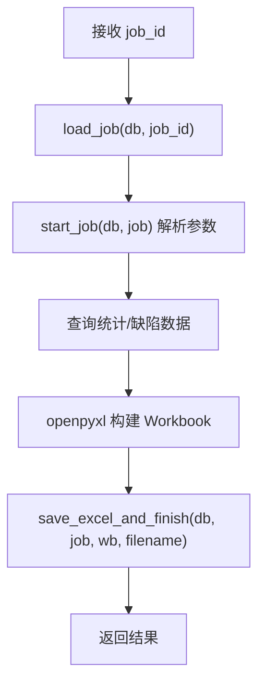
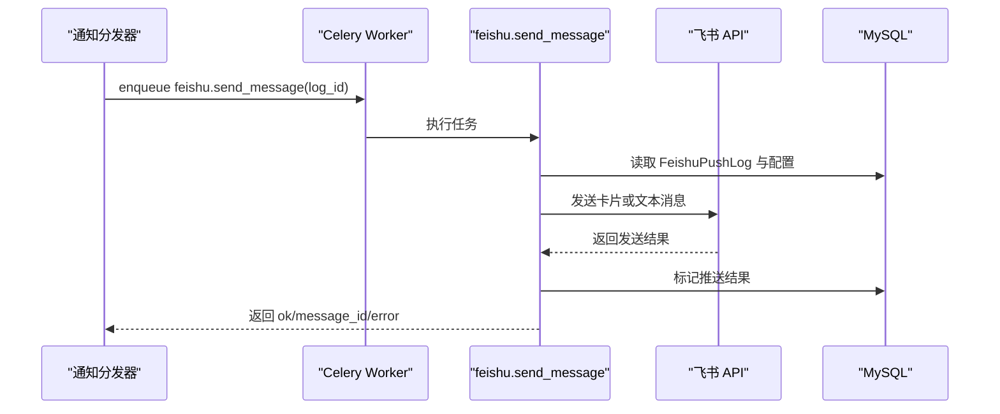
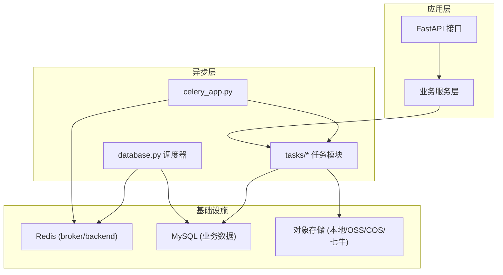

# Celery 异步任务与自动化

<cite>
**本文引用的文件**   
- [backend/app/celery_app.py](file://backend/app/celery_app.py)
- [backend/app/core/config.py](file://backend/app/core/config.py)
- [backend/app/schedulers/database.py](file://backend/app/schedulers/database.py)
- [backend/app/tasks/__init__.py](file://backend/app/tasks/__init__.py)
- [backend/app/tasks/salary.py](file://backend/app/tasks/salary.py)
- [backend/app/tasks/production.py](file://backend/app/tasks/production.py)
- [backend/app/tasks/report_exports.py](file://backend/app/tasks/report_exports.py)
- [backend/app/tasks/notify.py](file://backend/app/tasks/notify.py)
</cite>

## 目录
1. [引言](#引言)
2. [Celery 配置总览](#celery-配置总览)
3. [Broker 与 Backend 配置](#broker-与-backend-配置)
4. [任务定义与模块组织](#任务定义与模块组织)
5. [调度机制：内置 Beat 与数据库调度器](#调度机制内置-beat-与数据库调度器)
6. [关键任务流程分析](#关键任务流程分析)
7. [依赖关系与架构视图](#依赖关系与架构视图)
8. [性能与可靠性要点](#性能与可靠性要点)
9. [常见问题排查](#常见问题排查)
10. [结论](#结论)

## 引言
本说明聚焦 CenkorMES 后端中 Celery 的 broker/backend 配置、任务定义方式以及调度机制。项目采用 FastAPI + SQLAlchemy + Alembic + Celery，使用 Redis 作为消息队列和结果存储，并通过自定义数据库调度器实现可热重载的定时任务管理。Celery 相关代码集中在 `app/celery_app.py`、`app/tasks/*` 与 `app/schedulers/database.py`，业务任务覆盖薪资计算、生产排产自动化、报表导出与飞书通知等场景。

## Celery 配置总览
Celery 应用入口位于 `backend/app/celery_app.py`。该文件完成以下工作：
- 创建名为 `cenkormes` 的 Celery 实例。
- 从 `app.core.config.Settings` 读取 Redis URL、时区、UTC 开关、序列化格式等配置。
- 设置默认队列 `celery`。
- 自动发现 `app` 包下的任务模块。
- 定义内置 Beat 定时任务，并维护供系统初始化的默认 Cron 任务清单。



**图表来源**
- [backend/app/celery_app.py:10-25](file://backend/app/celery_app.py#L10-L25)
- [backend/app/celery_app.py:27-36](file://backend/app/celery_app.py#L27-L36)

**章节来源**
- [backend/app/celery_app.py:1-71](file://backend/app/celery_app.py#L1-L71)

## Broker 与 Backend 配置
### 配置来源
Celery 的 broker 与 backend 由 `app.core.config.Settings` 提供：
- `REDIS_URL`：Redis 连接串，默认指向本地 `redis://127.0.0.1:6379/0`。
- `CELERY_BROKER_URL`：Celery 消息队列地址；若未显式配置，则回退到 `REDIS_URL`。
- `CELERY_RESULT_BACKEND`：Celery 任务结果存储地址，默认指向另一个 Redis 库 `redis://127.0.0.1:6379/1`。
- `CELERY_TIMEZONE`：Celery 时区，默认 `Asia/Shanghai`。
- `CELERY_ENABLE_UTC`：是否启用 UTC。

### 配置映射
| 配置项 | 默认值 | 作用 | 说明 |
|---|---|---|---|
| `REDIS_URL` | `redis://127.0.0.1:6379/0` | Redis 通用连接串 | 被 Celery broker 与调度器重载信号使用 |
| `CELERY_BROKER_URL` | `redis://127.0.0.1:6379/0` | Celery 消息队列 | 未设置时回退到 `REDIS_URL` |
| `CELERY_RESULT_BACKEND` | `redis://127.0.0.1:6379/1` | Celery 任务结果存储 | 建议与 broker 使用不同 Redis 库 |
| `CELERY_TIMEZONE` | `Asia/Shanghai` | Celery 时区 | 影响 Beat 定时任务时间 |
| `CELERY_ENABLE_UTC` | `True` | 是否启用 UTC | 配合时区控制任务执行时间 |



**图表来源**
- [backend/app/celery_app.py:11-23](file://backend/app/celery_app.py#L11-L23)
- [backend/app/core/config.py:43-47](file://backend/app/core/config.py#L43-L47)

**章节来源**
- [backend/app/celery_app.py:11-23](file://backend/app/celery_app.py#L11-L23)
- [backend/app/core/config.py:43-47](file://backend/app/core/config.py#L43-L47)

## 任务定义与模块组织
Celery 任务通过 `celery.shared_task` 装饰器定义，并以字符串形式指定任务名，便于 Beat 与外部调用引用。任务模块按业务域拆分：
- `tasks/salary.py`：薪资相关任务，包括计件工资补漏、工资条生成、Excel 导出、每日计时工资计算、月度汇总。
- `tasks/production.py`：生产排产自动化流水线任务。
- `tasks/report_exports.py`：产量与良率报表 Excel 导出任务。
- `tasks/notify.py`：飞书消息推送、延迟消息刷新、待处理推送补偿扫描。
- `tasks/decorators.py`：任务装饰器（例如数据库事务封装）。
- `tasks/_excel_utils.py`、`tasks/_sync_excel.py`：Excel 工具与同步辅助。

`tasks/__init__.py` 主动导入各子模块，确保 Celery 自动发现能加载所有任务。

```mermaid
classDiagram
class SalaryTasks {
+export_salary_excel(job_id)
+daily_hourly_calc()
+monthly_salary_summary()
}
class ProductionTasks {
+production_automation_pipeline(plan_id, user_id, trigger)
}
class ReportExportTasks {
+export_production_excel(job_id)
+export_yield_excel(job_id)
}
class NotifyTasks {
+feishu_send_message(log_id)
+feishu_flush_deferred(db)
+push_scan_pending(db)
}
SalaryTasks <.. "shared_task" : "salary.*"
ProductionTasks <.. "shared_task" : "production.*"
ReportExportTasks <.. "shared_task" : "report.*"
NotifyTasks <.. "shared_task" : "feishu.*, push.*"
```

**图表来源**
- [backend/app/tasks/salary.py:175-348](file://backend/app/tasks/salary.py#L175-L348)
- [backend/app/tasks/production.py:7-39](file://backend/app/tasks/production.py#L7-L39)
- [backend/app/tasks/report_exports.py:32-159](file://backend/app/tasks/report_exports.py#L32-L159)
- [backend/app/tasks/notify.py:16-187](file://backend/app/tasks/notify.py#L16-L187)

**章节来源**
- [backend/app/tasks/__init__.py:1-4](file://backend/app/tasks/__init__.py#L1-L4)
- [backend/app/tasks/salary.py:1-348](file://backend/app/tasks/salary.py#L1-L348)
- [backend/app/tasks/production.py:1-40](file://backend/app/tasks/production.py#L1-L40)
- [backend/app/tasks/report_exports.py:1-159](file://backend/app/tasks/report_exports.py#L1-L159)
- [backend/app/tasks/notify.py:1-187](file://backend/app/tasks/notify.py#L1-L187)

## 调度机制：内置 Beat 与数据库调度器
### 内置 Beat 定时任务
`celery_app.py` 中定义了内置 Beat 调度：
- `salary.daily_hourly_calc`：每天凌晨 1:00 执行，用于计算前一天的计时工资。
- `salary.monthly_summary`：每月 1 日 2:00 执行，用于汇总上月工资条。

同时维护 `DEFAULT_CRON_JOBS`，供系统初始化或默认 Cron 任务管理使用，包含生产自动化流水线扫描任务 `production.automation.pipeline`，每 5 分钟执行一次。



**图表来源**
- [backend/app/celery_app.py:27-70](file://backend/app/celery_app.py#L27-L70)
- [backend/app/schedulers/database.py:28-92](file://backend/app/schedulers/database.py#L28-L92)

### 基于数据库的调度器
`app/schedulers/database.py` 实现了 `DatabaseScheduler`，从 `cron_jobs` 表读取启用的定时任务，并通过 Redis 键 `celery:beat:reload` 支持热重载：
- 启动时建立数据库引擎，加载已启用任务。
- 每次 tick 检查 Redis 是否写入重载信号，若存在则重新从数据库加载。
- 释放数据库引擎连接。



**图表来源**
- [backend/app/schedulers/database.py:28-99](file://backend/app/schedulers/database.py#L28-L99)

**章节来源**
- [backend/app/celery_app.py:27-70](file://backend/app/celery_app.py#L27-L70)
- [backend/app/schedulers/database.py:1-99](file://backend/app/schedulers/database.py#L1-L99)

## 关键任务流程分析
### 薪资导出任务
`salary.export_excel` 负责将当月薪资明细导出为 Excel，并上传到对象存储，记录附件信息：
- 校验 ExportJob 是否存在且状态允许运行。
- 解析参数（月份、用户 ID）。
- 查询薪资明细并生成多列数据。
- 使用 openpyxl 生成 Excel，保存到当前激活存储后端。
- 创建附件记录并更新 ExportJob 状态为成功。



**图表来源**
- [backend/app/tasks/salary.py:175-283](file://backend/app/tasks/salary.py#L175-L283)

**章节来源**
- [backend/app/tasks/salary.py:175-283](file://backend/app/tasks/salary.py#L175-L283)

### 生产自动化流水线任务
`production.automation.pipeline` 在计划保存后触发，根据自动化设置选择优化引擎并执行排产流水线：
- 获取自动化设置。
- 调用服务层 `run_schedule_pipeline` 执行排产逻辑。
- 提交事务并返回结果。



**图表来源**
- [backend/app/tasks/production.py:7-39](file://backend/app/tasks/production.py#L7-L39)

**章节来源**
- [backend/app/tasks/production.py:1-40](file://backend/app/tasks/production.py#L1-L40)

### 报表导出任务
`report.production_excel` 与 `report.yield_excel` 分别导出产量与良率报表：
- 加载 ExportJob 并解析日期范围。
- 查询统计数据并生成多个 Sheet。
- 使用统一工具函数保存 Excel 并更新 Job 状态。



**图表来源**
- [backend/app/tasks/report_exports.py:32-159](file://backend/app/tasks/report_exports.py#L32-L159)

**章节来源**
- [backend/app/tasks/report_exports.py:1-159](file://backend/app/tasks/report_exports.py#L1-L159)

### 飞书通知任务
`feishu.send_message` 负责将通知推送到飞书：
- 读取推送日志与配置。
- 根据目标类型（群聊/用户）与消息格式（卡片/文本）选择发送方式。
- 记录推送结果，并在失败时进行连续失败保护。



**图表来源**
- [backend/app/tasks/notify.py:16-149](file://backend/app/tasks/notify.py#L16-L149)

**章节来源**
- [backend/app/tasks/notify.py:1-187](file://backend/app/tasks/notify.py#L1-L187)

## 依赖关系与架构视图
Celery 在项目中承担异步与定时任务职责，依赖 Redis 作为消息通道与结果存储，依赖 MySQL 作为业务数据源，依赖对象存储作为文件输出目标。



**图表来源**
- [backend/app/celery_app.py:10-25](file://backend/app/celery_app.py#L10-L25)
- [backend/app/schedulers/database.py:37-92](file://backend/app/schedulers/database.py#L37-L92)
- [backend/app/tasks/salary.py:175-283](file://backend/app/tasks/salary.py#L175-L283)
- [backend/app/tasks/report_exports.py:32-159](file://backend/app/tasks/report_exports.py#L32-L159)
- [backend/app/tasks/notify.py:16-149](file://backend/app/tasks/notify.py#L16-L149)

## 性能与可靠性要点
- **队列隔离**：当前仅定义默认队列 `celery`，适合单队列部署；如需高吞吐，可按业务域拆分队列（如 `salary`、`report_export`、`notify`），并结合 worker 并发度调整。
- **结果存储分离**：broker 与 result_backend 建议使用不同 Redis 库，避免队列与结果竞争资源。
- **时区一致性**：Beat 定时任务受 `CELERY_TIMEZONE` 影响，需确保服务器时区与配置一致。
- **数据库连接池**：DatabaseScheduler 使用独立引擎与较小连接池，避免对主业务数据库造成压力。
- **错误恢复**：任务内部普遍使用 try/except 包裹数据库操作，失败时回滚并记录错误；飞书推送具备连续失败保护与延迟重试机制。
- **文件导出**：Excel 导出任务使用 openpyxl 内存构建，大报表需注意内存占用；必要时可分片写入或改用流式导出。

[本节为通用指导，不直接分析具体文件]

## 常见问题排查
- **无法消费任务**
  - 检查 `CELERY_BROKER_URL` 是否正确，是否与 Redis 实际地址一致。
  - 确认 worker 进程已启动并订阅了正确队列。
- **任务结果不可见**
  - 检查 `CELERY_RESULT_BACKEND` 是否指向可用 Redis。
  - 确认 Redis 权限与网络连通性。
- **定时任务未执行**
  - 检查 Beat 进程是否启动，是否使用 `DatabaseScheduler`。
  - 确认 `cron_jobs` 表中任务已启用且 cron 表达式正确。
  - 检查 Redis 中是否有重载信号导致频繁 reload。
- **飞书推送失败**
  - 检查飞书凭证与目标配置。
  - 查看推送日志状态与错误信息，关注连续失败保护是否触发。

**章节来源**
- [backend/app/celery_app.py:11-23](file://backend/app/celery_app.py#L11-L23)
- [backend/app/schedulers/database.py:78-92](file://backend/app/schedulers/database.py#L78-L92)
- [backend/app/tasks/notify.py:128-149](file://backend/app/tasks/notify.py#L128-L149)

## 结论
CenkorMES 的 Celery 体系以 `celery_app.py` 为中心，结合 `app.core.config.Settings` 完成 broker/backend 与时区配置，并通过 `app/schedulers/database.py` 实现基于数据库的可热重载定时任务。任务模块按业务域划分，覆盖薪资、生产自动化、报表导出与飞书通知等核心场景。整体设计清晰、职责明确，适合中小型制造系统的异步与定时任务需求。在生产环境中，建议进一步细化队列隔离、监控任务执行指标，并完善错误告警与重试策略。