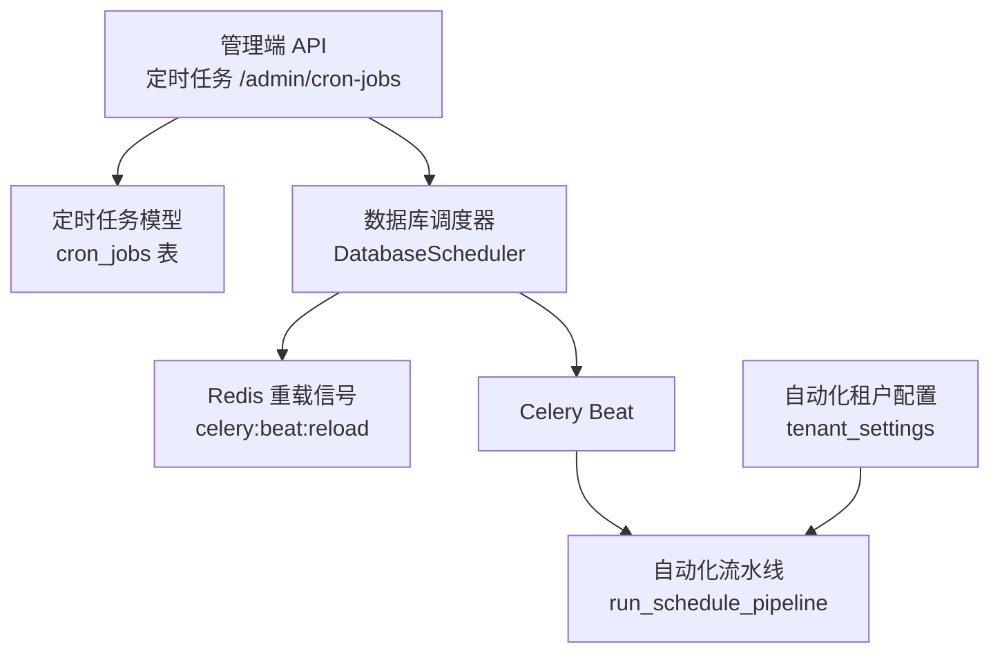
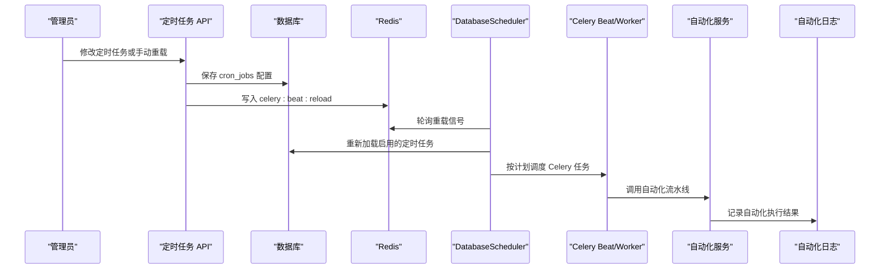
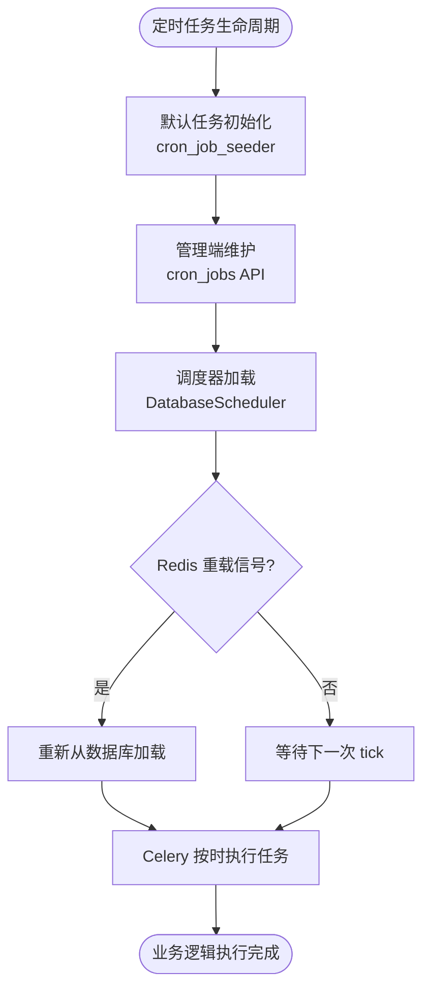
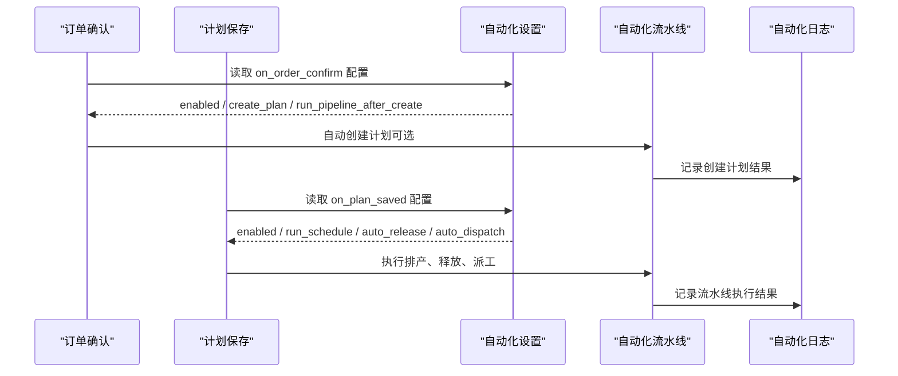
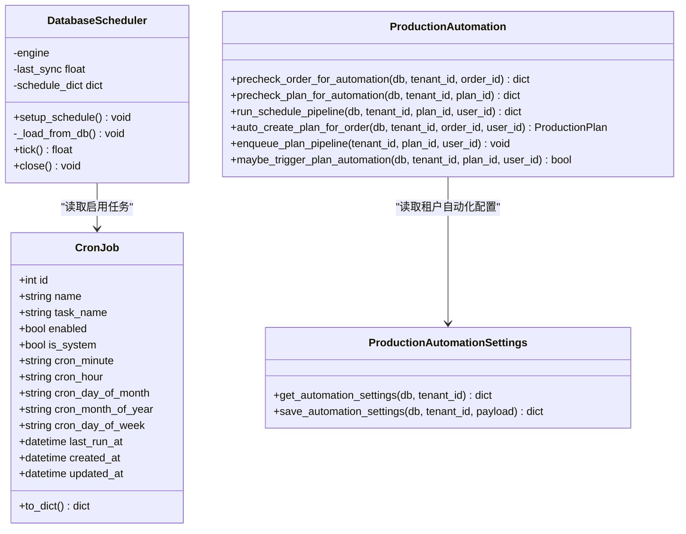

# 定时调度与自动化规则

<cite>
**本文引用的文件**   
- [backend/app/api/admin/cron_jobs.py](file://backend/app/api/admin/cron_jobs.py)
- [backend/app/models/cron_job.py](file://backend/app/models/cron_job.py)
- [backend/app/schedulers/database.py](file://backend/app/schedulers/database.py)
- [backend/app/services/cron_job_seeder.py](file://backend/app/services/cron_job_seeder.py)
- [backend/app/api/admin/automation/router.py](file://backend/app/api/admin/automation/router.py)
- [backend/app/services/production_automation_settings.py](file://backend/app/services/production_automation_settings.py)
- [backend/app/services/production_automation.py](file://backend/app/services/production_automation.py)
</cite>

## 目录
1. [引言](#引言)
2. [项目结构定位](#项目结构定位)
3. [核心组件](#核心组件)
4. [架构总览](#架构总览)
5. [详细组件分析](#详细组件分析)
6. [依赖关系分析](#依赖关系分析)
7. [性能与可靠性特征](#性能与可靠性特征)
8. [故障排查指南](#故障排查指南)
9. [结论](#结论)

## 引言
本文聚焦于 CenkorMES 后端中“定时任务”和“生产自动化”两条能力线，说明它们如何协作：  
- `cron_jobs` 是 Celery Beat 的调度配置层，负责“在什么时间执行哪个 Celery 任务”。  
- `automation` 是生产业务自动化规则层，负责“当订单确认或计划保存时，是否自动创建计划、排产、释放工单、派工”，并把结果写入自动化日志。  

二者不是同一概念：  
- `cron_jobs` 控制的是“系统级定时任务”的执行时机；  
- `automation` 控制的是“租户级生产流程自动化开关与策略”。  
但在实际运行中，定时任务可能通过 Celery 触发自动化流水线，从而把“时间驱动”和“事件驱动”的生产自动化串联起来。

## 项目结构定位
从代码分层看，本主题涉及以下模块：
- API 层：定时任务管理接口、自动化设置与日志查询接口。
- 模型层：定时任务持久化模型。
- 调度层：基于数据库的 Celery Beat 调度器。
- 服务层：生产自动化默认配置、自动化编排逻辑。

**图表来源**  
- [backend/app/api/admin/cron_jobs.py:37-86](file://backend/app/api/admin/cron_jobs.py#L37-L86)  
- [backend/app/models/cron_job.py:12-82](file://backend/app/models/cron_job.py#L12-L82)  
- [backend/app/schedulers/database.py:28-99](file://backend/app/schedulers/database.py#L28-L99)  
- [backend/app/services/production_automation.py:239-345](file://backend/app/services/production_automation.py#L239-L345)  
- [backend/app/services/production_automation_settings.py:14-47](file://backend/app/services/production_automation_settings.py#L14-L47)

**章节来源**  
- [backend/app/api/admin/cron_jobs.py:1-86](file://backend/app/api/admin/cron_jobs.py#L1-L86)  
- [backend/app/models/cron_job.py:1-82](file://backend/app/models/cron_job.py#L1-L82)  
- [backend/app/schedulers/database.py:1-99](file://backend/app/schedulers/database.py#L1-L99)  
- [backend/app/services/production_automation_settings.py:1-81](file://backend/app/services/production_automation_settings.py#L1-L81)  
- [backend/app/services/production_automation.py:1-490](file://backend/app/services/production_automation.py#L1-L490)

## 核心组件
### 定时任务模型与默认数据
- `CronJob` 模型定义调度唯一标识、Celery 任务路径、描述、启用状态、系统默认标记以及 cron 表达式字段。  
- `seed_default_cron_jobs` 将硬编码默认任务同步到 `cron_jobs` 表，用于初始化系统默认调度项。  
- `DEFAULT_CRON_JOBS` 由 Celery 应用提供，供前端参考和种子数据使用。

**章节来源**  
- [backend/app/models/cron_job.py:12-82](file://backend/app/models/cron_job.py#L12-L82)  
- [backend/app/services/cron_job_seeder.py:1-35](file://backend/app/services/cron_job_seeder.py#L1-L35)

### 定时任务管理 API
- 列出所有定时任务。  
- 更新某个定时任务的启用状态、cron 表达式和描述，并写入 Redis 重载信号。  
- 手动触发 Beat 重新加载调度配置。  
- 返回系统默认任务定义，便于前端展示参考。

**章节来源**  
- [backend/app/api/admin/cron_jobs.py:27-86](file://backend/app/api/admin/cron_jobs.py#L27-L86)

### 数据库调度器
- `DatabaseScheduler` 继承 Celery Beat 的 `Scheduler`，启动时从数据库读取启用的 `CronJob`，构造 Celery `crontab` 调度。  
- 每次 tick 检查 Redis 中的重载键，若存在则重新从数据库加载调度配置。  
- 关闭时释放数据库引擎连接。

**章节来源**  
- [backend/app/schedulers/database.py:28-99](file://backend/app/schedulers/database.py#L28-L99)

### 自动化设置与流水线
- 自动化设置以租户维度存储在 `tenant_settings`，默认关闭，包含订单确认后自动建计划、计划保存后自动排产/释放/派工、报工审核、每日简报、扫码告警等选项。  
- 自动化流水线根据引擎选择优化排产或直接正反向排程，并可按配置自动释放工单、自动派工。  
- 流水线失败会记录自动化日志，并向具备计划管理权限的用户发送通知，同时尝试推送飞书事件。

**章节来源**  
- [backend/app/services/production_automation_settings.py:14-81](file://backend/app/services/production_automation_settings.py#L14-L81)  
- [backend/app/services/production_automation.py:239-345](file://backend/app/services/production_automation.py#L239-L345)

## 架构总览
定时任务与自动化触发的整体关系如下：

**图表来源**  
- [backend/app/api/admin/cron_jobs.py:45-86](file://backend/app/api/admin/cron_jobs.py#L45-L86)  
- [backend/app/schedulers/database.py:48-92](file://backend/app/schedulers/database.py#L48-L92)  
- [backend/app/services/production_automation.py:239-345](file://backend/app/services/production_automation.py#L239-L345)

## 详细组件分析

### 定时任务调度链路
定时任务的生命周期包括：
1. 默认任务初始化：通过种子脚本将 `DEFAULT_CRON_JOBS` 写入 `cron_jobs` 表。  
2. 管理端维护：管理员通过 API 查看、编辑、启用/禁用定时任务。  
3. 调度器加载：`DatabaseScheduler` 启动时读取启用的任务，构建 Celery 调度字典。  
4. 热重载：管理端更新后写入 Redis，调度器每 10 秒检查并重载。  
5. 任务执行：Celery Beat 按 crontab 触发对应 Celery 任务，Worker 执行具体业务逻辑。

**图表来源**  
- [backend/app/services/cron_job_seeder.py:10-35](file://backend/app/services/cron_job_seeder.py#L10-L35)  
- [backend/app/api/admin/cron_jobs.py:37-86](file://backend/app/api/admin/cron_jobs.py#L37-L86)  
- [backend/app/schedulers/database.py:48-92](file://backend/app/schedulers/database.py#L48-L92)

**章节来源**  
- [backend/app/services/cron_job_seeder.py:1-35](file://backend/app/services/cron_job_seeder.py#L1-L35)  
- [backend/app/api/admin/cron_jobs.py:37-86](file://backend/app/api/admin/cron_jobs.py#L37-L86)  
- [backend/app/schedulers/database.py:48-92](file://backend/app/schedulers/database.py#L48-L92)

### 自动化触发链路
自动化触发主要围绕两个事件：
- 订单确认：可自动创建生产计划，并在配置允许时继续执行自动化流水线。  
- 计划保存：可自动执行排产优化、释放工单、自动派工。

自动化行为受租户配置控制，且所有关键步骤都会记录自动化日志。

**图表来源**  
- [backend/app/services/production_automation.py:348-469](file://backend/app/services/production_automation.py#L348-L469)  
- [backend/app/services/production_automation.py:481-490](file://backend/app/services/production_automation.py#L481-L490)  
- [backend/app/services/production_automation_settings.py:16-47](file://backend/app/services/production_automation_settings.py#L16-L47)

**章节来源**  
- [backend/app/services/production_automation.py:348-490](file://backend/app/services/production_automation.py#L348-L490)  
- [backend/app/services/production_automation_settings.py:16-81](file://backend/app/services/production_automation_settings.py#L16-L81)

### 定时任务与自动化的关联点
- 定时任务本身不直接判断自动化开关；它只负责“按时执行某个 Celery 任务”。  
- 如果该 Celery 任务是自动化相关任务，例如自动化流水线任务，那么定时任务就间接成为自动化执行的“时间触发入口”。  
- 自动化是否真正执行，仍取决于租户的自动化设置。例如 `enabled` 为 false 时，流水线会跳过并记录日志。

因此，二者的关系可以概括为：  
- `cron_jobs` 决定“何时触发”。  
- `automation` 决定“是否执行以及执行哪些步骤”。  
- 当定时任务指向自动化任务时，两者共同构成“时间驱动 + 规则驱动”的生产自动化闭环。

**章节来源**  
- [backend/app/api/admin/cron_jobs.py:45-86](file://backend/app/api/admin/cron_jobs.py#L45-L86)  
- [backend/app/schedulers/database.py:48-92](file://backend/app/schedulers/database.py#L48-L92)  
- [backend/app/services/production_automation.py:239-345](file://backend/app/services/production_automation.py#L239-L345)

## 依赖关系分析

**图表来源**  
- [backend/app/models/cron_job.py:12-82](file://backend/app/models/cron_job.py#L12-L82)  
- [backend/app/schedulers/database.py:28-99](file://backend/app/schedulers/database.py#L28-L99)  
- [backend/app/services/production_automation_settings.py:63-81](file://backend/app/services/production_automation_settings.py#L63-L81)  
- [backend/app/services/production_automation.py:59-101](file://backend/app/services/production_automation.py#L59-L101)  
- [backend/app/services/production_automation.py:239-345](file://backend/app/services/production_automation.py#L239-L345)  
- [backend/app/services/production_automation.py:348-490](file://backend/app/services/production_automation.py#L348-L490)

**章节来源**  
- [backend/app/models/cron_job.py:12-82](file://backend/app/models/cron_job.py#L12-L82)  
- [backend/app/schedulers/database.py:28-99](file://backend/app/schedulers/database.py#L28-L99)  
- [backend/app/services/production_automation_settings.py:63-81](file://backend/app/services/production_automation_settings.py#L63-L81)  
- [backend/app/services/production_automation.py:59-490](file://backend/app/services/production_automation.py#L59-L490)

## 性能与可靠性特征
- 调度器加载频率：`DatabaseScheduler.tick` 每 10 秒检查一次 Redis 重载信号，避免频繁读库。  
- 数据库连接：调度器启动时创建独立引擎，关闭时释放，减少与主应用共享连接的压力。  
- 自动化配置合并：自动化设置采用默认值与租户覆盖值的深度合并，保证新增字段不影响旧配置。  
- 错误处理：自动化流水线失败会记录日志并通知计划管理人员，同时尝试推送飞书事件，降低问题发现延迟。

[本节为通用性能与可靠性讨论，不直接分析具体文件]

## 故障排查指南
### 定时任务未生效
- 检查 `cron_jobs` 表中对应任务是否启用。  
- 检查管理端是否成功写入 Redis 重载信号。  
- 检查 `DatabaseScheduler` 是否正在运行，并观察其是否重新加载调度配置。  
- 确认 Celery Beat 启动命令使用了自定义调度器类。

**章节来源**  
- [backend/app/api/admin/cron_jobs.py:45-86](file://backend/app/api/admin/cron_jobs.py#L45-L86)  
- [backend/app/schedulers/database.py:78-92](file://backend/app/schedulers/database.py#L78-L92)

### 自动化未执行
- 检查租户自动化设置是否开启。  
- 检查对应触发条件是否满足，例如订单状态是否为已确认、计划是否存在且状态合法。  
- 查看自动化日志，确认流水线是否被跳过、失败或成功。  
- 若流水线失败，检查通知是否发送给具备计划管理权限的用户。

**章节来源**  
- [backend/app/services/production_automation_settings.py:63-81](file://backend/app/services/production_automation_settings.py#L63-L81)  
- [backend/app/services/production_automation.py:239-345](file://backend/app/services/production_automation.py#L239-L345)  
- [backend/app/services/production_automation.py:348-469](file://backend/app/services/production_automation.py#L348-L469)

## 结论
在本项目中，`cron_jobs` 与 `automation` 分别承担“时间调度”和“业务自动化规则”的职责。  
- 如果你希望某个自动化动作“每天定时执行”，应确保对应的 Celery 任务被写入 `cron_jobs`，并由 `DatabaseScheduler` 正确加载。  
- 如果你希望某个自动化动作“在订单确认或计划保存时自动执行”，应配置租户的自动化设置，并通过自动化服务触发流水线。  
- 当定时任务指向自动化任务时，二者形成“时间驱动 + 规则驱动”的组合：时间决定触发时机，规则决定是否执行以及如何执行。

[本节为总结性内容，不直接分析具体文件]