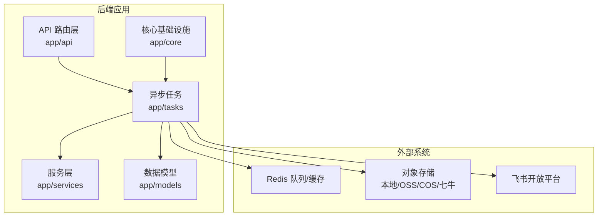
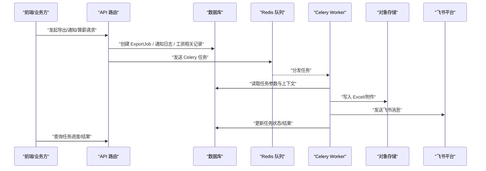
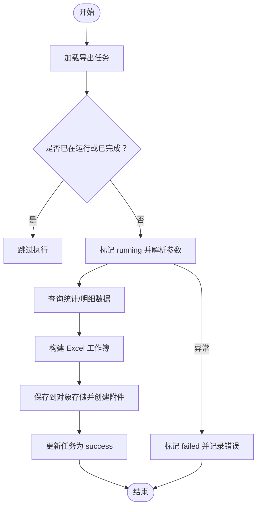
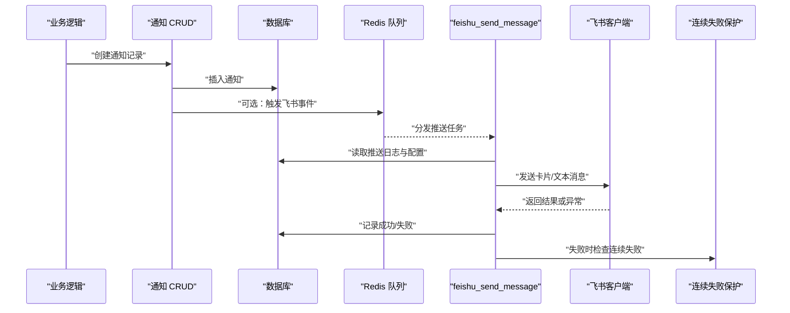
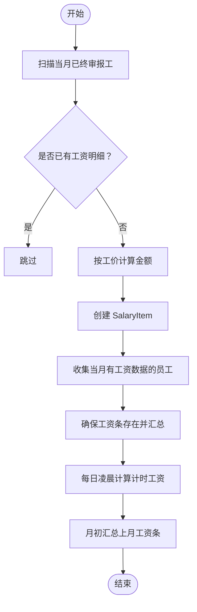
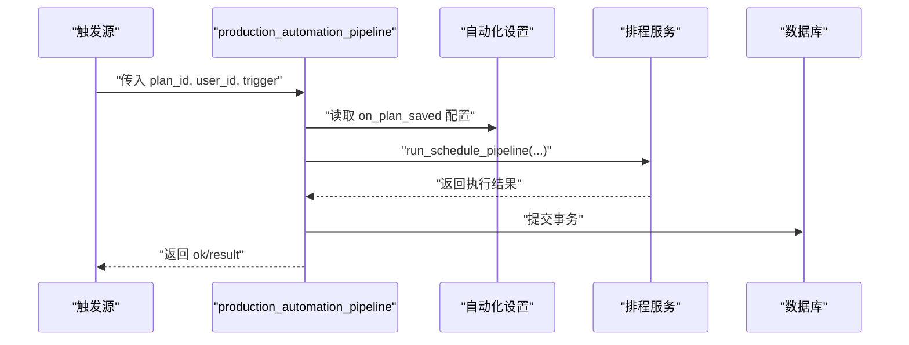
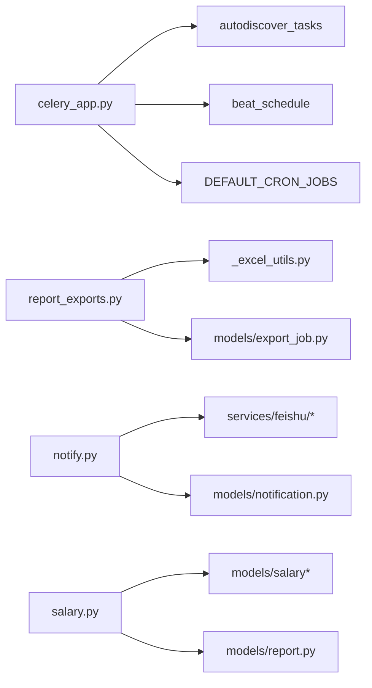

# 异步任务类型（导出·通知·算薪）

<cite>
**本文引用的文件**   
- [backend/app/tasks/report_exports.py](file://backend/app/tasks/report_exports.py)
- [backend/app/tasks/salary.py](file://backend/app/tasks/salary.py)
- [backend/app/tasks/production.py](file://backend/app/tasks/production.py)
- [backend/app/tasks/notify.py](file://backend/app/tasks/notify.py)
- [backend/app/tasks/_excel_utils.py](file://backend/app/tasks/_excel_utils.py)
- [backend/app/tasks/decorators.py](file://backend/app/tasks/decorators.py)
- [backend/app/celery_app.py](file://backend/app/celery_app.py)
- [backend/app/models/export_job.py](file://backend/app/models/export_job.py)
- [backend/app/models/notification.py](file://backend/app/models/notification.py)
- [backend/app/crud/notification.py](file://backend/app/crud/notification.py)
- [backend/app/api/admin/export_jobs.py](file://backend/app/api/admin/export_jobs.py)
</cite>

## 目录
1. [引言](#引言)
2. [项目结构定位](#项目结构定位)
3. [核心组件总览](#核心组件总览)
4. [架构总览](#架构总览)
5. [报表导出异步流程](#报表导出异步流程)
6. [消息通知异步流程](#消息通知异步流程)
7. [工资计算与工资条生成流程](#工资计算与工资条生成流程)
8. [生产排程自动化流水线](#生产排程自动化流水线)
9. [依赖关系分析](#依赖关系分析)
10. [性能与可靠性特征](#性能与可靠性特征)
11. [故障排查指南](#故障排查指南)
12. [结论](#结论)

## 引言
本文围绕 CenkorMES 后端中的三类异步任务进行系统化梳理：报表导出、消息通知、工资计算。重点说明它们的触发来源、Celery 任务定义、数据库状态机、存储落盘、定时调度以及补偿机制，帮助开发者快速理解“从业务动作到后台执行”的完整链路。

## 项目结构定位
本项目的异步任务集中在 `backend/app/tasks` 目录下，由 Celery 自动发现并执行；定时任务通过 `celery_app.py` 中的 Beat 配置和默认 Cron 清单驱动；导出类任务统一使用 `ExportJob` 模型记录生命周期；通知类任务以飞书推送为主，并通过日志表追踪投递结果。

**图示来源**
- [backend/app/tasks/report_exports.py:32-84](file://backend/app/tasks/report_exports.py#L32-L84)
- [backend/app/tasks/notify.py:16-149](file://backend/app/tasks/notify.py#L16-L149)
- [backend/app/tasks/salary.py:175-283](file://backend/app/tasks/salary.py#L175-L283)
- [backend/app/celery_app.py:10-36](file://backend/app/celery_app.py#L10-L36)

**章节来源**
- [backend/app/tasks/report_exports.py:1-159](file://backend/app/tasks/report_exports.py#L1-L159)
- [backend/app/tasks/notify.py:1-187](file://backend/app/tasks/notify.py#L1-L187)
- [backend/app/tasks/salary.py:1-348](file://backend/app/tasks/salary.py#L1-L348)
- [backend/app/tasks/production.py:1-40](file://backend/app/tasks/production.py#L1-L40)
- [backend/app/celery_app.py:1-71](file://backend/app/celery_app.py#L1-L71)

## 核心组件总览
- 报表导出任务：产量报表、良率报表 Excel 导出，基于 `ExportJob` 状态机，复用通用 Excel 工具。
- 消息通知任务：飞书消息推送、延迟消息刷新、挂起日志补偿扫描。
- 工资计算任务：计件工资明细补漏、工资条汇总生成、计时工资每日计算、月度薪资汇总。
- 生产自动化任务：计划保存后触发排程自动化流水线。
- Celery 基础设施：Broker/Backend 配置、任务自动发现、Beat 定时任务、默认 Cron 清单。
- 公共装饰器：`db_task` 为 Celery 任务提供自动 Session 管理。

**章节来源**
- [backend/app/tasks/_excel_utils.py:1-101](file://backend/app/tasks/_excel_utils.py#L1-L101)
- [backend/app/tasks/decorators.py:1-41](file://backend/app/tasks/decorators.py#L1-L41)
- [backend/app/models/export_job.py:1-28](file://backend/app/models/export_job.py#L1-L28)
- [backend/app/models/notification.py:1-26](file://backend/app/models/notification.py#L1-L26)

## 架构总览
三类异步任务的共同模式是：前端或业务逻辑调用 API → 创建持久化记录（如 `ExportJob`、通知日志）→ 入队 Celery 任务 → Worker 消费任务 → 执行业务逻辑 → 落盘存储并更新状态 → 前端轮询或回调获取结果。

**图示来源**
- [backend/app/tasks/report_exports.py:32-84](file://backend/app/tasks/report_exports.py#L32-L84)
- [backend/app/tasks/notify.py:16-149](file://backend/app/tasks/notify.py#L16-L149)
- [backend/app/tasks/salary.py:175-283](file://backend/app/tasks/salary.py#L175-L283)
- [backend/app/celery_app.py:10-36](file://backend/app/celery_app.py#L10-L36)

## 报表导出异步流程
### 触发方式
- 通常由管理端或 H5 端发起导出请求，后端创建 `ExportJob` 并派发 Celery 任务。
- 具体导出入口可参考导出任务模块与导出接口聚合点。

### 执行流程
- 任务加载 `ExportJob`，若已运行或成功则跳过。
- 标记任务为运行中，解析参数（如日期范围、用户筛选）。
- 查询统计数据，构造 Excel 工作簿。
- 将 Excel 写入对象存储，创建附件记录，更新任务结果为成功。
- 异常时标记失败并记录错误信息。

**图示来源**
- [backend/app/tasks/report_exports.py:32-84](file://backend/app/tasks/report_exports.py#L32-L84)
- [backend/app/tasks/report_exports.py:87-159](file://backend/app/tasks/report_exports.py#L87-L159)
- [backend/app/tasks/_excel_utils.py:22-79](file://backend/app/tasks/_excel_utils.py#L22-L79)
- [backend/app/tasks/_excel_utils.py:82-101](file://backend/app/tasks/_excel_utils.py#L82-L101)

### 关键实现要点
- 产量报表导出任务：包含产量汇总、工序排名、日趋势三个 Sheet。
- 良率报表导出任务：包含良率汇总与缺陷 Pareto 分析。
- 通用 Excel 工具：封装了任务加载、启动、保存与失败处理。
- 存储与附件：统一通过对象存储与附件模型关联。

**章节来源**
- [backend/app/tasks/report_exports.py:32-84](file://backend/app/tasks/report_exports.py#L32-L84)
- [backend/app/tasks/report_exports.py:87-159](file://backend/app/tasks/report_exports.py#L87-L159)
- [backend/app/tasks/_excel_utils.py:22-79](file://backend/app/tasks/_excel_utils.py#L22-L79)
- [backend/app/tasks/_excel_utils.py:82-101](file://backend/app/tasks/_excel_utils.py#L82-L101)
- [backend/app/models/export_job.py:11-28](file://backend/app/models/export_job.py#L11-L28)

## 消息通知异步流程
### 触发方式
- 业务侧创建通知记录时，可选择触发飞书事件推送。
- 通知创建逻辑会尝试调用飞书事件发射服务，失败不影响主流程。

### 执行流程
- 飞书消息推送任务根据日志 ID 查找推送记录。
- 解析配置与载荷，构建消息卡片或文本。
- 按目标类型（聊天/用户）选择 Webhook 或 OpenAPI 发送。
- 成功后记录消息 ID，失败时记录错误并触发连续失败保护。
- 定时任务刷新延迟消息，补偿扫描长时间 pending 的日志。

**图示来源**
- [backend/app/crud/notification.py:14-55](file://backend/app/crud/notification.py#L14-L55)
- [backend/app/tasks/notify.py:16-149](file://backend/app/tasks/notify.py#L16-L149)

### 关键实现要点
- 飞书消息推送任务支持卡片与文本两种格式，支持聊天与用户两类目标。
- 支持 Webhook 与 OpenAPI 双通道，兼容旧结构与迁移后的配置。
- 个人紧急推送在特定配置下启用。
- 延迟消息刷新与 pending 补偿扫描用于容错恢复。

**章节来源**
- [backend/app/crud/notification.py:14-55](file://backend/app/crud/notification.py#L14-L55)
- [backend/app/tasks/notify.py:16-149](file://backend/app/tasks/notify.py#L16-L149)
- [backend/app/tasks/notify.py:152-187](file://backend/app/tasks/notify.py#L152-L187)
- [backend/app/models/notification.py:11-26](file://backend/app/models/notification.py#L11-L26)

## 工资计算与工资条生成流程
### 触发方式
- 审核通过的报工记录会尝试生成计件工资明细。
- 管理员可手动触发批量补漏与重算。
- 定时任务每日凌晨计算前一天计时工资，月初汇总上月工资条。

### 执行流程
- 计件工资补漏：扫描当月已终审报工，排除已有明细，按工价计算金额并写入 `SalaryItem`。
- 工资条生成：收集当月有工资数据的员工，调用确保工资条函数汇总计件、计时、奖扣款。
- 计时工资每日计算：调用生成全部计时工资明细函数。
- 月度薪资汇总：收集上月所有工资数据来源，逐人生成工资条。

**图示来源**
- [backend/app/tasks/salary.py:31-117](file://backend/app/tasks/salary.py#L31-L117)
- [backend/app/tasks/salary.py:120-163](file://backend/app/tasks/salary.py#L120-L163)
- [backend/app/tasks/salary.py:286-347](file://backend/app/tasks/salary.py#L286-L347)

### 关键实现要点
- 幂等保护：同一报工仅生成一条工资明细，避免唯一约束冲突。
- 工价缺失处理：缺少工价配置的报工会被跳过并记录警告。
- 工资条汇总：按员工维度汇总计件、计时、奖扣款，生成实发工资。
- 定时任务：每日凌晨与每月初分别执行计时工资计算与月度汇总。

**章节来源**
- [backend/app/tasks/salary.py:31-117](file://backend/app/tasks/salary.py#L31-L117)
- [backend/app/tasks/salary.py:120-163](file://backend/app/tasks/salary.py#L120-L163)
- [backend/app/tasks/salary.py:286-347](file://backend/app/tasks/salary.py#L286-L347)
- [backend/app/crud/report.py:105-140](file://backend/app/crud/report.py#L105-L140)

## 生产排程自动化流水线
### 触发方式
- 计划保存后触发自动化流水线，或由定时任务周期性扫描。

### 执行流程
- 读取自动化设置，解析引擎与选项。
- 调用排程服务执行流水线，包括自动释放、自动派工、缺料允许等策略。
- 提交事务并返回执行结果。

**图示来源**
- [backend/app/tasks/production.py:7-39](file://backend/app/tasks/production.py#L7-L39)

**章节来源**
- [backend/app/tasks/production.py:1-40](file://backend/app/tasks/production.py#L1-L40)

## 依赖关系分析
- Celery 应用配置集中管理 Broker、Backend、时区、序列化方式与默认队列。
- 任务自动发现机制确保 `app.tasks` 下的模块被注册。
- Beat 定时任务定义与默认 Cron 清单保持一致，便于运维查看与调整。
- 导出任务依赖 `ExportJob` 模型与通用 Excel 工具。
- 通知任务依赖飞书客户端与服务层，同时具备连续失败保护。
- 工资任务依赖工资明细、工资条、计时工资与考勤等相关模型与服务。

**图示来源**
- [backend/app/celery_app.py:10-71](file://backend/app/celery_app.py#L10-L71)
- [backend/app/tasks/report_exports.py:32-84](file://backend/app/tasks/report_exports.py#L32-L84)
- [backend/app/tasks/notify.py:16-149](file://backend/app/tasks/notify.py#L16-L149)
- [backend/app/tasks/salary.py:175-283](file://backend/app/tasks/salary.py#L175-L283)

**章节来源**
- [backend/app/celery_app.py:10-71](file://backend/app/celery_app.py#L10-L71)
- [backend/app/tasks/report_exports.py:32-84](file://backend/app/tasks/report_exports.py#L32-L84)
- [backend/app/tasks/notify.py:16-149](file://backend/app/tasks/notify.py#L16-L149)
- [backend/app/tasks/salary.py:175-283](file://backend/app/tasks/salary.py#L175-L283)

## 性能与可靠性特征
- 导出任务采用状态机控制，避免重复执行；失败路径记录错误信息，便于重试与排查。
- 通知任务具备连续失败保护，防止雪崩式重试。
- 定时任务按固定周期执行，降低实时压力。
- 对象存储统一封装，支持多种后端，提升扩展性。
- 数据库会话通过装饰器统一管理，减少资源泄漏风险。

[本节为通用指导，不直接分析具体文件]

## 故障排查指南
- 导出任务失败：检查 `ExportJob.error_msg` 与对象存储权限；确认 `created_by` 不为空。
- 飞书推送失败：检查飞书凭证、Webhook 地址、消息格式与目标类型；查看连续失败保护是否触发。
- 工资计算异常：检查工价配置是否存在、报工是否终审通过、月份边界是否正确。
- 定时任务未执行：核对 Celery Beat 配置与默认 Cron 清单，确认 Worker 与 Beat 进程正常运行。

**章节来源**
- [backend/app/tasks/_excel_utils.py:82-101](file://backend/app/tasks/_excel_utils.py#L82-L101)
- [backend/app/tasks/notify.py:128-147](file://backend/app/tasks/notify.py#L128-L147)
- [backend/app/tasks/salary.py:72-85](file://backend/app/tasks/salary.py#L72-L85)
- [backend/app/celery_app.py:27-71](file://backend/app/celery_app.py#L27-L71)

## 结论
CenkorMES 的异步任务体系以 Celery 为核心，围绕报表导出、消息通知、工资计算三大场景形成清晰的任务生命周期与状态机。通过统一的存储抽象、装饰器与定时调度，系统在可扩展性与可靠性方面具备良好基础。建议在实际部署中关注对象存储权限、飞书凭证配置与定时任务调度准确性，并结合业务需求调整默认 Cron 与自动化策略。