# PC 管理后台（frontend-admin-pro）

<cite>
**本文引用的文件**   
- [main.ts](file://frontend-admin-pro/src/main.ts)
- [router/index.ts](file://frontend-admin-pro/src/router/index.ts)
- [package.json](file://frontend-admin-pro/package.json)
- [vite.config.ts](file://frontend-admin-pro/vite.config.ts)
- [App.vue](file://frontend-admin-pro/src/App.vue)
- [stores/auth.ts](file://frontend-admin-pro/src/stores/auth.ts)
- [stores/app-config.ts](file://frontend-admin-pro/src/stores/app-config.ts)
- [composables/useListPage.ts](file://frontend-admin-pro/src/composables/useListPage.ts)
- [composables/useExport.ts](file://frontend-admin-pro/src/composables/useExport.ts)
- [composables/useAdminTheme.ts](file://frontend-admin-pro/src/composables/useAdminTheme.ts)
- [composables/useSidebarCollapse.ts](file://frontend-admin-pro/src/composables/useSidebarCollapse.ts)
- [composables/useLoginCaptcha.ts](file://frontend-admin-pro/src/composables/useLoginCaptcha.ts)
- [composables/useTheme.ts](file://frontend-admin-pro/src/composables/useTheme.ts)
- [composables/useUnsavedGuard.ts](file://frontend-admin-pro/src/composables/useUnsavedGuard.ts)
</cite>

## 更新摘要
**所做更改**   
- 新增组件自动导入功能，使用 unplugin-vue-components 实现 Element Plus 组件按需自动导入
- 增强 Vite 构建配置，添加 manualChunks 函数进行手动分包优化
- 改进 Element Plus 集成，采用按需引入样式并通过 el-config-provider 提供国际化支持
- 更新构建性能优化策略，将大型依赖拆分为独立 chunk

## 目录
1. [简介](#简介)
2. [项目结构](#项目结构)
3. [核心组件](#核心组件)
4. [架构总览](#架构总览)
5. [详细组件分析](#详细组件分析)
6. [依赖关系分析](#依赖关系分析)
7. [性能与可维护性](#性能与可维护性)
8. [常见问题排查](#常见问题排查)
9. [结论](#结论)

## 简介
本仓库的 frontend-admin-pro 是 CenkorMES 的 PC 端管理后台，基于 Vue 3 + Element Plus + Pinia + Vue Router + i18n 构建。前端按 api/pages/stores/composables 分层组织：api 封装后端接口、pages 承载业务页面、stores 管理全局状态、composables 提供跨页面复用逻辑。路由集中定义在 router/index.ts，通过 meta.permissions 实现权限控制；登录态与用户信息由 stores/auth.ts 管理；应用级配置由 stores/app-config.ts 拉取并驱动品牌标题等展示。

**更新** 项目现已集成组件自动导入功能和增强的构建优化，显著提升开发体验和构建性能。

## 项目结构
frontend-admin-pro 的核心目录职责如下：
- src/api：按业务域拆分 API 调用方法，如 auth、system、master、production、warehouse、finance、erp 等。
- src/pages：按业务模块划分页面目录，包括 dashboard、system、master、production、warehouse、purchase、finance、erp、reports、account 等。
- src/stores：Pinia store，当前包含认证状态 app-config 与通用应用配置。
- src/composables：可组合式函数，涵盖列表分页、导出、主题、侧边栏折叠、验证码、未保存表单保护等。
- src/layouts：布局组件，AppLayout 与 AppMenu 负责整体框架与菜单。
- src/router：集中式路由表，统一处理鉴权、权限校验与懒加载。
- src/utils：HTTP 封装、二维码、打印、状态映射等工具。
- src/locales：多语言资源与合并策略。

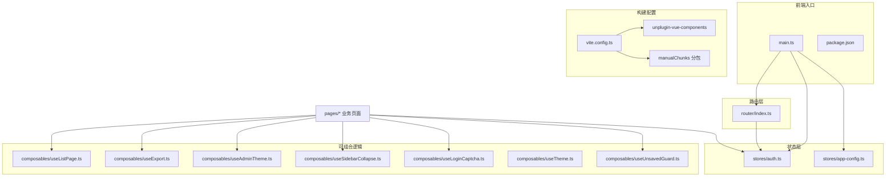

图表来源
- [main.ts:1-26](file://frontend-admin-pro/src/main.ts#L1-L26)
- [vite.config.ts:1-69](file://frontend-admin-pro/vite.config.ts#L1-L69)
- [router/index.ts:1-249](file://frontend-admin-pro/src/router/index.ts#L1-L249)
- [stores/auth.ts:1-43](file://frontend-admin-pro/src/stores/auth.ts#L1-L43)
- [stores/app-config.ts:1-53](file://frontend-admin-pro/src/stores/app-config.ts#L1-L53)

章节来源
- [main.ts:1-26](file://frontend-admin-pro/src/main.ts#L1-L26)
- [router/index.ts:1-249](file://frontend-admin-pro/src/router/index.ts#L1-L249)
- [package.json:1-48](file://frontend-admin-pro/package.json#L1-L48)

## 核心组件
- 应用启动与插件挂载：main.ts 初始化 Element Plus 样式、Pinia、Router、i18n，并启动主题与分块重载处理器。**更新** 现在采用按需引入 Element Plus 样式，减少打包体积。
- 路由与权限：router/index.ts 集中声明所有页面路由，使用 beforeEach 进行登录态检查与权限校验，支持公共路由与懒加载。
- 认证状态：stores/auth.ts 管理 token、用户信息与权限集合，提供登录、获取用户信息、登出与权限判断能力。
- 应用配置：stores/app-config.ts 拉取公开配置，设置公司名、Logo、登录验证码开关、会话过期时间，并动态更新浏览器标题。
- 列表分页：composables/useListPage.ts 提供 offset/limit 分页查询、页码计算、预估总数与刷新流程。
- 异步导出：composables/useExport.ts 封装创建导出任务、轮询结果、下载附件的统一流程。
- 主题与侧边栏：composables/useAdminTheme.ts 与 useSidebarCollapse.ts 分别管理暗色主题与侧边栏折叠状态，持久化到 localStorage。
- 登录验证码：composables/useLoginCaptcha.ts 封装验证码启用检测、图片加载、错误提示与登录载荷字段生成。
- 通用主题：composables/useTheme.ts 提供轻量主题切换能力，供非 admin 场景使用。
- 未保存表单保护：composables/useUnsavedGuard.ts 拦截路由离开与浏览器关闭，提示未保存修改。

**更新** 新增组件自动导入功能，通过 unplugin-vue-components 自动解析和使用 Element Plus 组件，无需手动导入模板组件和指令。

章节来源
- [main.ts:1-26](file://frontend-admin-pro/src/main.ts#L1-L26)
- [router/index.ts:1-249](file://frontend-admin-pro/src/router/index.ts#L1-L249)
- [stores/auth.ts:1-43](file://frontend-admin-pro/src/stores/auth.ts#L1-L43)
- [stores/app-config.ts:1-53](file://frontend-admin-pro/src/stores/app-config.ts#L1-L53)
- [composables/useListPage.ts:1-48](file://frontend-admin-pro/src/composables/useListPage.ts#L1-L48)
- [composables/useExport.ts:1-56](file://frontend-admin-pro/src/composables/useExport.ts#L1-L56)
- [composables/useAdminTheme.ts:1-56](file://frontend-admin-pro/src/composables/useAdminTheme.ts#L1-L56)
- [composables/useSidebarCollapse.ts:1-24](file://frontend-admin-pro/src/composables/useSidebarCollapse.ts#L1-L24)
- [composables/useLoginCaptcha.ts:1-57](file://frontend-admin-pro/src/composables/useLoginCaptcha.ts#L1-L57)
- [composables/useTheme.ts:1-43](file://frontend-admin-pro/src/composables/useTheme.ts#L1-L43)
- [composables/useUnsavedGuard.ts:1-69](file://frontend-admin-pro/src/composables/useUnsavedGuard.ts#L1-L69)

## 架构总览
PC 管理后台采用"路由驱动 + 状态集中 + 可组合逻辑"的前端架构：
- 入口 main.ts 装配 Pinia、Router、i18n，并初始化主题与分块重载。
- 路由层 router/index.ts 集中管理页面与权限，beforeEach 统一鉴权。
- 状态层 stores 管理认证与应用配置，被页面与路由共同消费。
- 可组合逻辑 composables 提供跨页面复用的能力，如分页、导出、主题、侧边栏、验证码、未保存保护。
- 页面层 pages 按业务域组织，按需引入 API 与 composables，渲染 Element Plus 组件。
- **新增** 构建层通过 vite.config.ts 配置组件自动导入和手动分包优化。

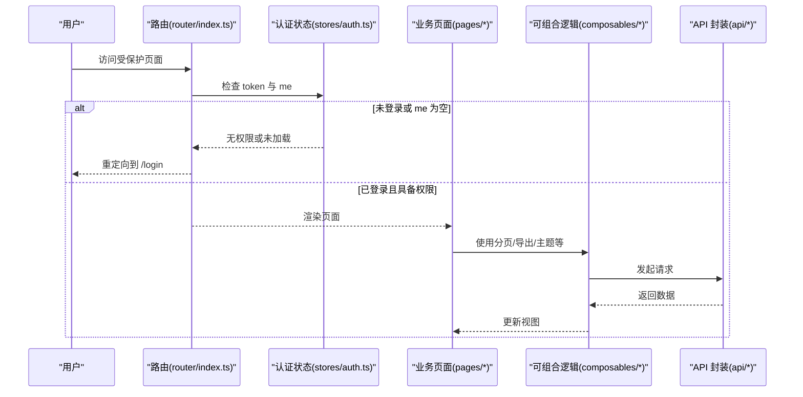

图表来源
- [router/index.ts:217-242](file://frontend-admin-pro/src/router/index.ts#L217-L242)
- [stores/auth.ts:22-32](file://frontend-admin-pro/src/stores/auth.ts#L22-L32)

## 详细组件分析

### 组件自动导入与 Element Plus 集成
**新增** 项目现已集成 unplugin-vue-components 插件，实现 Element Plus 组件的自动按需导入。

- **构建配置**：vite.config.ts 中配置了 Components 插件和 ElementPlusResolver，自动解析模板中的 el-* 组件和 v-loading 等指令。
- **样式按需引入**：main.ts 中仅引入必要的 Element Plus 样式副作用（message、message-box），其他组件样式由插件自动注入。
- **国际化支持**：App.vue 中使用 el-config-provider 包裹整个应用，根据当前语言环境自动切换 Element Plus 内置文案。
- **编程式 API**：ElMessage、ElMessageBox 等编程式 API 仍需在具体文件中显式导入。

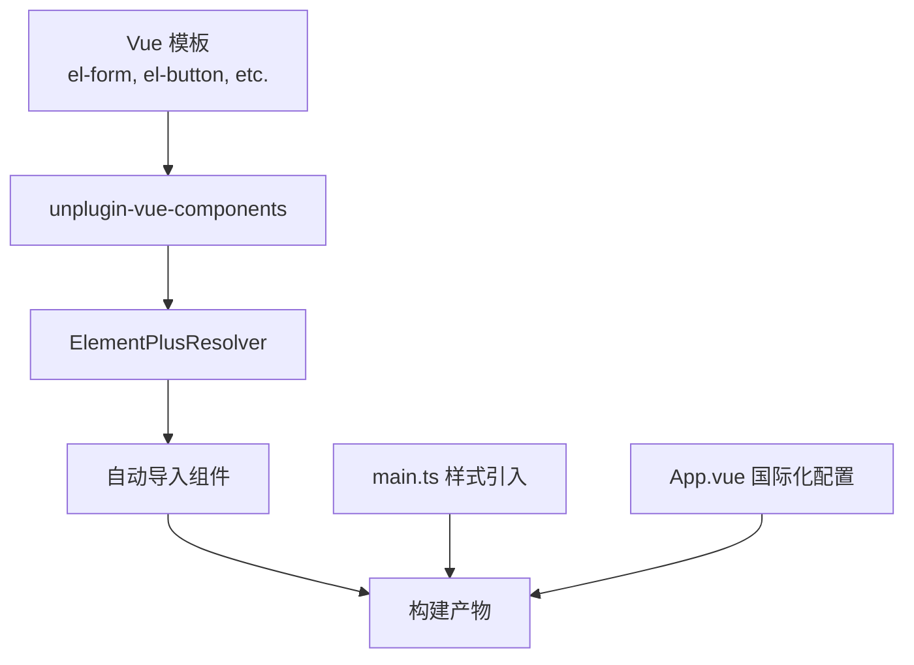

图表来源
- [vite.config.ts:52-60](file://frontend-admin-pro/vite.config.ts#L52-L60)
- [main.ts:4-9](file://frontend-admin-pro/src/main.ts#L4-L9)
- [App.vue:6-27](file://frontend-admin-pro/src/App.vue#L6-L27)

章节来源
- [vite.config.ts:52-60](file://frontend-admin-pro/vite.config.ts#L52-L60)
- [main.ts:4-9](file://frontend-admin-pro/src/main.ts#L4-L9)
- [App.vue:6-27](file://frontend-admin-pro/src/App.vue#L6-L27)

### 手动分包与构建优化
**新增** 项目实现了精细化的手动分包策略，优化大型依赖的加载性能。

- **分包策略**：manualChunks 函数根据依赖路径精确匹配，将不同功能族拆分为独立 chunk。
- **Element Plus 细分**：表格、日期选择器、表单控件等常用组件单独分包，避免单个 vendor 块过大。
- **第三方依赖分组**：echarts、icons、vue 生态依赖分别归类，便于缓存和并行加载。
- **体积控制**：chunkSizeWarningLimit 设置为 500kB，确保每个分包体积可控。

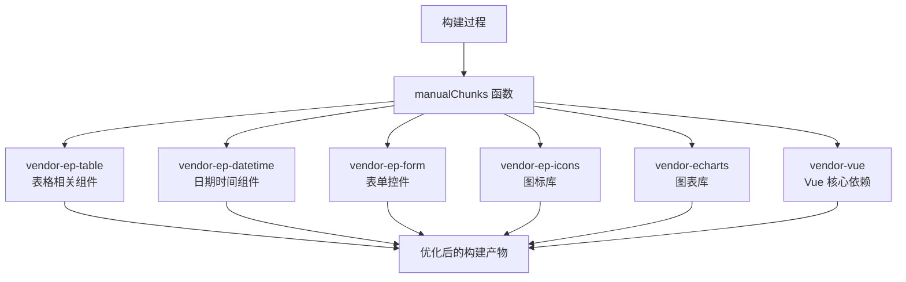

图表来源
- [vite.config.ts:10-28](file://frontend-admin-pro/vite.config.ts#L10-L28)
- [vite.config.ts:35-42](file://frontend-admin-pro/vite.config.ts#L35-L42)

章节来源
- [vite.config.ts:10-28](file://frontend-admin-pro/vite.config.ts#L10-L28)
- [vite.config.ts:35-42](file://frontend-admin-pro/vite.config.ts#L35-L42)

### 认证与会话流程
- stores/auth.ts 暴露 login、fetchMe、logout、hasAnyPermission 等方法，token 与用户信息持久化到本地存储。
- router/index.ts 的 beforeEach 在访问非 public 路由时校验 token 与权限，必要时调用 fetchMe 获取用户信息，失败则登出并重定向。

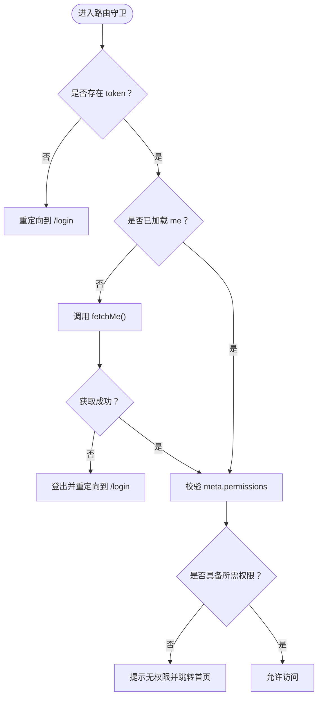

图表来源
- [router/index.ts:217-242](file://frontend-admin-pro/src/router/index.ts#L217-L242)
- [stores/auth.ts:22-32](file://frontend-admin-pro/src/stores/auth.ts#L22-L32)

章节来源
- [stores/auth.ts:1-43](file://frontend-admin-pro/src/stores/auth.ts#L1-L43)
- [router/index.ts:217-242](file://frontend-admin-pro/src/router/index.ts#L217-L242)

### 应用配置与品牌标题
- stores/app-config.ts 从公开接口拉取公司名、Logo、登录验证码开关、会话与记住我过期时间，并计算 brandTitle 与 browserTitle。
- 若配置拉取失败，回退默认品牌，避免登录页白屏。

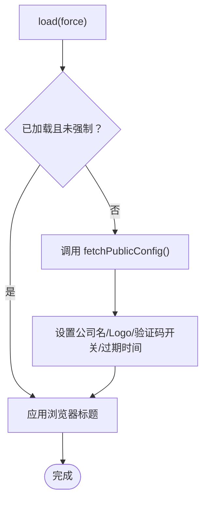

图表来源
- [stores/app-config.ts:20-38](file://frontend-admin-pro/src/stores/app-config.ts#L20-L38)

章节来源
- [stores/app-config.ts:1-53](file://frontend-admin-pro/src/stores/app-config.ts#L1-L53)

### 列表分页与刷新
- composables/useListPage.ts 提供 offset/limit 分页模型，自动计算 page、estimateTotal，并提供 runReload 统一加载流程。
- 适合大多数后端 offset/limit 接口的列表页复用。

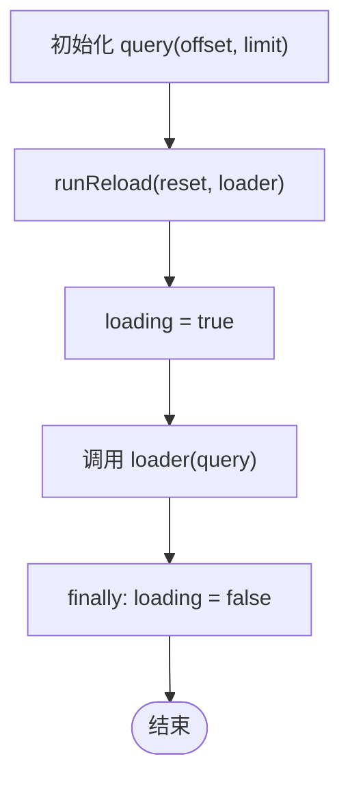

图表来源
- [composables/useListPage.ts:10-36](file://frontend-admin-pro/src/composables/useListPage.ts#L10-L36)

章节来源
- [composables/useListPage.ts:1-48](file://frontend-admin-pro/src/composables/useListPage.ts#L1-L48)

### 异步导出流程
- composables/useExport.ts 封装 doExport：创建导出任务、轮询任务状态、下载附件并触发浏览器下载。
- 轮询间隔为 2 秒，最多重试 60 次，失败时提示错误消息。

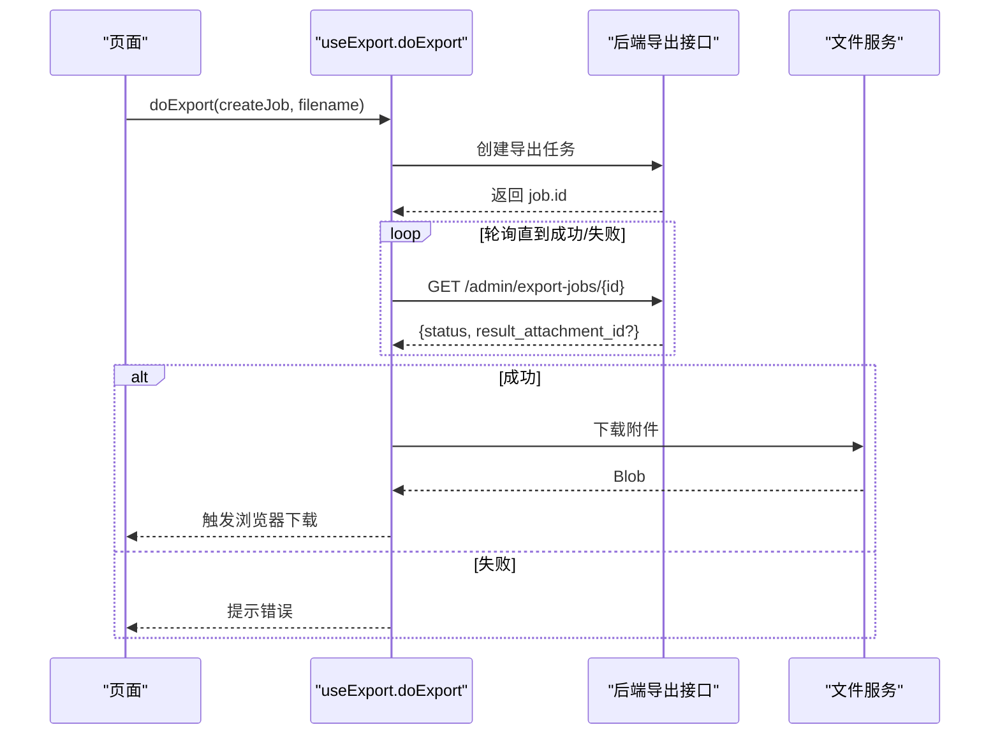

图表来源
- [composables/useExport.ts:11-55](file://frontend-admin-pro/src/composables/useExport.ts#L11-L55)

章节来源
- [composables/useExport.ts:1-56](file://frontend-admin-pro/src/composables/useExport.ts#L1-L56)

### 主题与侧边栏
- composables/useAdminTheme.ts 管理暗色主题，写入 documentElement class 与 data 属性，并持久化到 localStorage。
- composables/useSidebarCollapse.ts 管理侧边栏折叠状态，同样持久化到 localStorage。
- composables/useTheme.ts 提供通用主题切换能力，适用于非 admin 场景。

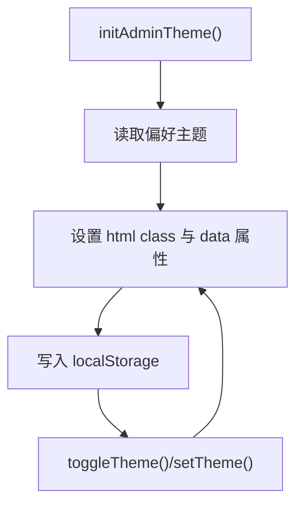

图表来源
- [composables/useAdminTheme.ts:12-23](file://frontend-admin-pro/src/composables/useAdminTheme.ts#L12-L23)
- [composables/useSidebarCollapse.ts:7-22](file://frontend-admin-pro/src/composables/useSidebarCollapse.ts#L7-L22)
- [composables/useTheme.ts:10-35](file://frontend-admin-pro/src/composables/useTheme.ts#L10-L35)

章节来源
- [composables/useAdminTheme.ts:1-56](file://frontend-admin-pro/src/composables/useAdminTheme.ts#L1-L56)
- [composables/useSidebarCollapse.ts:1-24](file://frontend-admin-pro/src/composables/useSidebarCollapse.ts#L1-L24)
- [composables/useTheme.ts:1-43](file://frontend-admin-pro/src/composables/useTheme.ts#L1-L43)

### 登录验证码
- composables/useLoginCaptcha.ts 在 mounted 时尝试加载验证码，根据后端返回决定是否启用。
- 提供 payloadFields 方法，将 captcha_id 与 captcha_code 注入登录载荷。

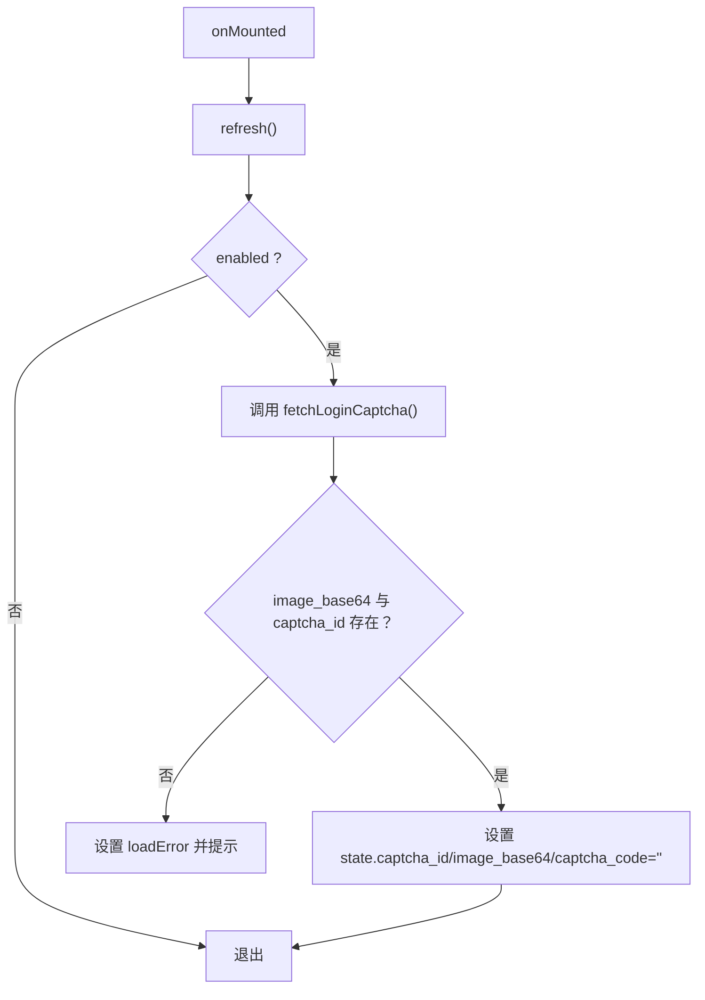

图表来源
- [composables/useLoginCaptcha.ts:17-48](file://frontend-admin-pro/src/composables/useLoginCaptcha.ts#L17-L48)

章节来源
- [composables/useLoginCaptcha.ts:1-57](file://frontend-admin-pro/src/composables/useLoginCaptcha.ts#L1-L57)

### 未保存表单保护
- composables/useUnsavedGuard.ts 监听表单脏状态，拦截路由离开与浏览器关闭事件，提示用户确认。
- 使用 sessionStorage 暂存表单数据，key 以 formKey 区分。

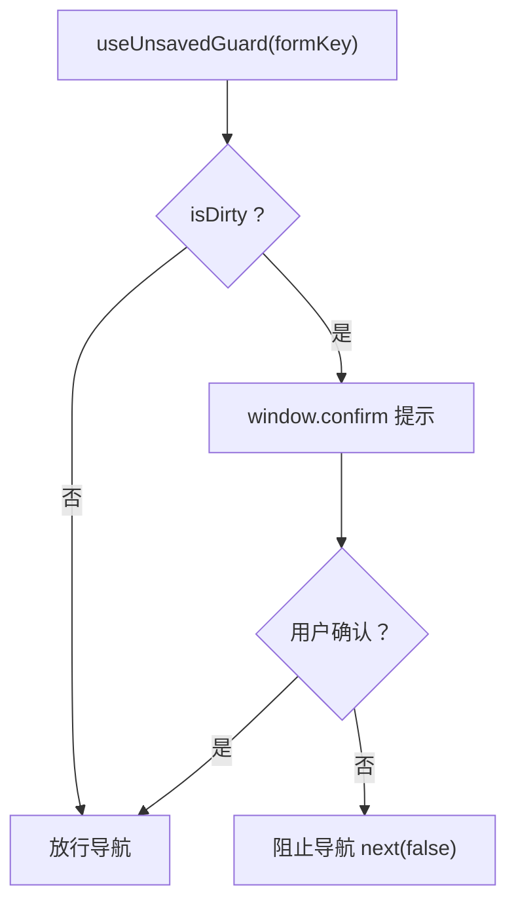

图表来源
- [composables/useUnsavedGuard.ts:43-53](file://frontend-admin-pro/src/composables/useUnsavedGuard.ts#L43-L53)

章节来源
- [composables/useUnsavedGuard.ts:1-69](file://frontend-admin-pro/src/composables/useUnsavedGuard.ts#L1-L69)

## 依赖关系分析
- 运行时依赖：Vue 3、Element Plus、Pinia、Vue Router、Axios、ECharts、vue-i18n、Tailwind 相关工具。
- 构建与开发：Vite、TypeScript、ESLint、unplugin-auto-import、unplugin-vue-components。
- **更新** 入口 main.ts 仅引入必要副作用样式与插件，其余组件按需引入，减少打包体积。

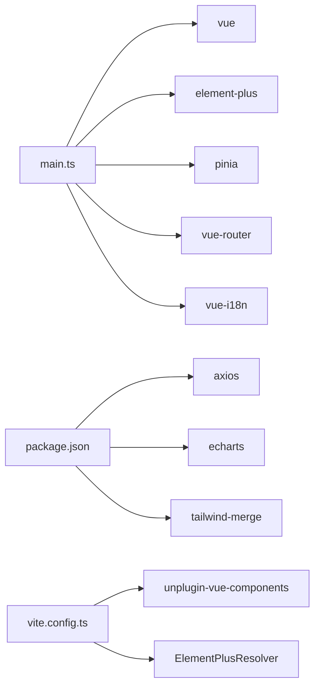

图表来源
- [main.ts:1-26](file://frontend-admin-pro/src/main.ts#L1-L26)
- [package.json:14-45](file://frontend-admin-pro/package.json#L14-L45)
- [vite.config.ts:52-60](file://frontend-admin-pro/vite.config.ts#L52-L60)

章节来源
- [package.json:1-48](file://frontend-admin-pro/package.json#L1-L48)
- [main.ts:1-26](file://frontend-admin-pro/src/main.ts#L1-L26)

## 性能与可维护性
- 路由懒加载：所有业务页面均使用动态 import，降低首屏体积。
- **更新** 组件按需引入：Element Plus 模板组件与指令由 unplugin-vue-components 自动引入，编程式 API 显式导入，样式按需引入。
- **新增** 手动分包优化：通过 manualChunks 将大型依赖拆分为独立 chunk，提升并行加载效率。
- 主题与侧边栏状态持久化：localStorage 减少重复初始化开销。
- 列表分页与导出：useListPage 与 useExport 抽象通用流程，减少重复代码，提升一致性。
- **新增** 构建体积控制：chunkSizeWarningLimit 确保分包体积可控，避免单个文件过大。
- 建议：
  - 对大型页面继续采用路由级懒加载与组件级懒加载。
  - 对高频 API 考虑增加缓存策略（如条件缓存或去抖）。
  - 对导出任务增加进度反馈与取消机制，提升用户体验。
  - 定期监控构建产物体积，调整分包策略。

[本节为通用指导，不直接分析具体文件]

## 常见问题排查
- 登录后仍跳转到登录页：
  - 检查 stores/auth.ts 的 login/fetchMe 是否正常返回 access_token 与用户信息。
  - 检查 router/index.ts 的 beforeEach 是否正确校验 token 与权限。
- 页面显示"无权限访问"：
  - 检查路由 meta.permissions 是否与后端返回的用户权限匹配。
  - 确认 hasAnyPermission 的判断逻辑是否满足需求。
- 导出任务失败或超时：
  - 检查 useExport.ts 的轮询逻辑与后端导出任务状态。
  - 确认文件服务路径与下载接口可用。
- 主题或侧边栏状态丢失：
  - 检查 localStorage 是否被浏览器策略限制。
  - 确认 useAdminTheme.ts 与 useSidebarCollapse.ts 的持久化逻辑。
- 验证码无法加载：
  - 检查 useLoginCaptcha.ts 的错误分支与后端验证码接口返回。
  - 确认 enabled 标志与 image_base64/captcha_id 字段。
- **新增** Element Plus 组件样式缺失：
  - 检查 main.ts 中是否正确引入了必要的样式副作用。
  - 确认 unplugin-vue-components 配置正确，ElementPlusResolver 已启用。
- **新增** 构建产物体积过大：
  - 检查 vite.config.ts 中的 manualChunks 配置是否合理。
  - 确认 chunkSizeWarningLimit 设置适当，监控各分包体积。

章节来源
- [stores/auth.ts:22-32](file://frontend-admin-pro/src/stores/auth.ts#L22-L32)
- [router/index.ts:217-242](file://frontend-admin-pro/src/router/index.ts#L217-L242)
- [composables/useExport.ts:45-55](file://frontend-admin-pro/src/composables/useExport.ts#L45-L55)
- [composables/useAdminTheme.ts:12-23](file://frontend-admin-pro/src/composables/useAdminTheme.ts#L12-L23)
- [composables/useSidebarCollapse.ts:10-16](file://frontend-admin-pro/src/composables/useSidebarCollapse.ts#L10-L16)
- [composables/useLoginCaptcha.ts:17-48](file://frontend-admin-pro/src/composables/useLoginCaptcha.ts#L17-L48)
- [main.ts:4-9](file://frontend-admin-pro/src/main.ts#L4-L9)
- [vite.config.ts:52-60](file://frontend-admin-pro/vite.config.ts#L52-L60)
- [vite.config.ts:35-42](file://frontend-admin-pro/vite.config.ts#L35-L42)

## 结论
frontend-admin-pro 以清晰的分层与模块化组织支撑了 CenkorMES 的管理后台能力。路由集中管理权限与页面，stores 统一管理认证与配置，composables 提供跨页面复用逻辑，pages 按业务域组织。该结构便于扩展新模块、统一交互体验与提升可维护性。

**更新** 通过集成组件自动导入功能和增强的构建优化，项目现在具有更好的开发体验和更优的构建性能。Element Plus 组件的按需自动导入减少了样板代码，手动分包策略提升了加载效率，国际化支持通过 el-config-provider 得到完善。后续可在缓存、导出进度、权限粒度等方面持续优化，进一步提升用户体验与系统稳定性。