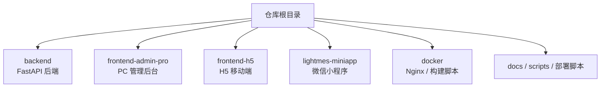
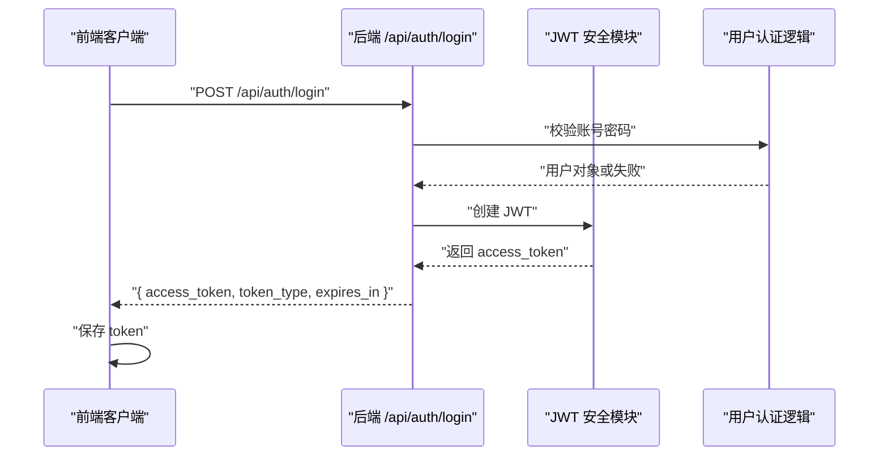
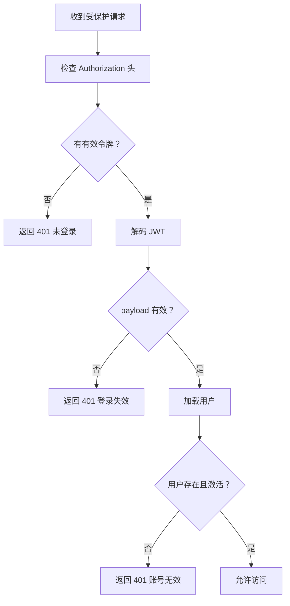
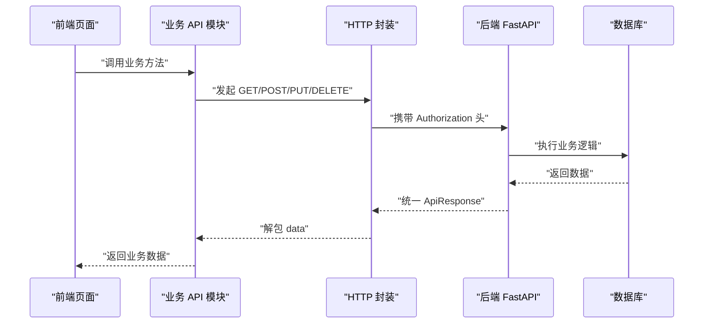

# 前端多端架构

<cite>
**本文引用的文件**   
- [README.md](file://README.md)
- [backend/app/api/router.py](file://backend/app/api/router.py)
- [backend/app/core/response.py](file://backend/app/core/response.py)
- [backend/app/core/deps.py](file://backend/app/core/deps.py)
- [backend/app/core/security.py](file://backend/app/core/security.py)
- [backend/app/api/v1/auth.py](file://backend/app/api/v1/auth.py)
- [frontend-admin-pro/package.json](file://frontend-admin-pro/package.json)
- [frontend-h5/package.json](file://frontend-h5/package.json)
- [lightmes-miniapp/package.json](file://lightmes-miniapp/package.json)
- [frontend-admin-pro/src/utils/http.ts](file://frontend-admin-pro/src/utils/http.ts)
- [frontend-h5/src/utils/http.ts](file://frontend-h5/src/utils/http.ts)
- [lightmes-miniapp/src/api/request.ts](file://lightmes-miniapp/src/api/request.ts)
</cite>

## 目录
1. [引言](#引言)
2. [三端技术栈总览](#三端技术栈总览)
3. [项目结构与职责边界](#项目结构与职责边界)
4. [共用 API 层约定](#共用-api-层约定)
5. [后端路由与权限入口](#后端路由与权限入口)
6. [登录与安全流程](#登录与安全流程)
7. [三端目录结构对比](#三端目录结构对比)
8. [API 调用时序图](#api-调用时序图)
9. [性能与可维护性建议](#性能与可维护性建议)
10. [常见问题排查](#常见问题排查)
11. [结论](#结论)

## 引言
本仓库是 CenkorMES —— 面向中小型加工厂、单租户私有部署的轻量 MES。其前端包含三个独立应用：PC 管理后台、H5 移动端、微信小程序，三者共同访问同一 FastAPI 后端。本文聚焦“三端技术栈、目录结构与共用 API 层约定”，帮助开发者快速理解前后端协作方式、接口契约、鉴权机制以及各自的前端工程组织。

## 三端技术栈总览
| 终端 | 框架与技术 | 主要依赖 | 典型用途 |
|---|---|---|---|
| PC 管理后台 | Vue 3 + Vite + TypeScript + Element Plus + Pinia + ECharts | `vue`、`element-plus`、`pinia`、`echarts`、`axios`、`vue-router`、`tailwindcss` | 系统配置、主数据、生产计划、工单、报表、财务、仓库等管理功能 |
| H5 移动端 | Vue 3 + Vite + TypeScript + Vant 4 + Pinia | `vue`、`vant`、`pinia`、`axios`、`vue-i18n`、`tailwindcss` | 员工扫码报工、任务查看、客户订单进度、工资条、通知等 |
| 小程序 | uni-app（Vue 3）+ TypeScript + Pinia | `@dcloudio/uni-*`、`vue`、`pinia`、`vue-i18n` | 小程序侧的管理、员工、客户页面，复用后端 `/h5`、`/admin`、`/miniapp/auth` 等接口 |

这些技术栈在各自工程的 `package.json` 中声明，并在 README 的技术栈表格中统一说明。

**章节来源**
- [README.md:76-86](file://README.md#L76-L86)
- [frontend-admin-pro/package.json:14-27](file://frontend-admin-pro/package.json#L14-L27)
- [frontend-h5/package.json:14-25](file://frontend-h5/package.json#L14-L25)
- [lightmes-miniapp/package.json:10-19](file://lightmes-miniapp/package.json#L10-L19)

## 项目结构与职责边界
从仓库根目录看，前端多端与后端是并列的工程：

**图表来源**
- [README.md:195-214](file://README.md#L195-L214)

后端按分层组织：
- `app/api`：对外 HTTP/WebSocket 路由聚合，按 admin、h5、v1、ws、feishu、crm-adapter、miniapp 等分组。
- `app/core`：配置、数据库会话、安全、错误、中间件、响应封装。
- `app/models`：SQLAlchemy 模型。
- `app/schemas`：Pydantic 请求/响应模型。
- `app/crud`：数据库操作。
- `app/services`：业务服务。
- `app/tasks`：Celery 异步任务。

前端三端各自独立，但共享“后端 API”这一契约。

**章节来源**
- [README.md:195-214](file://README.md#L195-L214)
- [backend/app/api/router.py:7-34](file://backend/app/api/router.py#L7-L34)

## 共用 API 层约定
### 1. 统一响应格式
后端通过 `ApiResponse` 和辅助函数定义统一的 JSON 响应结构：
- `code`：业务状态码，成功为 `200`。
- `msg`：提示信息。
- `data`：业务数据，可为空。

前端各端均按此结构判断成功或失败，并提取 `data` 作为实际返回值。

**章节来源**
- [backend/app/core/response.py:11-22](file://backend/app/core/response.py#L11-L22)
- [frontend-admin-pro/src/utils/http.ts:11-15](file://frontend-admin-pro/src/utils/http.ts#L11-L15)
- [frontend-h5/src/utils/http.ts:6-10](file://frontend-h5/src/utils/http.ts#L6-L10)
- [lightmes-miniapp/src/api/request.ts:7-15](file://lightmes-miniapp/src/api/request.ts#L7-L15)

### 2. 认证头约定
所有需要登录的接口都要求携带 JWT：
- Header：`Authorization: Bearer <token>`。
- Token 由后端 `/api/auth/login` 返回，字段包括 `access_token`、`token_type`、`expires_in`。
- 前端在请求拦截器中自动注入 token；若后端返回 `401`，则清除本地 token 并跳转登录页。

**章节来源**
- [backend/app/api/v1/auth.py:24-47](file://backend/app/api/v1/auth.py#L24-L47)
- [frontend-admin-pro/src/utils/http.ts:42-49](file://frontend-admin-pro/src/utils/http.ts#L42-L49)
- [frontend-h5/src/utils/http.ts:38-48](file://frontend-h5/src/utils/http.ts#L38-L48)
- [lightmes-miniapp/src/api/request.ts:54-61](file://lightmes-miniapp/src/api/request.ts#L54-L61)

### 3. 基础路径与代理
- 后端默认暴露 `/api` 前缀的所有接口。
- 前端开发时通常通过 Vite 代理将 `/api` 转发到后端 `127.0.0.1:8000`。
- 生产环境由 Nginx 静态托管前端，并将 `/api` 反代到后端服务。

**章节来源**
- [README.md:107-113](file://README.md#L107-L113)
- [README.md:149-157](file://README.md#L149-L157)
- [README.md:161-170](file://README.md#L161-L170)
- [frontend-admin-pro/src/utils/http.ts:164-165](file://frontend-admin-pro/src/utils/http.ts#L164-L165)
- [frontend-h5/src/utils/http.ts:33-36](file://frontend-h5/src/utils/http.ts#L33-L36)
- [lightmes-miniapp/src/api/request.ts:41-52](file://lightmes-miniapp/src/api/request.ts#L41-L52)

### 4. 错误处理约定
- 后端业务错误使用 `code != 200`，并通过 `msg` 描述。
- 前端根据 `code` 判断是否抛出业务异常，并提示用户。
- 网络错误或后端未包裹响应时，前端会显示通用错误信息。

**章节来源**
- [backend/app/core/response.py:17-22](file://backend/app/core/response.py#L17-L22)
- [frontend-admin-pro/src/utils/http.ts:52-83](file://frontend-admin-pro/src/utils/http.ts#L52-L83)
- [frontend-h5/src/utils/http.ts:50-66](file://frontend-h5/src/utils/http.ts#L50-L66)
- [lightmes-miniapp/src/api/request.ts:75-103](file://lightmes-miniapp/src/api/request.ts#L75-L103)

## 后端路由与权限入口
后端将所有前端可用的路由集中在 `router.py` 中注册，并按角色和用途划分前缀：

| 路由前缀 | 用途 | 是否需要登录 |
|---|---|---|
| `/auth` | 登录、获取当前用户、修改资料密码 | 部分公开，部分需登录 |
| `/auth/captcha` | 登录验证码 | 公开 |
| `/files` | 文件相关接口 | 视具体接口而定 |
| `/public-config` | 公开配置 | 公开 |
| `/dashboard` | 仪表盘 | 需要管理员登录 |
| `/admin/*` | 管理后台业务接口 | 需要管理员登录 |
| `/h5/*` | H5 移动端接口 | 视接口而定 |
| `/ws/*` | WebSocket 接口 | 视接口而定 |
| `/feishu/*` | 飞书开放接口 | 外部回调 |
| `/crm-adapter/*` | CRM 适配器 | 外部或内部集成 |
| `/miniapp/auth` | 小程序认证 | 小程序专用 |
| `/ai/*` | AI 兼容占位接口 | 可选启用 |

其中，`_admin_deps = [Depends(get_current_user)]` 表示 `/admin/*`、`/dashboard`、`/ws/dashboard` 等路由默认需要当前用户已登录。

**章节来源**
- [backend/app/api/router.py:36-77](file://backend/app/api/router.py#L36-L77)

## 登录与安全流程
### 登录流程
1. 前端调用 `/api/auth/login`，提交用户名、密码、验证码等信息。
2. 后端校验登录失败次数、验证码、账号密码。
3. 成功后生成 JWT，返回 `access_token`、`token_type`、`expires_in`。
4. 前端保存 token，并在后续请求中携带 `Authorization: Bearer <token>`。

**图表来源**
- [backend/app/api/v1/auth.py:24-47](file://backend/app/api/v1/auth.py#L24-L47)
- [backend/app/core/security.py:61-70](file://backend/app/core/security.py#L61-L70)

### 权限校验流程
后端通过依赖注入解析当前用户：
- 从 `Authorization` 头解析 JWT。
- 解码后取 `sub` 作为用户 ID。
- 查询用户是否存在且激活。
- 将用户放入请求上下文，供后续权限检查使用。

**图表来源**
- [backend/app/core/deps.py:27-45](file://backend/app/core/deps.py#L27-L45)

**章节来源**
- [backend/app/core/deps.py:16-45](file://backend/app/core/deps.py#L16-L45)
- [backend/app/core/security.py:29-40](file://backend/app/core/security.py#L29-L40)
- [backend/app/core/security.py:61-70](file://backend/app/core/security.py#L61-L70)

## 三端目录结构对比
### PC 管理后台
- 入口：`src/main.ts`
- 路由：`src/router/index.ts`
- 状态：`src/stores`
- 页面：`src/pages`
- 组件：`src/components`
- API 调用：`src/api/*.ts`
- HTTP 封装：`src/utils/http.ts`
- 国际化：`src/locales`
- 主题与样式：Tailwind + Element Plus

该工程以业务模块划分 API 文件，如 `auth.ts`、`system.ts`、`production.ts`、`erp.ts` 等，对应后端 `/admin/*`、`/auth/*`、`/erp/*` 等路由。

**章节来源**
- [frontend-admin-pro/package.json:14-27](file://frontend-admin-pro/package.json#L14-L27)
- [frontend-admin-pro/src/utils/http.ts:17-100](file://frontend-admin-pro/src/utils/http.ts#L17-L100)

### H5 移动端
- 入口：`src/main.ts`
- 路由：`src/router/index.ts`
- 状态：`src/stores`
- 页面：`src/pages`
- 组件：`src/components`
- API 调用：`src/api/*.ts`
- HTTP 封装：`src/utils/http.ts`
- 国际化：`src/locales`
- UI 组件库：Vant 4

H5 更侧重移动端交互，如扫码报工、任务列表、工资条、通知等。

**章节来源**
- [frontend-h5/package.json:14-25](file://frontend-h5/package.json#L14-L25)
- [frontend-h5/src/utils/http.ts:33-85](file://frontend-h5/src/utils/http.ts#L33-L85)

### 微信小程序
- 入口：`src/main.ts`
- 页面：`src/pages`、`src/pages-admin`、`src/pages-customer`、`src/pages-employee`
- 组件：`src/components`
- API 调用：`src/api/*.ts`
- HTTP 封装：`src/api/request.ts`
- 国际化：`src/locales`
- 平台适配：uni-app

小程序通过 uni-app 编译为微信小程序，同时复用后端 `/h5`、`/admin`、`/miniapp/auth` 等接口。

**章节来源**
- [lightmes-miniapp/package.json:10-19](file://lightmes-miniapp/package.json#L10-L19)
- [lightmes-miniapp/src/api/request.ts:54-122](file://lightmes-miniapp/src/api/request.ts#L54-L122)

## API 调用时序图
以下时序图展示一个典型的前端调用后端接口的过程：

**图表来源**
- [frontend-admin-pro/src/utils/http.ts:73-100](file://frontend-admin-pro/src/utils/http.ts#L73-L100)
- [frontend-h5/src/utils/http.ts:68-85](file://frontend-h5/src/utils/http.ts#L68-L85)
- [lightmes-miniapp/src/api/request.ts:105-122](file://lightmes-miniapp/src/api/request.ts#L105-L122)
- [backend/app/core/response.py:11-22](file://backend/app/core/response.py#L11-L22)

## 性能与可维护性建议
- **统一 HTTP 封装**：三端都应通过各自的 `http.ts` 或 `request.ts` 发起请求，避免分散的 axios 实例。
- **统一响应判断**：所有前端应基于 `code === 200` 判断成功，避免直接读取原始响应。
- **Token 管理集中化**：登录成功后统一保存 token，登出时统一清理。
- **错误提示国际化**：前端错误消息应尽量走 i18n，便于多语言支持。
- **后端依赖注入复用**：新增接口优先复用 `get_current_user`、`get_db` 等依赖，减少重复鉴权逻辑。
- **路由分组清晰**：新增业务模块应在 `router.py` 中按前缀注册，保持 `/admin/*`、`/h5/*`、`/miniapp/*` 的职责边界。

[本节为通用建议，不直接分析具体代码文件]

## 常见问题排查
| 问题 | 可能原因 | 排查建议 |
|---|---|---|
| 登录后仍提示未登录 | JWT 未正确保存或过期 | 检查前端 token 存储、后端 `expires_in`、浏览器缓存 |
| 401 未登录 | 缺少 `Authorization` 头或 token 无效 | 检查请求拦截器、后端 `decode_token` |
| 403 无权限 | 用户角色或权限不足 | 检查 RBAC 配置、权限代码 |
| 接口 404 | 路由未注册或前缀错误 | 检查 `router.py` 中的 include_router |
| 下载文件为空 | 后端返回非 Blob 或业务错误 | 检查 `downloadBlob` 分支与后端响应类型 |
| 小程序请求超时 | 域名或网络不可达 | 检查 `VITE_API_BASE_URL`、服务器可达性 |

**章节来源**
- [backend/app/core/deps.py:27-45](file://backend/app/core/deps.py#L27-L45)
- [backend/app/api/router.py:36-77](file://backend/app/api/router.py#L36-L77)
- [frontend-admin-pro/src/utils/http.ts:102-138](file://frontend-admin-pro/src/utils/http.ts#L102-L138)
- [lightmes-miniapp/src/api/request.ts:95-103](file://lightmes-miniapp/src/api/request.ts#L95-L103)

## 结论
CenkorMES 的前端多端架构以“后端统一 API + 三端独立工程”为核心：PC 管理后台负责复杂管理场景，H5 移动端面向员工与客户轻交互，小程序提供微信生态下的便捷入口。三端共享统一的响应格式、认证头、基础路径与错误处理约定，后端通过 FastAPI 路由聚合与依赖注入实现清晰的权限与业务边界。对开发者而言，遵循现有 API 层约定、复用 HTTP 封装、保持路由分组清晰，是保证多端协同稳定性的关键。