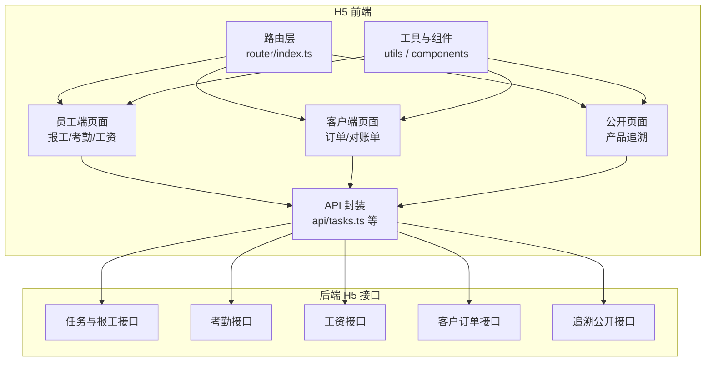
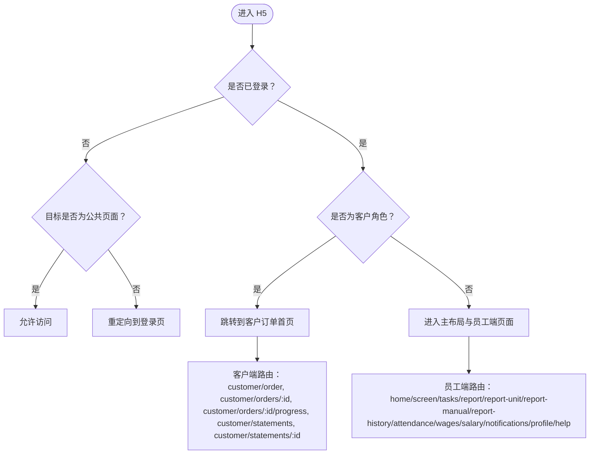
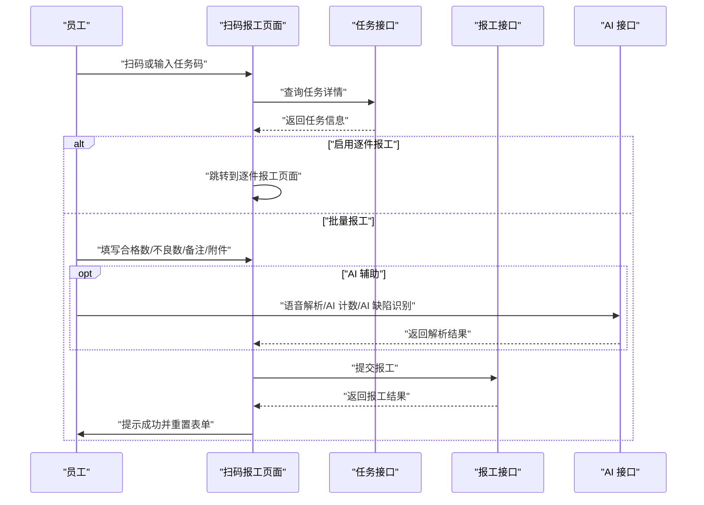
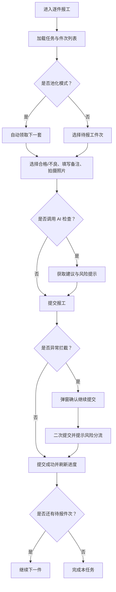
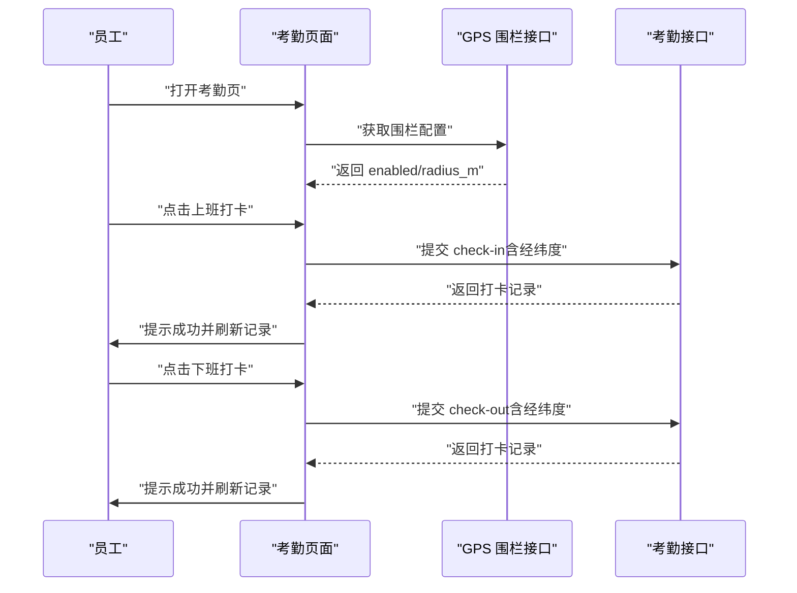
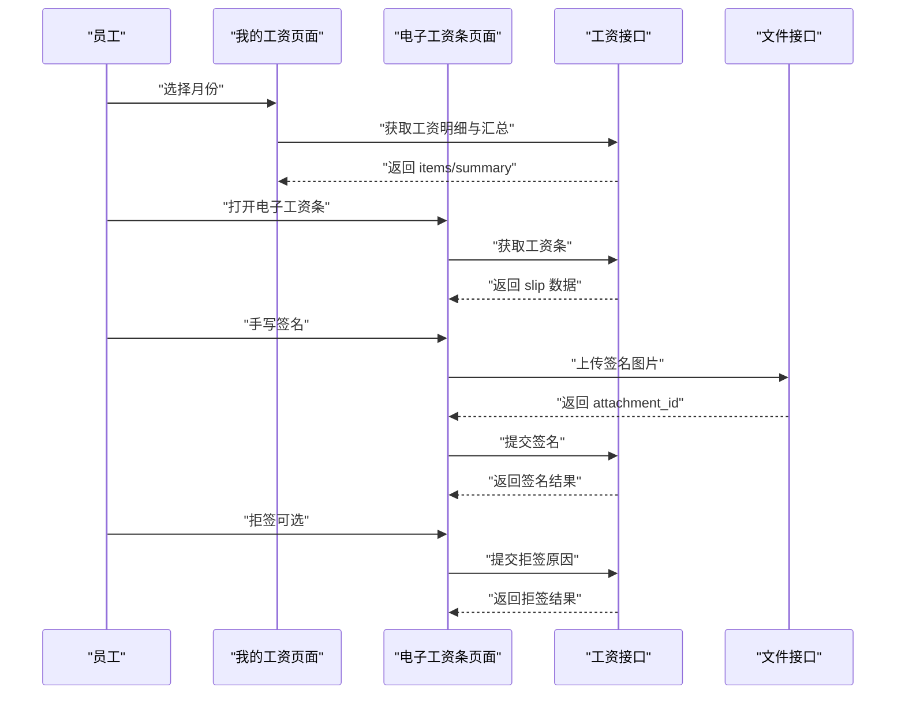
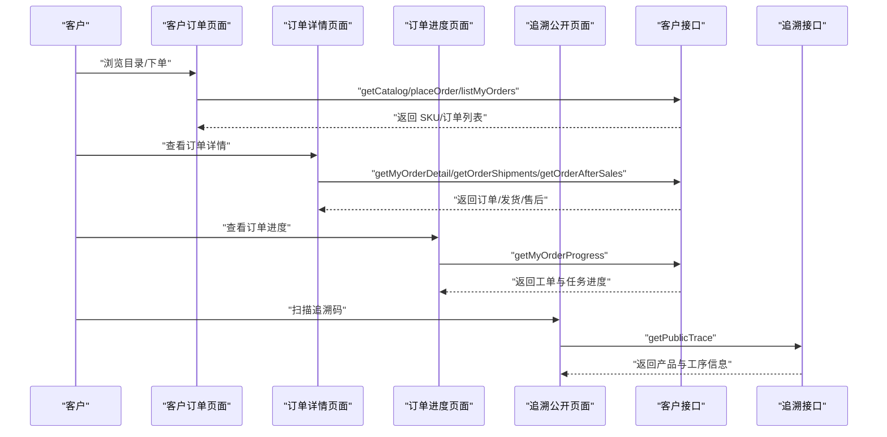
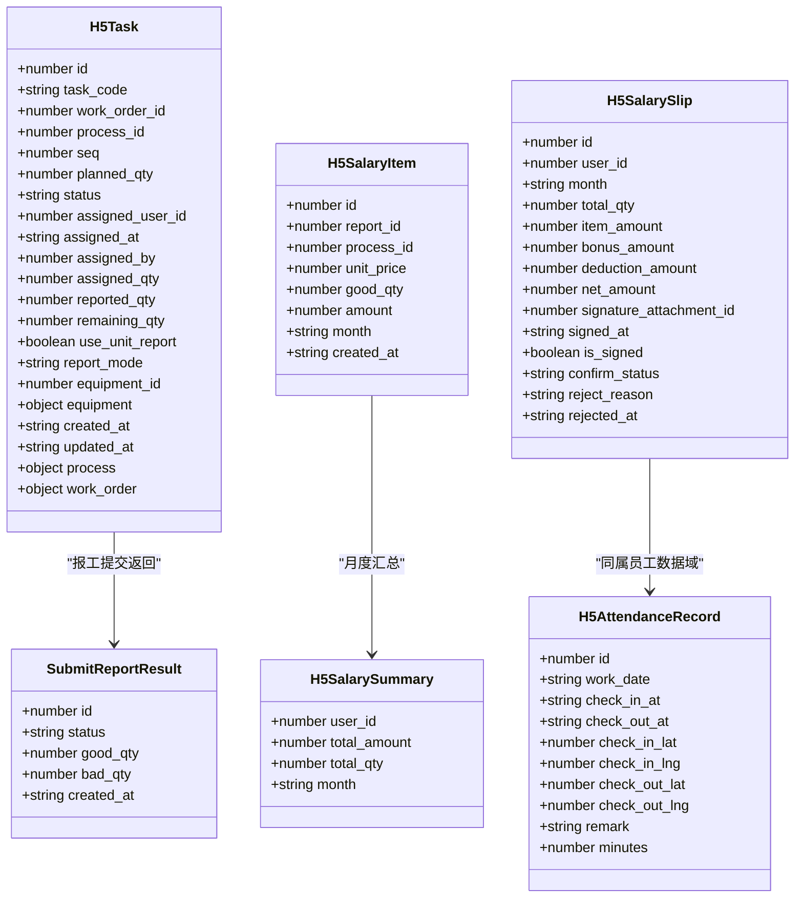
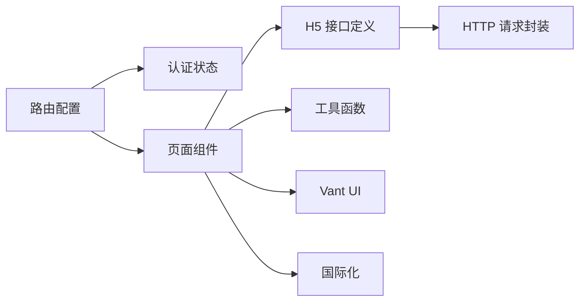

# 员工与客户端 H5（frontend-h5）

<cite>
**本文引用的文件**   
- [路由配置](file://frontend-h5/src/router/index.ts)
- [扫码报工页面](file://frontend-h5/src/pages/ReportWorkPage.vue)
- [逐件报工页面](file://frontend-h5/src/pages/ReportUnitPage.vue)
- [主动报工入口页面](file://frontend-h5/src/pages/ReportManualPage.vue)
- [报工记录页面](file://frontend-h5/src/pages/ReportHistoryPage.vue)
- [任务列表页面](file://frontend-h5/src/pages/TasksPage.vue)
- [任务详情页面](file://frontend-h5/src/pages/TaskDetailPage.vue)
- [考勤打卡页面](file://frontend-h5/src/pages/AttendancePage.vue)
- [我的工资页面](file://frontend-h5/src/pages/WagesPage.vue)
- [电子工资条页面](file://frontend-h5/src/pages/SalarySlipPage.vue)
- [客户订单列表页面](file://frontend-h5/src/pages/CustomerOrderPage.vue)
- [客户订单详情页面](file://frontend-h5/src/pages/CustomerOrderDetailPage.vue)
- [客户订单进度页面](file://frontend-h5/src/pages/CustomerOrderProgressPage.vue)
- [客户对账单列表页面](file://frontend-h5/src/pages/CustomerStatementsPage.vue)
- [客户对账单详情页面](file://frontend-h5/src/pages/CustomerStatementDetailPage.vue)
- [产品追溯公开页面](file://frontend-h5/src/pages/TracePublicPage.vue)
- [H5 接口定义](file://frontend-h5/src/api/tasks.ts)
</cite>

## 目录
1. [引言](#引言)
2. [项目结构定位](#项目结构定位)
3. [核心页面与职责](#核心页面与职责)
4. [路由与权限控制](#路由与权限控制)
5. [关键业务流程](#关键业务流程)
6. [组件关系与数据流](#组件关系与数据流)
7. [依赖分析](#依赖分析)
8. [性能与体验特性](#性能与体验特性)
9. [常见问题排查](#常见问题排查)
10. [结论](#结论)

## 引言
本文件聚焦 `frontend-h5` 子项目，梳理基于 Vue 3 + Vant 4 的员工端与客户端 H5 移动端页面、路由与业务边界。重点覆盖：
- 员工端：扫码报工、逐件报工、主动报工、报工记录、任务列表、任务详情、考勤打卡、我的工资、电子工资条。
- 客户端：客户订单浏览与下单、订单详情、订单进度、对账单列表与详情。
- 公开能力：产品追溯信息查看。

后端采用 FastAPI + SQLAlchemy + Alembic + Celery；前端为 Vue 3 全家桶，PC 管理后台使用 Element Plus，员工与客户端 H5 使用 Vant 4，微信小程序使用 uni-app。本项目不含 React、Go Gin、PostgreSQL、MinIO。

## 项目结构定位
`frontend-h5` 是面向员工与客户的轻量 H5 应用，主要目录包括：
- `src/pages`：按业务划分的页面组件，如报工、考勤、工资、客户订单等。
- `src/router`：Vue Router 路由配置与全局守卫。
- `src/api`：前端 API 封装，对应后端 `/h5/*` 接口。
- `src/components`：通用组件，如拍照、文件上传、扫码按钮等。
- `src/utils`：工具函数，如 HTTP 请求、二维码、语音输入、租户路径适配等。
- `src/layouts`：主布局容器。
- `src/stores`：状态管理，例如登录态与用户信息。

**图示来源**
- [路由配置:1-154](file://frontend-h5/src/router/index.ts#L1-L154)
- [H5 接口定义:1-257](file://frontend-h5/src/api/tasks.ts#L1-L257)

**章节来源**
- [路由配置:1-154](file://frontend-h5/src/router/index.ts#L1-L154)

## 核心页面与职责
本节按业务域梳理 H5 页面的职责、入口路由与关键交互。

### 员工端：报工体系
| 页面 | 路由 | 主要职责 | 关键交互 |
|---|---|---|---|
| 扫码报工 | `/report` | 扫描或手动输入任务码，批量提交合格数、不良数、备注与附件，支持 AI 语音解析、AI 计数、AI 缺陷识别。 | 扫码、查询任务、上传附件、语音输入、提交报工。 |
| 逐件报工 | `/report-unit` | 按套号或池化模式逐件报工，绑定成品码、流程上下文、异常拦截与二次确认。 | 选择件次、拍摄照片、AI 检查、提交并自动领取下一套。 |
| 主动报工 | `/report-manual` | 输入任务码后进入逐件报工。 | 输入任务码跳转。 |
| 报工记录 | `/report-history` | 查看已提交的逐件报工记录，过滤草稿。 | 列表展示状态、结果类型、时间。 |
| 任务列表 | `/tasks` | 查看我的任务，按状态筛选，支持 AI 推荐急件、续报、剩余最多任务。 | 下拉刷新、分页加载、点击报工。 |
| 任务详情 | `/tasks/:id` | 查看任务基础信息、设备信息、工单信息、派工数量、报工二维码。 | 复制任务码、开始报工、返回任务列表。 |

**章节来源**
- [扫码报工页面:1-518](file://frontend-h5/src/pages/ReportWorkPage.vue#L1-L518)
- [逐件报工页面:1-559](file://frontend-h5/src/pages/ReportUnitPage.vue#L1-L559)
- [主动报工入口页面:1-27](file://frontend-h5/src/pages/ReportManualPage.vue#L1-L27)
- [报工记录页面:1-60](file://frontend-h5/src/pages/ReportHistoryPage.vue#L1-L60)
- [任务列表页面:1-247](file://frontend-h5/src/pages/TasksPage.vue#L1-L247)
- [任务详情页面:1-197](file://frontend-h5/src/pages/TaskDetailPage.vue#L1-L197)

### 员工端：考勤与工资
| 页面 | 路由 | 主要职责 | 关键交互 |
|---|---|---|---|
| 考勤打卡 | `/attendance` | 上班打卡、下班打卡，显示今日状态、本月统计、最近记录，支持 GPS 围栏提示。 | 打卡、刷新、查看工时。 |
| 我的工资 | `/wages` | 按月查看工资明细与汇总，支持月份切换、电子工资条入口。 | 上月/下月、选择月份、查看明细。 |
| 电子工资条 | `/salary/slip` | 查看当月工资条，手写签名确认或拒签，查看签名图片与拒签原因。 | 签名、拒签、查看详情。 |

**章节来源**
- [考勤打卡页面:1-242](file://frontend-h5/src/pages/AttendancePage.vue#L1-L242)
- [我的工资页面:1-207](file://frontend-h5/src/pages/WagesPage.vue#L1-L207)
- [电子工资条页面:1-275](file://frontend-h5/src/pages/SalarySlipPage.vue#L1-L275)

### 客户端：订单与对账单
| 页面 | 路由 | 主要职责 | 关键交互 |
|---|---|---|---|
| 客户订单 | `/customer/order` | 浏览 SKU 目录、下单、查看我的订单、跳转到对账单。 | 搜索、筛选产品、下单、查看订单。 |
| 客户订单详情 | `/customer/orders/:id` | 查看订单基本信息、进度、发货信息、售后申请。 | 查看进度、申请售后、返回列表。 |
| 客户订单进度 | `/customer/orders/:id/progress` | 查看订单下的工单与任务进度。 | 查看工单、任务进度百分比。 |
| 客户对账单列表 | `/customer/statements` | 按状态查看对账单列表，分页浏览。 | 状态筛选、翻页、查看详情。 |
| 客户对账单详情 | `/customer/statements/:id` | 查看对账单金额、明细、确认、标记已付款、下载 CSV。 | 确认、标记已付款、下载。 |

**章节来源**
- [客户订单列表页面:1-307](file://frontend-h5/src/pages/CustomerOrderPage.vue#L1-L307)
- [客户订单详情页面:1-250](file://frontend-h5/src/pages/CustomerOrderDetailPage.vue#L1-L250)
- [客户订单进度页面:1-101](file://frontend-h5/src/pages/CustomerOrderProgressPage.vue#L1-L101)
- [客户对账单列表页面:1-125](file://frontend-h5/src/pages/CustomerStatementsPage.vue#L1-L125)
- [客户对账单详情页面:1-149](file://frontend-h5/src/pages/CustomerStatementDetailPage.vue#L1-L149)

### 公开能力：产品追溯
| 页面 | 路由 | 主要职责 | 关键交互 |
|---|---|---|---|
| 产品追溯公开页 | `/trace` | 根据追溯码与租户参数展示产品信息、生产工序记录、质检影像。 | 扫码或输入追溯码、查看工序与媒体。 |

**章节来源**
- [产品追溯公开页面:1-110](file://frontend-h5/src/pages/TracePublicPage.vue#L1-L110)

## 路由与权限控制
路由以 Hash 历史模式运行，统一入口为根路径，登录后进入主布局，未登录访问受保护路由时重定向到登录页。公共页面如登录、指南、产品追溯无需登录。

**图示来源**
- [路由配置:75-147](file://frontend-h5/src/router/index.ts#L75-L147)

关键规则：
- 未登录且非公共页面：重定向到 `/login`，并携带原始跳转路径。
- 登录后访问 `/login`：若已登录则根据用户角色跳转，客户角色默认进入客户订单页。
- 客户角色限制：隐藏员工端功能路由，如任务、报工、考勤、工资等，统一重定向到客户订单页。
- 标题设置：根据路由元信息动态设置页面标题，支持国际化键值。

**章节来源**
- [路由配置:1-154](file://frontend-h5/src/router/index.ts#L1-L154)

## 关键业务流程

### 扫码报工流程
员工通过扫码或手动输入任务码，系统加载任务详情，判断是否启用逐件报工；若启用则跳转到逐件报工页面，否则在批量报工页面填写合格数、不良数、备注与附件并提交。

**图示来源**
- [扫码报工页面:37-60](file://frontend-h5/src/pages/ReportWorkPage.vue#L37-L60)
- [扫码报工页面:283-332](file://frontend-h5/src/pages/ReportWorkPage.vue#L283-L332)
- [H5 接口定义:40-75](file://frontend-h5/src/api/tasks.ts#L40-L75)

### 逐件报工流程
逐件报工支持池化模式与手工选择件次，提交前可调用 AI 检查、缺陷识别、拍照计数；当检测到异常时弹出确认对话框，确认后二次提交并提示风险分流结果。

**图示来源**
- [逐件报工页面:87-112](file://frontend-h5/src/pages/ReportUnitPage.vue#L87-L112)
- [逐件报工页面:302-374](file://frontend-h5/src/pages/ReportUnitPage.vue#L302-L374)

### 考勤打卡流程
考勤页面加载最近打卡记录与 GPS 围栏配置，支持上班打卡与下班打卡，并在失败时提示错误。

**图示来源**
- [考勤打卡页面:64-104](file://frontend-h5/src/pages/AttendancePage.vue#L64-L104)
- [H5 接口定义:168-198](file://frontend-h5/src/api/tasks.ts#L168-L198)

### 工资与电子工资条流程
工资页面按月拉取工资明细与汇总，电子工资条页面拉取当前月工资条，支持手写签名与拒签。

**图示来源**
- [我的工资页面:48-114](file://frontend-h5/src/pages/WagesPage.vue#L48-L114)
- [电子工资条页面:38-193](file://frontend-h5/src/pages/SalarySlipPage.vue#L38-L193)
- [H5 接口定义:108-151](file://frontend-h5/src/api/tasks.ts#L108-L151)

### 客户订单与追溯流程
客户浏览 SKU 目录、下单、查看订单详情与进度；公开追溯页根据追溯码展示产品信息与工序记录。

**图示来源**
- [客户订单列表页面:88-162](file://frontend-h5/src/pages/CustomerOrderPage.vue#L88-L162)
- [客户订单详情页面:77-143](file://frontend-h5/src/pages/CustomerOrderDetailPage.vue#L77-L143)
- [客户订单进度页面:33-44](file://frontend-h5/src/pages/CustomerOrderProgressPage.vue#L33-L44)
- [产品追溯公开页面:25-48](file://frontend-h5/src/pages/TracePublicPage.vue#L25-L48)

## 组件关系与数据流
以下类图展示 H5 前端中与报工、任务、考勤、工资相关的主要数据结构与接口关系。

**图示来源**
- [H5 接口定义:5-38](file://frontend-h5/src/api/tasks.ts#L5-L38)
- [H5 接口定义:59-75](file://frontend-h5/src/api/tasks.ts#L59-L75)
- [H5 接口定义:90-151](file://frontend-h5/src/api/tasks.ts#L90-L151)
- [H5 接口定义:153-198](file://frontend-h5/src/api/tasks.ts#L153-L198)

## 依赖分析
- 路由依赖：
  - 登录态与用户信息：`@/stores/auth`
  - 国际化：`@/locales`
  - 租户路径适配：`@/utils/tenant`
- 页面依赖：
  - 报工页面依赖任务接口、文件上传接口、AI 接口、语音输入工具。
  - 考勤页面依赖考勤接口与地理定位。
  - 工资页面依赖工资接口与文件上传接口。
  - 客户订单页面依赖客户接口。
  - 追溯页面依赖公开追溯接口。
- 外部依赖：
  - Vant UI 组件库用于弹窗、表单、标签、进度条等。
  - Vue Router 提供路由与导航。
  - Vue I18n 提供多语言支持。

**图示来源**
- [路由配置:1-21](file://frontend-h5/src/router/index.ts#L1-L21)
- [H5 接口定义:1-4](file://frontend-h5/src/api/tasks.ts#L1-L4)

**章节来源**
- [路由配置:1-154](file://frontend-h5/src/router/index.ts#L1-L154)
- [H5 接口定义:1-257](file://frontend-h5/src/api/tasks.ts#L1-L257)

## 性能与体验特性
- 懒加载路由：部分页面使用动态导入，减少首屏体积。
- 下拉刷新与分页：任务列表支持下拉刷新与分页加载，提升大数据量体验。
- 异步并行请求：订单详情同时拉取订单、发货、售后信息，缩短等待时间。
- 离线降级：语音识别不可用时自动切换到文字输入弹层。
- 安全区域适配：底部按钮考虑安全区高度，避免被刘海遮挡。
- 缓存与重试：路由错误时尝试恢复过期 chunk，提高稳定性。

[本节为通用指导，不直接分析具体文件]

## 常见问题排查
- 扫码无法识别任务码：
  - 检查扫码解析逻辑与任务码格式。
  - 确认任务是否存在且状态允许报工。
- 语音识别不可用：
  - 浏览器不支持 Web Speech API 或网络受限，自动降级到文字输入。
- 打卡失败：
  - 检查 GPS 权限与围栏配置，确认经纬度是否正确传递。
- 工资条签名失败：
  - 检查 Canvas 绘制与文件上传流程，确认 attachment_id 返回。
- 客户订单无法下单：
  - 检查 SKU 目录加载与下单参数，确认用户角色与权限。

**章节来源**
- [扫码报工页面:93-192](file://frontend-h5/src/pages/ReportWorkPage.vue#L93-L192)
- [考勤打卡页面:64-104](file://frontend-h5/src/pages/AttendancePage.vue#L64-L104)
- [电子工资条页面:148-193](file://frontend-h5/src/pages/SalarySlipPage.vue#L148-L193)
- [客户订单列表页面:120-150](file://frontend-h5/src/pages/CustomerOrderPage.vue#L120-L150)

## 结论
`frontend-h5` 以清晰的页面划分与路由控制，构建了完整的员工端与客户端 H5 能力：
- 员工端覆盖从任务发现、扫码报工、逐件报工、考勤打卡到工资查看与电子工资条的全链路。
- 客户端覆盖 SKU 目录、下单、订单详情、订单进度、对账单管理与下载。
- 公开追溯页提供透明化的产品生命周期信息。

整体架构遵循前后端分离，前端通过统一的 API 封装与工具函数与后端交互，结合 Vant UI 与 Vue 生态实现良好的移动端体验。后续可扩展更多 AI 能力与报表维度，进一步优化用户体验与生产效率。