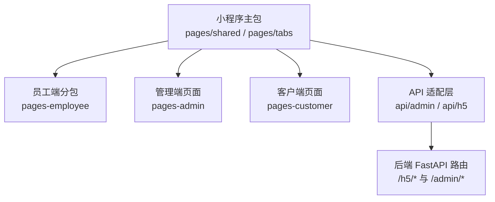
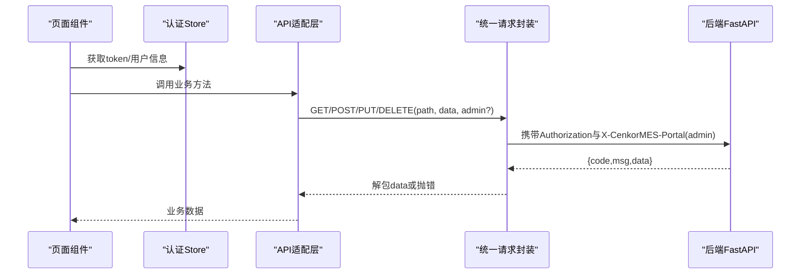
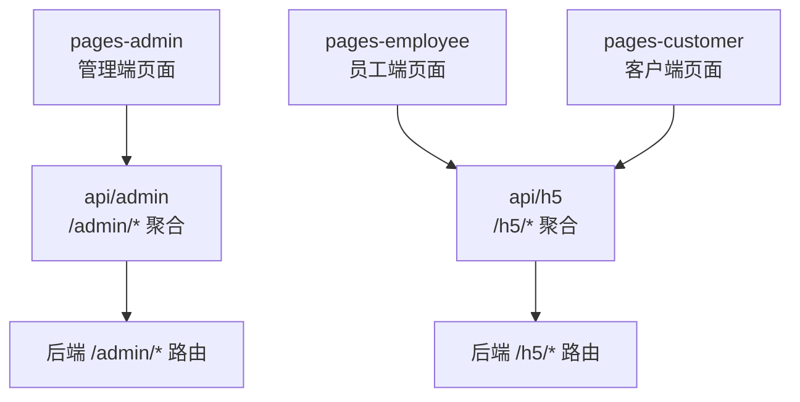
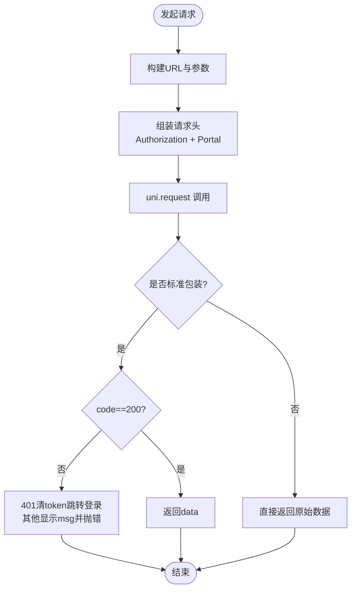
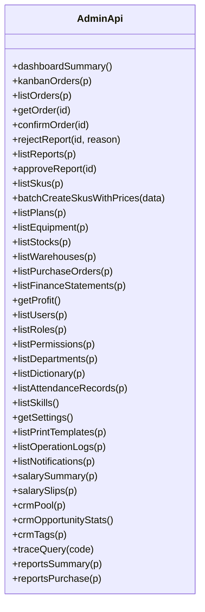
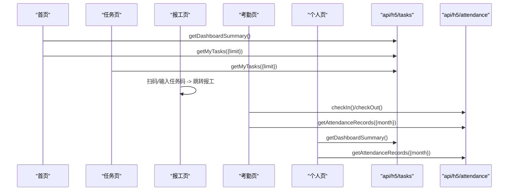
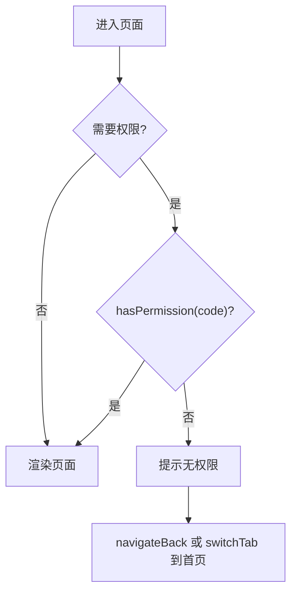
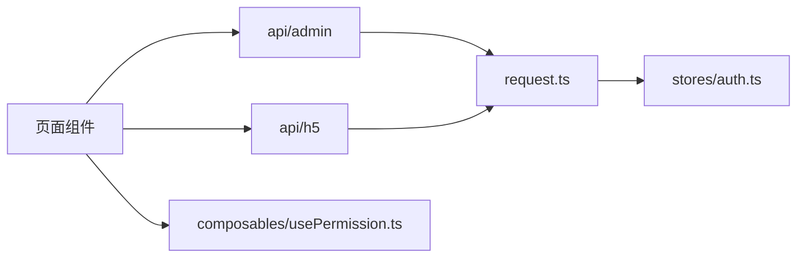

# 微信小程序（lightmes-miniapp）

<cite>
**本文引用的文件**   
- [pages.json](file://lightmes-miniapp/src/pages.json)
- [request.ts](file://lightmes-miniapp/src/api/request.ts)
- [admin/index.ts](file://lightmes-miniapp/src/api/admin/index.ts)
- [portal.ts](file://lightmes-miniapp/src/utils/portal.ts)
- [auth.ts](file://lightmes-miniapp/src/stores/auth.ts)
- [usePermission.ts](file://lightmes-miniapp/src/composables/usePermission.ts)
- [emp-home/index.vue](file://lightmes-miniapp/src/pages/tabs/emp-home/index.vue)
- [emp-tasks/index.vue](file://lightmes-miniapp/src/pages/tabs/emp-tasks/index.vue)
- [emp-report/index.vue](file://lightmes-miniapp/src/pages/tabs/emp-report/index.vue)
- [emp-attendance/index.vue](file://lightmes-miniapp/src/pages/tabs/emp-attendance/index.vue)
- [emp-profile/index.vue](file://lightmes-miniapp/src/pages/tabs/emp-profile/index.vue)
</cite>

## 目录
1. [引言](#引言)
2. [项目结构](#项目结构)
3. [核心组件](#核心组件)
4. [架构总览](#架构总览)
5. [详细组件分析](#详细组件分析)
6. [依赖关系分析](#依赖关系分析)
7. [性能与可维护性建议](#性能与可维护性建议)
8. [故障排查指南](#故障排查指南)
9. [结论](#结论)

## 引言
本文聚焦 uni-app 小程序端 lightmes-miniapp，梳理以下目标：
- 三层页面分层：pages-admin（管理端）、pages-employee（员工端）、pages-customer（客户端）。
- 接口适配层：api/admin（面向管理端）与 api/h5（面向员工/客户端 H5 风格接口）。
- 统一请求封装、鉴权与权限控制。
- 以实际代码为依据，给出架构图、调用链与排错要点。

## 项目结构
lightmes-miniapp 采用“主包 + 分包”的 uni-app 组织方式：
- 主包包含通用登录、绑定账号、帮助、溯源等共享页面，以及员工端 TabBar 入口页。
- 员工端功能通过 subPackages 挂载到 pages-employee。
- 管理端与客户端页面分别位于 pages-admin 与 pages-customer，由业务路由或权限控制进入。

**图示来源**
- [pages.json:1-173](file://lightmes-miniapp/src/pages.json#L1-L173)

**章节来源**
- [pages.json:1-173](file://lightmes-miniapp/src/pages.json#L1-L173)

## 核心组件
- 统一请求封装 request.ts：负责 Token 存取、URL 拼接、请求头注入、统一错误处理与 401 跳转。
- 管理端 API 聚合 admin/index.ts：将 /admin/* 与部分 /dashboard/*、/h5/* 能力封装为前端方法。
- 门户头 portal.ts：提供 X-CenkorMES-Portal=admin 标识，用于后端识别管理端来源。
- 认证状态 auth.ts：Pinia store，持有 token、用户信息、角色权限、未读消息数，并提供登出刷新逻辑。
- 权限 composable usePermission.ts：封装 hasPermission、requirePermission、requireEmployee 等常用权限判断。

**章节来源**
- [request.ts:1-122](file://lightmes-miniapp/src/api/request.ts#L1-L122)
- [admin/index.ts:1-103](file://lightmes-miniapp/src/api/admin/index.ts#L1-L103)
- [portal.ts:1-9](file://lightmes-miniapp/src/utils/portal.ts#L1-L9)
- [auth.ts:1-78](file://lightmes-miniapp/src/stores/auth.ts#L1-L78)
- [usePermission.ts:1-37](file://lightmes-miniapp/src/composables/usePermission.ts#L1-L37)

## 架构总览
小程序端通过 uni.request 发起 HTTP 请求，经 request.ts 统一封装后，按业务域分发到 api/admin 或 api/h5；管理端请求额外携带门户头，后端据此区分管理端流量。

**图示来源**
- [request.ts:41-122](file://lightmes-miniapp/src/api/request.ts#L41-L122)
- [admin/index.ts:5-102](file://lightmes-miniapp/src/api/admin/index.ts#L5-L102)
- [portal.ts:3-8](file://lightmes-miniapp/src/utils/portal.ts#L3-L8)

## 详细组件分析

### 页面分层与职责
- pages-admin（管理端）
  - 面向管理员/运营人员，覆盖看板、生产、计划、采购、财务、系统设置、仓库、质量、设备、CRM 等模块。
  - 主要调用 api/admin 下的接口，并附带 admin=true 标志，使请求携带门户头。
- pages-employee（员工端）
  - 员工任务、扫码报工、手动报工、报工记录、薪资查询、考勤打卡、消息订阅等。
  - 主要调用 api/h5 下的接口，如 tasks、attendance、notifications、salary 等。
- pages-customer（客户端）
  - 客户订单跟踪、对账单详情、售后、发货、通知订阅等。
  - 同样基于 api/h5 的能力对外暴露给客户端使用。

**图示来源**
- [pages.json:108-167](file://lightmes-miniapp/src/pages.json#L108-L167)
- [admin/index.ts:5-102](file://lightmes-miniapp/src/api/admin/index.ts#L5-L102)

**章节来源**
- [pages.json:108-167](file://lightmes-miniapp/src/pages.json#L108-L167)

### 统一请求封装与鉴权
- Token 管理：getToken/setToken/clearToken 读写本地存储。
- 请求构建：buildUrl 支持环境变量 VITE_API_BASE_URL，自动补全路径与查询参数。
- 请求头：Authorization 与 adminHeaders（X-CenkorMES-Portal=admin）。
- 响应处理：统一解析 {code,msg,data}，code=200 返回 data；code=401 清理 token 并跳转登录；其他错误提示并抛出。
- 便捷方法：apiGet/apiPost/apiPut/apiDel 及 POST/PUT 走 query 的参数变体。

**图示来源**
- [request.ts:41-122](file://lightmes-miniapp/src/api/request.ts#L41-L122)

**章节来源**
- [request.ts:1-122](file://lightmes-miniapp/src/api/request.ts#L1-L122)

### 管理端 API 适配（api/admin）
- 聚合 dashboard、production、master、plans、equipment、warehouse、purchase、finance、system、trace、reports 等能力。
- 所有方法默认 admin=true，确保携带管理端门户头。
- 典型用法：listOrders/getOrder/confirmOrder/rejectReport/listSkus/batchCreateSkusWithPrices/getProfit/listUsers 等。

**图示来源**
- [admin/index.ts:5-102](file://lightmes-miniapp/src/api/admin/index.ts#L5-L102)

**章节来源**
- [admin/index.ts:1-103](file://lightmes-miniapp/src/api/admin/index.ts#L1-L103)

### 员工端页面与 H5 接口适配
- emp-home/index.vue：展示今日概览、快捷入口、待办任务预览；调用 getDashboardSummary 与 getMyTasks。
- emp-tasks/index.vue：任务列表与状态筛选；调用 getMyTasks。
- emp-report/index.vue：扫码报工与手动报工入口；跳转到具体报工页。
- emp-attendance/index.vue：考勤打卡与月度统计；调用 attendance 相关接口。
- emp-profile/index.vue：个人卡与常用功能；汇总 dashboard 与 attendance 数据。

**图示来源**
- [emp-home/index.vue:92-179](file://lightmes-miniapp/src/pages/tabs/emp-home/index.vue#L92-L179)
- [emp-tasks/index.vue:65-121](file://lightmes-miniapp/src/pages/tabs/emp-tasks/index.vue#L65-L121)
- [emp-report/index.vue:55-91](file://lightmes-miniapp/src/pages/tabs/emp-report/index.vue#L55-L91)
- [emp-attendance/index.vue:108-231](file://lightmes-miniapp/src/pages/tabs/emp-attendance/index.vue#L108-L231)
- [emp-profile/index.vue:106-152](file://lightmes-miniapp/src/pages/tabs/emp-profile/index.vue#L106-L152)

**章节来源**
- [emp-home/index.vue:92-179](file://lightmes-miniapp/src/pages/tabs/emp-home/index.vue#L92-L179)
- [emp-tasks/index.vue:65-121](file://lightmes-miniapp/src/pages/tabs/emp-tasks/index.vue#L65-L121)
- [emp-report/index.vue:55-91](file://lightmes-miniapp/src/pages/tabs/emp-report/index.vue#L55-L91)
- [emp-attendance/index.vue:108-231](file://lightmes-miniapp/src/pages/tabs/emp-attendance/index.vue#L108-L231)
- [emp-profile/index.vue:106-152](file://lightmes-miniapp/src/pages/tabs/emp-profile/index.vue#L106-L152)

### 权限与访问控制
- 认证状态：auth store 提供 roles、permissions、isEmployee、hasPermission、refreshUnread、logout。
- 权限工具：usePermission 提供 requirePermission、requireEmployee，失败时提示并回退到员工首页。
- 登录态失效：request.ts 在 code=401 时清理 token 并跳转登录页。

**图示来源**
- [usePermission.ts:11-28](file://lightmes-miniapp/src/composables/usePermission.ts#L11-L28)
- [auth.ts:21-24](file://lightmes-miniapp/src/stores/auth.ts#L21-L24)
- [request.ts:75-90](file://lightmes-miniapp/src/api/request.ts#L75-L90)

**章节来源**
- [usePermission.ts:1-37](file://lightmes-miniapp/src/composables/usePermission.ts#L1-L37)
- [auth.ts:1-78](file://lightmes-miniapp/src/stores/auth.ts#L1-L78)
- [request.ts:75-90](file://lightmes-miniapp/src/api/request.ts#L75-L90)

## 依赖关系分析
- 页面依赖 API 适配层：
  - 员工端页面依赖 api/h5/tasks、api/h5/attendance 等。
  - 管理端页面依赖 api/admin 聚合方法。
- API 适配层依赖统一请求封装：
  - api/admin 中所有方法均传入 admin=true，触发门户头注入。
- 认证与权限：
  - 页面与 store 共同维护登录态与权限；composable 提供统一的权限校验入口。

**图示来源**
- [admin/index.ts:1-103](file://lightmes-miniapp/src/api/admin/index.ts#L1-L103)
- [request.ts:1-122](file://lightmes-miniapp/src/api/request.ts#L1-L122)
- [auth.ts:1-78](file://lightmes-miniapp/src/stores/auth.ts#L1-L78)
- [usePermission.ts:1-37](file://lightmes-miniapp/src/composables/usePermission.ts#L1-L37)

**章节来源**
- [admin/index.ts:1-103](file://lightmes-miniapp/src/api/admin/index.ts#L1-L103)
- [request.ts:1-122](file://lightmes-miniapp/src/api/request.ts#L1-L122)
- [auth.ts:1-78](file://lightmes-miniapp/src/stores/auth.ts#L1-L78)
- [usePermission.ts:1-37](file://lightmes-miniapp/src/composables/usePermission.ts#L1-L37)

## 性能与可维护性建议
- 接口复用：继续以 api/admin 与 api/h5 作为领域聚合点，避免页面直接拼接 URL。
- 分页与缓存：对长列表（任务、报表、库存）增加分页与本地缓存策略，减少重复请求。
- 错误提示：统一使用 request.ts 的错误处理，必要时在页面层补充业务级提示。
- 权限前置：在进入敏感页面前使用 requirePermission/requireEmployee 进行拦截，降低无效请求。
- 主题与样式：保持 employee-theme/customer-theme/admin-theme 的隔离，避免样式污染。

[本节为通用建议，不直接分析具体文件]

## 故障排查指南
- 401 登录过期：检查本地 token 是否存在；确认后端 JWT 配置；观察 request.ts 的 401 分支是否触发跳转登录。
- 网络超时：检查 VITE_API_BASE_URL 与后端域名可达性；查看 request.ts 的 fail 分支提示信息。
- 管理端无法访问：确认页面调用 api/admin 的方法时 admin=true；确认后端能识别 X-CenkorMES-Portal=admin。
- 权限不足：检查用户 roles/permissions 是否正确加载；使用 usePermission.requirePermission 定位拦截位置。

**章节来源**
- [request.ts:75-100](file://lightmes-miniapp/src/api/request.ts#L75-L100)
- [portal.ts:3-8](file://lightmes-miniapp/src/utils/portal.ts#L3-L8)
- [usePermission.ts:15-28](file://lightmes-miniapp/src/composables/usePermission.ts#L15-L28)

## 结论
- pages-admin / pages-employee / pages-customer 形成清晰的角色分层，分别对应管理端、员工端与客户端。
- api/admin 与 api/h5 作为接口适配层，将页面与后端路由解耦，便于多端复用与扩展。
- 统一请求封装与权限控制提升了安全性与可维护性，建议在新增页面时遵循现有模式。

[本节为总结性内容，不直接分析具体文件]