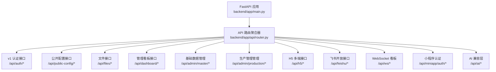
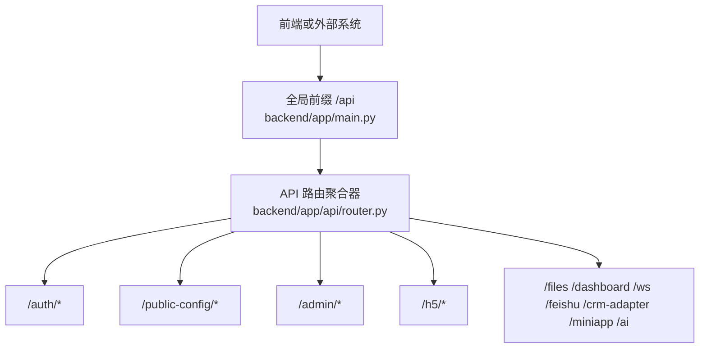
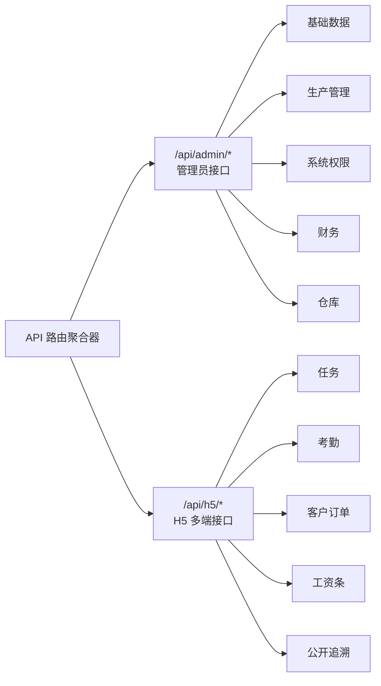
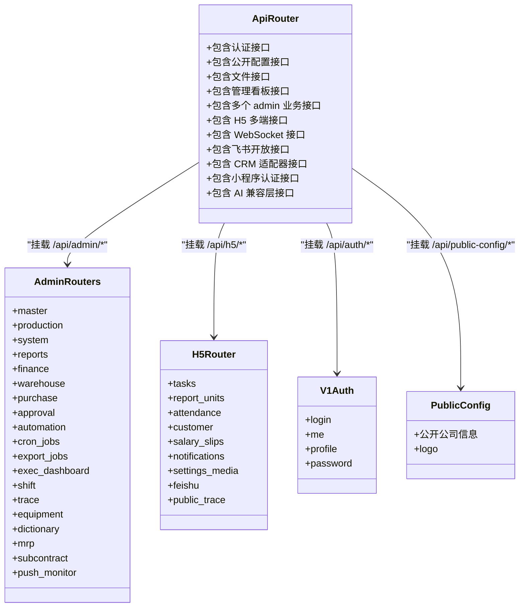
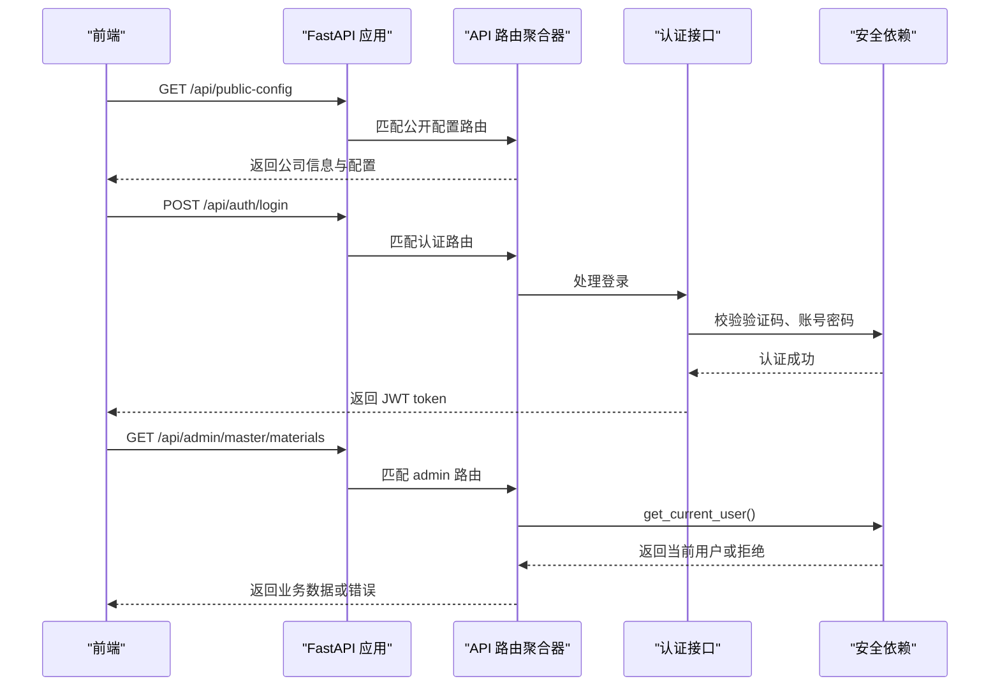
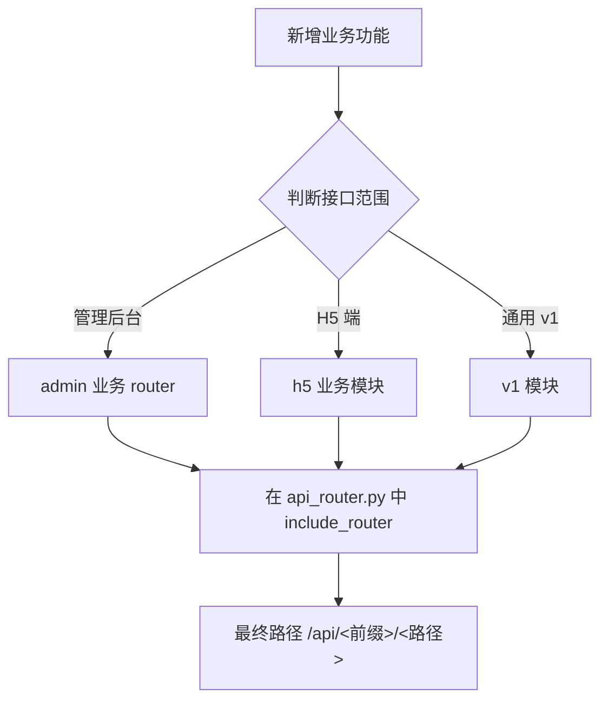

# API 路由与接口分组

<cite>
**本文引用的文件**   
- [backend/app/main.py](file://backend/app/main.py)
- [backend/app/api/router.py](file://backend/app/api/router.py)
- [backend/app/api/h5/router.py](file://backend/app/api/h5/router.py)
- [backend/app/api/v1/auth.py](file://backend/app/api/v1/auth.py)
- [backend/app/api/v1/public_config.py](file://backend/app/api/v1/public_config.py)
</cite>

## 目录
1. [引言](#引言)
2. [项目结构与聚合入口](#项目结构与聚合入口)
3. [接口前缀 /api 与全局挂载方式](#接口前缀-api-与全局挂载方式)
4. [admin 与 h5 多端路由分组](#admin-与-h5-多端路由分组)
5. [各业务 router 的职责边界](#各业务-router-的职责边界)
6. [依赖、鉴权与安全边界](#依赖鉴权与安全边界)
7. [请求路径总览](#请求路径总览)
8. [扩展新接口的规范](#扩展新接口的规范)
9. [常见问题排查](#常见问题排查)
10. [结论](#结论)

## 引言
本文聚焦后端 FastAPI 的 API 路由聚合结构，重点说明以下问题：
- `app/api/router.py` 如何把 admin、h5、dashboard、v1、ws、feishu、crm_adapter、miniapp、ai_compat 等模块聚合到统一入口。
- 为什么所有对外接口都以 `/api` 开头。
- admin 与 h5 两个多端路由组的职责差异。
- 各业务 router 的职责边界，以及新增业务接口时应遵循的路由组织方式。

## 项目结构与聚合入口
后端采用 FastAPI，应用实例在 `backend/app/main.py` 中创建，并通过 `include_router(api_router, prefix="/api")` 将 API 路由挂载到 `/api` 前缀下。  
真正的路由聚合逻辑集中在 `backend/app/api/router.py`，它负责：
- 导入各业务子 router。
- 为不同业务组设置前缀、标签和依赖（例如管理员接口统一要求登录）。
- 把公开接口、管理后台接口、H5 员工/客户端接口、WebSocket、飞书开放接口、CRM 适配器、小程序认证、AI 兼容层等全部汇总到一个 `api_router`。

**图表来源**
- [backend/app/main.py:47-47](file://backend/app/main.py#L47-L47)
- [backend/app/api/router.py:36-84](file://backend/app/api/router.py#L36-L84)

**章节来源**
- [backend/app/main.py:26-47](file://backend/app/main.py#L26-L47)
- [backend/app/api/router.py:1-86](file://backend/app/api/router.py#L1-L86)

## 接口前缀 /api 与全局挂载方式
`backend/app/main.py` 中创建 FastAPI 应用后，通过一行关键代码完成全局挂载：

| 层级 | 作用 | 对应实现位置 |
|---|---|---|
| 应用层 | 定义 FastAPI 实例、中间件、异常处理器、启动初始化 | `backend/app/main.py` |
| 全局前缀 | 所有 API 路由统一以 `/api` 开头 | `backend/app/main.py` 中 `app.include_router(api_router, prefix="/api")` |
| 路由聚合层 | 按业务分组挂载具体 router，并设置子前缀、标签、依赖 | `backend/app/api/router.py` |
| 业务 router 层 | 每个业务模块定义自己的接口路径、参数校验、服务调用 | 各 `router.py` 或模块内直接注册接口 |

这意味着：
- 前端调用时，通常以 `/api/...` 作为基础路径。
- 如果某个 router 自身还设置了 `prefix`，最终路径会拼接，例如 `/api/admin/master/materials`。
- 健康检查接口 `/api/health` 是直接在 FastAPI 应用上注册的，不经过 `api_router`。

**图表来源**
- [backend/app/main.py:47-52](file://backend/app/main.py#L47-L52)
- [backend/app/api/router.py:36-84](file://backend/app/api/router.py#L36-L84)

**章节来源**
- [backend/app/main.py:47-52](file://backend/app/main.py#L47-L52)
- [backend/app/api/router.py:36-84](file://backend/app/api/router.py#L36-L84)

## admin 与 h5 多端路由分组
### admin 多端
admin 路由代表管理后台使用的接口，主要面向 PC 管理端、小程序管理端等需要完整权限控制的场景。  
在 `backend/app/api/router.py` 中，admin 相关 router 被集中挂载，并且统一附加了管理员依赖 `_admin_deps = [Depends(get_current_user)]`，表示这些接口默认需要已登录用户。

典型 admin 分组包括：
- `/api/admin/master`：产品、物料、SKU、BOM、供应商等基础数据。
- `/api/admin/production`：生产相关主模块。
- `/api/admin/system`：系统、租户、角色、权限等 RBAC 能力。
- `/api/admin/reports`：报工、报表相关。
- `/api/admin/shift`：班次。
- `/api/admin/exec-dashboard`：高管看板。
- `/api/admin/cron-jobs`：定时任务。
- `/api/admin/export-jobs`：导出任务。
- `/api/admin/automation`：自动化流程。
- `/api/admin/finance`：财务。
- `/api/admin/purchase`：采购。
- `/api/admin/warehouse`：仓库。
- `/api/admin/approval`：审批流。
- `/api/admin/mrp`：物料需求计划。
- `/api/admin/subcontract`：外协。
- `/api/admin/push-monitor`：推送监控。

这些接口共同特征是：
- 路径以 `/api/admin/...` 开头。
- 通常需要登录态。
- 通常还需要结合 RBAC 权限码控制细粒度访问。

### h5 多端
h5 路由代表面向移动端、H5、微信小程序员工端或客户端的接口。  
在 `backend/app/api/h5/router.py` 中，H5 子路由进一步按功能拆分：

| H5 子路由 | 职责 | 示例路径片段 |
|---|---|---|
| `h5_feishu` | 飞书相关 H5 能力 | `/api/h5/feishu/*` |
| `h5_settings_media` | H5 设置与媒体上传 | `/api/h5/settings-media/*` |
| `h5_tasks` | 任务查看、操作 | `/api/h5/tasks/*` |
| `h5_report_units` | 报工单位 | `/api/h5/report-units/*` |
| `h5_attendance` | 考勤 | `/api/h5/attendance/*` |
| `h5_customer` | 客户订单相关 | `/api/h5/customer/*` |
| `h5_salary_slips` | 工资条 | `/api/h5/salary-slips/*` |
| `h5_notifications` | 通知 | `/api/h5/notifications/*` |
| `h5_public_trace` | 公开追溯页面 | `/api/h5/public/*` |

H5 路由与 admin 路由的关键区别：
- H5 路由挂载在前缀 `/api/h5` 下。
- H5 router 本身没有像 admin 那样统一附加 `get_current_user` 依赖，因此是否登录取决于具体接口内部逻辑。
- H5 更偏向员工端、客户端使用，接口设计通常更轻量，部分接口可能允许匿名访问，例如公开追溯。

**图表来源**
- [backend/app/api/router.py:43-63](file://backend/app/api/router.py#L43-L63)
- [backend/app/api/h5/router.py:15-26](file://backend/app/api/h5/router.py#L15-L26)

**章节来源**
- [backend/app/api/router.py:36-63](file://backend/app/api/router.py#L36-L63)
- [backend/app/api/h5/router.py:1-27](file://backend/app/api/h5/router.py#L1-L27)

## 各业务 router 的职责边界
### 认证与公开配置
- `/api/auth/*`：登录、获取当前用户、修改资料、修改密码。核心认证逻辑在 `backend/app/api/v1/auth.py`，包含登录限流、验证码校验、JWT token 生成。
- `/api/public-config/*`：免登录公开配置，用于登录页和品牌信息加载，必须在拿到 token 之前可用。
- `/api/files/*`：文件相关接口，由 v1 模块提供。
- `/api/public-config/logo`：返回公司 logo，支持本地存储直出和远程存储重定向。

### 管理后台业务
admin 下的每个子 router 对应一个业务域，职责边界清晰：
- `master`：主数据，如产品、物料、工序、工艺路线、SKU、供应商等。
- `production`：生产主模块。
- `plans`：排产计划。
- `reports`：报工与报表。
- `system`：系统配置、RBAC、租户、版本等。
- `trace`：追溯。
- `equipment`：设备。
- `dictionary`：字典。
- `shift`：班次。
- `exec-dashboard`：高管看板。
- `cron-jobs`：定时任务。
- `export-jobs`：导出任务。
- `automation`：自动化。
- `finance`：财务。
- `purchase`：采购。
- `warehouse`：仓库。
- `approval`：审批。
- `mrp`：MRP。
- `subcontract`：外协。
- `push-monitor`：推送监控。

### H5 业务
H5 路由更贴近一线员工和客户端：
- 任务、考勤、客户订单、工资条、通知、报工单位、设置与媒体、飞书集成、公开追溯。
- 公开追溯接口放在 `/api/h5/public/*`，体现“对访客或外部扫码用户开放”的语义。

### 其他聚合模块
- `/api/dashboard`：管理看板接口，附加管理员依赖。
- `/api/ws/*`：WebSocket 看板通道。
- `/api/feishu/*`：飞书开放接口。
- `/api/crm-adapter/*`：CRM 适配器管理接口。
- `/api/crm-adapter/inbound`：CRM 入站数据接口。
- `/api/miniapp/auth/*`：小程序认证接口。
- `/api/ai/*`：AI 兼容层占位接口；独立版未启用 AI 时不会暴露真实能力，但保留路径避免 404。

**图表来源**
- [backend/app/api/router.py:36-84](file://backend/app/api/router.py#L36-L84)
- [backend/app/api/h5/router.py:15-26](file://backend/app/api/h5/router.py#L15-L26)
- [backend/app/api/v1/auth.py:17-105](file://backend/app/api/v1/auth.py#L17-L105)
- [backend/app/api/v1/public_config.py:18-55](file://backend/app/api/v1/public_config.py#L18-L55)

**章节来源**
- [backend/app/api/router.py:36-84](file://backend/app/api/router.py#L36-L84)
- [backend/app/api/h5/router.py:1-27](file://backend/app/api/h5/router.py#L1-L27)
- [backend/app/api/v1/auth.py:1-105](file://backend/app/api/v1/auth.py#L1-L105)
- [backend/app/api/v1/public_config.py:1-55](file://backend/app/api/v1/public_config.py#L1-L55)

## 依赖、鉴权与安全边界
### 管理员接口统一依赖
`backend/app/api/router.py` 中定义了 `_admin_deps = [Depends(get_current_user)]`，并把该依赖应用到大部分 admin 路由。  
这意味着：
- 访问 `/api/admin/*` 下大多数接口时，FastAPI 会先执行 `get_current_user`。
- 如果未携带有效 token 或 token 无效，会在进入业务 handler 前失败。
- 这体现了“管理后台接口默认需要登录”的设计原则。

### 认证接口
`/api/auth/login` 负责：
- 登录失败次数限制。
- 登录验证码校验。
- 用户名密码认证。
- 生成 JWT access_token。
- 返回 token、过期时间、是否记住我等信息。

`/api/auth/me`、`/api/auth/profile`、`/api/auth/password` 则基于已登录用户进行信息查询、资料更新和密码修改。

### 公开配置接口
`/api/public-config` 不需要登录，适合前端在登录前读取公司名称、logo、登录验证码开关、token 过期时间等配置。

**图表来源**
- [backend/app/api/router.py:37-41](file://backend/app/api/router.py#L37-L41)
- [backend/app/api/router.py:43-63](file://backend/app/api/router.py#L43-L63)
- [backend/app/api/v1/auth.py:24-47](file://backend/app/api/v1/auth.py#L24-L47)
- [backend/app/api/v1/public_config.py:21-30](file://backend/app/api/v1/public_config.py#L21-L30)

**章节来源**
- [backend/app/api/router.py:37-63](file://backend/app/api/router.py#L37-L63)
- [backend/app/api/v1/auth.py:24-105](file://backend/app/api/v1/auth.py#L24-L105)
- [backend/app/api/v1/public_config.py:21-55](file://backend/app/api/v1/public_config.py#L21-L55)

## 请求路径总览
以下表格列出主要接口分组及其职责，便于快速定位：

| 接口前缀 | 所属模块 | 职责 | 是否需要登录 |
|---|---|---|---|
| `/api/auth/*` | v1 认证 | 登录、当前用户、资料、密码 | 登录类接口无需登录，查询类接口需要 |
| `/api/public-config/*` | v1 公开配置 | 公司品牌、验证码开关、token 过期时间 | 否 |
| `/api/files/*` | v1 文件 | 文件上传、下载等 | 视具体接口而定 |
| `/api/dashboard/*` | dashboard | 管理看板数据 | 是 |
| `/api/admin/master/*` | admin master | 基础数据管理 | 是 |
| `/api/admin/production/*` | admin production | 生产管理 | 是 |
| `/api/admin/system/*` | admin system | 系统、RBAC、租户 | 是 |
| `/api/admin/reports/*` | admin reports | 报工、报表 | 是 |
| `/api/admin/shift/*` | admin shift | 班次 | 是 |
| `/api/admin/exec-dashboard/*` | admin exec dashboard | 高管看板 | 是 |
| `/api/admin/cron-jobs/*` | admin cron jobs | 定时任务 | 是 |
| `/api/admin/export-jobs/*` | admin export jobs | 导出任务 | 是 |
| `/api/admin/automation/*` | admin automation | 自动化流程 | 是 |
| `/api/admin/finance/*` | admin finance | 财务 | 是 |
| `/api/admin/purchase/*` | admin purchase | 采购 | 是 |
| `/api/admin/warehouse/*` | admin warehouse | 仓库 | 是 |
| `/api/admin/approval/*` | admin approval | 审批 | 是 |
| `/api/admin/mrp/*` | admin mrp | 物料需求计划 | 是 |
| `/api/admin/subcontract/*` | admin subcontract | 外协 | 是 |
| `/api/admin/push-monitor/*` | admin push monitor | 推送监控 | 是 |
| `/api/h5/*` | h5 | 员工端、客户端接口 | 视具体接口而定 |
| `/api/ws/*` | ws dashboard | WebSocket 看板 | 视连接建立逻辑而定 |
| `/api/feishu/*` | feishu | 飞书开放接口 | 视回调与签名逻辑而定 |
| `/api/crm-adapter/*` | crm adapter | CRM 适配器管理 | 视接口而定 |
| `/api/crm-adapter/inbound` | crm adapter inbound | CRM 入站数据 | 通常由外部系统调用 |
| `/api/miniapp/auth/*` | miniapp auth | 小程序认证 | 小程序登录流程 |
| `/api/ai/*` | ai compat | AI 兼容层占位 | 独立版不开放真实能力 |

**章节来源**
- [backend/app/api/router.py:36-84](file://backend/app/api/router.py#L36-L84)

## 扩展新接口的规范
根据现有聚合方式，新增接口建议遵循以下规则：

1. **确定接口归属端**
   - 管理后台强权限接口：放入 `app/api/admin/<业务>/router.py`。
   - H5 员工端或客户端接口：放入 `app/api/h5/<业务>.py`。
   - 通用 v1 接口：放入 `app/api/v1/<模块>.py`。
   - WebSocket：放入 `app/api/ws/<模块>.py`。
   - 第三方开放接口：放入 `app/api/<平台>/router.py`。

2. **在 `app/api/router.py` 中注册**
   - 导入新 router。
   - 使用 `api_router.include_router(...)` 挂载。
   - 为 admin 类接口添加 `dependencies=_admin_deps`。
   - 为业务组设置合理 `prefix` 和 `tags`。

3. **保持路径语义清晰**
   - admin 接口以 `/api/admin/<业务>` 开头。
   - H5 接口以 `/api/h5/<业务>` 开头。
   - 公开接口放在不需要登录的路由组。

4. **不要绕过聚合器**
   - 除非是极少量全局接口，否则不要在 `main.py` 中直接注册业务接口。
   - 业务接口应通过 `api_router` 聚合，保证前缀、标签、依赖一致。

**图表来源**
- [backend/app/api/router.py:36-84](file://backend/app/api/router.py#L36-L84)

**章节来源**
- [backend/app/api/router.py:36-84](file://backend/app/api/router.py#L36-L84)

## 常见问题排查
### 1. 访问 admin 接口返回未登录
**现象**：调用 `/api/admin/*` 接口时报鉴权失败。  
**原因**：admin 路由默认附加 `get_current_user` 依赖，未携带有效 token 会被拦截。  
**处理**：
- 确认已通过 `/api/auth/login` 获取 token。
- 确认请求头中携带正确的 Authorization 或 session token。
- 确认 token 未过期。

**章节来源**
- [backend/app/api/router.py:37-63](file://backend/app/api/router.py#L37-L63)
- [backend/app/api/v1/auth.py:24-47](file://backend/app/api/v1/auth.py#L24-L47)

### 2. 登录频繁失败被限流
**现象**：短时间内多次登录失败后提示登录失败次数过多。  
**原因**：`/api/auth/login` 实现了基于客户端 IP 的登录失败限制。  
**处理**：
- 等待冷却时间后再试。
- 检查验证码是否正确。
- 检查用户名密码是否正确。

**章节来源**
- [backend/app/api/v1/auth.py:24-47](file://backend/app/api/v1/auth.py#L24-L47)

### 3. 前端登录前无法获取公司 logo
**现象**：登录页加载 logo 失败。  
**原因**：logo 可能未配置，或远程存储对象不存在。  
**处理**：
- 检查公司配置中的 logo 附件 ID。
- 检查对象存储中对应文件是否存在。
- 确认 `/api/public-config/logo` 返回状态正常。

**章节来源**
- [backend/app/api/v1/public_config.py:33-55](file://backend/app/api/v1/public_config.py#L33-L55)

### 4. 新增接口后 404
**现象**：新增接口路径无法访问。  
**原因**：未在 `app/api/router.py` 中 `include_router`，或前缀拼接错误。  
**处理**：
- 确认 router 已导入并挂载。
- 确认最终路径是 `/api` + router prefix + 接口 path。
- 确认 tags 和 dependencies 配置正确。

**章节来源**
- [backend/app/api/router.py:36-84](file://backend/app/api/router.py#L36-L84)

## 结论
`backend/app/api/router.py` 是整个后端 API 的聚合中枢。它以 `/api` 为统一入口，把认证、公开配置、文件、看板、admin 多业务、H5 多端、WebSocket、飞书开放接口、CRM 适配器、小程序认证、AI 兼容层等模块整合在一起。  
admin 与 h5 的核心区别在于：
- admin 接口以 `/api/admin/*` 为主，默认需要登录，面向管理后台。
- h5 接口以 `/api/h5/*` 为主，更贴近员工端和客户端，部分接口可匿名访问。
- 新增接口应优先明确业务归属，再在对应 router 中实现，最后通过 `api_router` 挂载，确保路径、标签、鉴权行为一致。