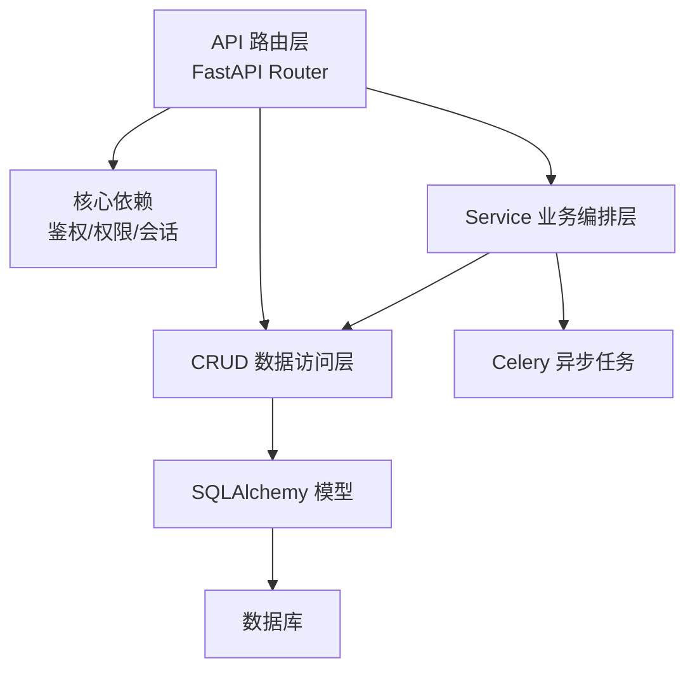
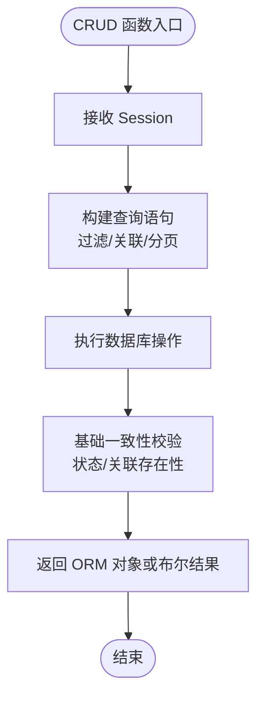
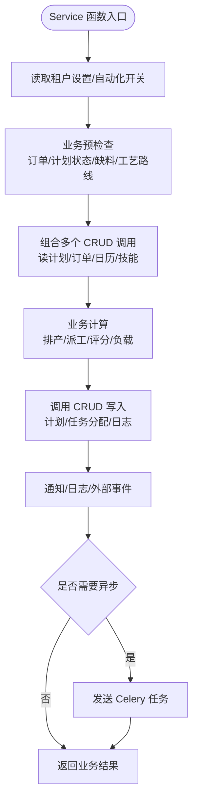
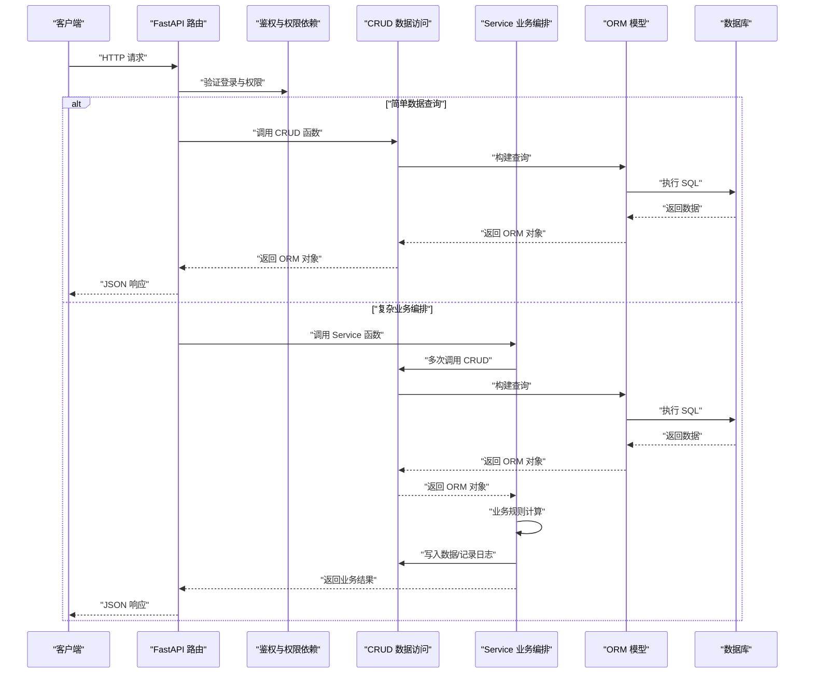
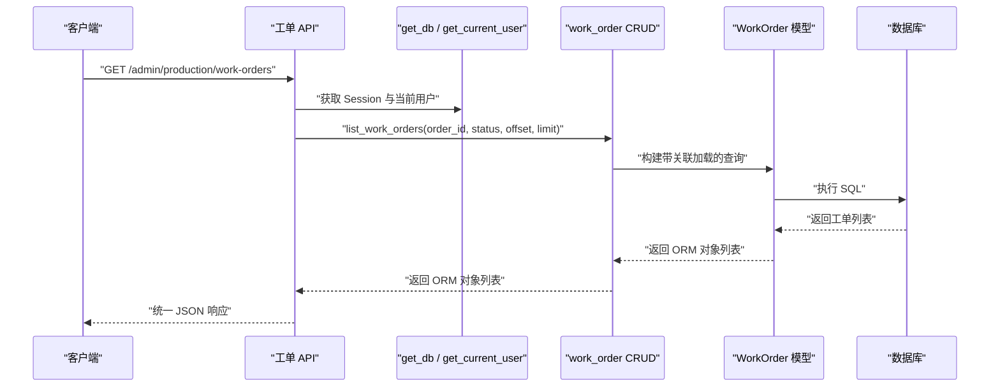
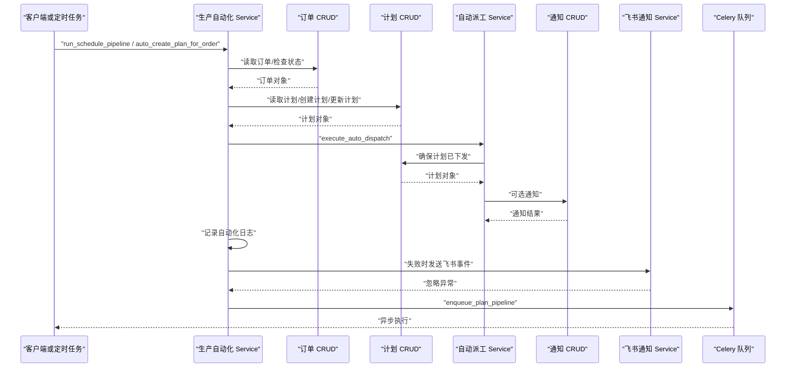
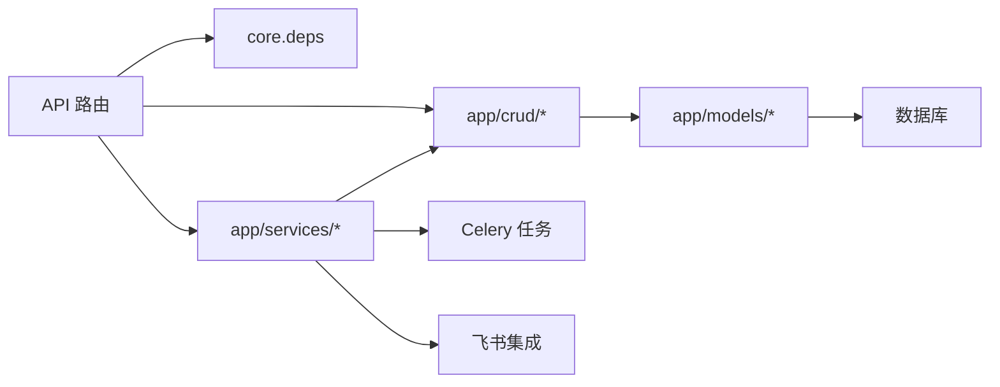

# CRUD 与 Service 业务逻辑层

<cite>
**本文引用的文件**   
- [backend/app/api/router.py](file://backend/app/api/router.py)
- [backend/app/core/deps.py](file://backend/app/core/deps.py)
- [backend/app/api/admin/production/router.py](file://backend/app/api/admin/production/router.py)
- [backend/app/api/admin/production/work_orders.py](file://backend/app/api/admin/production/work_orders.py)
- [backend/app/crud/work_order.py](file://backend/app/crud/work_order.py)
- [backend/app/crud/order.py](file://backend/app/crud/order.py)
- [backend/app/services/production_automation.py](file://backend/app/services/production_automation.py)
- [backend/app/services/plan_auto_dispatch.py](file://backend/app/services/plan_auto_dispatch.py)
- [backend/app/models/work_order.py](file://backend/app/models/work_order.py)
</cite>

## 目录
1. [引言](#引言)
2. [项目结构定位](#项目结构定位)
3. [CRUD 层职责与边界](#crud-层职责与边界)
4. [Service 层职责与边界](#service-层职责与边界)
5. [API、CRUD 与 Service 的协作关系](#apicrud-与-service-的协作关系)
6. [典型流程：工单查询](#典型流程工单查询)
7. [典型流程：生产自动化编排](#典型流程生产自动化编排)
8. [依赖关系分析](#依赖关系分析)
9. [常见问题与排错建议](#常见问题与排错建议)
10. [结论](#结论)

## 引言
本文件聚焦区分后端中 `app/crud`（数据访问）与 `app/services`（业务编排）的职责，并说明它们如何与 API 路由层协作。CenkorMES 的后端采用 FastAPI + SQLAlchemy + Alembic + Celery 的分层架构：API 负责请求入口、鉴权与响应；CRUD 负责模型读写、基础校验与事务内数据变更；Service 负责跨模块业务流程编排、规则计算、外部服务调用和异步任务调度。

## 项目结构定位
从仓库结构看，后端核心代码集中在 `backend/app` 下：
- `app/api`：按业务域划分路由，如 `admin/master`、`admin/production`、`h5`、`v1`、`ws` 等。
- `app/core`：数据库会话、JWT 鉴权、权限依赖、错误与中间件等横切能力。
- `app/models`：SQLAlchemy 模型定义。
- `app/schemas`：Pydantic 输入输出模型。
- `app/crud`：面向模型的增删改查函数集合。
- `app/services`：面向业务场景的服务函数集合。
- `app/tasks`：Celery 异步任务实现。

**图示来源**
- [backend/app/api/router.py:36-65](file://backend/app/api/router.py#L36-L65)
- [backend/app/core/deps.py:19-45](file://backend/app/core/deps.py#L19-L45)

**章节来源**
- [backend/app/api/router.py:1-86](file://backend/app/api/router.py#L1-L86)

## CRUD 层职责与边界
`app/crud` 是“数据访问层”，主要承担以下职责：
- 接收 `sqlalchemy.orm.Session`，执行 SQL 查询、插入、更新、删除。
- 封装常用查询条件、关联加载、分页、排序。
- 对模型状态做基础一致性校验，例如订单是否可删除、是否已有工单、是否已下发计划。
- 返回 ORM 模型对象或简单布尔值、计数结果，不直接构造 HTTP 响应。

以订单与工单为例：
- `order.py` 提供订单查询、创建、更新、提交审核、确认、生成工单等函数，并在其中加入业务相关的基础约束，例如仅草稿订单可删除、已存在工单的订单不可删除、已下发投产的订单不可新增明细。
- `work_order.py` 提供按 ID 获取工单、按订单或状态列表工单等函数，并通过 `selectinload` 预加载 SKU、产品、工序等关联数据，避免 N+1 查询。

**图示来源**
- [backend/app/crud/order.py:42-50](file://backend/app/crud/order.py#L42-L50)
- [backend/app/crud/order.py:87-103](file://backend/app/crud/order.py#L87-L103)
- [backend/app/crud/order.py:394-411](file://backend/app/crud/order.py#L394-L411)
- [backend/app/crud/work_order.py:11-37](file://backend/app/crud/work_order.py#L11-L37)

**章节来源**
- [backend/app/crud/order.py:1-412](file://backend/app/crud/order.py#L1-L412)
- [backend/app/crud/work_order.py:1-38](file://backend/app/crud/work_order.py#L1-L38)

## Service 层职责与边界
`app/services` 是“业务编排层”，主要承担以下职责：
- 组合多个 CRUD 函数完成复杂业务流程。
- 读取配置、日历、权限、技能、产能等业务上下文。
- 执行规则计算，例如自动排产、自动派工、缺料检查、工作日用工日调整。
- 记录自动化日志、发送通知、触发飞书事件。
- 将耗时或独立流程交给 Celery 异步任务执行。

以生产自动化为例：
- `production_automation.py` 提供自动化总入口，包括订单确认前预检查、计划日期正排/倒排、优化器应用、自动下发、自动派工、流水线编排、异步队列发送等。
- `plan_auto_dispatch.py` 抽取自动派工逻辑，供 API 与自动化编排复用，内部会再次调用 CRUD 层进行计划释放、任务分配、员工候选筛选、技能与产能匹配。

**图示来源**
- [backend/app/services/production_automation.py:33-56](file://backend/app/services/production_automation.py#L33-L56)
- [backend/app/services/production_automation.py:59-91](file://backend/app/services/production_automation.py#L59-L91)
- [backend/app/services/production_automation.py:147-192](file://backend/app/services/production_automation.py#L147-L192)
- [backend/app/services/production_automation.py:239-345](file://backend/app/services/production_automation.py#L239-L345)
- [backend/app/services/production_automation.py:472-489](file://backend/app/services/production_automation.py#L472-L489)
- [backend/app/services/plan_auto_dispatch.py:64-207](file://backend/app/services/plan_auto_dispatch.py#L64-L207)

**章节来源**
- [backend/app/services/production_automation.py:1-490](file://backend/app/services/production_automation.py#L1-L490)
- [backend/app/services/plan_auto_dispatch.py:1-208](file://backend/app/services/plan_auto_dispatch.py#L1-L208)

## API、CRUD 与 Service 的协作关系
API 层是请求入口，负责：
- 挂载路由分组，例如 `/admin/master`、`/admin/production`、`/h5`、`/auth`、`/feishu` 等。
- 通过 `get_current_user` 与 `require_permissions` 完成鉴权与权限控制。
- 解析请求参数、调用 CRUD 或 Service、转换 ORM 结果为响应体。
- 在简单 CRUD 场景中直接调用 CRUD；在复杂业务场景中调用 Service。

以生产模块路由为例：
- `router.py` 聚合客户、订单、工单、任务、派工、报工、质检、CRM 等子路由。
- `work_orders.py` 中的接口直接调用 `crud.work_order` 获取工单列表与详情，并返回统一响应格式。

**图示来源**
- [backend/app/api/router.py:36-65](file://backend/app/api/router.py#L36-L65)
- [backend/app/core/deps.py:27-45](file://backend/app/core/deps.py#L27-L45)
- [backend/app/api/admin/production/work_orders.py:60-104](file://backend/app/api/admin/production/work_orders.py#L60-L104)
- [backend/app/crud/work_order.py:11-37](file://backend/app/crud/work_order.py#L11-L37)
- [backend/app/services/production_automation.py:239-345](file://backend/app/services/production_automation.py#L239-L345)

**章节来源**
- [backend/app/api/router.py:1-86](file://backend/app/api/router.py#L1-L86)
- [backend/app/api/admin/production/router.py:1-28](file://backend/app/api/admin/production/router.py#L1-L28)
- [backend/app/api/admin/production/work_orders.py:1-160](file://backend/app/api/admin/production/work_orders.py#L1-L160)
- [backend/app/core/deps.py:1-74](file://backend/app/core/deps.py#L1-L74)

## 典型流程：工单查询
该流程展示 API 如何通过依赖注入获取数据库会话与当前用户，再调用 CRUD 层查询工单。

**图示来源**
- [backend/app/api/admin/production/work_orders.py:60-70](file://backend/app/api/admin/production/work_orders.py#L60-L70)
- [backend/app/core/deps.py:19-45](file://backend/app/core/deps.py#L19-L45)
- [backend/app/crud/work_order.py:18-37](file://backend/app/crud/work_order.py#L18-L37)
- [backend/app/models/work_order.py:11-39](file://backend/app/models/work_order.py#L11-L39)

**章节来源**
- [backend/app/api/admin/production/work_orders.py:1-160](file://backend/app/api/admin/production/work_orders.py#L1-L160)
- [backend/app/crud/work_order.py:1-38](file://backend/app/crud/work_order.py#L1-L38)
- [backend/app/models/work_order.py:1-39](file://backend/app/models/work_order.py#L1-L39)

## 典型流程：生产自动化编排
该流程展示 Service 层如何编排订单确认、计划创建、排产、下发、派工、日志与通知。

**图示来源**
- [backend/app/services/production_automation.py:239-345](file://backend/app/services/production_automation.py#L239-L345)
- [backend/app/services/production_automation.py:348-469](file://backend/app/services/production_automation.py#L348-L469)
- [backend/app/services/production_automation.py:472-489](file://backend/app/services/production_automation.py#L472-L489)
- [backend/app/services/plan_auto_dispatch.py:64-207](file://backend/app/services/plan_auto_dispatch.py#L64-L207)
- [backend/app/crud/order.py:42-50](file://backend/app/crud/order.py#L42-L50)
- [backend/app/crud/production_plan.py:引用位置见 Service 调用处:17-23](file://backend/app/services/production_automation.py#L17-L23)

**章节来源**
- [backend/app/services/production_automation.py:1-490](file://backend/app/services/production_automation.py#L1-L490)
- [backend/app/services/plan_auto_dispatch.py:1-208](file://backend/app/services/plan_auto_dispatch.py#L1-L208)
- [backend/app/crud/order.py:1-412](file://backend/app/crud/order.py#L1-L412)

## 依赖关系分析
从依赖方向看：
- API 依赖 `core.deps` 获取数据库会话、当前用户与权限。
- API 可直接依赖 `crud`，也可依赖 `services`。
- `services` 依赖 `crud` 完成数据读写，并可依赖其他 `services` 完成更细粒度的业务编排。
- `crud` 依赖 `models` 与 SQLAlchemy，不依赖 API 与 Service。
- `services` 可依赖 Celery 任务与外部集成（如飞书）。

**图示来源**
- [backend/app/api/router.py:36-65](file://backend/app/api/router.py#L36-L65)
- [backend/app/core/deps.py:19-45](file://backend/app/core/deps.py#L19-L45)
- [backend/app/services/production_automation.py:13-30](file://backend/app/services/production_automation.py#L13-L30)
- [backend/app/services/production_automation.py:472-489](file://backend/app/services/production_automation.py#L472-L489)

**章节来源**
- [backend/app/api/router.py:1-86](file://backend/app/api/router.py#L1-L86)
- [backend/app/core/deps.py:1-74](file://backend/app/core/deps.py#L1-L74)
- [backend/app/services/production_automation.py:1-490](file://backend/app/services/production_automation.py#L1-L490)

## 常见问题与排错建议
- **权限不足**：API 使用 `require_permissions` 校验权限码，若用户无对应权限会返回 403。排查时应先确认用户角色与权限码是否包含所需权限。
- **未登录或 Token 失效**：`get_current_user` 在未携带有效 JWT 时会返回 401。排查时应检查前端是否正确传递 Authorization 头。
- **CRUD 抛出 ValueError**：CRUD 层对数据一致性做基础校验，例如订单不存在、订单状态不允许修改、订单已存在工单等。排查时应查看具体函数抛出的错误信息。
- **Service 自动化失败**：`run_schedule_pipeline` 会记录自动化日志并尝试发送通知，失败时仍可能向上抛出异常。排查时应查看自动化日志与通知记录，并检查租户自动化开关、计划状态、开始结束日期、员工技能与产能配置。
- **自动派工无可用员工**：`execute_auto_dispatch` 在无可用员工时会报错。排查时应检查员工角色、部门、技能、车间与产能配置。

**章节来源**
- [backend/app/core/deps.py:27-72](file://backend/app/core/deps.py#L27-L72)
- [backend/app/crud/order.py:87-103](file://backend/app/crud/order.py#L87-L103)
- [backend/app/crud/order.py:290-360](file://backend/app/crud/order.py#L290-L360)
- [backend/app/services/production_automation.py:239-345](file://backend/app/services/production_automation.py#L239-L345)
- [backend/app/services/plan_auto_dispatch.py:107-116](file://backend/app/services/plan_auto_dispatch.py#L107-L116)

## 结论
在本项目中，CRUD 与 Service 的职责边界清晰：
- CRUD 专注数据访问与基础一致性校验，返回 ORM 对象或简单结果，不关心 HTTP 响应与复杂业务编排。
- Service 专注业务编排，组合多个 CRUD 调用，处理规则计算、配置读取、通知、日志与异步任务。
- API 作为入口，根据场景选择直接调用 CRUD 或委托给 Service，并通过 `core.deps` 完成鉴权与权限控制。

这种分层有助于保持代码可读性与可维护性：简单数据操作放在 CRUD，复杂业务流程放在 Service，API 只负责协议适配与依赖注入。对于 CenkorMES 的生产制造闭环，这一分工尤其重要，因为订单、计划、工单、任务、派工、报工、算薪等环节既需要稳定的数据访问，也需要灵活的业务编排。