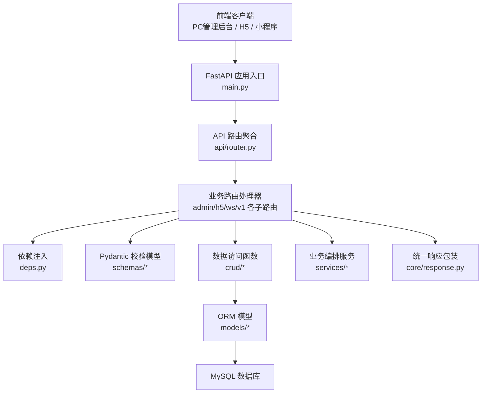
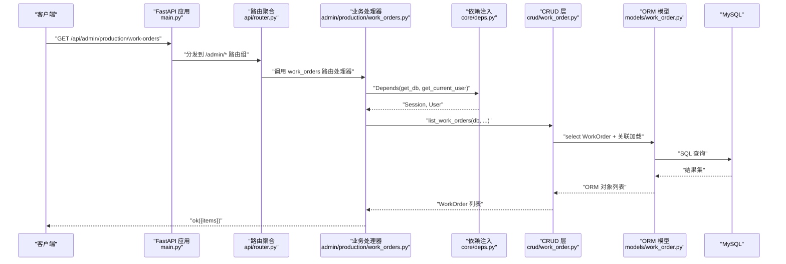
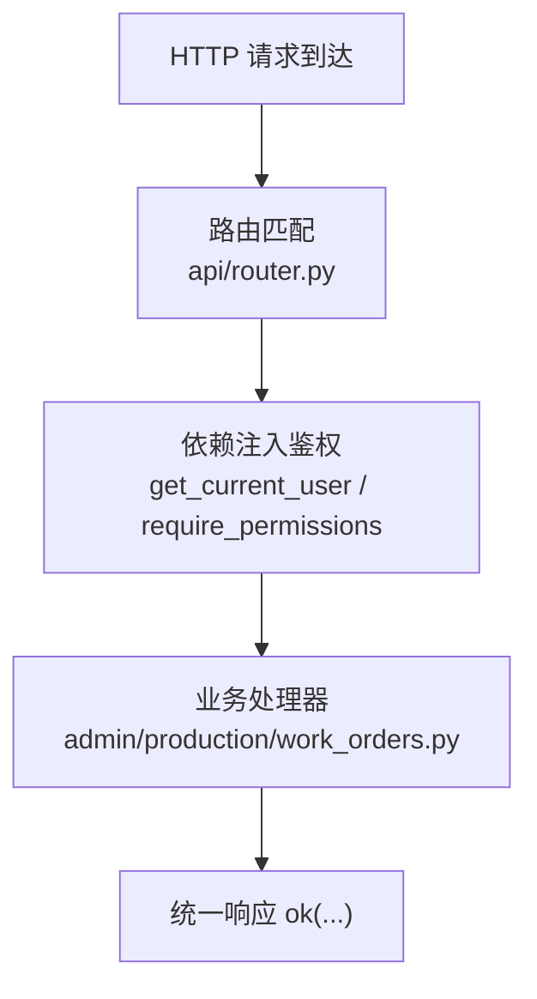
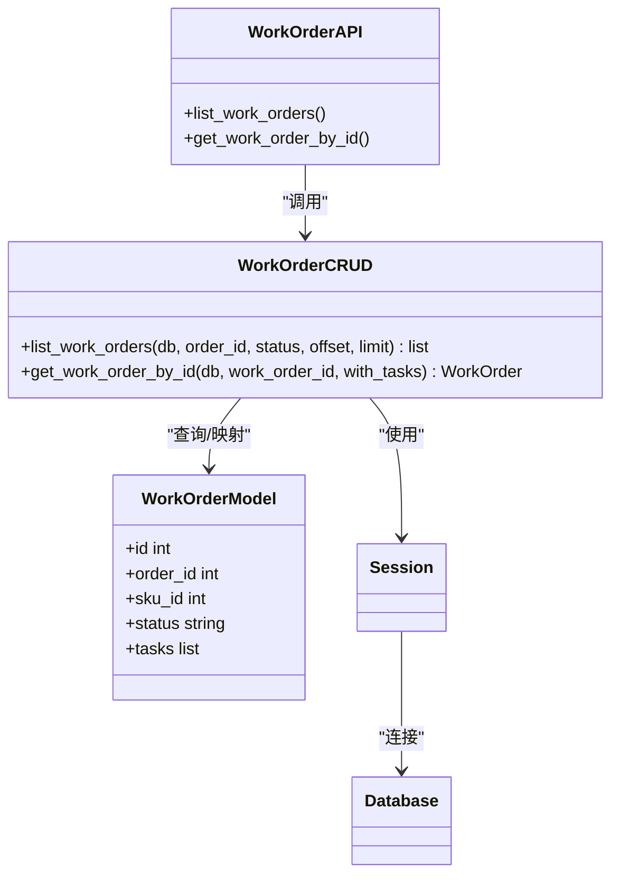
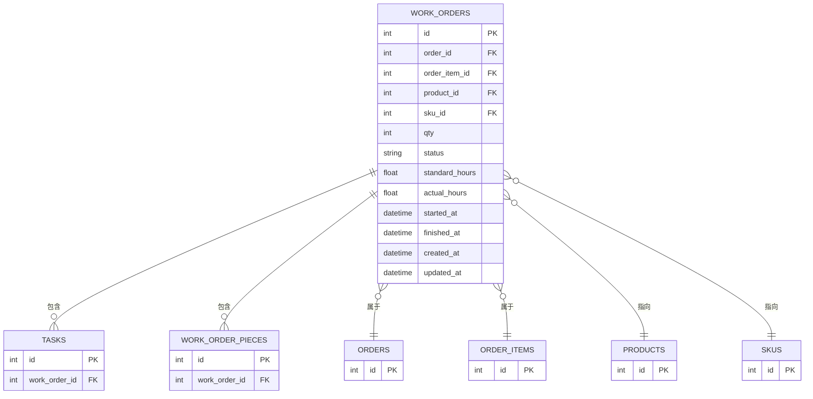
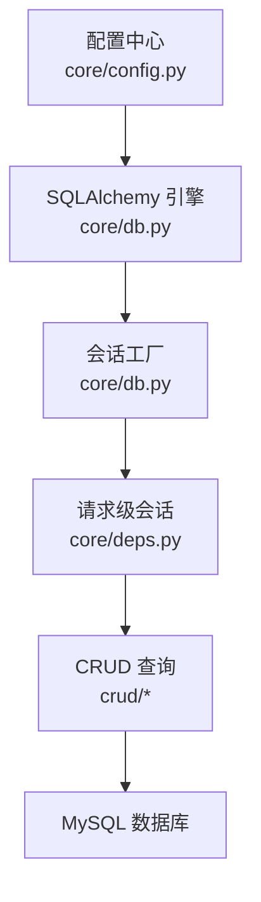
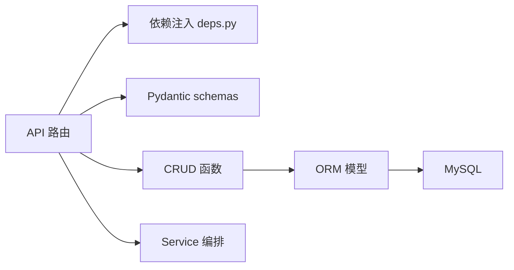

# 后端分层架构

<cite>
**本文引用的文件**   
- [backend/app/main.py](file://backend/app/main.py)
- [backend/app/api/router.py](file://backend/app/api/router.py)
- [backend/app/core/deps.py](file://backend/app/core/deps.py)
- [backend/app/core/db.py](file://backend/app/core/db.py)
- [backend/app/core/config.py](file://backend/app/core/config.py)
- [backend/app/models/base.py](file://backend/app/models/base.py)
- [backend/app/models/work_order.py](file://backend/app/models/work_order.py)
- [backend/app/crud/work_order.py](file://backend/app/crud/work_order.py)
- [backend/app/schemas/work_order.py](file://backend/app/schemas/work_order.py)
- [backend/app/api/admin/production/work_orders.py](file://backend/app/api/admin/production/work_orders.py)
- [backend/app/api/v1/auth.py](file://backend/app/api/v1/auth.py)
</cite>

## 目录
1. [引言](#引言)
2. [项目结构](#项目结构)
3. [核心组件](#核心组件)
4. [架构总览](#架构总览)
5. [详细组件分析](#详细组件分析)
6. [依赖关系分析](#依赖关系分析)
7. [性能与扩展性考虑](#性能与扩展性考虑)
8. [故障排查指南](#故障排查指南)
9. [结论](#结论)

## 引言
本文面向 CenkorMES 后端 FastAPI 服务，聚焦“API → Schema → Service/CRUD → Model → DB”的分层职责与请求处理链路。CenkorMES 是面向中小型加工厂、单租户私有部署的轻量 MES 制造执行系统，核心业务闭环围绕产品/型号、工序/工价、客户/订单、工单、任务派驻、扫码报工、审核与自动算薪展开。后端技术栈为 FastAPI + SQLAlchemy + Alembic + Celery，数据库使用 MySQL 8，缓存与消息队列使用 Redis，对象存储支持本地磁盘与主流云厂商。

本文不直接粘贴代码内容，而是通过路径引用定位关键实现，帮助读者快速建立从接口到数据表的完整调用链认知。

## 项目结构
后端代码位于 `backend/app`，按分层组织：
- `app/api`：FastAPI 路由聚合与接口定义，按 admin/h5/ws/v1 等端点分组。
- `app/core`：应用基础设施，包括配置、数据库连接、安全、中间件、错误处理、统一响应。
- `app/models`：SQLAlchemy ORM 模型，映射数据库表结构。
- `app/schemas`：Pydantic 请求/响应数据结构。
- `app/crud`：基于 SQLAlchemy 的数据访问函数，封装查询、更新、事务边界。
- `app/services`：跨模块的业务编排逻辑，如自动化、通知、报表设置等。
- `app/tasks`：Celery 异步任务与定时任务。

**图表来源**
- [backend/app/main.py:26-47](file://backend/app/main.py#L26-L47)
- [backend/app/api/router.py:36-65](file://backend/app/api/router.py#L36-L65)
- [backend/app/core/deps.py:19-45](file://backend/app/core/deps.py#L19-L45)

**章节来源**
- [backend/app/main.py:26-47](file://backend/app/main.py#L26-L47)
- [backend/app/api/router.py:36-65](file://backend/app/api/router.py#L36-L65)

## 核心组件
- FastAPI 应用启动与全局异常处理：在 `main.py` 中创建 FastAPI 实例、注册中间件、挂载 `/api` 路由、定义健康检查与统一异常处理器。
- 路由聚合：`api/router.py` 将认证、文件、公共配置、看板、多端 admin/h5/ws、CRM 适配器、飞书开放接口等子路由集中挂载。
- 依赖注入与安全：`core/deps.py` 提供数据库会话、当前用户解析、权限校验依赖。
- 数据库连接：`core/db.py` 使用 SQLAlchemy 创建引擎与会话工厂，读取 `core/config.py` 中的数据库 URL 与回显开关。
- ORM 模型：`models/base.py` 定义声明式基类；具体业务模型（如工单）在对应文件中定义表结构与关系。
- Pydantic Schema：`schemas/*` 定义输入输出结构，用于参数校验与响应序列化。
- CRUD 层：`crud/*` 封装 SQL 查询与关联加载，避免在路由中散落复杂查询。
- 服务层：`services/*` 承载跨模块业务编排，例如生产自动化、报表媒体设置、实体引用转换等。

**章节来源**
- [backend/app/main.py:26-86](file://backend/app/main.py#L26-L86)
- [backend/app/api/router.py:36-65](file://backend/app/api/router.py#L36-L65)
- [backend/app/core/deps.py:19-74](file://backend/app/core/deps.py#L19-L74)
- [backend/app/core/db.py:9-16](file://backend/app/core/db.py#L9-L16)
- [backend/app/core/config.py:6-50](file://backend/app/core/config.py#L6-L50)
- [backend/app/models/base.py:6-7](file://backend/app/models/base.py#L6-L7)

## 架构总览
下图展示一次典型的管理端工单列表请求的处理链路：客户端发起 HTTP 请求，FastAPI 路由匹配后进入业务处理器，处理器通过依赖注入获取数据库会话与当前用户，调用 CRUD 层查询 ORM 模型，最终返回统一格式响应。

**图表来源**
- [backend/app/main.py:47-52](file://backend/app/main.py#L47-L52)
- [backend/app/api/router.py:43-44](file://backend/app/api/router.py#L43-L44)
- [backend/app/api/admin/production/work_orders.py:1-17](file://backend/app/api/admin/production/work_orders.py#L1-L17)
- [backend/app/core/deps.py:19-45](file://backend/app/core/deps.py#L19-L45)
- [backend/app/crud/work_order.py:18-37](file://backend/app/crud/work_order.py#L18-L37)
- [backend/app/models/work_order.py:11-39](file://backend/app/models/work_order.py#L11-L39)

## 详细组件分析

### API 层：路由与权限控制
- 路由挂载：`api/router.py` 将认证、验证码、文件、公共配置、看板、多端 admin/h5/ws、CRM 适配器、飞书开放接口、推送监控、小程序认证等子路由集中挂载到 `/api` 前缀下。
- 权限依赖：多数 admin 路由通过 `dependencies=[Depends(get_current_user)]` 或更细粒度的 `require_permissions([...])` 进行鉴权。
- 示例：生产工单路由在 `admin/production/work_orders.py` 中使用 `require_permissions(["work.manage"])` 限制访问。

**图表来源**
- [backend/app/api/router.py:36-65](file://backend/app/api/router.py#L36-L65)
- [backend/app/api/admin/production/work_orders.py:20-20](file://backend/app/api/admin/production/work_orders.py#L20-L20)
- [backend/app/core/deps.py:27-65](file://backend/app/core/deps.py#L27-L65)

**章节来源**
- [backend/app/api/router.py:36-65](file://backend/app/api/router.py#L36-L65)
- [backend/app/api/admin/production/work_orders.py:1-20](file://backend/app/api/admin/production/work_orders.py#L1-L20)
- [backend/app/core/deps.py:27-65](file://backend/app/core/deps.py#L27-L65)

### Schema 层：参数校验与响应结构
- 输入校验：Pydantic 模型用于校验请求体与查询参数，例如登录输入 `LoginIn`、租户设置更新输入 `TenantSettingUpsertIn`。
- 输出结构：响应模型用于序列化 ORM 对象，例如 `WorkOrderOut` 定义工单对外字段。
- 优势：Schema 层隔离了外部契约与内部模型，便于前后端协作与版本演进。

**章节来源**
- [backend/app/api/v1/auth.py:1-14](file://backend/app/api/v1/auth.py#L1-L14)
- [backend/app/api/admin/system/settings.py:11-13](file://backend/app/api/admin/system/settings.py#L11-L13)
- [backend/app/schemas/work_order.py:8-17](file://backend/app/schemas/work_order.py#L8-L17)

### Service/CRUD 层：数据访问与业务编排
- CRUD 层：以函数形式封装 SQLAlchemy 查询，例如 `crud/work_order.py` 提供 `get_work_order_by_id` 与 `list_work_orders`，并使用 `selectinload` 预加载关联对象，减少 N+1 查询问题。
- Service 层：承担跨模块编排逻辑，例如生产自动化预检查、报表媒体设置、实体引用转换等。Service 通常接收 Session 与业务上下文，组合多个 CRUD 调用并返回领域对象或 DTO。
- 与 API 的关系：API 处理器负责参数校验、权限检查、调用 Service/CRUD，并将结果包装为统一响应。

**图表来源**
- [backend/app/api/admin/production/work_orders.py:1-17](file://backend/app/api/admin/production/work_orders.py#L1-L17)
- [backend/app/crud/work_order.py:11-37](file://backend/app/crud/work_order.py#L11-L37)
- [backend/app/models/work_order.py:11-39](file://backend/app/models/work_order.py#L11-L39)
- [backend/app/core/db.py:9-16](file://backend/app/core/db.py#L9-L16)

**章节来源**
- [backend/app/crud/work_order.py:11-37](file://backend/app/crud/work_order.py#L11-L37)
- [backend/app/api/admin/production/work_orders.py:1-17](file://backend/app/api/admin/production/work_orders.py#L1-L17)

### Model 层：ORM 模型与关系
- 基础模型：`models/base.py` 定义 SQLAlchemy 声明式基类。
- 工单模型：`models/work_order.py` 定义工单表结构、外键约束、状态字段、时间戳，以及与订单、SKU、产品、任务、工单的 pieces 的关联关系。
- 设计要点：
  - 使用 `ForeignKey` 与 `relationship` 表达实体关系。
  - 使用 `UniqueConstraint` 保证业务唯一性。
  - 使用 `server_default` 与 `onupdate` 维护审计字段。

**图表来源**
- [backend/app/models/work_order.py:11-39](file://backend/app/models/work_order.py#L11-L39)

**章节来源**
- [backend/app/models/base.py:6-7](file://backend/app/models/base.py#L6-L7)
- [backend/app/models/work_order.py:11-39](file://backend/app/models/work_order.py#L11-L39)

### 数据库层：连接与会话管理
- 引擎与会话：`core/db.py` 使用 `create_engine` 与 `sessionmaker` 创建数据库连接池与会话工厂，读取 `core/config.py` 中的 `DB_URL`、`DB_ECHO`、连接池参数。
- 生命周期：`core/deps.py` 的 `get_db` 在请求开始时创建 Session，在请求结束时关闭，确保资源释放。
- 启动初始化：`main.py` 在应用启动时根据配置决定是否自动建表与种子数据，并同步系统版本信息。

**图表来源**
- [backend/app/core/config.py:14-17](file://backend/app/core/config.py#L14-L17)
- [backend/app/core/db.py:9-16](file://backend/app/core/db.py#L9-L16)
- [backend/app/core/deps.py:19-24](file://backend/app/core/deps.py#L19-L24)
- [backend/app/main.py:88-131](file://backend/app/main.py#L88-L131)

**章节来源**
- [backend/app/core/config.py:14-17](file://backend/app/core/config.py#L14-L17)
- [backend/app/core/db.py:9-16](file://backend/app/core/db.py#L9-L16)
- [backend/app/core/deps.py:19-24](file://backend/app/core/deps.py#L19-L24)
- [backend/app/main.py:88-131](file://backend/app/main.py#L88-L131)

## 依赖关系分析
- API 层依赖：
  - `core/deps`：数据库会话、当前用户、权限校验。
  - `schemas/*`：请求/响应结构。
  - `crud/*`：数据访问函数。
  - `services/*`：业务编排（可选）。
  - `models/*`：ORM 模型（部分路由直接引用，但推荐通过 CRUD 层访问）。
- 核心依赖图如下：

**图表来源**
- [backend/app/api/router.py:36-65](file://backend/app/api/router.py#L36-L65)
- [backend/app/core/deps.py:19-74](file://backend/app/core/deps.py#L19-L74)
- [backend/app/crud/work_order.py:11-37](file://backend/app/crud/work_order.py#L11-L37)
- [backend/app/models/work_order.py:11-39](file://backend/app/models/work_order.py#L11-L39)

**章节来源**
- [backend/app/api/router.py:36-65](file://backend/app/api/router.py#L36-L65)
- [backend/app/core/deps.py:19-74](file://backend/app/core/deps.py#L19-L74)

## 性能与扩展性考虑
- 查询优化：CRUD 层使用 `selectinload` 预加载关联对象，避免 N+1 查询问题，提升列表页性能。
- 连接池：SQLAlchemy 引擎启用 `pool_pre_ping=True` 与 `pool_recycle=3600`，增强连接健壮性与复用效率。
- 分页与过滤：CRUD 层支持 `offset/limit` 与条件过滤，便于前端分页与筛选。
- 扩展建议：
  - 对热点查询引入 Redis 缓存（如字典、配置、看板统计）。
  - 对写操作与耗时计算使用 Celery 异步任务（如报表导出、自动化流程）。
  - 对复杂业务编排下沉至 Service 层，保持 API 薄、CRUD 纯、Model 稳。

[本节为通用指导，不直接分析具体文件]

## 故障排查指南
- 未登录或 Token 失效：`core/deps.py` 的 `get_current_user` 会抛出 401 异常，统一由 `main.py` 的异常处理器转换为标准失败响应。
- 无权限访问：`require_permissions` 校验失败返回 403，常见于缺少所需权限码。
- 参数校验失败：FastAPI 的 `RequestValidationError` 被统一处理器捕获，返回包含错误详情的失败响应。
- 服务器异常：未捕获异常会被记录日志，并在开发环境返回详细错误信息，生产环境仅返回通用错误。

**章节来源**
- [backend/app/core/deps.py:27-45](file://backend/app/core/deps.py#L27-L45)
- [backend/app/core/deps.py:61-72](file://backend/app/core/deps.py#L61-L72)
- [backend/app/main.py:55-86](file://backend/app/main.py#L55-L86)

## 结论
CenkorMES 后端采用清晰的 FastAPI 分层架构：API 层负责路由与鉴权，Schema 层定义契约，Service/CRUD 层封装业务与数据访问，Model 层映射数据库结构，DB 层提供持久化能力。该结构有利于职责分离、可测试性与可扩展性。结合 RBAC 权限、JWT 安全、Alembic 迁移与 Celery 异步任务，系统能够支撑中小型加工厂的 MES 业务闭环，并在生产环境中保持稳定运行。

[本节为总结性内容，不直接分析具体文件]