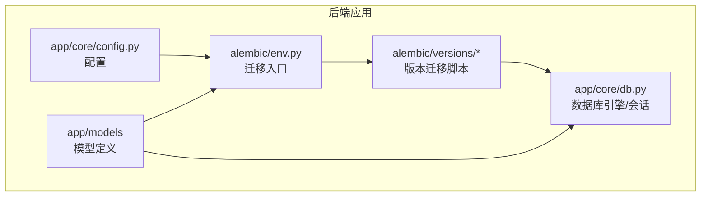
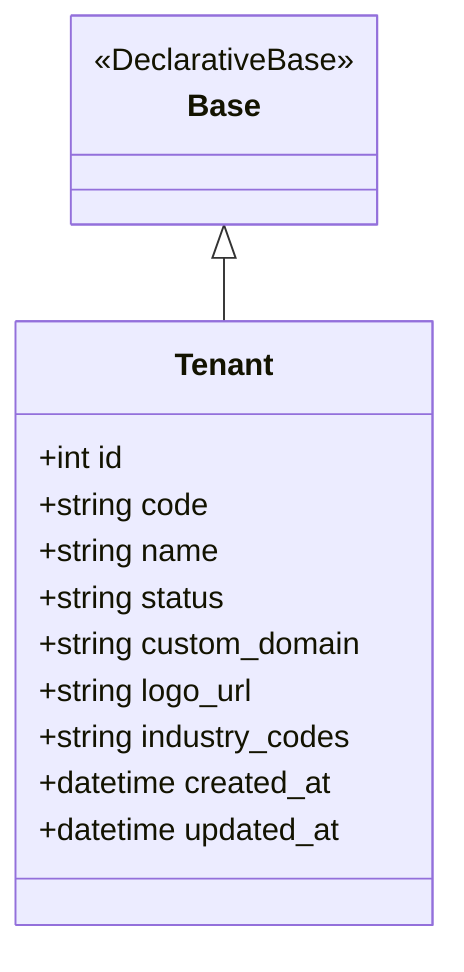
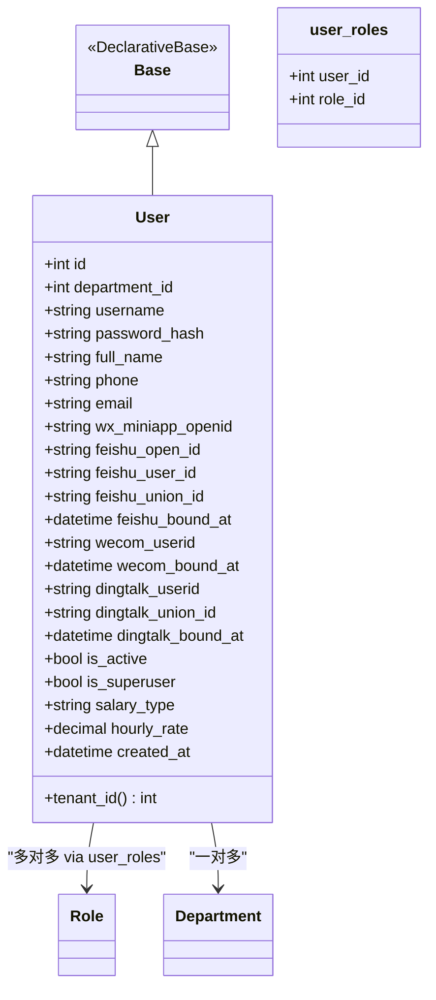
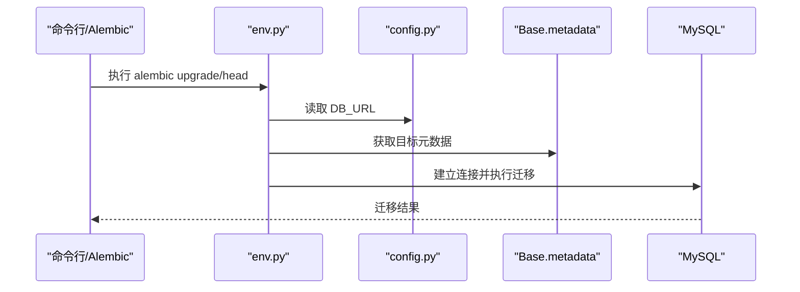
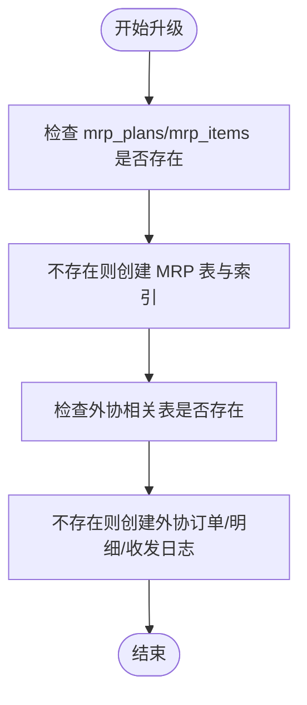
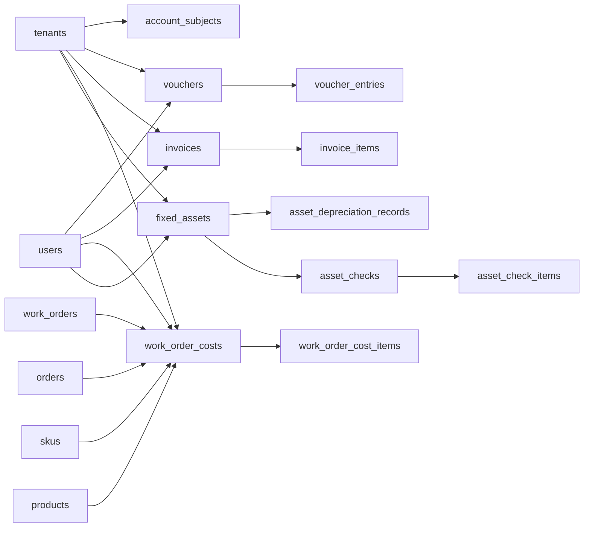
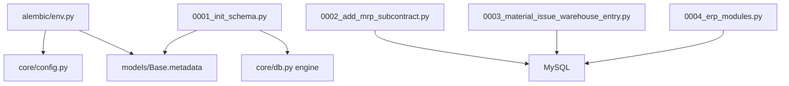

# 数据模型与 ORM

<cite>
**本文引用的文件**   
- [backend/app/models/base.py](file://backend/app/models/base.py)
- [backend/app/models/tenant.py](file://backend/app/models/tenant.py)
- [backend/app/models/user.py](file://backend/app/models/user.py)
- [backend/app/models/__init__.py](file://backend/app/models/__init__.py)
- [backend/alembic/env.py](file://backend/alembic/env.py)
- [backend/alembic/versions/0001_init_schema.py](file://backend/alembic/versions/0001_init_schema.py)
- [backend/alembic/versions/0002_add_mrp_subcontract.py](file://backend/alembic/versions/0002_add_mrp_subcontract.py)
- [backend/alembic/versions/0003_material_issue_warehouse_entry.py](file://backend/alembic/versions/0003_material_issue_warehouse_entry.py)
- [backend/alembic/versions/0004_erp_modules.py](file://backend/alembic/versions/0004_erp_modules.py)
- [backend/app/core/config.py](file://backend/app/core/config.py)
</cite>

## 目录
1. [引言](#引言)
2. [项目结构](#项目结构)
3. [核心模型体系](#核心模型体系)
4. [架构总览](#架构总览)
5. [关键组件分析](#关键组件分析)
6. [依赖关系分析](#依赖关系分析)
7. [性能与建模建议](#性能与建模建议)
8. [迁移策略与排错指南](#迁移策略与排错指南)
9. [结论](#结论)

## 引言
本文聚焦 CenkorMES 后端的数据层设计，围绕 SQLAlchemy 模型体系、基础模型 base/tenant/user、以及 Alembic 迁移策略展开。CenkorMES 是面向中小型加工厂的轻量 MES，技术栈为 FastAPI + SQLAlchemy + Alembic + Celery，数据库使用 MySQL 8（连接串 mysql+pymysql），缓存与消息队列使用 Redis。文档重点帮助开发者理解：
- 模型如何组织、继承 Base 并注册到 metadata；
- tenant/user 等基础实体在权限、租户隔离中的角色；
- Alembic 如何通过 env.py 与版本脚本驱动数据库结构演进；
- 如何在新增业务表时保持幂等迁移与现有数据兼容。

## 项目结构
与数据模型和迁移直接相关的代码位于 backend 子目录：
- backend/app/models：SQLAlchemy 模型定义与统一导出入口；
- backend/alembic：Alembic 迁移配置与版本脚本；
- backend/app/core/config.py：数据库连接 URL 等运行时配置；
- backend/app/core/db.py：数据库引擎与会话相关逻辑（由迁移与模型导入间接依赖）。

**图表来源**
- [backend/app/models/__init__.py:1-167](file://backend/app/models/__init__.py#L1-L167)
- [backend/alembic/env.py:1-59](file://backend/alembic/env.py#L1-L59)
- [backend/app/core/config.py:1-51](file://backend/app/core/config.py#L1-L51)

**章节来源**
- [backend/app/models/__init__.py:1-167](file://backend/app/models/__init__.py#L1-L167)
- [backend/alembic/env.py:1-59](file://backend/alembic/env.py#L1-L59)
- [backend/app/core/config.py:1-51](file://backend/app/core/config.py#L1-L51)

## 核心模型体系
### 基类与元数据注册
- Base 是 SQLAlchemy DeclarativeBase 的简单子类，作为所有模型的基类。
- app/models/__init__.py 集中导入各业务模块中的模型类，确保它们在应用启动或 Alembic 运行前完成 mapper 注册，使 Base.metadata 包含全部表结构。

该设计的关键点：
- 所有模型继承 Base，从而共享同一 metadata；
- __init__.py 的“副作用式”导入保证 create_all、Alembic 自动检测都能发现模型；
- 对跨模块字符串引用（如 warehouse_entry 引用 finance）通过延迟导入避免循环依赖。

**章节来源**
- [backend/app/models/base.py:1-9](file://backend/app/models/base.py#L1-L9)
- [backend/app/models/__init__.py:1-167](file://backend/app/models/__init__.py#L1-L167)

### 租户模型 Tenant
Tenant 表示一个独立租户，字段包括：
- id：自增主键；
- code：租户编码，唯一且索引；
- name：租户名称；
- status：状态，默认 active；
- custom_domain/logo_url/industry_codes：扩展信息；
- created_at/updated_at：时间戳。

该模型目前未显式声明 tenant_id 外键到其他表，但后续 ERP 迁移中多处表通过 tenant_id 实现多租户隔离，说明系统存在“模型层尚未完全体现、但迁移层已按租户维度建表”的过渡态。

**图表来源**
- [backend/app/models/base.py:1-9](file://backend/app/models/base.py#L1-L9)
- [backend/app/models/tenant.py:1-20](file://backend/app/models/tenant.py#L1-L20)

**章节来源**
- [backend/app/models/tenant.py:1-20](file://backend/app/models/tenant.py#L1-L20)

### 用户模型 User 与 RBAC 关联
User 是系统用户实体，关键字段包括：
- id、username、password_hash；
- department_id：关联部门；
- 第三方账号绑定字段：微信小程序 openid、飞书 open_id/user_id/union_id、企业微信 userid、钉钉 userid/union_id；
- is_active/is_superuser：账户状态与超级管理员标记；
- salary_type/hourly_rate：计件/计时工资相关；
- roles：通过 user_roles 中间表与 Role 多对多关联；
- department：与 Department 一对多关联；
- tenant_id：当前 User 模型提供属性返回固定值 1，体现单租户版语义。

user_roles 是一个关联表，同时指向 users.id 与 roles.id，采用 ondelete=CASCADE，删除用户或角色时会级联清理关联。

**图表来源**
- [backend/app/models/user.py:1-57](file://backend/app/models/user.py#L1-L57)

**章节来源**
- [backend/app/models/user.py:1-57](file://backend/app/models/user.py#L1-L57)

### 模型导出与依赖注册
app/models/__init__.py 不仅导出 Base、Tenant、User，还集中导出大量业务模型，例如：
- 生产与计划：WorkOrder、Task、ProductionPlan；
- 基础数据：Product、Sku、Process、ProcessRoute、Material、Supplier；
- 质量与设备：InspectionTemplate、DefectCode、Equipment；
- 仓库与采购：Warehouse、Stock、PurchaseOrder；
- 财务与成本：Invoice、Voucher、AccountSubject、FixedAsset；
- 权限与系统：Role、Permission、OperationLog、SystemVersion。

此外，__init__.py 末尾显式导入 warehouse/purchase/finance 等模块，以解决字符串 relationship 与 ForeignKey 在 alembic、demo_data、pytest 场景下的映射注册问题。

**章节来源**
- [backend/app/models/__init__.py:1-167](file://backend/app/models/__init__.py#L1-L167)

## 架构总览
从数据访问视角看，Alembic 迁移流程如下：
1. env.py 读取 settings.DB_URL；
2. 将 Base.metadata 作为 target_metadata；
3. 根据是否离线模式选择 run_migrations_offline 或 run_migrations_online；
4. 执行具体版本的 upgrade/downgrade。

**图表来源**
- [backend/alembic/env.py:1-59](file://backend/alembic/env.py#L1-L59)
- [backend/app/core/config.py:1-51](file://backend/app/core/config.py#L1-L51)

## 关键组件分析

### Alembic 环境配置 env.py
env.py 的核心职责：
- 加载 Alembic 日志配置；
- 从 settings.DB_URL 设置 sqlalchemy.url；
- 将 Base.metadata 设为 target_metadata；
- 分别实现 offline/online 两种迁移执行路径；
- 启用 compare_type=True，便于检测字段类型变更。

这意味着：只要模型被正确导入并注册到 Base.metadata，Alembic 就能感知表结构变化。

**章节来源**
- [backend/alembic/env.py:1-59](file://backend/alembic/env.py#L1-L59)
- [backend/app/core/config.py:14-17](file://backend/app/core/config.py#L14-L17)

### 初始迁移 0001_init_schema
该迁移是 CenkorMES 正式进入 Alembic 管理的起点：
- revision 为 0001_init；
- down_revision 为 None；
- upgrade 中动态导入 app.models.Base 并通过 Base.metadata.create_all(bind=engine, checkfirst=True) 创建所有已注册模型表；
- downgrade 为空实现，表示不主动回滚初始结构。

这种“一次性全量建表”的方式适合早期快速迭代，但后续新增表应优先使用增量迁移。

**章节来源**
- [backend/alembic/versions/0001_init_schema.py:1-32](file://backend/alembic/versions/0001_init_schema.py#L1-L32)

### MRP 与外协迁移 0002_add_mrp_subcontract
该迁移引入物料需求计划与外协工序管理相关表：
- mrp_plans：MRP 计划主表；
- mrp_items：MRP 明细，关联 work_orders/orders/skus/materials/boms/suppliers；
- subcontract_orders/subcontract_order_items：外协订单及明细；
- subcontract_send_logs/subcontract_receive_logs：外协发料与收货流水。

迁移中使用 _table_exists 判断表是否存在，保证对已有库幂等；downgrade 按依赖顺序 drop 表。

**图表来源**
- [backend/alembic/versions/0002_add_mrp_subcontract.py:19-198](file://backend/alembic/versions/0002_add_mrp_subcontract.py#L19-L198)

**章节来源**
- [backend/alembic/versions/0002_add_mrp_subcontract.py:1-198](file://backend/alembic/versions/0002_add_mrp_subcontract.py#L1-L198)

### 领料/退料/入库单迁移 0003_material_issue_warehouse_entry
该迁移补录 Phase 2 与 Phase 4 的库存相关表：
- material_issues / material_issue_items：领料单及明细；
- material_returns / material_return_items：退料单及明细；
- warehouse_entries / warehouse_entry_items：入库单及明细。

这些表均包含 code、status、warehouse_id、work_order_id、created_by 等通用字段，并针对常用查询字段建立索引。downgrade 按依赖顺序删除表。

**章节来源**
- [backend/alembic/versions/0003_material_issue_warehouse_entry.py:1-218](file://backend/alembic/versions/0003_material_issue_warehouse_entry.py#L1-L218)

### ERP 四模块迁移 0004_erp_modules
该迁移引入财务与成本相关模块：
- 总账：account_subjects、vouchers、voucher_entries、period_closings；
- 发票：invoices、invoice_items；
- 工单成本：work_order_costs、work_order_cost_items；
- 固定资产：fixed_assets、asset_depreciation_records、asset_checks、asset_check_items。

这些表普遍包含 tenant_id 字段，并与 tenants/users/customers/suppliers/work_orders/products/skus/equipment/departments 等业务表建立外键关系，体现多租户与业务闭环。

**图表来源**
- [backend/alembic/versions/0004_erp_modules.py:15-299](file://backend/alembic/versions/0004_erp_modules.py#L15-L299)

**章节来源**
- [backend/alembic/versions/0004_erp_modules.py:1-299](file://backend/alembic/versions/0004_erp_modules.py#L1-L299)

## 依赖关系分析
### 模型与 Alembic 的耦合
- env.py 依赖 app.core.config.settings.DB_URL；
- env.py 依赖 app.models.Base.metadata；
- 0001 迁移依赖 app.core.db.engine 与 app.models.Base；
- 后续迁移脚本多为纯 SQL 结构变更，不再直接依赖 Python 模型，但业务语义仍与模型保持一致。

**图表来源**
- [backend/alembic/env.py:1-59](file://backend/alembic/env.py#L1-L59)
- [backend/alembic/versions/0001_init_schema.py:23-27](file://backend/alembic/versions/0001_init_schema.py#L23-L27)

**章节来源**
- [backend/alembic/env.py:1-59](file://backend/alembic/env.py#L1-L59)
- [backend/alembic/versions/0001_init_schema.py:1-32](file://backend/alembic/versions/0001_init_schema.py#L1-L32)

### 模型内部依赖
- User 依赖 Role、Department；
- ERP 迁移中的表依赖 tenants、users、warehouses、work_orders、orders、skus、materials、suppliers、equipment、departments 等；
- models/__init__.py 通过集中导入确保所有模型在 Alembic 或测试环境中可被发现。

**章节来源**
- [backend/app/models/user.py:1-57](file://backend/app/models/user.py#L1-L57)
- [backend/app/models/__init__.py:1-167](file://backend/app/models/__init__.py#L1-L167)
- [backend/alembic/versions/0004_erp_modules.py:15-299](file://backend/alembic/versions/0004_erp_modules.py#L15-L299)

## 性能与建模建议
- 索引策略：迁移脚本中对 status、warehouse_id、work_order_id、tenant_id、sku_id、material_id 等高频查询字段建立索引，有助于列表页与统计报表性能。
- 数值精度：成本、金额字段使用 Numeric(precision=14, scale=2) 或更高精度，避免浮点误差。
- 软删除与状态机：多数表使用 status 字段表达生命周期，建议在模型层补充状态校验与转换方法，减少非法状态写入。
- 多租户隔离：ERP 迁移广泛使用 tenant_id，建议在模型层显式增加 tenant_id 字段与查询过滤，避免仅依赖迁移层约束。
- 外键约束：迁移中大量使用 ondelete=RESTRICT/CASCADE/SET NULL，需结合业务语义评估级联删除风险，防止误删主数据。

[本节为通用建模建议，不直接分析具体文件]

## 迁移策略与排错指南

### 迁移策略要点
- 初始迁移采用全量建表：0001 通过 Base.metadata.create_all 一次性创建所有表，适合项目早期。
- 后续迁移采用增量方式：0002/0003/0004 分别引入新模块，并使用 _table_exists 保证幂等。
- 回滚策略：0002/0003/0004 的 downgrade 按依赖顺序 drop 表；0001 的 downgrade 为空，不建议用于生产回滚。
- 元数据来源：env.py 使用 Base.metadata，因此新增模型必须被 models/__init__.py 或其他入口导入，否则 Alembic 无法检测到结构变化。

### 常见问题与排查
- Alembic 无法识别新表：
  - 确认模型已继承 Base；
  - 确认模型已被 models/__init__.py 或其他入口导入；
  - 确认 env.py 的 target_metadata 仍为 Base.metadata。
- 迁移重复执行报错：
  - 检查迁移脚本是否使用 checkfirst 或 _table_exists；
  - 对于 0001，若已在旧库中存在表，应避免再次执行全量 create_all。
- 外键约束冲突：
  - 检查 ondelete 行为是否符合业务；
  - 先清理子表数据再删除父表记录。
- 多租户字段缺失：
  - 若业务表需要 tenant_id，应在迁移中添加字段并在模型中同步；
  - 注意历史数据回填与查询层过滤。

**章节来源**
- [backend/alembic/env.py:1-59](file://backend/alembic/env.py#L1-L59)
- [backend/alembic/versions/0001_init_schema.py:23-31](file://backend/alembic/versions/0001_init_schema.py#L23-L31)
- [backend/alembic/versions/0002_add_mrp_subcontract.py:19-198](file://backend/alembic/versions/0002_add_mrp_subcontract.py#L19-L198)
- [backend/alembic/versions/0003_material_issue_warehouse_entry.py:23-218](file://backend/alembic/versions/0003_material_issue_warehouse_entry.py#L23-L218)
- [backend/alembic/versions/0004_erp_modules.py:15-299](file://backend/alembic/versions/0004_erp_modules.py#L15-L299)

## 结论
CenkorMES 的数据层以 SQLAlchemy 模型为基础，通过 Base 与集中导入机制统一管理元数据；Alembic 从 0001 的全量建表逐步演进到 0002/0003/0004 的模块化增量迁移。基础模型 Tenant 与 User 承担租户与身份能力，RBAC 通过 user_roles 关联表实现多对多权限分配。随着 ERP 模块引入，tenant_id 成为多租户隔离的重要维度。开发新功能时，建议：
- 新增模型后确保被 models/__init__.py 导入；
- 新增表优先使用增量迁移，并保持幂等；
- 对高频查询字段建立索引，合理设计外键级联；
- 在多租户场景下显式维护 tenant_id 并在查询层强制过滤。