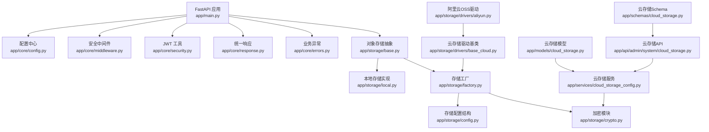
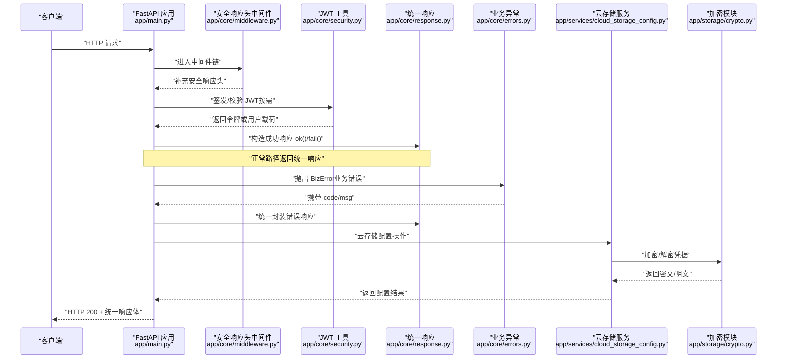
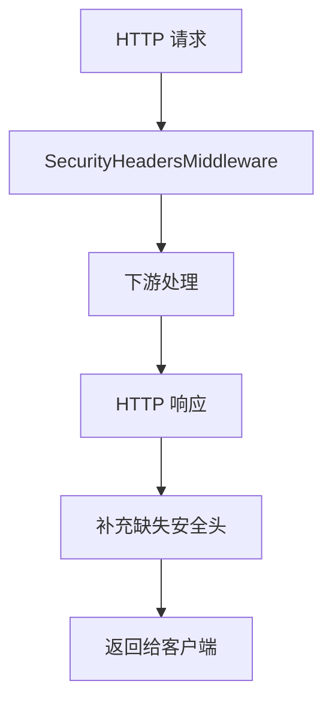
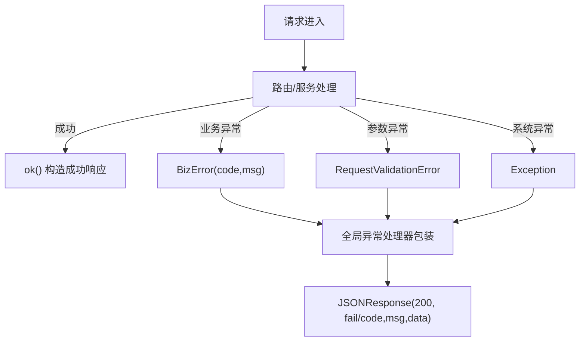
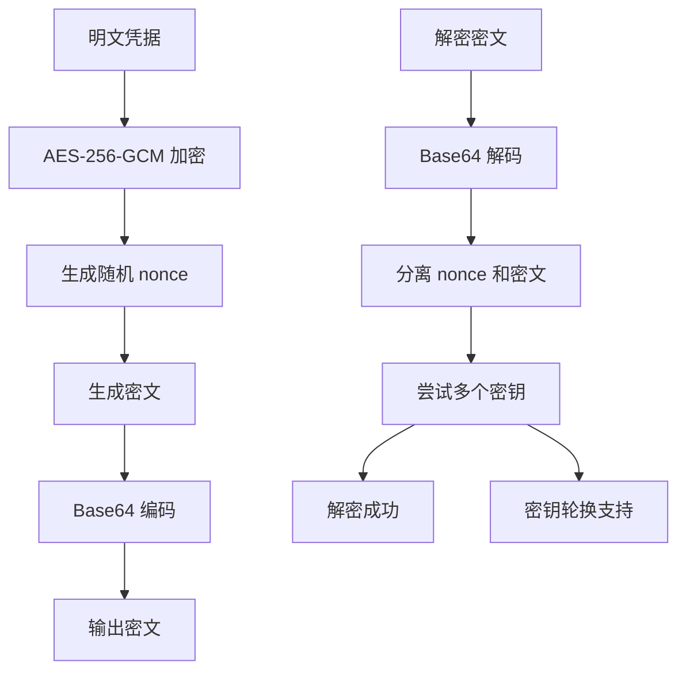
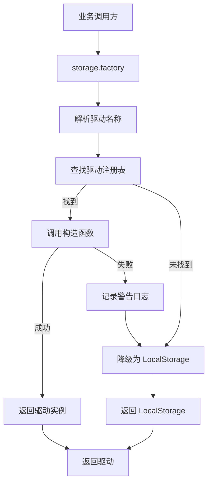
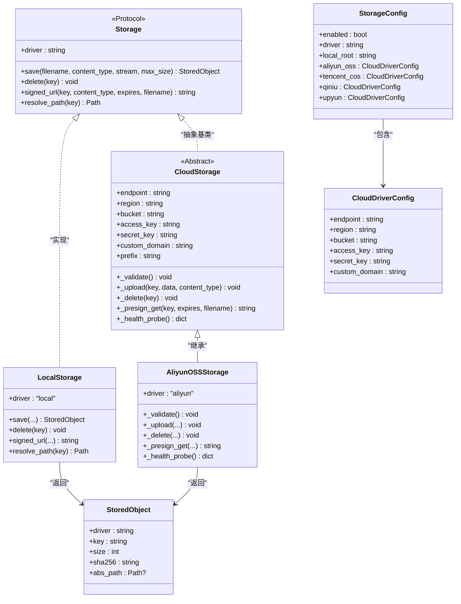
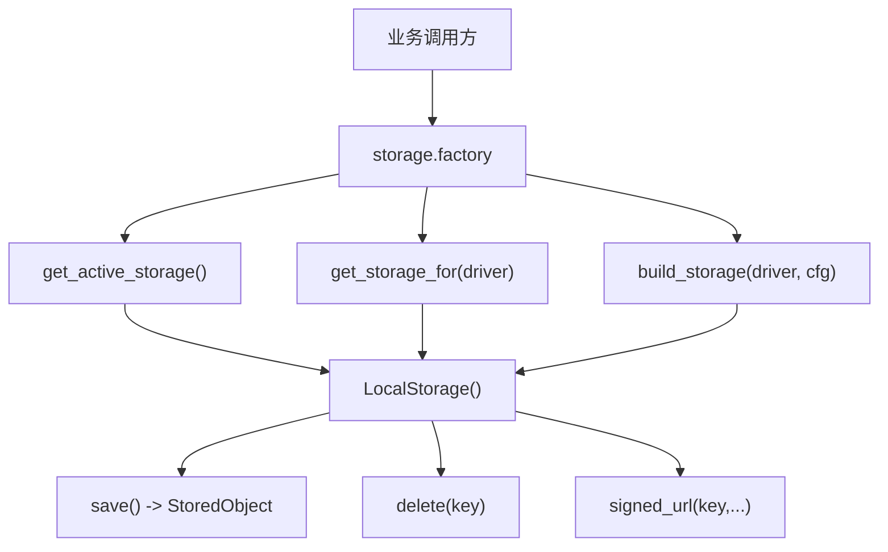
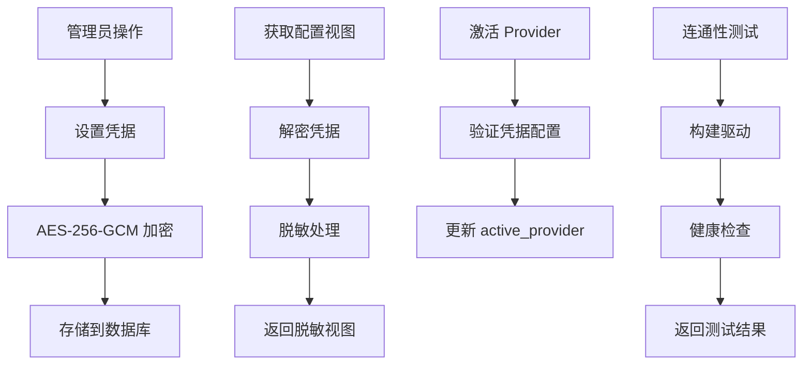
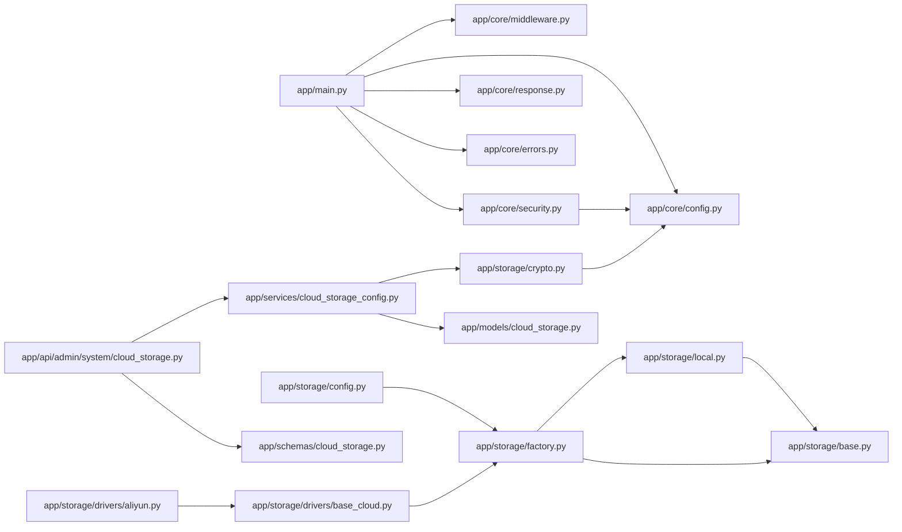

# 核心基础设施（配置·安全·中间件·存储）

<cite>
**本文引用的文件**   
- [backend/app/core/config.py](file://backend/app/core/config.py)
- [backend/app/core/security.py](file://backend/app/core/security.py)
- [backend/app/core/middleware.py](file://backend/app/core/middleware.py)
- [backend/app/core/errors.py](file://backend/app/core/errors.py)
- [backend/app/core/response.py](file://backend/app/core/response.py)
- [backend/app/main.py](file://backend/app/main.py)
- [backend/app/storage/base.py](file://backend/app/storage/base.py)
- [backend/app/storage/local.py](file://backend/app/storage/local.py)
- [backend/app/storage/factory.py](file://backend/app/storage/factory.py)
- [backend/app/storage/crypto.py](file://backend/app/storage/crypto.py)
- [backend/app/storage/__init__.py](file://backend/app/storage/__init__.py)
- [backend/app/storage/config.py](file://backend/app/storage/config.py)
- [backend/app/models/cloud_storage.py](file://backend/app/models/cloud_storage.py)
- [backend/app/services/cloud_storage_config.py](file://backend/app/services/cloud_storage_config.py)
- [backend/app/api/admin/system/cloud_storage.py](file://backend/app/api/admin/system/cloud_storage.py)
- [backend/app/schemas/cloud_storage.py](file://backend/app/schemas/cloud_storage.py)
- [backend/app/storage/drivers/base_cloud.py](file://backend/app/storage/drivers/base_cloud.py)
- [backend/app/storage/drivers/aliyun.py](file://backend/app/storage/drivers/aliyun.py)
- [backend/tests/test_security.py](file://backend/tests/test_security.py)
- [backend/tests/test_storage.py](file://backend/tests/test_storage.py)
- [backend/tests/test_storage_crypto.py](file://backend/tests/test_storage_crypto.py)
- [backend/tests/test_cloud_storage_config.py](file://backend/tests/test_cloud_storage_config.py)
- [backend/tests/test_cloud_drivers.py](file://backend/tests/test_cloud_drivers.py)
</cite>

## 更新摘要
**变更内容**   
- 新增完整的云存储配置管理系统，支持阿里云 OSS、腾讯云 COS、七牛、又拍等多提供商
- 实现 AES-256-GCM 加密模块用于云存储凭据的安全管理，支持密钥轮换和凭据脱敏
- 重构存储工厂采用驱动注册模式，支持动态注册和向后兼容降级机制
- 新增数据库模型 CloudStorageConfig 和 CloudStorageMigrationJob，支持多 provider 的加密凭据存储
- 完善服务层提供完整的凭据加密/解密、脱敏和管理功能
- 新增管理员 API 端点，提供云存储配置的完整 CRUD 操作
- 扩展测试覆盖率，新增云存储配置、驱动注册和加密功能的单元测试

## 目录
1. [引言](#引言)
2. [项目结构定位](#项目结构定位)
3. [核心组件总览](#核心组件总览)
4. [架构与请求流程](#架构与请求流程)
5. [详细组件分析](#详细组件分析)
6. [依赖关系分析](#依赖关系分析)
7. [性能与扩展性](#性能与扩展性)
8. [故障排查指南](#故障排查指南)
9. [结论](#结论)

## 引言
本文聚焦后端 `app/core` 与 `app/storage` 的核心基础设施，围绕以下目标展开：
- 应用配置模型与安全基线
- JWT 令牌生成、校验与密钥强度保护
- 限流与安全响应头中间件
- 统一错误类型与统一响应格式
- 对象存储抽象接口与本地实现，以及云存储扩展点
- **新增**：AES-256-GCM 加密模块用于云存储凭据安全管理
- **新增**：驱动注册模式的存储工厂，支持动态注册和向后兼容
- **新增**：完整的云存储配置管理系统，支持多提供商和凭据加密

本仓库是 CenkorMES 后端，技术栈为 FastAPI + SQLAlchemy + Alembic + Celery，数据库 MySQL 8，缓存/队列 Redis，对象存储支持本地磁盘，并预留阿里云 OSS、腾讯云 COS、七牛、又拍的扩展结构。

## 项目结构定位
本次文档关注的代码位于后端 `backend/app` 下：
- `app/core`：配置、安全、中间件、错误、统一响应、启动入口集成
- `app/storage`：对象存储协议、本地实现、工厂与配置结构、**新增**加密模块
- `app/models`：**新增**云存储配置模型
- `app/services`：**新增**云存储配置管理服务
- `app/api/admin/system`：**新增**云存储配置管理 API
- `app/schemas`：**新增**云存储配置输入 Schema
- `app/main.py`：FastAPI 应用装配、全局异常处理、中间件注册、启动初始化

**图示来源**
- [backend/app/main.py:26-47](file://backend/app/main.py#L26-L47)
- [backend/app/core/config.py:6-50](file://backend/app/core/config.py#L6-L50)
- [backend/app/core/middleware.py:16-39](file://backend/app/core/middleware.py#L16-L39)
- [backend/app/core/security.py:29-70](file://backend/app/core/security.py#L29-L70)
- [backend/app/core/response.py:11-22](file://backend/app/core/response.py#L11-L22)
- [backend/app/core/errors.py:3-7](file://backend/app/core/errors.py#L3-L7)
- [backend/app/storage/base.py:27-50](file://backend/app/storage/base.py#L27-L50)
- [backend/app/storage/local.py:13-45](file://backend/app/storage/local.py#L13-L45)
- [backend/app/storage/factory.py:8-26](file://backend/app/storage/factory.py#L8-L26)
- [backend/app/storage/crypto.py:1-71](file://backend/app/storage/crypto.py#L1-L71)
- [backend/app/models/cloud_storage.py:16-37](file://backend/app/models/cloud_storage.py#L16-L37)
- [backend/app/services/cloud_storage_config.py:1-152](file://backend/app/services/cloud_storage_config.py#L1-L152)
- [backend/app/api/admin/system/cloud_storage.py:1-168](file://backend/app/api/admin/system/cloud_storage.py#L1-L168)
- [backend/app/schemas/cloud_storage.py:1-37](file://backend/app/schemas/cloud_storage.py#L1-L37)
- [backend/app/storage/drivers/base_cloud.py:1-79](file://backend/app/storage/drivers/base_cloud.py#L1-L79)
- [backend/app/storage/drivers/aliyun.py:1-37](file://backend/app/storage/drivers/aliyun.py#L1-L37)

**章节来源**
- [backend/app/main.py:26-47](file://backend/app/main.py#L26-L47)
- [backend/app/core/config.py:6-50](file://backend/app/core/config.py#L6-L50)

## 核心组件总览
- 配置中心：集中管理应用、数据库、JWT、CORS、Host 白名单、登录失败限流、对象存储、Redis/Celery 等参数。
- 安全模块：密码强度校验、生产环境 JWT 密钥强制校验、bcrypt 哈希与验证、JWT 签发与解码。
- 中间件：全局安全响应头注入；可选 CORS 与 Host 白名单。
- 错误与响应：统一业务异常 `BizError`，统一响应体 `ApiResponse` 及 `ok`/`fail` 构造器。
- 对象存储：定义 `Storage` 协议与 `StoredObject`，提供本地实现，并通过工厂暴露获取方法；同时定义云存储配置结构，便于后续扩展 OSS/COS/七牛/又拍。
- **新增**：AES-256-GCM 加密模块，基于 JWT_SECRET 派生密钥，支持密钥轮换和凭据脱敏展示。
- **新增**：驱动注册模式的存储工厂，支持动态注册云存储驱动并提供向后兼容降级机制。
- **新增**：完整的云存储配置管理系统，包括数据库模型、服务层、API 端点和 Schema 定义。

**章节来源**
- [backend/app/core/config.py:6-50](file://backend/app/core/config.py#L6-L50)
- [backend/app/core/security.py:20-70](file://backend/app/core/security.py#L20-L70)
- [backend/app/core/middleware.py:16-39](file://backend/app/core/middleware.py#L16-L39)
- [backend/app/core/errors.py:3-7](file://backend/app/core/errors.py#L3-L7)
- [backend/app/core/response.py:11-22](file://backend/app/core/response.py#L11-L22)
- [backend/app/storage/base.py:10-50](file://backend/app/storage/base.py#L10-L50)
- [backend/app/storage/local.py:13-45](file://backend/app/storage/local.py#L13-L45)
- [backend/app/storage/factory.py:8-26](file://backend/app/storage/factory.py#L8-L26)
- [backend/app/storage/crypto.py:1-71](file://backend/app/storage/crypto.py#L1-L71)
- [backend/app/storage/config.py:8-25](file://backend/app/storage/config.py#L8-L25)
- [backend/app/models/cloud_storage.py:16-37](file://backend/app/models/cloud_storage.py#L16-L37)
- [backend/app/services/cloud_storage_config.py:1-152](file://backend/app/services/cloud_storage_config.py#L1-L152)
- [backend/app/api/admin/system/cloud_storage.py:1-168](file://backend/app/api/admin/system/cloud_storage.py#L1-L168)

## 架构与请求流程
FastAPI 启动时完成关键初始化：检查 JWT 密钥强度、创建数据库表、初始化租户与权限、创建默认管理员账号。所有 HTTP 响应经过安全响应头中间件；可选启用 CORS 与 Host 白名单；全局异常处理器将各类异常转换为统一响应格式。

**图示来源**
- [backend/app/main.py:26-85](file://backend/app/main.py#L26-L85)
- [backend/app/core/middleware.py:16-39](file://backend/app/core/middleware.py#L16-L39)
- [backend/app/core/security.py:55-70](file://backend/app/core/security.py#L55-L70)
- [backend/app/core/response.py:11-22](file://backend/app/core/response.py#L11-L22)
- [backend/app/core/errors.py:3-7](file://backend/app/core/errors.py#L3-L7)
- [backend/app/services/cloud_storage_config.py:44-86](file://backend/app/services/cloud_storage_config.py#L44-L86)
- [backend/app/storage/crypto.py:33-61](file://backend/app/storage/crypto.py#L33-L61)

## 详细组件分析

### 配置中心（Settings）
- 使用 Pydantic Settings 加载 `.env`，忽略多余字段。
- 包含应用基础信息、数据库连接、自动建库/种子开关、JWT 算法与过期时间、公共 URL、CORS 与可信 Host、登录失败限流阈值与窗口、对象存储驱动与本地根目录、上传大小与 MIME 白名单、Redis/Celery 连接与时区设置。
- 安全基线：生产环境要求 JWT_SECRET 最小长度，密码最小长度策略由安全模块执行。

**图示来源**
- [backend/app/core/config.py:6-50](file://backend/app/core/config.py#L6-L50)

**章节来源**
- [backend/app/core/config.py:6-50](file://backend/app/core/config.py#L6-L50)

### JWT 安全与密码策略
- 密码强度：最小长度与字符多样性校验，不满足则抛错。
- 生产环境 fail-fast：若 `APP_ENV=prod` 且 `JWT_SECRET` 为示例值或长度不足，直接抛出运行时错误，阻止不安全部署。
- 哈希与验证：基于 bcrypt 的密码哈希与比对。
- 令牌签发与解码：根据是否"记住我"选择不同过期时间，使用配置的算法与密钥签发/解码。

**图示来源**
- [backend/app/core/security.py:20-70](file://backend/app/core/security.py#L20-L70)

**章节来源**
- [backend/app/core/security.py:20-70](file://backend/app/core/security.py#L20-L70)

### 限流与安全头中间件
- 安全响应头中间件：在 ASGI 层拦截 HTTP 响应，补充缺失的安全头，包括防 MIME 嗅探、禁止嵌套框架、严格 Referrer-Policy、XSS 保护与权限收敛。不会覆盖已有头部。
- 登录失败限流：由配置项控制（最大失败次数、滑动窗口、锁定持续时间），具体计数逻辑通常由服务层或专用限流模块实现；此处重点说明配置能力。
- CORS 与 Host 白名单：仅在显式配置时启用，避免默认放行。

**图示来源**
- [backend/app/core/middleware.py:16-39](file://backend/app/core/middleware.py#L16-L39)
- [backend/app/main.py:28-45](file://backend/app/main.py#L28-L45)

**章节来源**
- [backend/app/core/middleware.py:16-39](file://backend/app/core/middleware.py#L16-L39)
- [backend/app/main.py:28-45](file://backend/app/main.py#L28-L45)
- [backend/tests/test_security.py:103-113](file://backend/tests/test_security.py#L103-L113)

### 错误与统一响应
- 业务异常：`BizError(code, msg)`，用于业务层明确表达错误码与消息。
- 统一响应：`ApiResponse` 模型与 `ok()`/`fail()` 构造器，保证前后端一致的数据结构。
- 全局异常处理：
  - HTTP 异常：转为统一响应，保留原状态码与消息。
  - 参数校验异常：统一返回 400 与错误详情。
  - 业务异常：按 `code`/`msg` 包装。
  - 未捕获异常：开发环境返回详细错误信息，生产环境仅返回通用错误。

**图示来源**
- [backend/app/core/errors.py:3-7](file://backend/app/core/errors.py#L3-L7)
- [backend/app/core/response.py:11-22](file://backend/app/core/response.py#L11-L22)
- [backend/app/main.py:55-85](file://backend/app/main.py#L55-L85)

**章节来源**
- [backend/app/core/errors.py:3-7](file://backend/app/core/errors.py#L3-L7)
- [backend/app/core/response.py:11-22](file://backend/app/core/response.py#L11-L22)
- [backend/app/main.py:55-85](file://backend/app/main.py#L55-L85)

### AES-256-GCM 加密模块（新增）
- **密钥派生**：基于现有 JWT_SECRET 派生加密密钥，无需引入独立密钥体系。
- **加密算法**：使用 AES-256-GCM 认证加密，随机 nonce 确保相同明文产生不同密文。
- **密钥轮换**：支持 JWT_SECRET_OLD 历史密钥，解密时依次尝试当前和历史密钥。
- **凭据脱敏**：提供 `mask` 函数用于敏感信息的部分脱敏展示。
- **安全特性**：GCM 模式提供完整性认证，篡改检测自动抛出异常。

**图示来源**
- [backend/app/storage/crypto.py:24-61](file://backend/app/storage/crypto.py#L24-L61)

**章节来源**
- [backend/app/storage/crypto.py:1-71](file://backend/app/storage/crypto.py#L1-L71)
- [backend/tests/test_storage_crypto.py:15-46](file://backend/tests/test_storage_crypto.py#L15-L46)

### 驱动注册模式的存储工厂（重构）
- **驱动注册表**：维护驱动名到构造函数的映射，支持动态注册新驱动。
- **向后兼容**：未注册或未实现的云驱动自动降级为 local，避免历史部署中断。
- **惰性加载**：驱动构造函数延迟调用，避免 SDK 依赖导致导入期失败。
- **降级机制**：驱动构造失败时记录警告日志并回退到本地存储。
- **扩展接口**：提供 `register_driver` 函数供云驱动模块在导入时注册自身。

**图示来源**
- [backend/app/storage/factory.py:21-54](file://backend/app/storage/factory.py#L21-L54)

**章节来源**
- [backend/app/storage/factory.py:1-112](file://backend/app/storage/factory.py#L1-L112)
- [backend/tests/test_storage_crypto.py:51-66](file://backend/tests/test_storage_crypto.py#L51-L66)

### 对象存储抽象（本地/OSS/COS/七牛/又拍）
- 抽象协议：`Storage` Protocol 定义统一接口，包括保存、删除、签名 URL、路径解析；`StoredObject` 描述已存储对象的元数据。
- 本地实现：`LocalStorage` 基于文件系统，按日期+UUID 生成 key，计算 sha256，限制文件大小，返回 `StoredObject`；签名 URL 拼接公共基础地址。
- 工厂与导出：`factory` 提供获取当前存储、按驱动获取存储、构建存储等方法；当前默认返回本地实现。
- 配置结构：`CloudDriverConfig` 与 `StorageConfig` 定义了云存储驱动的配置骨架，便于后续接入阿里云 OSS、腾讯云 COS、七牛、又拍。
- **新增**：云存储驱动基类 `CloudStorage`，提供通用的 key 生成、流缓冲、sha256 计算等功能，子类只需实现特定的上传、删除、签名和健康检查方法。

**图示来源**
- [backend/app/storage/base.py:18-50](file://backend/app/storage/base.py#L18-L50)
- [backend/app/storage/local.py:13-45](file://backend/app/storage/local.py#L13-L45)
- [backend/app/storage/config.py:8-25](file://backend/app/storage/config.py#L8-L25)
- [backend/app/storage/drivers/base_cloud.py:21-79](file://backend/app/storage/drivers/base_cloud.py#L21-L79)
- [backend/app/storage/drivers/aliyun.py:11-37](file://backend/app/storage/drivers/aliyun.py#L11-L37)

**图示来源**
- [backend/app/storage/factory.py:8-26](file://backend/app/storage/factory.py#L8-L26)
- [backend/app/storage/local.py:13-45](file://backend/app/storage/local.py#L13-L45)

**章节来源**
- [backend/app/storage/base.py:10-50](file://backend/app/storage/base.py#L10-L50)
- [backend/app/storage/local.py:13-45](file://backend/app/storage/local.py#L13-L45)
- [backend/app/storage/factory.py:8-26](file://backend/app/storage/factory.py#L8-L26)
- [backend/app/storage/__init__.py:1-21](file://backend/app/storage/__init__.py#L1-L21)
- [backend/app/storage/config.py:8-25](file://backend/app/storage/config.py#L8-L25)
- [backend/app/storage/drivers/base_cloud.py:1-79](file://backend/app/storage/drivers/base_cloud.py#L1-L79)
- [backend/app/storage/drivers/aliyun.py:1-37](file://backend/app/storage/drivers/aliyun.py#L1-L37)
- [backend/tests/test_storage.py:11-13](file://backend/tests/test_storage.py#L11-L13)

### 云存储配置管理（新增）
- **数据库模型**：`CloudStorageConfig` 存储全局配置和各 provider 的加密凭据，`CloudStorageMigrationJob` 跟踪迁移任务状态。
- **凭据加密**：使用 AES-256-GCM 对 JSON 格式的凭据进行加密后存储，支持密钥轮换。
- **脱敏展示**：对外 API 返回脱敏后的凭据，敏感字段全遮或部分遮罩。
- **Provider 管理**：支持 local、aliyun、tencent、qiniu、upyun 五种 provider，激活前必须配置凭据。
- **服务接口**：提供凭据设置、获取、激活、备份配置等完整的管理功能。
- **API 端点**：提供 RESTful API 接口，支持凭据的增删改查、provider 激活、连通性测试和迁移任务管理。

**图示来源**
- [backend/app/models/cloud_storage.py:16-37](file://backend/app/models/cloud_storage.py#L16-L37)
- [backend/app/services/cloud_storage_config.py:44-86](file://backend/app/services/cloud_storage_config.py#L44-L86)
- [backend/app/api/admin/system/cloud_storage.py:105-118](file://backend/app/api/admin/system/cloud_storage.py#L105-L118)

**章节来源**
- [backend/app/models/cloud_storage.py:1-58](file://backend/app/models/cloud_storage.py#L1-L58)
- [backend/app/services/cloud_storage_config.py:1-152](file://backend/app/services/cloud_storage_config.py#L1-L152)
- [backend/app/api/admin/system/cloud_storage.py:1-168](file://backend/app/api/admin/system/cloud_storage.py#L1-L168)
- [backend/app/schemas/cloud_storage.py:1-37](file://backend/app/schemas/cloud_storage.py#L1-L37)
- [backend/tests/test_cloud_storage_config.py:1-75](file://backend/tests/test_cloud_storage_config.py#L1-L75)

## 依赖关系分析
- `app/main.py` 依赖 `core.config`、`core.middleware`、`core.security`、`core.response`、`core.errors`，并在启动阶段执行安全与数据初始化。
- `core.security` 依赖 `core.config` 读取环境与密钥策略。
- `storage.factory` 当前只依赖 `storage.local`，对外暴露统一的存储获取方法；`storage.base` 定义协议，`storage.config` 提供云存储配置结构。
- **新增**：`storage.crypto` 依赖 `core.config` 获取 JWT_SECRET 用于密钥派生。
- **新增**：`services.cloud_storage_config` 依赖 `models.cloud_storage` 和 `storage.crypto` 提供完整的凭据管理功能。
- **新增**：`api.admin.system.cloud_storage` 依赖 `services.cloud_storage_config` 和 `schemas.cloud_storage` 提供完整的 API 接口。
- **新增**：`storage.drivers.base_cloud` 提供云存储驱动基类，各云厂商驱动继承该基类实现特定功能。
- 测试用例验证了安全响应头与 JWT 密钥强度策略，以及存储配置默认行为、加密功能和驱动注册机制。

**图示来源**
- [backend/app/main.py:12-24](file://backend/app/main.py#L12-L24)
- [backend/app/core/security.py:9-9](file://backend/app/core/security.py#L9-L9)
- [backend/app/storage/factory.py:4-5](file://backend/app/storage/factory.py#L4-L5)
- [backend/app/storage/local.py:9-10](file://backend/app/storage/local.py#L9-L10)
- [backend/app/storage/base.py:27-50](file://backend/app/storage/base.py#L27-L50)
- [backend/app/storage/config.py:8-25](file://backend/app/storage/config.py#L8-L25)
- [backend/app/storage/crypto.py:19-19](file://backend/app/storage/crypto.py#L19-L19)
- [backend/app/services/cloud_storage_config.py:17-18](file://backend/app/services/cloud_storage_config.py#L17-L18)
- [backend/app/api/admin/system/cloud_storage.py:14-22](file://backend/app/api/admin/system/cloud_storage.py#L14-L22)
- [backend/app/storage/drivers/base_cloud.py:17-18](file://backend/app/storage/drivers/base_cloud.py#L17-L18)
- [backend/app/storage/drivers/aliyun.py:8-8](file://backend/app/storage/drivers/aliyun.py#L8-L8)

**章节来源**
- [backend/app/main.py:12-24](file://backend/app/main.py#L12-L24)
- [backend/app/core/security.py:9-9](file://backend/app/core/security.py#L9-L9)
- [backend/app/storage/factory.py:4-5](file://backend/app/storage/factory.py#L4-L5)
- [backend/app/storage/local.py:9-10](file://backend/app/storage/local.py#L9-L10)
- [backend/app/storage/base.py:27-50](file://backend/app/storage/base.py#L27-L50)
- [backend/app/storage/config.py:8-25](file://backend/app/storage/config.py#L8-L25)
- [backend/app/storage/crypto.py:19-19](file://backend/app/storage/crypto.py#L19-L19)
- [backend/app/services/cloud_storage_config.py:17-18](file://backend/app/services/cloud_storage_config.py#L17-L18)
- [backend/app/api/admin/system/cloud_storage.py:14-22](file://backend/app/api/admin/system/cloud_storage.py#L14-L22)
- [backend/app/storage/drivers/base_cloud.py:17-18](file://backend/app/storage/drivers/base_cloud.py#L17-L18)
- [backend/app/storage/drivers/aliyun.py:8-8](file://backend/app/storage/drivers/aliyun.py#L8-L8)

## 性能与扩展性
- 配置加载：Pydantic Settings 一次性加载，开销极低；建议在生产环境关闭不必要的自动建库/种子功能。
- JWT：HS256 对称签名，性能良好；注意在生产环境使用足够长度的随机密钥。
- 中间件：安全响应头在响应阶段追加，影响极小；CORS 与 Host 白名单按需启用，避免无谓开销。
- 对象存储：本地实现简单高效；未来扩展云存储时，应优先复用 `Storage` 协议，保持业务层解耦。
- **新增**：加密模块使用高效的 AES-GCM 算法，密钥派生基于 SHA-256，性能开销可忽略不计。
- **新增**：驱动注册模式支持热插拔新驱动，不影响现有功能，向后兼容性好。
- **新增**：云存储配置服务采用懒加载策略，仅在需要时访问数据库，减少不必要的 I/O 开销。

[本节为通用指导，不直接分析具体文件]

## 故障排查指南
- 生产环境启动失败（JWT 密钥不安全）：
  - 现象：启动时报运行时错误，提示 JWT_SECRET 不安全。
  - 原因：`APP_ENV=prod` 且 `JWT_SECRET` 为示例值或长度不足。
  - 处理：设置强随机密钥，长度不低于配置的最小值。
  - 参考：[backend/app/core/security.py:29-39](file://backend/app/core/security.py#L29-L39)

- 前端跨域失败：
  - 现象：浏览器报跨域错误。
  - 原因：未配置 `CORS_ORIGINS` 或配置不正确。
  - 处理：在 `.env` 中设置允许的源，逗号分隔。
  - 参考：[backend/app/main.py:31-40](file://backend/app/main.py#L31-L40)

- Host 头校验失败：
  - 现象：访问被拒绝。
  - 原因：未配置 `TRUSTED_HOSTS` 或域名不在白名单。
  - 处理：设置可信主机列表。
  - 参考：[backend/app/main.py:42-45](file://backend/app/main.py#L42-L45)

- 统一响应不符合预期：
  - 现象：接口返回非统一结构。
  - 原因：未使用 `ok()`/`fail()` 或抛出未捕获异常。
  - 处理：使用统一响应构造器；检查全局异常处理器日志。
  - 参考：[backend/app/core/response.py:11-22](file://backend/app/core/response.py#L11-L22)、[backend/app/main.py:55-85](file://backend/app/main.py#L55-L85)

- 对象存储上传失败：
  - 现象：上传报错或无法访问。
  - 原因：文件大小超限、MIME 不在白名单、本地根目录不可写、签名 URL 拼接错误。
  - 处理：检查 `FILE_MAX_UPLOAD_SIZE`、`FILE_ALLOWED_MIME`、`STORAGE_LOCAL_ROOT`、`PUBLIC_BASE_URL`。
  - 参考：[backend/app/core/config.py:35-41](file://backend/app/core/config.py#L35-L41)、[backend/app/storage/local.py:24-42](file://backend/app/storage/local.py#L24-L42)

- **新增**：云存储凭据加密失败：
  - 现象：启动时报错提示未配置 JWT_SECRET。
  - 原因：未设置 JWT_SECRET 环境变量。
  - 处理：确保 JWT_SECRET 环境变量已正确配置。
  - 参考：[backend/app/storage/crypto.py:38-40](file://backend/app/storage/crypto.py#L38-L40)

- **新增**：云存储驱动降级：
  - 现象：日志中出现"存储驱动 X 未实现/未注册，降级为 local"警告。
  - 原因：配置了云存储驱动但未实现对应驱动类。
  - 处理：实现对应的 Storage 驱动类并注册，或改回 local 驱动。
  - 参考：[backend/app/storage/factory.py:46-49](file://backend/app/storage/factory.py#L46-L49)

- **新增**：Provider 激活失败：
  - 现象：激活非 local provider 时报错"尚未配置凭据"。
  - 原因：尝试激活未配置凭据的云存储 provider。
  - 处理：先为该 provider 配置凭据后再激活。
  - 参考：[backend/app/services/cloud_storage_config.py:80-81](file://backend/app/services/cloud_storage_config.py#L80-L81)

- **新增**：云存储配置 API 权限错误：
  - 现象：访问云存储配置 API 返回 403 权限错误。
  - 原因：当前用户缺少 `cloud_storage.manage` 权限。
  - 处理：为用户分配相应的权限角色。
  - 参考：[backend/app/api/admin/system/cloud_storage.py:25](file://backend/app/api/admin/system/cloud_storage.py#L25)

- **新增**：云存储凭据解密失败：
  - 现象：解密凭据时报错，提示密钥不匹配。
  - 原因：JWT_SECRET 发生变化，但存在使用旧密钥加密的凭据。
  - 处理：设置 JWT_SECRET_OLD 环境变量以支持密钥轮换。
  - 参考：[backend/app/storage/crypto.py:53-61](file://backend/app/storage/crypto.py#L53-L61)

**章节来源**
- [backend/app/core/security.py:29-39](file://backend/app/core/security.py#L29-L39)
- [backend/app/main.py:31-45](file://backend/app/main.py#L31-L45)
- [backend/app/core/response.py:11-22](file://backend/app/core/response.py#L11-L22)
- [backend/app/main.py:55-85](file://backend/app/main.py#L55-L85)
- [backend/app/core/config.py:35-41](file://backend/app/core/config.py#L35-L41)
- [backend/app/storage/local.py:24-42](file://backend/app/storage/local.py#L24-L42)
- [backend/app/storage/crypto.py:38-40](file://backend/app/storage/crypto.py#L38-L40)
- [backend/app/storage/factory.py:46-49](file://backend/app/storage/factory.py#L46-L49)
- [backend/app/services/cloud_storage_config.py:80-81](file://backend/app/services/cloud_storage_config.py#L80-L81)
- [backend/app/api/admin/system/cloud_storage.py:25](file://backend/app/api/admin/system/cloud_storage.py#L25)
- [backend/app/storage/crypto.py:53-61](file://backend/app/storage/crypto.py#L53-L61)

## 结论
- `app/core` 提供了稳定可靠的配置、安全、中间件、错误与响应基础设施，确保系统在开发与生产环境具备一致的安全基线与可观测性。
- `app/storage` 以 Protocol 抽象对象存储，当前本地实现完备，并为阿里云 OSS、腾讯云 COS、七牛、又拍预留清晰扩展点。
- **新增**：AES-256-GCM 加密模块为云存储凭据提供了企业级安全保障，支持密钥轮换和凭据脱敏。
- **新增**：驱动注册模式的存储工厂实现了灵活的扩展机制，向后兼容性好，便于逐步迁移到云存储。
- **新增**：完整的云存储配置管理系统提供了从凭据加密到 provider 管理的完整解决方案，包括数据库模型、服务层、API 端点和 Schema 定义。
- **新增**：云存储驱动基类简化了新云厂商的集成工作，只需实现特定的上传、删除、签名和健康检查方法即可快速接入。
- 建议在上线前完成：强随机 JWT 密钥、CORS 与 Host 白名单、对象存储驱动切换与域名配置、统一响应规范落地、云存储凭据加密配置、必要的权限分配。

[本节为总结性内容，不直接分析具体文件]