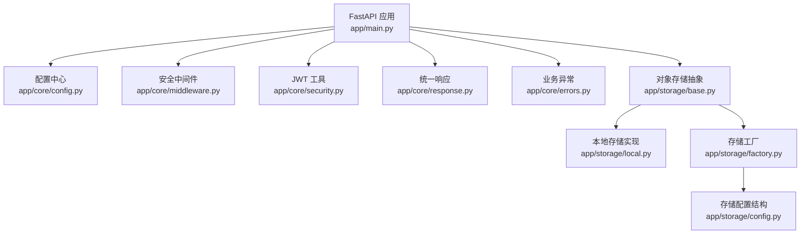
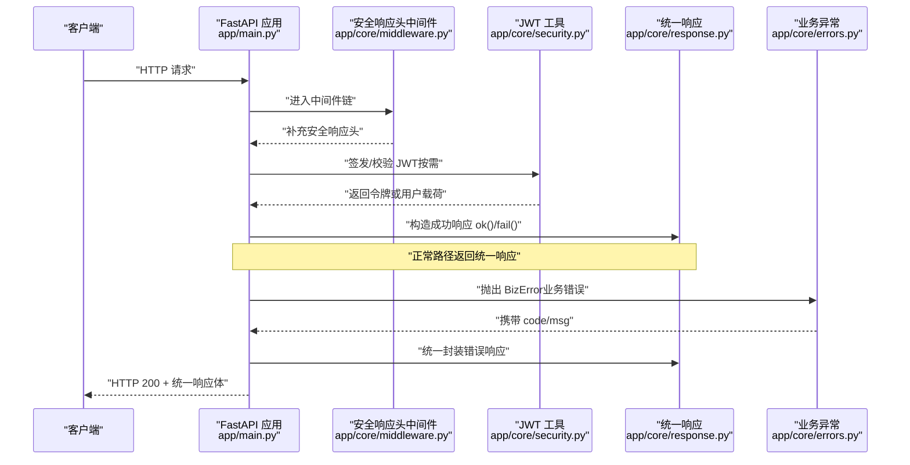
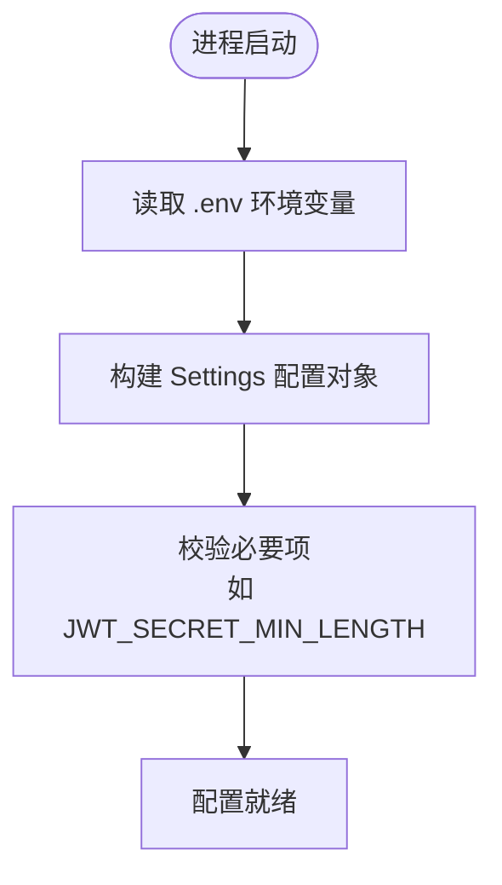
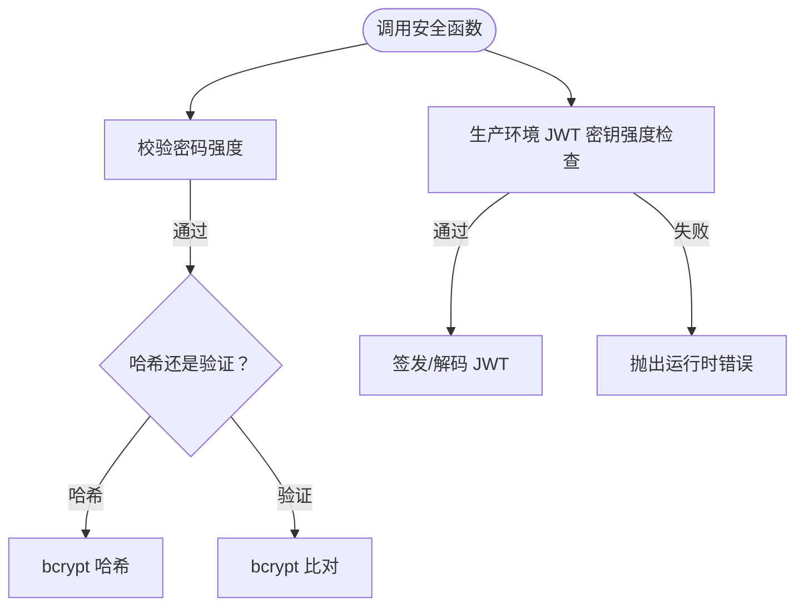
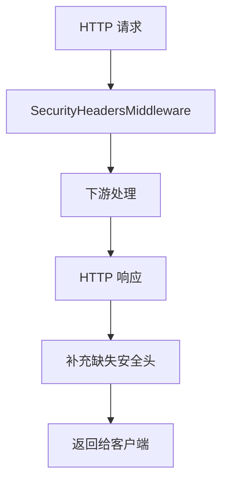
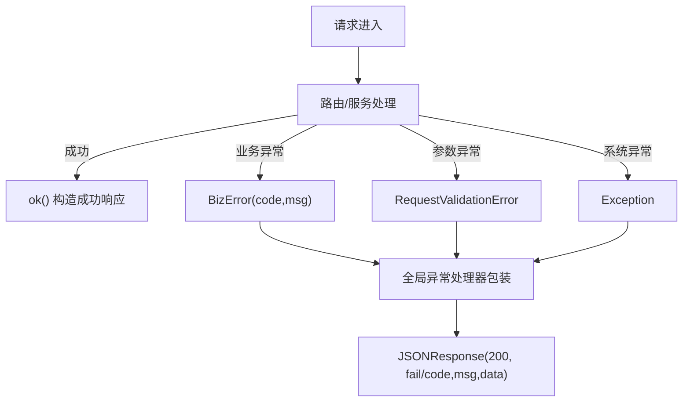
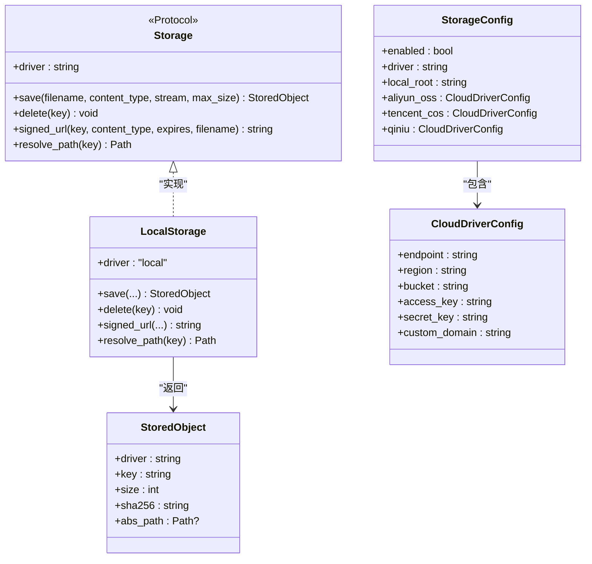
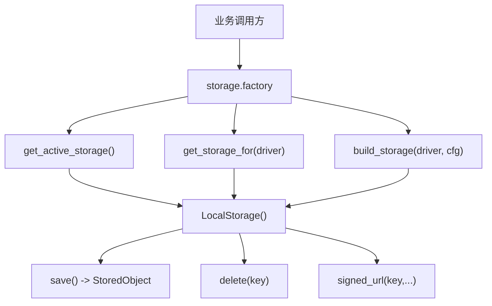
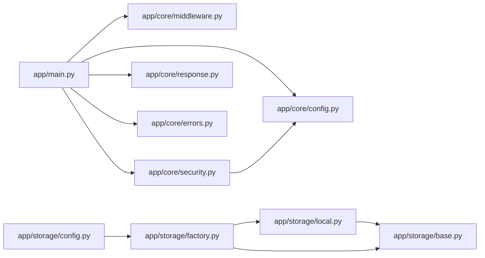

# 核心基础设施（配置·安全·中间件·存储）

<cite>
**本文引用的文件**   
- [backend/app/core/config.py](file://backend/app/core/config.py)
- [backend/app/core/security.py](file://backend/app/core/security.py)
- [backend/app/core/middleware.py](file://backend/app/core/middleware.py)
- [backend/app/core/errors.py](file://backend/app/core/errors.py)
- [backend/app/core/response.py](file://backend/app/core/response.py)
- [backend/app/main.py](file://backend/app/main.py)
- [backend/app/storage/base.py](file://backend/app/storage/base.py)
- [backend/app/storage/local.py](file://backend/app/storage/local.py)
- [backend/app/storage/factory.py](file://backend/app/storage/factory.py)
- [backend/app/storage/__init__.py](file://backend/app/storage/__init__.py)
- [backend/app/storage/config.py](file://backend/app/storage/config.py)
- [backend/tests/test_security.py](file://backend/tests/test_security.py)
- [backend/tests/test_storage.py](file://backend/tests/test_storage.py)
</cite>

## 目录
1. [引言](#引言)
2. [项目结构定位](#项目结构定位)
3. [核心组件总览](#核心组件总览)
4. [架构与请求流程](#架构与请求流程)
5. [详细组件分析](#详细组件分析)
6. [依赖关系分析](#依赖关系分析)
7. [性能与扩展性](#性能与扩展性)
8. [故障排查指南](#故障排查指南)
9. [结论](#结论)

## 引言
本文聚焦后端 `app/core` 与 `app/storage` 的核心基础设施，围绕以下目标展开：
- 应用配置模型与安全基线
- JWT 令牌生成、校验与密钥强度保护
- 限流与安全响应头中间件
- 统一错误类型与统一响应格式
- 对象存储抽象接口与本地实现，以及云存储扩展点

本仓库是 CenkorMES 后端，技术栈为 FastAPI + SQLAlchemy + Alembic + Celery，数据库 MySQL 8，缓存/队列 Redis，对象存储支持本地磁盘，并预留阿里云 OSS、腾讯云 COS、七牛的扩展结构。

## 项目结构定位
本次文档关注的代码位于后端 `backend/app` 下：
- `app/core`：配置、安全、中间件、错误、统一响应、启动入口集成
- `app/storage`：对象存储协议、本地实现、工厂与配置结构
- `app/main.py`：FastAPI 应用装配、全局异常处理、中间件注册、启动初始化

**图示来源**
- [backend/app/main.py:26-47](file://backend/app/main.py#L26-L47)
- [backend/app/core/config.py:6-50](file://backend/app/core/config.py#L6-L50)
- [backend/app/core/middleware.py:16-39](file://backend/app/core/middleware.py#L16-L39)
- [backend/app/core/security.py:29-70](file://backend/app/core/security.py#L29-L70)
- [backend/app/core/response.py:11-22](file://backend/app/core/response.py#L11-L22)
- [backend/app/core/errors.py:3-7](file://backend/app/core/errors.py#L3-L7)
- [backend/app/storage/base.py:27-50](file://backend/app/storage/base.py#L27-L50)
- [backend/app/storage/local.py:13-45](file://backend/app/storage/local.py#L13-L45)
- [backend/app/storage/factory.py:8-26](file://backend/app/storage/factory.py#L8-L26)
- [backend/app/storage/config.py:8-25](file://backend/app/storage/config.py#L8-L25)

**章节来源**
- [backend/app/main.py:26-47](file://backend/app/main.py#L26-L47)
- [backend/app/core/config.py:6-50](file://backend/app/core/config.py#L6-L50)

## 核心组件总览
- 配置中心：集中管理应用、数据库、JWT、CORS、Host 白名单、登录失败限流、对象存储、Redis/Celery 等参数。
- 安全模块：密码强度校验、生产环境 JWT 密钥强制校验、bcrypt 哈希与验证、JWT 签发与解码。
- 中间件：全局安全响应头注入；可选 CORS 与 Host 白名单。
- 错误与响应：统一业务异常 `BizError`，统一响应体 `ApiResponse` 及 `ok`/`fail` 构造器。
- 对象存储：定义 `Storage` 协议与 `StoredObject`，提供本地实现，并通过工厂暴露获取方法；同时定义云存储配置结构，便于后续扩展 OSS/COS/七牛。

**章节来源**
- [backend/app/core/config.py:6-50](file://backend/app/core/config.py#L6-L50)
- [backend/app/core/security.py:20-70](file://backend/app/core/security.py#L20-L70)
- [backend/app/core/middleware.py:16-39](file://backend/app/core/middleware.py#L16-L39)
- [backend/app/core/errors.py:3-7](file://backend/app/core/errors.py#L3-L7)
- [backend/app/core/response.py:11-22](file://backend/app/core/response.py#L11-L22)
- [backend/app/storage/base.py:10-50](file://backend/app/storage/base.py#L10-L50)
- [backend/app/storage/local.py:13-45](file://backend/app/storage/local.py#L13-L45)
- [backend/app/storage/factory.py:8-26](file://backend/app/storage/factory.py#L8-L26)
- [backend/app/storage/config.py:8-25](file://backend/app/storage/config.py#L8-L25)

## 架构与请求流程
FastAPI 启动时完成关键初始化：检查 JWT 密钥强度、创建数据库表、初始化租户与权限、创建默认管理员账号。所有 HTTP 响应经过安全响应头中间件；可选启用 CORS 与 Host 白名单；全局异常处理器将各类异常转换为统一响应格式。

**图示来源**
- [backend/app/main.py:26-85](file://backend/app/main.py#L26-L85)
- [backend/app/core/middleware.py:16-39](file://backend/app/core/middleware.py#L16-L39)
- [backend/app/core/security.py:55-70](file://backend/app/core/security.py#L55-L70)
- [backend/app/core/response.py:11-22](file://backend/app/core/response.py#L11-L22)
- [backend/app/core/errors.py:3-7](file://backend/app/core/errors.py#L3-L7)

## 详细组件分析

### 配置中心（Settings）
- 使用 Pydantic Settings 加载 `.env`，忽略多余字段。
- 包含应用基础信息、数据库连接、自动建库/种子开关、JWT 算法与过期时间、公共 URL、CORS 与可信 Host、登录失败限流阈值与窗口、对象存储驱动与本地根目录、上传大小与 MIME 白名单、Redis/Celery 连接与时区设置。
- 安全基线：生产环境要求 JWT_SECRET 最小长度，密码最小长度策略由安全模块执行。

**图示来源**
- [backend/app/core/config.py:6-50](file://backend/app/core/config.py#L6-L50)

**章节来源**
- [backend/app/core/config.py:6-50](file://backend/app/core/config.py#L6-L50)

### JWT 安全与密码策略
- 密码强度：最小长度与字符多样性校验，不满足则抛错。
- 生产环境 fail-fast：若 `APP_ENV=prod` 且 `JWT_SECRET` 为示例值或长度不足，直接抛出运行时错误，阻止不安全部署。
- 哈希与验证：基于 bcrypt 的密码哈希与比对。
- 令牌签发与解码：根据是否“记住我”选择不同过期时间，使用配置的算法与密钥签发/解码。

**图示来源**
- [backend/app/core/security.py:20-70](file://backend/app/core/security.py#L20-L70)

**章节来源**
- [backend/app/core/security.py:20-70](file://backend/app/core/security.py#L20-L70)

### 限流与安全头中间件
- 安全响应头中间件：在 ASGI 层拦截 HTTP 响应，补充缺失的安全头，包括防 MIME 嗅探、禁止嵌套框架、严格 Referrer-Policy、XSS 保护与权限收敛。不会覆盖已有头部。
- 登录失败限流：由配置项控制（最大失败次数、滑动窗口、锁定持续时间），具体计数逻辑通常由服务层或专用限流模块实现；此处重点说明配置能力。
- CORS 与 Host 白名单：仅在显式配置时启用，避免默认放行。

**图示来源**
- [backend/app/core/middleware.py:16-39](file://backend/app/core/middleware.py#L16-L39)
- [backend/app/main.py:28-45](file://backend/app/main.py#L28-L45)

**章节来源**
- [backend/app/core/middleware.py:16-39](file://backend/app/core/middleware.py#L16-L39)
- [backend/app/main.py:28-45](file://backend/app/main.py#L28-L45)
- [backend/tests/test_security.py:103-113](file://backend/tests/test_security.py#L103-L113)

### 错误与统一响应
- 业务异常：`BizError(code, msg)`，用于业务层明确表达错误码与消息。
- 统一响应：`ApiResponse` 模型与 `ok()`/`fail()` 构造器，保证前后端一致的数据结构。
- 全局异常处理：
  - HTTP 异常：转为统一响应，保留原状态码与消息。
  - 参数校验异常：统一返回 400 与错误详情。
  - 业务异常：按 `code`/`msg` 包装。
  - 未捕获异常：开发环境返回详细错误信息，生产环境仅返回通用错误。

**图示来源**
- [backend/app/core/errors.py:3-7](file://backend/app/core/errors.py#L3-L7)
- [backend/app/core/response.py:11-22](file://backend/app/core/response.py#L11-L22)
- [backend/app/main.py:55-85](file://backend/app/main.py#L55-L85)

**章节来源**
- [backend/app/core/errors.py:3-7](file://backend/app/core/errors.py#L3-L7)
- [backend/app/core/response.py:11-22](file://backend/app/core/response.py#L11-L22)
- [backend/app/main.py:55-85](file://backend/app/main.py#L55-L85)

### 对象存储抽象（本地/OSS/COS/七牛）
- 抽象协议：`Storage` Protocol 定义统一接口，包括保存、删除、签名 URL、路径解析；`StoredObject` 描述已存储对象的元数据。
- 本地实现：`LocalStorage` 基于文件系统，按日期+UUID 生成 key，计算 sha256，限制文件大小，返回 `StoredObject`；签名 URL 拼接公共基础地址。
- 工厂与导出：`factory` 提供获取当前存储、按驱动获取存储、构建存储等方法；当前默认返回本地实现。
- 配置结构：`CloudDriverConfig` 与 `StorageConfig` 定义了云存储驱动的配置骨架，便于后续接入阿里云 OSS、腾讯云 COS、七牛。

**图示来源**
- [backend/app/storage/base.py:18-50](file://backend/app/storage/base.py#L18-L50)
- [backend/app/storage/local.py:13-45](file://backend/app/storage/local.py#L13-L45)
- [backend/app/storage/config.py:8-25](file://backend/app/storage/config.py#L8-L25)

**图示来源**
- [backend/app/storage/factory.py:8-26](file://backend/app/storage/factory.py#L8-L26)
- [backend/app/storage/local.py:13-45](file://backend/app/storage/local.py#L13-L45)

**章节来源**
- [backend/app/storage/base.py:10-50](file://backend/app/storage/base.py#L10-L50)
- [backend/app/storage/local.py:13-45](file://backend/app/storage/local.py#L13-L45)
- [backend/app/storage/factory.py:8-26](file://backend/app/storage/factory.py#L8-L26)
- [backend/app/storage/__init__.py:1-21](file://backend/app/storage/__init__.py#L1-L21)
- [backend/app/storage/config.py:8-25](file://backend/app/storage/config.py#L8-L25)
- [backend/tests/test_storage.py:11-13](file://backend/tests/test_storage.py#L11-L13)

## 依赖关系分析
- `app/main.py` 依赖 `core.config`、`core.middleware`、`core.security`、`core.response`、`core.errors`，并在启动阶段执行安全与数据初始化。
- `core.security` 依赖 `core.config` 读取环境与密钥策略。
- `storage.factory` 当前只依赖 `storage.local`，对外暴露统一的存储获取方法；`storage.base` 定义协议，`storage.config` 提供云存储配置结构。
- 测试用例验证了安全响应头与 JWT 密钥强度策略，以及存储配置默认行为。

**图示来源**
- [backend/app/main.py:12-24](file://backend/app/main.py#L12-L24)
- [backend/app/core/security.py:9-9](file://backend/app/core/security.py#L9-L9)
- [backend/app/storage/factory.py:4-5](file://backend/app/storage/factory.py#L4-L5)
- [backend/app/storage/local.py:9-10](file://backend/app/storage/local.py#L9-L10)
- [backend/app/storage/base.py:27-50](file://backend/app/storage/base.py#L27-L50)
- [backend/app/storage/config.py:8-25](file://backend/app/storage/config.py#L8-L25)

**章节来源**
- [backend/app/main.py:12-24](file://backend/app/main.py#L12-L24)
- [backend/app/core/security.py:9-9](file://backend/app/core/security.py#L9-L9)
- [backend/app/storage/factory.py:4-5](file://backend/app/storage/factory.py#L4-L5)
- [backend/app/storage/local.py:9-10](file://backend/app/storage/local.py#L9-L10)
- [backend/app/storage/base.py:27-50](file://backend/app/storage/base.py#L27-L50)
- [backend/app/storage/config.py:8-25](file://backend/app/storage/config.py#L8-L25)

## 性能与扩展性
- 配置加载：Pydantic Settings 一次性加载，开销极低；建议在生产环境关闭不必要的自动建库/种子功能。
- JWT：HS256 对称签名，性能良好；注意在生产环境使用足够长度的随机密钥。
- 中间件：安全响应头在响应阶段追加，影响极小；CORS 与 Host 白名单按需启用，避免无谓开销。
- 对象存储：本地实现简单高效；未来扩展云存储时，应优先复用 `Storage` 协议，保持业务层解耦。

[本节为通用指导，不直接分析具体文件]

## 故障排查指南
- 生产环境启动失败（JWT 密钥不安全）：
  - 现象：启动时报运行时错误，提示 JWT_SECRET 不安全。
  - 原因：`APP_ENV=prod` 且 `JWT_SECRET` 为示例值或长度不足。
  - 处理：设置强随机密钥，长度不低于配置的最小值。
  - 参考：[backend/app/core/security.py:29-39](file://backend/app/core/security.py#L29-L39)

- 前端跨域失败：
  - 现象：浏览器报跨域错误。
  - 原因：未配置 `CORS_ORIGINS` 或配置不正确。
  - 处理：在 `.env` 中设置允许的源，逗号分隔。
  - 参考：[backend/app/main.py:31-40](file://backend/app/main.py#L31-L40)

- Host 头校验失败：
  - 现象：访问被拒绝。
  - 原因：未配置 `TRUSTED_HOSTS` 或域名不在白名单。
  - 处理：设置可信主机列表。
  - 参考：[backend/app/main.py:42-45](file://backend/app/main.py#L42-L45)

- 统一响应不符合预期：
  - 现象：接口返回非统一结构。
  - 原因：未使用 `ok()`/`fail()` 或抛出未捕获异常。
  - 处理：使用统一响应构造器；检查全局异常处理器日志。
  - 参考：[backend/app/core/response.py:11-22](file://backend/app/core/response.py#L11-L22)、[backend/app/main.py:55-85](file://backend/app/main.py#L55-L85)

- 对象存储上传失败：
  - 现象：上传报错或无法访问。
  - 原因：文件大小超限、MIME 不在白名单、本地根目录不可写、签名 URL 拼接错误。
  - 处理：检查 `FILE_MAX_UPLOAD_SIZE`、`FILE_ALLOWED_MIME`、`STORAGE_LOCAL_ROOT`、`PUBLIC_BASE_URL`。
  - 参考：[backend/app/core/config.py:35-41](file://backend/app/core/config.py#L35-L41)、[backend/app/storage/local.py:24-42](file://backend/app/storage/local.py#L24-L42)

**章节来源**
- [backend/app/core/security.py:29-39](file://backend/app/core/security.py#L29-L39)
- [backend/app/main.py:31-45](file://backend/app/main.py#L31-L45)
- [backend/app/core/response.py:11-22](file://backend/app/core/response.py#L11-L22)
- [backend/app/main.py:55-85](file://backend/app/main.py#L55-L85)
- [backend/app/core/config.py:35-41](file://backend/app/core/config.py#L35-L41)
- [backend/app/storage/local.py:24-42](file://backend/app/storage/local.py#L24-L42)

## 结论
- `app/core` 提供了稳定可靠的配置、安全、中间件、错误与响应基础设施，确保系统在开发与生产环境具备一致的安全基线与可观测性。
- `app/storage` 以 Protocol 抽象对象存储，当前本地实现完备，并为阿里云 OSS、腾讯云 COS、七牛预留清晰扩展点。
- 建议在上线前完成：强随机 JWT 密钥、CORS 与 Host 白名单、对象存储驱动切换与域名配置、统一响应规范落地。

[本节为总结性内容，不直接分析具体文件]