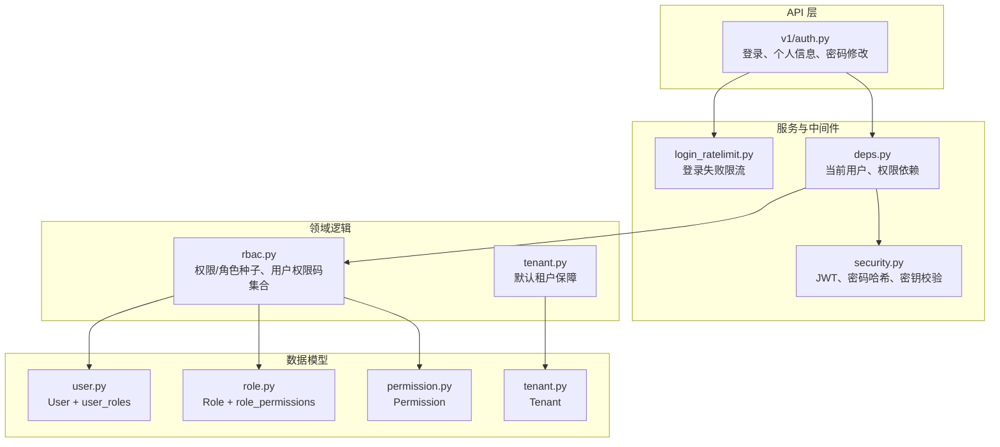
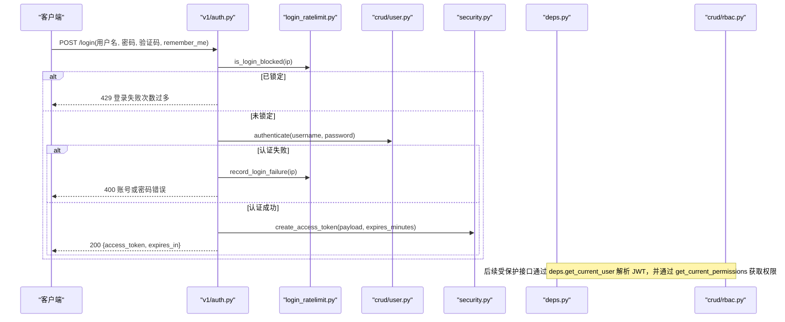
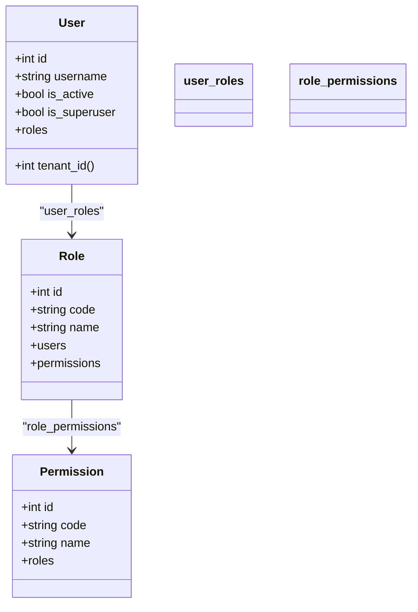
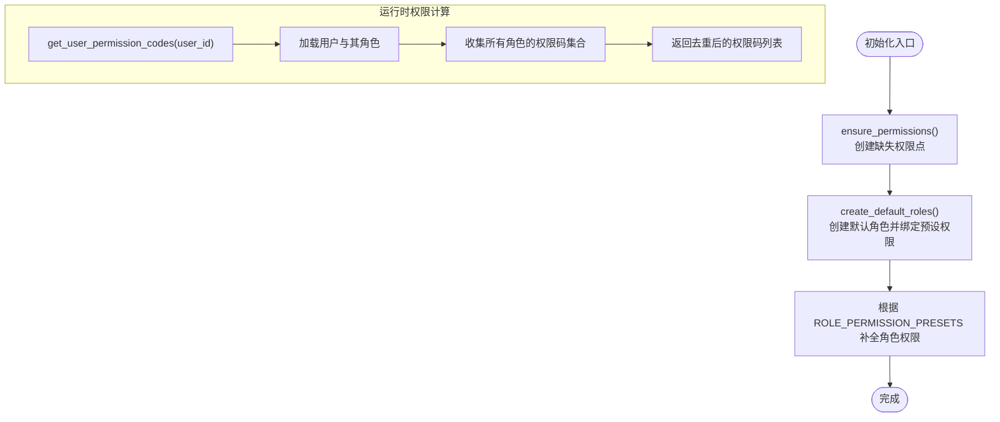
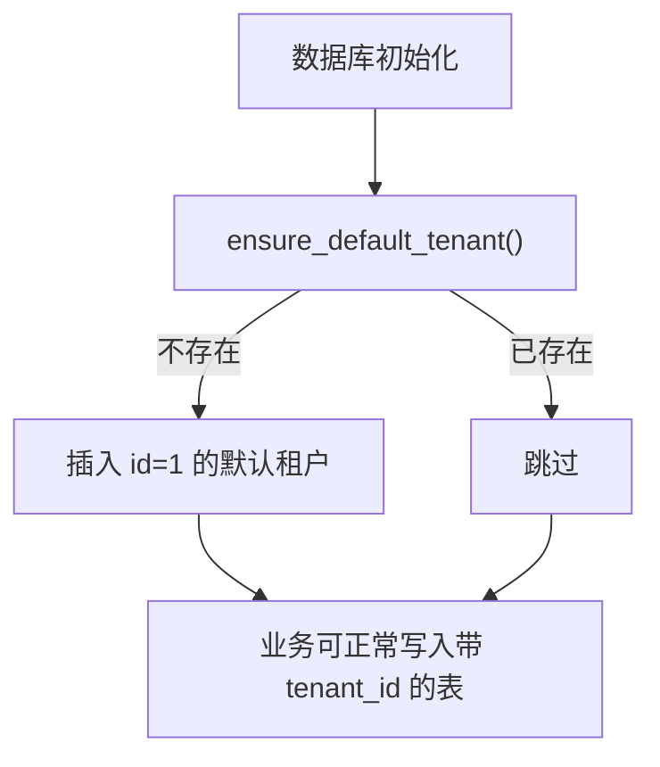
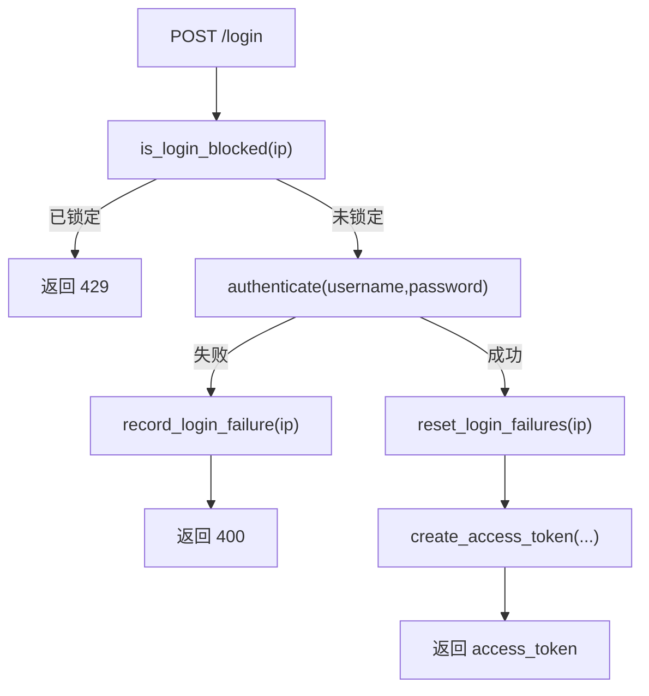
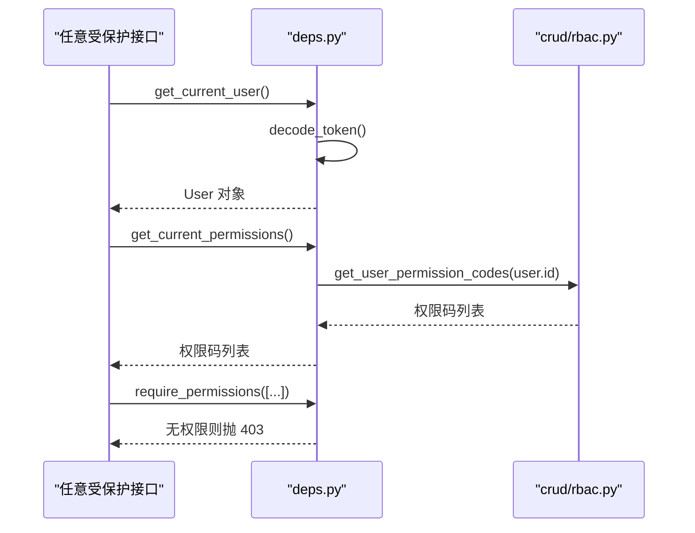
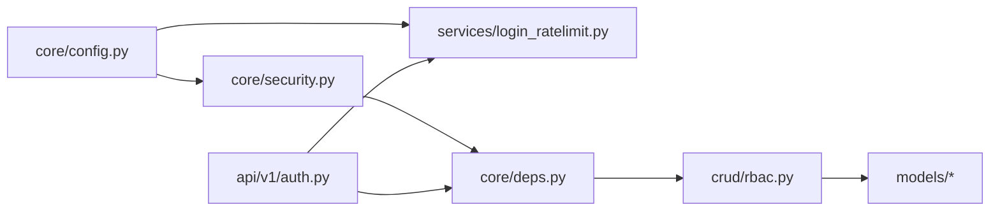

# 权限体系与多租户

<cite>
**本文引用的文件**   
- [backend/app/models/tenant.py](file://backend/app/models/tenant.py)
- [backend/app/models/user.py](file://backend/app/models/user.py)
- [backend/app/models/role.py](file://backend/app/models/role.py)
- [backend/app/models/permission.py](file://backend/app/models/permission.py)
- [backend/app/crud/rbac.py](file://backend/app/crud/rbac.py)
- [backend/app/crud/tenant.py](file://backend/app/crud/tenant.py)
- [backend/app/core/security.py](file://backend/app/core/security.py)
- [backend/app/core/deps.py](file://backend/app/core/deps.py)
- [backend/app/api/v1/auth.py](file://backend/app/api/v1/auth.py)
- [backend/app/services/login_ratelimit.py](file://backend/app/services/login_ratelimit.py)
- [backend/app/core/config.py](file://backend/app/core/config.py)
- [backend/app/core/seed.py](file://backend/app/core/seed.py)
</cite>

## 目录
1. [引言](#引言)
2. [项目结构定位](#项目结构定位)
3. [核心组件总览](#核心组件总览)
4. [架构总览](#架构总览)
5. [详细组件分析](#详细组件分析)
6. [依赖关系分析](#依赖关系分析)
7. [性能与安全特性](#性能与安全特性)
8. [故障排查指南](#故障排查指南)
9. [结论](#结论)

## 引言
本文聚焦 CenkorMES 后端在以下三个关键安全与隔离能力上的实现：
- RBAC 权限模型：用户、角色、权限点及其预设。
- 租户模型与单租户隔离：默认租户、固定 tenant_id=1 的简化策略，以及与 ERP/CRM 等模块的外键约束关系。
- 登录安全：JWT 签发与校验、密码强度校验、失败限流与锁定、生产环境强密钥检查。

这些能力由 models、crud、core、api 和 services 多层协作完成，API 层通过 FastAPI 依赖注入统一鉴权，业务层按租户上下文访问数据。

## 项目结构定位
围绕本主题的相关代码主要分布在：
- 数据模型：models/tenant.py、models/user.py、models/role.py、models/permission.py
- 初始化与 CRUD：crud/rbac.py、crud/tenant.py、core/seed.py
- 安全与鉴权：core/security.py、core/deps.py、api/v1/auth.py
- 登录限流：services/login_ratelimit.py
- 配置项：core/config.py

图表来源
- [backend/app/api/v1/auth.py:24-47](file://backend/app/api/v1/auth.py#L24-L47)
- [backend/app/services/login_ratelimit.py:48-101](file://backend/app/services/login_ratelimit.py#L48-L101)
- [backend/app/core/deps.py:27-72](file://backend/app/core/deps.py#L27-L72)
- [backend/app/core/security.py:20-70](file://backend/app/core/security.py#L20-L70)
- [backend/app/crud/rbac.py:12-75](file://backend/app/crud/rbac.py#L12-L75)
- [backend/app/crud/tenant.py:10-22](file://backend/app/crud/tenant.py#L10-L22)
- [backend/app/models/user.py:12-57](file://backend/app/models/user.py#L12-L57)
- [backend/app/models/role.py:9-27](file://backend/app/models/role.py#L9-L27)
- [backend/app/models/permission.py:9-17](file://backend/app/models/permission.py#L9-L17)
- [backend/app/models/tenant.py:9-20](file://backend/app/models/tenant.py#L9-L20)

章节来源
- [backend/app/api/v1/auth.py:24-47](file://backend/app/api/v1/auth.py#L24-L47)
- [backend/app/core/deps.py:27-72](file://backend/app/core/deps.py#L27-L72)
- [backend/app/core/security.py:20-70](file://backend/app/core/security.py#L20-L70)
- [backend/app/crud/rbac.py:12-75](file://backend/app/crud/rbac.py#L12-L75)
- [backend/app/crud/tenant.py:10-22](file://backend/app/crud/tenant.py#L10-L22)

## 核心组件总览
- RBAC 权限模型
  - User 与 Role 通过 user_roles 关联；Role 与 Permission 通过 role_permissions 关联。
  - crud/rbac.py 提供 ensure_permissions、create_default_roles、get_user_permission_codes，用于初始化权限/角色并计算用户权限码集合。
  - core/seed.py 定义 DEFAULT_PERMISSIONS、DEFAULT_ROLES、ROLE_PERMISSION_PRESETS，内置管理员、班组长、质检员、员工、客户等角色及权限预设。
- 租户模型与单租户隔离
  - Tenant 表存在，但 User.tenant_id 固定返回 1；crud/tenant.ensure_default_tenant 保证 tenants.id=1 存在，避免 ERP/CRM 外键写入失败。
  - 业务 API 普遍使用 user.tenant_id 作为数据隔离维度，单租户模式下恒为 1。
- 登录安全
  - JWT：security.create_access_token / decode_token，基于 settings.JWT_SECRET 与算法。
  - 密码强度：validate_password_strength 限制最小长度与字符多样性。
  - 生产密钥校验：ensure_secure_jwt_secret 在 prod 环境下拒绝弱或示例密钥。
  - 失败限流：services.login_ratelimit 基于 Redis（回退内存）按 IP 滑动窗口计数，超过阈值临时锁定。

章节来源
- [backend/app/models/user.py:12-57](file://backend/app/models/user.py#L12-L57)
- [backend/app/models/role.py:9-27](file://backend/app/models/role.py#L9-L27)
- [backend/app/models/permission.py:9-17](file://backend/app/models/permission.py#L9-L17)
- [backend/app/crud/rbac.py:12-75](file://backend/app/crud/rbac.py#L12-L75)
- [backend/app/core/seed.py:3-77](file://backend/app/core/seed.py#L3-L77)
- [backend/app/models/tenant.py:9-20](file://backend/app/models/tenant.py#L9-L20)
- [backend/app/crud/tenant.py:10-22](file://backend/app/crud/tenant.py#L10-L22)
- [backend/app/core/security.py:20-70](file://backend/app/core/security.py#L20-L70)
- [backend/app/services/login_ratelimit.py:1-101](file://backend/app/services/login_ratelimit.py#L1-L101)

## 架构总览
下图展示从登录到鉴权的完整调用链，以及 RBAC 与租户隔离在请求处理中的位置。

图表来源
- [backend/app/api/v1/auth.py:24-47](file://backend/app/api/v1/auth.py#L24-L47)
- [backend/app/services/login_ratelimit.py:48-101](file://backend/app/services/login_ratelimit.py#L48-L101)
- [backend/app/crud/user.py:112-120](file://backend/app/crud/user.py#L112-L120)
- [backend/app/core/security.py:61-70](file://backend/app/core/security.py#L61-L70)
- [backend/app/core/deps.py:27-58](file://backend/app/core/deps.py#L27-L58)
- [backend/app/crud/rbac.py:65-75](file://backend/app/crud/rbac.py#L65-L75)

## 详细组件分析

### RBAC 权限模型与初始化
RBAC 采用“用户-角色-权限”三段式关系，并通过两张关联表维护多对多关系。系统启动或数据初始化时，会确保权限点和默认角色存在，并按预设将权限分配给角色。

图表来源
- [backend/app/models/user.py:12-57](file://backend/app/models/user.py#L12-L57)
- [backend/app/models/role.py:9-27](file://backend/app/models/role.py#L9-L27)
- [backend/app/models/permission.py:9-17](file://backend/app/models/permission.py#L9-L17)

初始化与权限计算流程如下：

图表来源
- [backend/app/crud/rbac.py:12-75](file://backend/app/crud/rbac.py#L12-L75)
- [backend/app/core/seed.py:3-77](file://backend/app/core/seed.py#L3-L77)

章节来源
- [backend/app/models/user.py:12-57](file://backend/app/models/user.py#L12-L57)
- [backend/app/models/role.py:9-27](file://backend/app/models/role.py#L9-L27)
- [backend/app/models/permission.py:9-17](file://backend/app/models/permission.py#L9-L17)
- [backend/app/crud/rbac.py:12-75](file://backend/app/crud/rbac.py#L12-L75)
- [backend/app/core/seed.py:3-77](file://backend/app/core/seed.py#L3-L77)

### 租户模型与单租户隔离
- 数据模型层面：Tenant 表包含 code、name、status 等字段，供多租户扩展；User 的 tenant_id 属性固定返回 1，表示单租户模式。
- 初始化层面：ensure_default_tenant 保证 tenants.id=1 存在，避免 ERP/CRM 等模块首次写数据时因外键约束失败。
- 业务层面：多数业务 API 以 user.tenant_id 作为查询过滤条件，从而在单租户场景下天然隔离。

图表来源
- [backend/app/models/tenant.py:9-20](file://backend/app/models/tenant.py#L9-L20)
- [backend/app/models/user.py:52-56](file://backend/app/models/user.py#L52-L56)
- [backend/app/crud/tenant.py:10-22](file://backend/app/crud/tenant.py#L10-L22)

章节来源
- [backend/app/models/tenant.py:9-20](file://backend/app/models/tenant.py#L9-L20)
- [backend/app/models/user.py:52-56](file://backend/app/models/user.py#L52-L56)
- [backend/app/crud/tenant.py:10-22](file://backend/app/crud/tenant.py#L10-L22)

### 登录安全：JWT、失败限流、强密钥校验
- JWT 签发与校验
  - create_access_token 将用户标识与过期时间编码为 JWT。
  - decode_token 在依赖注入中解析 token，提取 sub 并加载用户对象。
- 密码强度与哈希
  - validate_password_strength 强制最小长度与字符多样性。
  - hash_password / verify_password 使用 bcrypt。
- 生产环境强密钥校验
  - ensure_secure_jwt_secret 在 APP_ENV=prod 时拒绝示例密钥或过短密钥，防止弱密钥上线。
- 登录失败限流
  - login_ratelimit 基于 Redis（不可用时回退进程内内存），按 IP 统计失败次数，超过阈值后锁定一段时间。
  - 登录成功或重置时清理失败计数。

图表来源
- [backend/app/api/v1/auth.py:24-47](file://backend/app/api/v1/auth.py#L24-L47)
- [backend/app/services/login_ratelimit.py:48-101](file://backend/app/services/login_ratelimit.py#L48-L101)
- [backend/app/crud/user.py:112-120](file://backend/app/crud/user.py#L112-L120)
- [backend/app/core/security.py:61-70](file://backend/app/core/security.py#L61-L70)

章节来源
- [backend/app/core/security.py:20-70](file://backend/app/core/security.py#L20-L70)
- [backend/app/api/v1/auth.py:24-47](file://backend/app/api/v1/auth.py#L24-L47)
- [backend/app/services/login_ratelimit.py:1-101](file://backend/app/services/login_ratelimit.py#L1-L101)
- [backend/app/crud/user.py:99-120](file://backend/app/crud/user.py#L99-L120)

### 鉴权依赖与权限控制
- get_current_user：从 Bearer Token 解析 payload，校验用户存在且激活，并将 token payload 放入 request.state。
- get_current_permissions：计算并缓存当前用户的权限码集合，避免重复查询。
- require_permissions / require_any_permissions：FastAPI 依赖装饰器，用于接口级权限控制。

图表来源
- [backend/app/core/deps.py:27-72](file://backend/app/core/deps.py#L27-L72)
- [backend/app/crud/rbac.py:65-75](file://backend/app/crud/rbac.py#L65-L75)

章节来源
- [backend/app/core/deps.py:27-72](file://backend/app/core/deps.py#L27-L72)
- [backend/app/crud/rbac.py:65-75](file://backend/app/crud/rbac.py#L65-L75)

## 依赖关系分析
- 低耦合分层
  - API 层仅负责参数校验、调用服务与返回响应。
  - 安全与鉴权集中在 core/security.py 与 core/deps.py。
  - 领域逻辑通过 crud 层封装，模型层只描述数据结构与关系。
- 外部依赖
  - JWT：jose 库进行编解码。
  - 密码哈希：bcrypt。
  - 限流：Redis（优先）+ 进程内内存（回退）。
  - 数据库：SQLAlchemy ORM，MySQL 8。

图表来源
- [backend/app/core/config.py:6-50](file://backend/app/core/config.py#L6-L50)
- [backend/app/core/security.py:20-70](file://backend/app/core/security.py#L20-L70)
- [backend/app/services/login_ratelimit.py:1-101](file://backend/app/services/login_ratelimit.py#L1-L101)
- [backend/app/core/deps.py:27-72](file://backend/app/core/deps.py#L27-L72)
- [backend/app/crud/rbac.py:12-75](file://backend/app/crud/rbac.py#L12-L75)
- [backend/app/api/v1/auth.py:24-47](file://backend/app/api/v1/auth.py#L24-L47)

章节来源
- [backend/app/core/config.py:6-50](file://backend/app/core/config.py#L6-L50)
- [backend/app/core/security.py:20-70](file://backend/app/core/security.py#L20-L70)
- [backend/app/services/login_ratelimit.py:1-101](file://backend/app/services/login_ratelimit.py#L1-L101)
- [backend/app/core/deps.py:27-72](file://backend/app/core/deps.py#L27-L72)
- [backend/app/crud/rbac.py:12-75](file://backend/app/crud/rbac.py#L12-L75)
- [backend/app/api/v1/auth.py:24-47](file://backend/app/api/v1/auth.py#L24-L47)

## 性能与安全特性
- 性能
  - 权限码集合在请求级别缓存于 request.state.permission_codes，避免重复查询。
  - 登录失败限流优先使用 Redis，支持分布式实例共享状态；不可用时回退内存，保证可用性。
  - 默认租户初始化仅在缺失时写入一次。
- 安全
  - 生产环境强制 JWT_SECRET 长度与复杂度检查，拒绝示例密钥。
  - 密码强度校验与 bcrypt 哈希存储。
  - 登录失败次数限制与临时锁定，降低暴力破解风险。
  - 依赖注入统一鉴权，接口级权限控制清晰明确。

[本节为通用指导，不直接分析具体文件]

## 故障排查指南
- 登录被锁定
  - 现象：频繁失败后出现 429 提示。
  - 排查：检查 LOGIN_MAX_FAILURES、LOGIN_FAIL_WINDOW_SECONDS、LOGIN_LOCKOUT_SECONDS 配置；确认 Redis 是否可用。
  - 参考：[backend/app/services/login_ratelimit.py:16-18](file://backend/app/services/login_ratelimit.py#L16-L18)、[backend/app/services/login_ratelimit.py:48-101](file://backend/app/services/login_ratelimit.py#L48-L101)
- 生产环境启动失败
  - 现象：抛出 JWT_SECRET 不安全异常。
  - 排查：设置足够长度的随机密钥，并确保不是示例值。
  - 参考：[backend/app/core/security.py:29-39](file://backend/app/core/security.py#L29-L39)、[backend/app/core/config.py:19-28](file://backend/app/core/config.py#L19-L28)
- 首次写入 ERP/CRM 报外键错误
  - 现象：凭证、资产、线索等写入时报 tenants.id 外键失败。
  - 排查：确保 ensure_default_tenant 已执行，tenants.id=1 存在。
  - 参考：[backend/app/crud/tenant.py:10-22](file://backend/app/crud/tenant.py#L10-L22)
- 权限不足
  - 现象：接口返回 403。
  - 排查：检查用户角色与权限预设是否正确初始化；确认接口所需权限码是否在用户权限集合中。
  - 参考：[backend/app/core/deps.py:61-72](file://backend/app/core/deps.py#L61-L72)、[backend/app/crud/rbac.py:65-75](file://backend/app/crud/rbac.py#L65-L75)、[backend/app/core/seed.py:70-77](file://backend/app/core/seed.py#L70-L77)

章节来源
- [backend/app/services/login_ratelimit.py:16-18](file://backend/app/services/login_ratelimit.py#L16-L18)
- [backend/app/services/login_ratelimit.py:48-101](file://backend/app/services/login_ratelimit.py#L48-L101)
- [backend/app/core/security.py:29-39](file://backend/app/core/security.py#L29-L39)
- [backend/app/core/config.py:19-28](file://backend/app/core/config.py#L19-L28)
- [backend/app/crud/tenant.py:10-22](file://backend/app/crud/tenant.py#L10-L22)
- [backend/app/core/deps.py:61-72](file://backend/app/core/deps.py#L61-L72)
- [backend/app/crud/rbac.py:65-75](file://backend/app/crud/rbac.py#L65-L75)
- [backend/app/core/seed.py:70-77](file://backend/app/core/seed.py#L70-L77)

## 结论
CenkorMES 在后端实现了清晰的 RBAC 权限模型与单租户隔离策略，并通过统一的依赖注入机制完成鉴权与权限控制。登录安全方面，结合 JWT、密码强度校验、生产密钥强校验与失败限流，形成较为完善的安全基线。对于多租户扩展，Tenant 模型与租户 ID 的使用方式已预留空间，当前单租户版本通过固定 tenant_id=1 简化部署与维护。建议在生产环境中严格配置 JWT_SECRET、合理设置限流参数，并确保默认租户初始化成功，以避免外键约束问题。