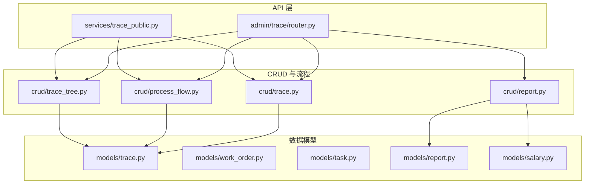
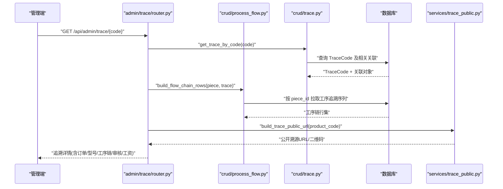
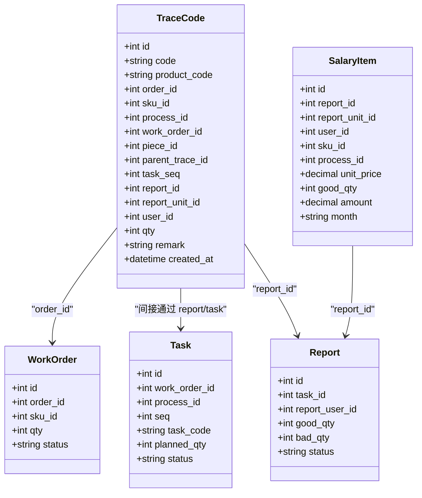
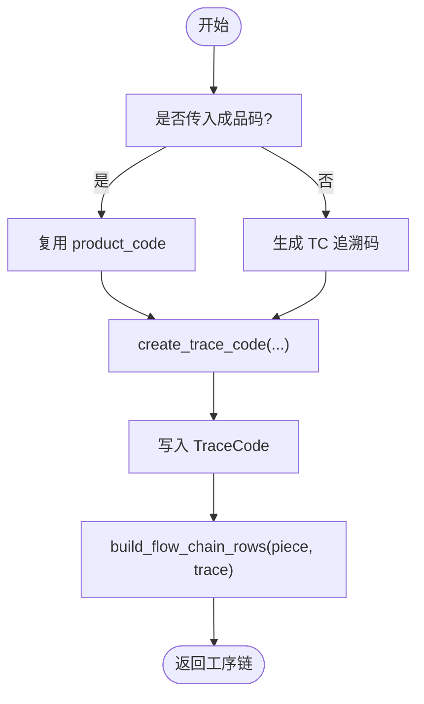
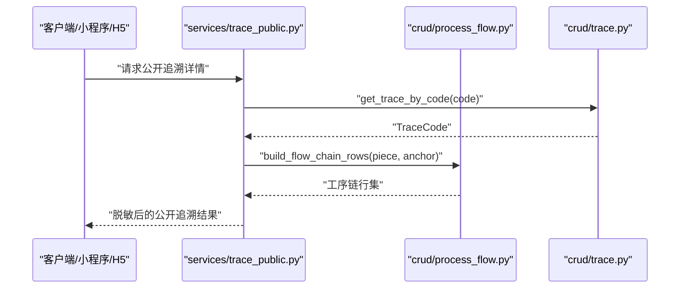
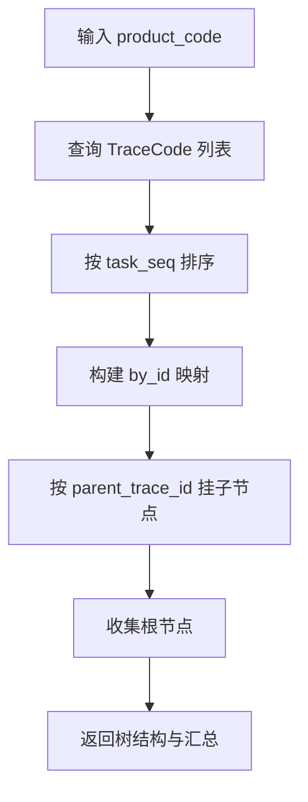
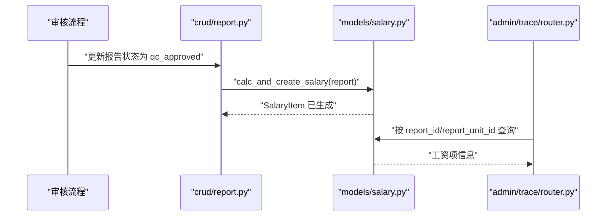
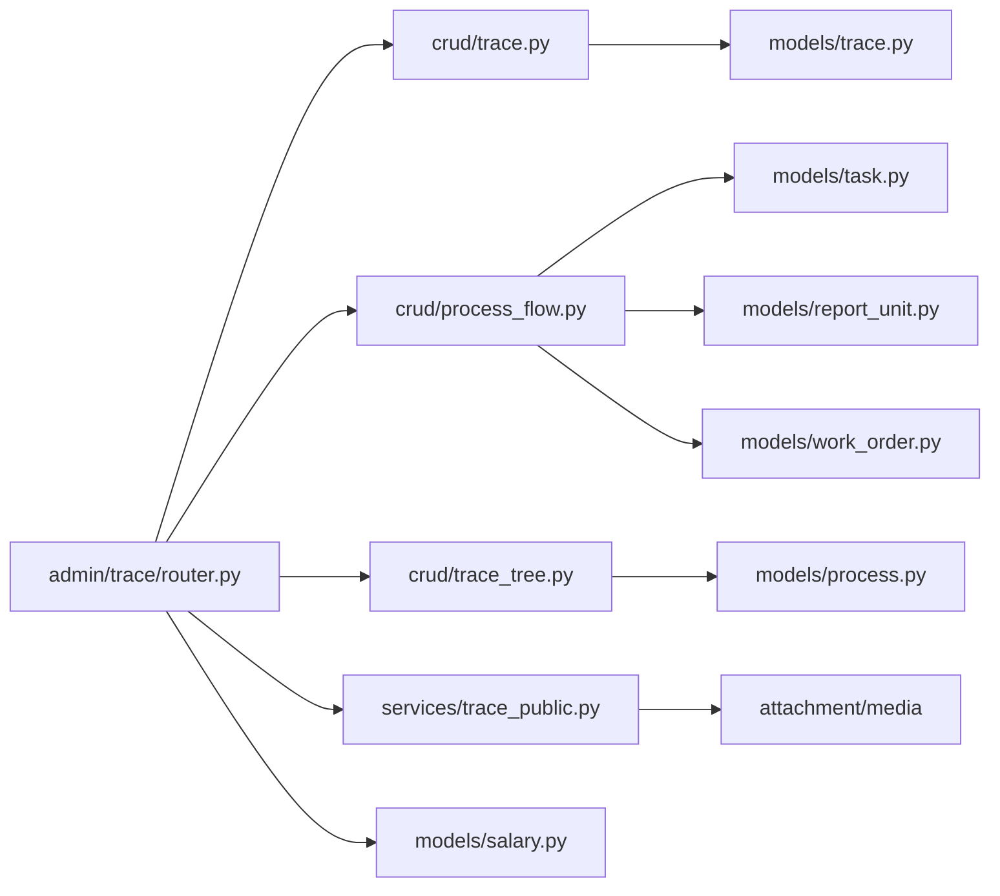

# 全程追溯

<cite>
**本文引用的文件**   
- [backend/app/models/trace.py](file://backend/app/models/trace.py)
- [backend/app/crud/trace.py](file://backend/app/crud/trace.py)
- [backend/app/crud/process_flow.py](file://backend/app/crud/process_flow.py)
- [backend/app/crud/trace_tree.py](file://backend/app/crud/trace_tree.py)
- [backend/app/api/admin/trace/router.py](file://backend/app/api/admin/trace/router.py)
- [backend/app/services/trace_public.py](file://backend/app/services/trace_public.py)
- [backend/app/models/work_order.py](file://backend/app/models/work_order.py)
- [backend/app/models/task.py](file://backend/app/models/task.py)
- [backend/app/models/report.py](file://backend/app/models/report.py)
- [backend/app/models/salary.py](file://backend/app/models/salary.py)
- [backend/app/crud/report.py](file://backend/app/crud/report.py)
</cite>

## 目录
1. [引言](#引言)
2. [项目结构](#项目结构)
3. [核心组件](#核心组件)
4. [架构总览](#架构总览)
5. [详细组件分析](#详细组件分析)
6. [依赖关系分析](#依赖关系分析)
7. [性能与一致性考虑](#性能与一致性考虑)
8. [故障排查指南](#故障排查指南)
9. [结论](#结论)

## 引言
本文件聚焦 CenkorMES 的“全程追溯”能力，说明 trace 追溯链如何贯穿工单、任务、报工、算薪各节点。追溯以工序级 TraceCode 为核心，通过成品码 product_code 串联同一件产品在各工序中的流转记录；审核通过的报工再映射到工资明细 SalaryItem，从而形成从订单到计件工资的完整可审计链路。

## 项目结构
围绕追溯的主干代码集中在后端：
- 数据模型：TraceCode、WorkOrder、Task、Report、SalaryItem 等。
- 业务逻辑：trace CRUD、process_flow（套号池与成品码）、trace_tree（层级树）。
- API 层：admin/trace 提供内部追溯查询与公开溯源 URL/二维码。
- 服务层：trace_public 负责客户侧公开追溯详情、媒体资源与脱敏展示。

**图表来源** 
- [backend/app/api/admin/trace/router.py:1-176](file://backend/app/api/admin/trace/router.py#L1-L176)
- [backend/app/services/trace_public.py:1-192](file://backend/app/services/trace_public.py#L1-L192)
- [backend/app/crud/trace.py:1-198](file://backend/app/crud/trace.py#L1-L198)
- [backend/app/crud/process_flow.py:1-414](file://backend/app/crud/process_flow.py#L1-L414)
- [backend/app/crud/trace_tree.py:1-139](file://backend/app/crud/trace_tree.py#L1-L139)
- [backend/app/crud/report.py:105-140](file://backend/app/crud/report.py#L105-L140)
- [backend/app/models/trace.py:1-47](file://backend/app/models/trace.py#L1-L47)
- [backend/app/models/work_order.py:1-39](file://backend/app/models/work_order.py#L1-L39)
- [backend/app/models/task.py:1-39](file://backend/app/models/task.py#L1-L39)
- [backend/app/models/report.py:1-53](file://backend/app/models/report.py#L1-L53)
- [backend/app/models/salary.py:1-46](file://backend/app/models/salary.py#L1-L46)

**章节来源**
- [backend/app/api/admin/trace/router.py:1-176](file://backend/app/api/admin/trace/router.py#L1-L176)
- [backend/app/services/trace_public.py:1-192](file://backend/app/services/trace_public.py#L1-L192)
- [backend/app/crud/trace.py:1-198](file://backend/app/crud/trace.py#L1-L198)
- [backend/app/crud/process_flow.py:1-414](file://backend/app/crud/process_flow.py#L1-L414)
- [backend/app/crud/trace_tree.py:1-139](file://backend/app/crud/trace_tree.py#L1-L139)
- [backend/app/crud/report.py:105-140](file://backend/app/crud/report.py#L105-L140)
- [backend/app/models/trace.py:1-47](file://backend/app/models/trace.py#L1-L47)
- [backend/app/models/work_order.py:1-39](file://backend/app/models/work_order.py#L1-L39)
- [backend/app/models/task.py:1-39](file://backend/app/models/task.py#L1-L39)
- [backend/app/models/report.py:1-53](file://backend/app/models/report.py#L1-L53)
- [backend/app/models/salary.py:1-46](file://backend/app/models/salary.py#L1-L46)

## 核心组件
- TraceCode：工序追溯记录，承载 code、product_code、order_id、sku_id、process_id、work_order_id、piece_id、parent_trace_id、task_seq、report_id、report_unit_id、user_id、qty、remark 等字段，是贯穿全流程的核心实体。
- process_flow：负责套号池、成品码生成与绑定、逐件报工时的套号领取与校验、工序链构建。
- trace CRUD：生成追溯码、按 code/product_code 查询、列表分页。
- trace_tree：根据 product_code 构建父子层级追溯树（parent_trace_id）。
- admin/trace router：对外暴露追溯查询、公开溯源链接与二维码、工序链、审核流水、工资信息。
- trace_public：面向客户的公开追溯页 URL、二维码、脱敏用户信息与媒体资源聚合。
- report/salary：报工审核后生成工资明细，追溯接口可反向关联到工资项。

**章节来源**
- [backend/app/models/trace.py:11-47](file://backend/app/models/trace.py#L11-L47)
- [backend/app/crud/process_flow.py:69-85](file://backend/app/crud/process_flow.py#L69-L85)
- [backend/app/crud/process_flow.py:282-294](file://backend/app/crud/process_flow.py#L282-L294)
- [backend/app/crud/process_flow.py:377-414](file://backend/app/crud/process_flow.py#L377-L414)
- [backend/app/crud/trace.py:21-73](file://backend/app/crud/trace.py#L21-L73)
- [backend/app/crud/trace.py:108-144](file://backend/app/crud/trace.py#L108-L144)
- [backend/app/crud/trace.py:147-181](file://backend/app/crud/trace.py#L147-L181)
- [backend/app/crud/trace_tree.py:13-139](file://backend/app/crud/trace_tree.py#L13-L139)
- [backend/app/api/admin/trace/router.py:37-176](file://backend/app/api/admin/trace/router.py#L37-L176)
- [backend/app/services/trace_public.py:30-56](file://backend/app/services/trace_public.py#L30-L56)
- [backend/app/services/trace_public.py:111-162](file://backend/app/services/trace_public.py#L111-L162)
- [backend/app/models/report.py:11-53](file://backend/app/models/report.py#L11-L53)
- [backend/app/models/salary.py:12-46](file://backend/app/models/salary.py#L12-L46)

## 架构总览
追溯链在系统中的关键路径如下：
- 工单 WorkOrder 派生出任务 Task。
- 首道工序派工时预建套号池并赋成品码 product_code。
- 员工扫码报工，系统为每道报工创建 TraceCode，并通过 piece_id、task_seq、parent_trace_id 建立工序链。
- 报工经班组长初审、质检终审后，触发算薪生成 SalaryItem。
- 追溯接口可按 code 或 product_code 返回订单、型号、工序链、审核流水、工资项及公开溯源链接。

**图表来源**
- [backend/app/api/admin/trace/router.py:54-163](file://backend/app/api/admin/trace/router.py#L54-L163)
- [backend/app/crud/trace.py:147-181](file://backend/app/crud/trace.py#L147-L181)
- [backend/app/crud/process_flow.py:377-414](file://backend/app/crud/process_flow.py#L377-L414)
- [backend/app/services/trace_public.py:30-56](file://backend/app/services/trace_public.py#L30-L56)

## 详细组件分析

### 追溯数据模型与关系
TraceCode 是追溯链的核心节点，包含：
- 外部标识：code（工序追溯码）、product_code（成品码，首工序赋码，全工序共用）。
- 业务关联：order_id、sku_id、process_id、work_order_id、piece_id。
- 工序顺序：task_seq（用于排序）、parent_trace_id（父子层级）。
- 报工关联：report_id、report_unit_id。
- 人员与数量：user_id、qty、remark。

**图表来源**
- [backend/app/models/trace.py:11-47](file://backend/app/models/trace.py#L11-L47)
- [backend/app/models/work_order.py:11-39](file://backend/app/models/work_order.py#L11-L39)
- [backend/app/models/task.py:11-39](file://backend/app/models/task.py#L11-L39)
- [backend/app/models/report.py:11-53](file://backend/app/models/report.py#L11-L53)
- [backend/app/models/salary.py:12-46](file://backend/app/models/salary.py#L12-L46)

**章节来源**
- [backend/app/models/trace.py:11-47](file://backend/app/models/trace.py#L11-L47)
- [backend/app/models/work_order.py:11-39](file://backend/app/models/work_order.py#L11-L39)
- [backend/app/models/task.py:11-39](file://backend/app/models/task.py#L11-L39)
- [backend/app/models/report.py:11-53](file://backend/app/models/report.py#L11-L53)
- [backend/app/models/salary.py:12-46](file://backend/app/models/salary.py#L12-L46)

### 追溯码生成与工序链构建
- 生成策略：
  - generate_trace_code：若传入 product_code 则复用该成品码；否则生成 TC 前缀追溯码，避免冲突。
  - create_trace_code：持久化 TraceCode，自动填充 product_code（当 code 以 FP 开头时视为成品码）。
- 工序链构建：
  - build_flow_chain_rows：优先按 piece_id 拉取所有 TraceCode，按 task_seq 排序输出工序链；若无 piece_id，则直接返回当前 trace 所在工序。
  - ensure_work_order_piece_pool：首道工序派工后预建套号池并赋成品码（FP 前缀），状态 reserved。
  - assign_product_code_on_piece：为 WorkOrderPiece 生成唯一 product_code。

**图表来源**
- [backend/app/crud/trace.py:21-73](file://backend/app/crud/trace.py#L21-L73)
- [backend/app/crud/trace.py:108-144](file://backend/app/crud/trace.py#L108-L144)
- [backend/app/crud/process_flow.py:377-414](file://backend/app/crud/process_flow.py#L377-L414)
- [backend/app/crud/process_flow.py:69-85](file://backend/app/crud/process_flow.py#L69-L85)
- [backend/app/crud/process_flow.py:282-294](file://backend/app/crud/process_flow.py#L282-L294)

**章节来源**
- [backend/app/crud/trace.py:21-73](file://backend/app/crud/trace.py#L21-L73)
- [backend/app/crud/trace.py:108-144](file://backend/app/crud/trace.py#L108-L144)
- [backend/app/crud/process_flow.py:69-85](file://backend/app/crud/process_flow.py#L69-L85)
- [backend/app/crud/process_flow.py:282-294](file://backend/app/crud/process_flow.py#L282-L294)
- [backend/app/crud/process_flow.py:377-414](file://backend/app/crud/process_flow.py#L377-L414)

### 公开追溯与二维码
- build_trace_public_url：基于 H5_PUBLIC_BASE_URL/PUBLIC_BASE_URL 拼接 /trace.html?id=...&tenant=...。
- trace_qr_payload：生成二维码 SVG 与文本内容。
- build_public_trace_detail：根据 code 解析 piece 与 trace，组装订单、SKU、产品、客户、工序链、媒体资源，并对用户信息进行脱敏。

**图表来源**
- [backend/app/services/trace_public.py:30-56](file://backend/app/services/trace_public.py#L30-L56)
- [backend/app/services/trace_public.py:111-162](file://backend/app/services/trace_public.py#L111-L162)
- [backend/app/crud/trace.py:147-181](file://backend/app/crud/trace.py#L147-L181)
- [backend/app/crud/process_flow.py:377-414](file://backend/app/crud/process_flow.py#L377-L414)

**章节来源**
- [backend/app/services/trace_public.py:30-56](file://backend/app/services/trace_public.py#L30-L56)
- [backend/app/services/trace_public.py:111-162](file://backend/app/services/trace_public.py#L111-L162)
- [backend/app/crud/trace.py:147-181](file://backend/app/crud/trace.py#L147-L181)
- [backend/app/crud/process_flow.py:377-414](file://backend/app/crud/process_flow.py#L377-L414)

### 追溯树（父子层级）
- build_trace_tree：按 product_code 查询所有 TraceCode，按 task_seq 排序，再以 parent_trace_id 构建父子树结构，返回根节点集合与汇总信息。

**图表来源**
- [backend/app/crud/trace_tree.py:13-139](file://backend/app/crud/trace_tree.py#L13-L139)

**章节来源**
- [backend/app/crud/trace_tree.py:13-139](file://backend/app/crud/trace_tree.py#L13-L139)

### 追溯与算薪的衔接
- 报工 Report 经审核通过后，calc_and_create_salary 生成 SalaryItem，关联 report_id、user_id、sku_id、process_id、good_qty、unit_price、amount、month。
- admin/trace 追溯接口可根据 report_unit_id 或 report_id 反查 SalaryItem，并在响应中附带工资信息。

**图表来源**
- [backend/app/crud/report.py:105-140](file://backend/app/crud/report.py#L105-L140)
- [backend/app/models/salary.py:12-46](file://backend/app/models/salary.py#L12-L46)
- [backend/app/api/admin/trace/router.py:71-85](file://backend/app/api/admin/trace/router.py#L71-L85)

**章节来源**
- [backend/app/crud/report.py:105-140](file://backend/app/crud/report.py#L105-L140)
- [backend/app/models/salary.py:12-46](file://backend/app/models/salary.py#L12-L46)
- [backend/app/api/admin/trace/router.py:71-85](file://backend/app/api/admin/trace/router.py#L71-L85)

## 依赖关系分析
- API 层依赖：
  - admin/trace/router.py 依赖 crud/trace、crud/process_flow、crud/trace_tree、services/trace_public、models/salary。
- CRUD 层依赖：
  - trace.py 依赖 models/trace、models/report、models/report_unit。
  - process_flow.py 依赖 models/task、models/report_unit、models/work_order、models/work_order_piece、models/trace。
  - trace_tree.py 依赖 models/trace、models/process、models/report、models/report_unit、models/user。
- 模型间关系：
  - TraceCode 关联 Order、Sku、Process、WorkOrder、WorkOrderPiece、Report、ReportUnit、User。
  - Report 关联 Task、User、ReportAudit。
  - SalaryItem 关联 Report、ReportUnit、User、Sku、Process。

**图表来源**
- [backend/app/api/admin/trace/router.py:1-176](file://backend/app/api/admin/trace/router.py#L1-L176)
- [backend/app/crud/trace.py:1-198](file://backend/app/crud/trace.py#L1-L198)
- [backend/app/crud/process_flow.py:1-414](file://backend/app/crud/process_flow.py#L1-L414)
- [backend/app/crud/trace_tree.py:1-139](file://backend/app/crud/trace_tree.py#L1-L139)
- [backend/app/services/trace_public.py:1-192](file://backend/app/services/trace_public.py#L1-L192)
- [backend/app/models/trace.py:1-47](file://backend/app/models/trace.py#L1-L47)
- [backend/app/models/task.py:1-39](file://backend/app/models/task.py#L1-L39)
- [backend/app/models/work_order.py:1-39](file://backend/app/models/work_order.py#L1-L39)

**章节来源**
- [backend/app/api/admin/trace/router.py:1-176](file://backend/app/api/admin/trace/router.py#L1-L176)
- [backend/app/crud/trace.py:1-198](file://backend/app/crud/trace.py#L1-L198)
- [backend/app/crud/process_flow.py:1-414](file://backend/app/crud/process_flow.py#L1-L414)
- [backend/app/crud/trace_tree.py:1-139](file://backend/app/crud/trace_tree.py#L1-L139)
- [backend/app/services/trace_public.py:1-192](file://backend/app/services/trace_public.py#L1-L192)
- [backend/app/models/trace.py:1-47](file://backend/app/models/trace.py#L1-L47)
- [backend/app/models/task.py:1-39](file://backend/app/models/task.py#L1-L39)
- [backend/app/models/work_order.py:1-39](file://backend/app/models/work_order.py#L1-L39)

## 性能与一致性考虑
- 追溯码生成去重：generate_trace_code 与 assign_product_code_on_piece 均使用循环重试确保唯一性，避免并发冲突。
- 批量加载优化：get_trace_by_code 与 build_trace_tree 使用 selectinload 预加载关联对象，减少 N+1 查询。
- 工序链排序：TRACE_TASK_SEQ_ORDER 保证 task_seq 为空时排在前面，并按 id 升序稳定排序。
- 幂等保护：calc_and_create_salary 对同一 report_id 仅生成一条工资明细，避免重复终审导致唯一约束异常。
- 公开追溯脱敏：_mask_user_name 对用户姓名进行脱敏，保障客户侧隐私。

[本节为通用指导，不直接分析具体文件]

## 故障排查指南
- 追溯码不存在：admin/trace/router 在 get_trace_by_code 未命中时返回错误，需检查 code 大小写与 product_code 是否正确。
- 无可用套号：process_flow 在 claim_next_piece_for_task 抛出异常，常见于首道工序无可领取套号或非首道工序上游未终审良品。
- 工资明细缺失：确认报工状态已终审且 calc_and_create_salary 已执行；检查 ProcessPrice 是否存在且激活。
- 公开追溯空白：检查 H5_PUBLIC_BASE_URL/PUBLIC_BASE_URL 配置与 tenant_code 参数是否正确传递。

**章节来源**
- [backend/app/api/admin/trace/router.py:54-63](file://backend/app/api/admin/trace/router.py#L54-L63)
- [backend/app/crud/process_flow.py:184-214](file://backend/app/crud/process_flow.py#L184-L214)
- [backend/app/crud/report.py:105-140](file://backend/app/crud/report.py#L105-L140)
- [backend/app/services/trace_public.py:30-45](file://backend/app/services/trace_public.py#L30-L45)

## 结论
CenkorMES 的追溯体系以 TraceCode 为中心，结合 product_code 将工单、任务、报工、审核与算薪串联成完整闭环。通过 process_flow 的套号池与成品码机制，确保逐件报工的准确性与可追溯性；通过 admin/trace 与 trace_public 的双通道接口，既满足内部管理查询，也支持客户侧公开溯源与二维码展示。审核通过的报工最终映射到 SalaryItem，实现从生产执行到薪酬结算的全链路可审计。