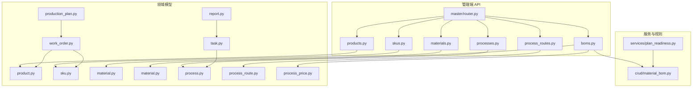
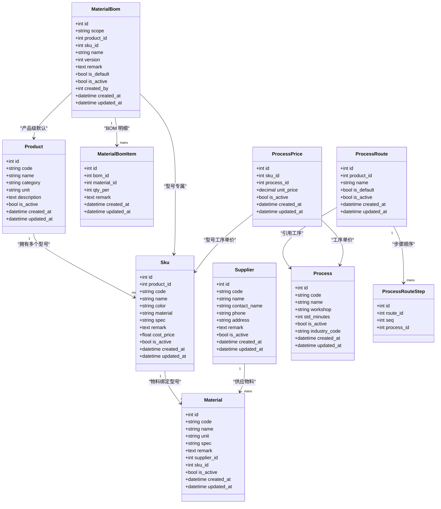
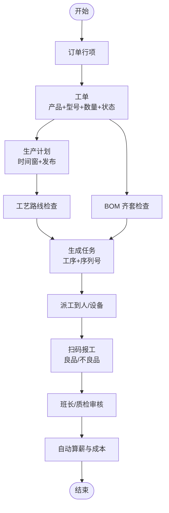
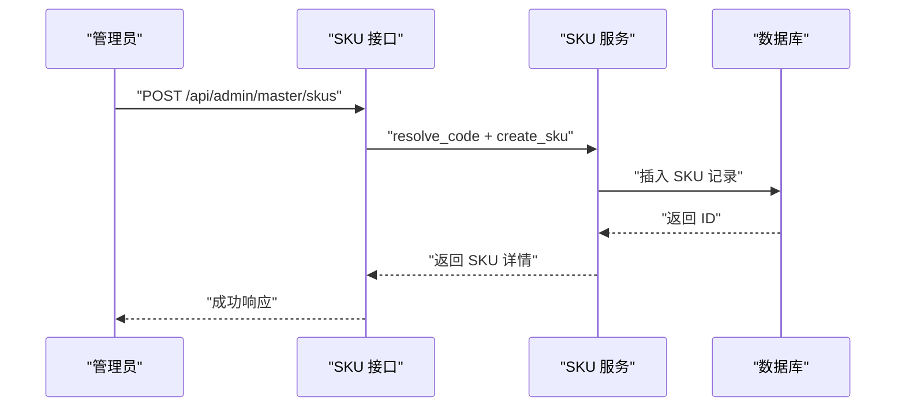
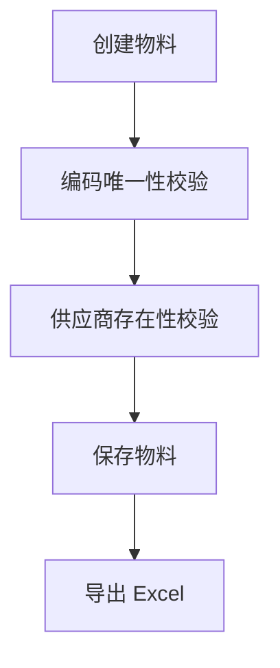
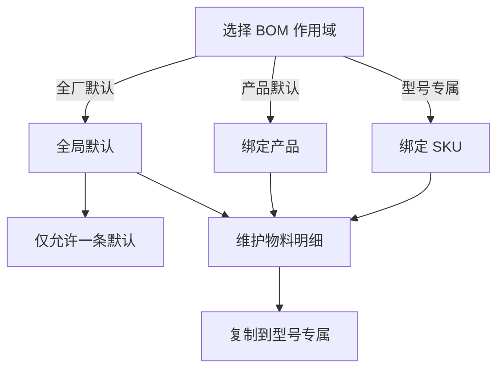
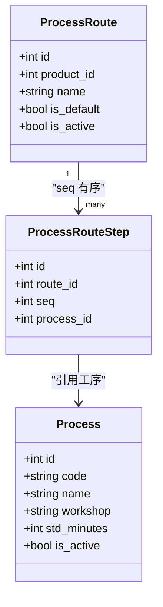
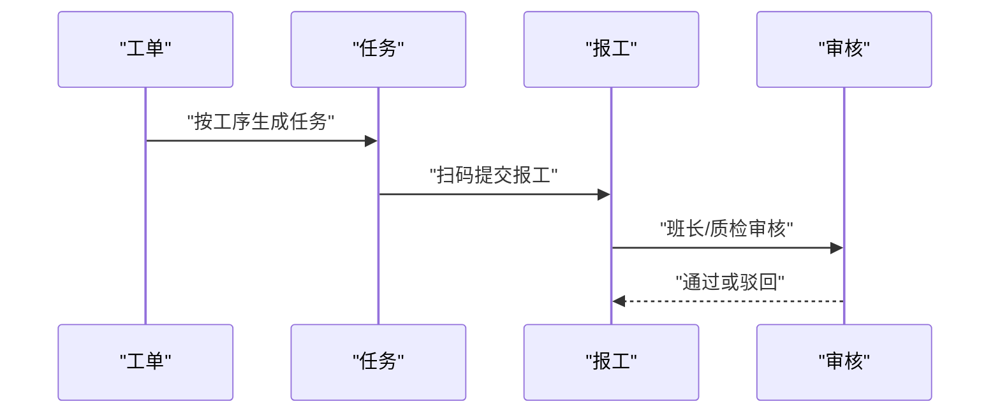
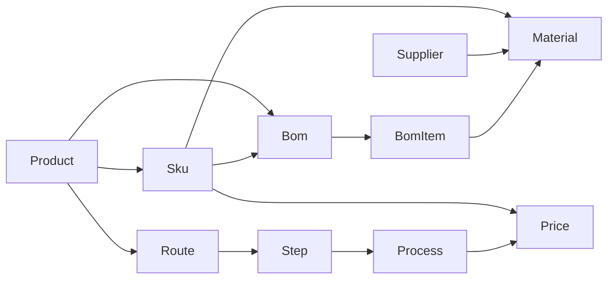

# 基础数据（物料·BOM·工序·工艺路线·产品 SKU）

<cite>
**本文引用的文件**   
- [material.py](file://backend/app/models/material.py)
- [product.py](file://backend/app/models/product.py)
- [sku.py](file://backend/app/models/sku.py)
- [process.py](file://backend/app/models/process.py)
- [process_route.py](file://backend/app/models/process_route.py)
- [work_order.py](file://backend/app/models/work_order.py)
- [production_plan.py](file://backend/app/models/production_plan.py)
- [task.py](file://backend/app/models/task.py)
- [report.py](file://backend/app/models/report.py)
- [process_price.py](file://backend/app/models/process_price.py)
- [router.py](file://backend/app/api/admin/master/router.py)
- [products.py](file://backend/app/api/admin/master/products.py)
- [skus.py](file://backend/app/api/admin/master/skus.py)
- [materials.py](file://backend/app/api/admin/master/materials.py)
- [boms.py](file://backend/app/api/admin/master/boms.py)
- [processes.py](file://backend/app/api/admin/master/processes.py)
- [process_routes.py](file://backend/app/api/admin/master/process_routes.py)
- [material_bom.py](file://backend/app/crud/material_bom.py)
- [plan_readiness.py](file://backend/app/services/plan_readiness.py)
</cite>

## 目录
1. [引言](#引言)
2. [项目结构定位](#项目结构定位)
3. [核心主数据模型](#核心主数据模型)
4. [架构总览：主数据如何支撑工单·排产·报工](#架构总览主数据如何支撑工单排产报工)
5. [详细组件分析](#详细组件分析)
6. [依赖关系分析](#依赖关系分析)
7. [性能与一致性要点](#性能与一致性要点)
8. [常见问题排查](#常见问题排查)
9. [结论](#结论)

## 引言
本文件聚焦 CenkorMES 的主数据建模，说明“产品 → 型号 SKU → 物料 → BOM → 工序 → 工艺路线 → 工序工价”这一基础数据体系，如何为“订单 → 工单 → 生产计划 → 任务派工 → 扫码报工 → 审核算薪”提供稳定支撑。文档面向后端开发、实施顾问与生产业务骨干，既给出代码级实体关系，也给出面向业务的流程解释。

## 项目结构定位
主数据相关能力集中在后端 FastAPI 的 admin API 层与领域模型层：
- 模型定义位于 `app/models`，包括产品、SKU、物料、BOM、工序、工艺路线、工序工价、工单、计划、任务、报工等。
- 管理端接口聚合在 `app/api/admin/master/router.py`，按产品、SKU、物料、供应商、BOM、工序、工艺路线、工序工价分组。
- 业务校验与组合逻辑分布在 `app/crud` 与 `app/services`，例如 BOM 作用域解析、投产前就绪检查等。

**图示来源**  
- [router.py:1-24](file://backend/app/api/admin/master/router.py#L1-L24)  
- [products.py:1-121](file://backend/app/api/admin/master/products.py#L1-L121)  
- [skus.py:1-389](file://backend/app/api/admin/master/skus.py#L1-L389)  
- [materials.py:1-146](file://backend/app/api/admin/master/materials.py#L1-L146)  
- [boms.py:1-338](file://backend/app/api/admin/master/boms.py#L1-L338)  
- [process_routes.py:1-120](file://backend/app/api/admin/master/process_routes.py#L1-L120)  
- [processes.py:1-155](file://backend/app/api/admin/master/processes.py#L1-L155)  
- [product.py:1-29](file://backend/app/models/product.py#L1-L29)  
- [sku.py:1-34](file://backend/app/models/sku.py#L1-L34)  
- [material.py:1-110](file://backend/app/models/material.py#L1-L110)  
- [process.py:1-29](file://backend/app/models/process.py#L1-L29)  
- [process_route.py:1-42](file://backend/app/models/process_route.py#L1-L42)  
- [process_price.py:1-28](file://backend/app/models/process_price.py#L1-L28)  
- [work_order.py:1-39](file://backend/app/models/work_order.py#L1-L39)  
- [production_plan.py:1-30](file://backend/app/models/production_plan.py#L1-L30)  
- [task.py:1-39](file://backend/app/models/task.py#L1-L39)  
- [report.py:1-53](file://backend/app/models/report.py#L1-L53)  
- [material_bom.py:218-272](file://backend/app/crud/material_bom.py#L218-L272)  
- [plan_readiness.py:1-217](file://backend/app/services/plan_readiness.py#L1-L217)

**章节来源**  
- [router.py:1-24](file://backend/app/api/admin/master/router.py#L1-L24)

## 核心主数据模型
本节从数据库模型角度梳理主数据实体及其关系，重点说明“产品—SKU—物料—BOM—工序—工艺路线—工序工价”的建模意图。

**图示来源**  
- [product.py:11-29](file://backend/app/models/product.py#L11-L29)  
- [sku.py:11-34](file://backend/app/models/sku.py#L11-L34)  
- [material.py:11-110](file://backend/app/models/material.py#L11-L110)  
- [process.py:11-29](file://backend/app/models/process.py#L11-L29)  
- [process_route.py:11-42](file://backend/app/models/process_route.py#L11-L42)  
- [process_price.py:12-28](file://backend/app/models/process_price.py#L12-L28)

### 关键设计要点
- 产品是分类维度，SKU 是实际可销售/可生产的型号，二者通过外键关联。
- 物料通过 `sku_id` 与 SKU 绑定，同时可选绑定供应商；这使物料既能作为通用资源，也能体现型号差异。
- BOM 支持三种作用域：型号专属、产品默认、全厂默认，并通过版本与启用状态控制生效策略。
- 工序是标准作业单元，工艺路线将工序按顺序组织到产品上，并允许设置默认路线。
- 工序工价以“型号 × 工序”为单位，支撑计件工资与成本核算。

**章节来源**  
- [product.py:11-29](file://backend/app/models/product.py#L11-L29)  
- [sku.py:11-34](file://backend/app/models/sku.py#L11-L34)  
- [material.py:31-110](file://backend/app/models/material.py#L31-L110)  
- [process.py:11-29](file://backend/app/models/process.py#L11-L29)  
- [process_route.py:11-42](file://backend/app/models/process_route.py#L11-L42)  
- [process_price.py:12-28](file://backend/app/models/process_price.py#L12-L28)

## 架构总览：主数据如何支撑工单·排产·报工
主数据不是孤立存在，而是贯穿订单执行全流程：
- 工单绑定产品与 SKU，承载数量、状态与工时统计。
- 生产计划绑定订单，用于排程时间窗与发布记录。
- 任务由工单拆分而来，绑定工序与序列号，形成派工与扫码报工的最小单位。
- 报工记录绑定任务，记录良品/不良品数量与审核流水。
- BOM 与工艺路线决定“用什么料、走哪些工序”，工序工价决定“计件多少钱”。

**图示来源**  
- [work_order.py:11-39](file://backend/app/models/work_order.py#L11-L39)  
- [production_plan.py:11-30](file://backend/app/models/production_plan.py#L11-L30)  
- [task.py:11-39](file://backend/app/models/task.py#L11-L39)  
- [report.py:11-53](file://backend/app/models/report.py#L11-L53)  
- [material.py:63-110](file://backend/app/models/material.py#L63-L110)  
- [process_route.py:11-42](file://backend/app/models/process_route.py#L11-L42)  
- [process_price.py:12-28](file://backend/app/models/process_price.py#L12-L28)

**章节来源**  
- [work_order.py:11-39](file://backend/app/models/work_order.py#L11-L39)  
- [production_plan.py:11-30](file://backend/app/models/production_plan.py#L11-L30)  
- [task.py:11-39](file://backend/app/models/task.py#L11-L39)  
- [report.py:11-53](file://backend/app/models/report.py#L11-L53)

## 详细组件分析

### 产品与型号 SKU
- 产品提供分类、单位、描述等基础信息，SKU 在此基础上增加颜色、材质、规格、成本价格等型号级属性。
- SKU 接口支持批量创建、Excel 导入、导出，以及结合产品默认工艺路线的批量模板查询。
- SKU 与工序工价建立一对多关系，便于后续计件工资计算。

**图示来源**  
- [skus.py:109-135](file://backend/app/api/admin/master/skus.py#L109-L135)  
- [sku.py:11-34](file://backend/app/models/sku.py#L11-L34)

**章节来源**  
- [product.py:11-29](file://backend/app/models/product.py#L11-L29)  
- [sku.py:11-34](file://backend/app/models/sku.py#L11-L34)  
- [skus.py:109-135](file://backend/app/api/admin/master/skus.py#L109-L135)

### 物料与供应商
- 物料编码唯一，名称必填，支持单位、规格、备注。
- 物料可选择绑定供应商，同时绑定一个 SKU，体现“该物料用于哪个型号或作为通用物料”。
- 物料接口提供增删改查、导出 Excel，并在创建/更新时进行编码重复校验与供应商存在性校验。

**图示来源**  
- [materials.py:67-95](file://backend/app/api/admin/master/materials.py#L67-L95)  
- [materials.py:106-135](file://backend/app/api/admin/master/materials.py#L106-L135)  
- [material.py:31-56](file://backend/app/models/material.py#L31-L56)

**章节来源**  
- [material.py:11-56](file://backend/app/models/material.py#L11-L56)  
- [materials.py:67-135](file://backend/app/api/admin/master/materials.py#L67-L135)

### BOM：作用域与生效策略
- BOM 支持三种作用域：型号专属、产品默认、全厂默认。
- 全厂默认仅允许一条启用且为默认；复制功能可将产品默认或全厂默认 BOM 复制到某型号专属。
- CRUD 层对作用域、默认标志、版本、激活状态进行约束，确保 BOM 生效策略一致。

**图示来源**  
- [material.py:58-110](file://backend/app/models/material.py#L58-L110)  
- [boms.py:232-267](file://backend/app/api/admin/master/boms.py#L232-L267)  
- [material_bom.py:218-272](file://backend/app/crud/material_bom.py#L218-L272)

**章节来源**  
- [material.py:58-110](file://backend/app/models/material.py#L58-L110)  
- [boms.py:114-229](file://backend/app/api/admin/master/boms.py#L114-L229)  
- [boms.py:232-338](file://backend/app/api/admin/master/boms.py#L232-L338)  
- [material_bom.py:218-272](file://backend/app/crud/material_bom.py#L218-L272)

### 工序与工艺路线
- 工序是标准作业单元，包含车间、标准工时、行业分类等。
- 工艺路线将工序按顺序组织到产品上，支持多条路线并指定默认路线。
- 工艺路线步骤序号唯一，且步骤中的工序必须存在。

**图示来源**  
- [process.py:11-29](file://backend/app/models/process.py#L11-L29)  
- [process_route.py:11-42](file://backend/app/models/process_route.py#L11-L42)

**章节来源**  
- [process.py:11-29](file://backend/app/models/process.py#L11-L29)  
- [process_routes.py:40-87](file://backend/app/api/admin/master/process_routes.py#L40-L87)  
- [processes.py:66-85](file://backend/app/api/admin/master/processes.py#L66-L85)

### 工序工价
- 工序工价以“型号 × 工序”为单位，保证不同型号在同一工序上的计件单价可以不同。
- 该表与 SKU、Process 均建立外键关系，是计件工资与成本核算的基础。

**章节来源**  
- [process_price.py:12-28](file://backend/app/models/process_price.py#L12-L28)  
- [skus.py:160-188](file://backend/app/api/admin/master/skus.py#L160-L188)

### 主数据对工单·排产·报工的支撑关系

#### 工单
- 工单绑定订单行项、产品、SKU，承载数量、状态、标准工时与实际工时。
- 工单下挂任务与工单件次，任务再驱动报工。

**章节来源**  
- [work_order.py:11-39](file://backend/app/models/work_order.py#L11-L39)

#### 生产计划
- 生产计划绑定订单，记录计划编号、状态、起止日期、工作日、发布人与发布时间。
- 计划发布后，系统会基于主数据进行齐套与工艺检查。

**章节来源**  
- [production_plan.py:11-30](file://backend/app/models/production_plan.py#L11-L30)  
- [plan_readiness.py:1-217](file://backend/app/services/plan_readiness.py#L1-L217)

#### 任务与报工
- 任务由工单拆分，绑定工序与序列号，并可指派人员与设备。
- 报工记录绑定任务，记录良品/不良品数量、附件、状态与审核流水。

**图示来源**  
- [task.py:11-39](file://backend/app/models/task.py#L11-L39)  
- [report.py:11-53](file://backend/app/models/report.py#L11-L53)

**章节来源**  
- [task.py:11-39](file://backend/app/models/task.py#L11-L39)  
- [report.py:11-53](file://backend/app/models/report.py#L11-L53)

## 依赖关系分析
主数据之间的耦合关系如下：
- 产品与 SKU 强耦合：SKU 必须属于某个产品。
- 物料与 SKU 弱耦合：物料通过 `sku_id` 指向 SKU，但也可作为通用物料使用。
- BOM 与物料、产品、SKU 多重耦合：BOM 明细引用物料，BOM 本身可作用于产品或 SKU。
- 工艺路线与工序解耦：工艺路线只引用工序 ID，不直接存储工序信息。
- 工序工价与 SKU、工序双重耦合：计件工资与成本核算依赖该关系。

**图示来源**  
- [product.py:11-29](file://backend/app/models/product.py#L11-L29)  
- [sku.py:11-34](file://backend/app/models/sku.py#L11-L34)  
- [material.py:31-110](file://backend/app/models/material.py#L31-L110)  
- [process_route.py:11-42](file://backend/app/models/process_route.py#L11-L42)  
- [process_price.py:12-28](file://backend/app/models/process_price.py#L12-L28)

**章节来源**  
- [material.py:31-110](file://backend/app/models/material.py#L31-L110)  
- [process_route.py:11-42](file://backend/app/models/process_route.py#L11-L42)  
- [process_price.py:12-28](file://backend/app/models/process_price.py#L12-L28)

## 性能与一致性要点
- 列表接口避免加载过多关联数据，例如 BOM 列表接口不加载明细，防止 N+1 查询。
- 编码统一通过 `code_generator` 生成与校验，避免重复编码导致的数据不一致。
- BOM 作用域与默认标志在 CRUD 层强制校验，防止多条全厂默认冲突。
- 工艺路线步骤序号唯一，且步骤中的工序必须存在，保证路线有效性。
- 投产前就绪检查在服务层集中处理齐套、工艺路线与工序工价缺失问题，减少前端判断复杂度。

**章节来源**  
- [boms.py:42-66](file://backend/app/api/admin/master/boms.py#L42-L66)  
- [boms.py:104-111](file://backend/app/api/admin/master/boms.py#L104-L111)  
- [process_routes.py:40-51](file://backend/app/api/admin/master/process_routes.py#L40-L51)  
- [material_bom.py:218-272](file://backend/app/crud/material_bom.py#L218-L272)  
- [plan_readiness.py:194-217](file://backend/app/services/plan_readiness.py#L194-L217)

## 常见问题排查
- 型号未配置 BOM：在投产前就绪检查中会被提示，需配置型号专属、产品默认或全厂默认 BOM。
- 物料缺料：齐套检查会统计缺料项，需补充库存或调整 BOM。
- 产品未配置默认工艺路线：计划发布前会提示，需为产品配置默认工艺路线。
- 型号工序工价缺失：计件工资与成本核算需要该数据，需在工序工价中补齐。
- BOM 表结构未升级：若出现列不存在错误，需执行 Alembic 迁移。

**章节来源**  
- [plan_readiness.py:194-217](file://backend/app/services/plan_readiness.py#L194-L217)  
- [boms.py:104-111](file://backend/app/api/admin/master/boms.py#L104-L111)

## 结论
CenkorMES 的主数据建模以“产品—SKU—物料—BOM—工序—工艺路线—工序工价”为核心，通过明确的作用域、版本与默认策略，为工单、排产与报工提供稳定、可追溯的数据基础。实施时应优先完成产品与 SKU、物料与 BOM、工序与工艺路线、工序工价的初始化，再进入订单执行与报工环节，以确保生产计划可发布、任务可派工、报工可审核、薪资可计算。