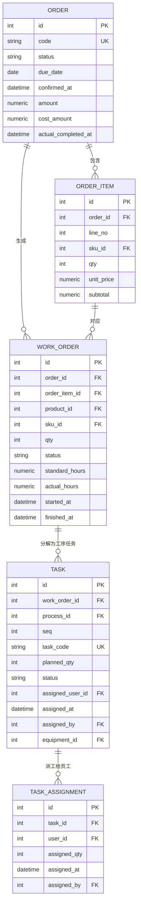
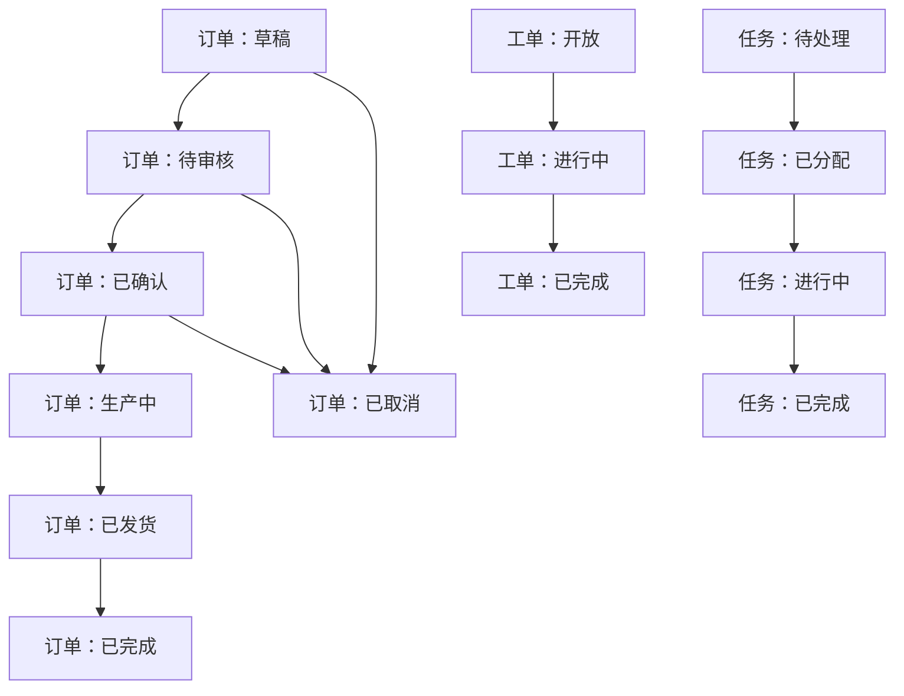
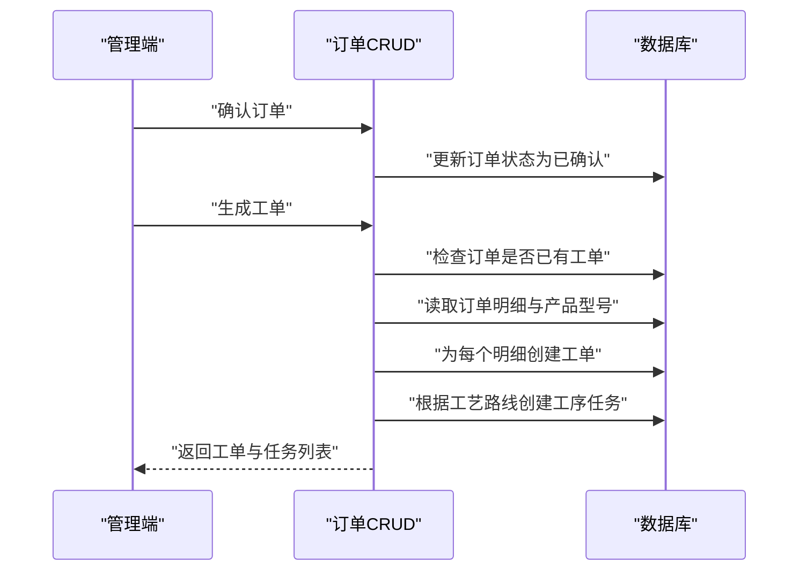
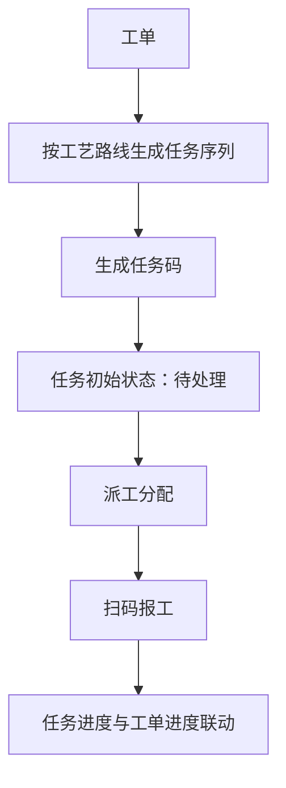
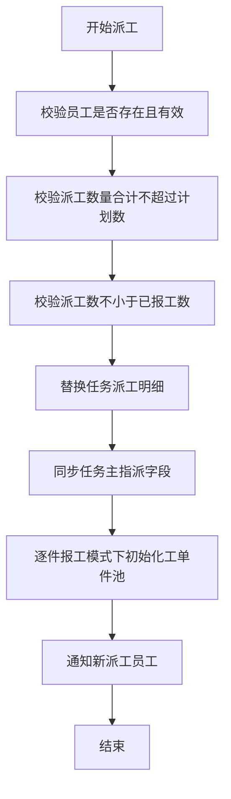
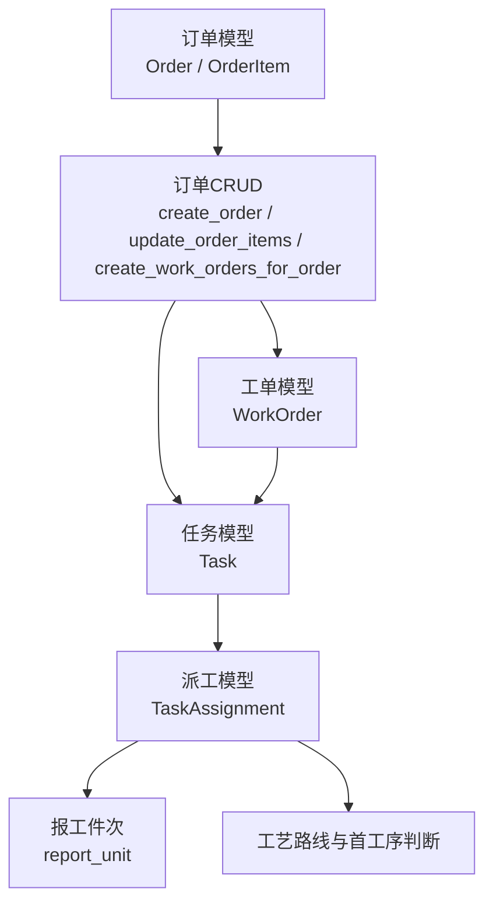

# 工单·派工与生产任务

<cite>
**本文引用的文件**   
- [order.py](file://backend/app/models/order.py)
- [work_order.py](file://backend/app/models/work_order.py)
- [task.py](file://backend/app/models/task.py)
- [task_assignment.py](file://backend/app/models/task_assignment.py)
- [order.py](file://backend/app/crud/order.py)
- [work_order.py](file://backend/app/crud/work_order.py)
- [task.py](file://backend/app/crud/task.py)
- [task_assignment.py](file://backend/app/crud/task_assignment.py)
- [production.ts](file://frontend-admin-pro/src/api/production.ts)
- [index.vue](file://lightmes-miniapp/src/pages-employee/task/detail/index.vue)
</cite>

## 目录
1. [引言](#引言)
2. [项目结构定位](#项目结构定位)
3. [核心实体与关联模型](#核心实体与关联模型)
4. [状态流转总览](#状态流转总览)
5. [订单到工单的生成逻辑](#订单到工单的生成逻辑)
6. [工单到任务的派驻逻辑](#工单到任务的派驻逻辑)
7. [任务到派工的分配逻辑](#任务到派工的分配逻辑)
8. [前端展示与报工入口](#前端展示与报工入口)
9. [依赖关系分析](#依赖关系分析)
10. [性能与一致性要点](#性能与一致性要点)
11. [常见问题排查](#常见问题排查)
12. [结论](#结论)

## 引言
本文聚焦 CenkorMES 中“订单 → 工单 → 任务派驻 → 派工”的主干业务链，目标是帮助开发者快速理解：
- 订单明细如何驱动工单与工序任务；
- 工单、任务、派工三者的数据关联；
- 各阶段的状态字段、约束条件与变更边界；
- 前端管理端与员工端在任务与派工中的交互点。

该链路是 MES 制造执行闭环的核心：从销售订单出发，落到可执行的工序任务，再分配到具体员工，最终通过扫码报工、审核与算薪形成完整追溯。

## 项目结构定位
后端按分层组织：
- `app/models`：数据库模型定义，承载订单、工单、任务、派工等实体；
- `app/crud`：领域操作层，封装订单、工单、任务、派工的创建、更新、校验与联动逻辑；
- `frontend-admin-pro`：PC 管理端，负责订单、工单、任务、派工的管理界面；
- `lightmes-miniapp`：员工端 H5/小程序，用于查看任务、扫码报工。

本主题涉及的后端代码集中在 `models` 与 `crud` 两个层次，前端则主要使用 `production.ts` 类型定义与员工端任务详情页。

**章节来源**
- [order.py:11-66](file://backend/app/models/order.py#L11-L66)
- [work_order.py:11-38](file://backend/app/models/work_order.py#L11-L38)
- [task.py:11-38](file://backend/app/models/task.py#L11-L38)
- [task_assignment.py:11-28](file://backend/app/models/task_assignment.py#L11-L28)

## 核心实体与关联模型
本节梳理四类核心实体及其关联方向。

**图表来源**
- [order.py:11-66](file://backend/app/models/order.py#L11-L66)
- [work_order.py:11-38](file://backend/app/models/work_order.py#L11-L38)
- [task.py:11-38](file://backend/app/models/task.py#L11-L38)
- [task_assignment.py:11-28](file://backend/app/models/task_assignment.py#L11-L28)

### 关键设计要点
- **订单与订单明细**：`Order` 通过 `OrderItem` 表达客户订购的 SKU 与数量；`OrderItem` 同时被 `WorkOrder` 引用，体现“一个订单行可能对应一个工单”。
- **工单**：`WorkOrder` 绑定订单、订单行、产品、SKU 与计划数量，并维护工单级进度字段（标准工时、实际工时、开工/完工时间）。
- **任务**：`Task` 表示工单对应的工序步骤，由工艺路线决定；每个任务有唯一任务码、计划数量、当前状态及可选设备。
- **派工**：`TaskAssignment` 将任务数量拆分到具体员工，支持多人派工同一任务，且每人有独立派工数量与报工统计。

**章节来源**
- [order.py:11-66](file://backend/app/models/order.py#L11-L66)
- [work_order.py:11-38](file://backend/app/models/work_order.py#L11-L38)
- [task.py:11-38](file://backend/app/models/task.py#L11-L38)
- [task_assignment.py:11-28](file://backend/app/models/task_assignment.py#L11-L28)

## 状态流转总览
订单、工单、任务各自维护 `status` 字段，但职责不同：
- **订单状态**：反映商务与计划生命周期，如草稿、待审核、已确认、生产中、发货、完成、取消等；
- **工单状态**：反映制造执行生命周期，如开放、进行中、完成等；
- **任务状态**：反映工序执行生命周期，如待处理、已分配、进行中、完成等；
- **派工记录**：本身没有全局状态字段，而是通过派工数量、已报数量、剩余数量以及是否已有报工件次来体现执行进度与可修改性。

说明：
- 订单状态由订单 CRUD 层控制，包括提交审核、驳回、确认等；
- 工单状态由工单与任务执行进度共同影响；
- 任务状态由任务分配、报工与流程策略影响；
- 派工记录通过数量约束与报工限制参与任务进度计算。

**章节来源**
- [order.py:22-33](file://backend/app/models/order.py#L22-L33)
- [work_order.py:21-28](file://backend/app/models/work_order.py#L21-L28)
- [task.py:20-28](file://backend/app/models/task.py#L20-L28)
- [exec_dashboard.py:376-383](file://backend/app/crud/exec_dashboard.py#L376-L383)

## 订单到工单的生成逻辑
订单不是直接变成工单，而是先经过“订单明细 → 工单 → 工序任务”的生成过程。

### 触发时机
- 当订单处于“已确认”或“生产中”时，可以调用生成工单接口；
- 如果订单尚未存在工单，系统会为每个订单明细创建一个工单；
- 每个工单会根据产品的默认工艺路线，自动生成多个工序任务。

### 生成规则
- 工单数量等于订单明细数量；
- 工单的计划数量继承自订单明细数量；
- 每个工序任务的任务码按全局序列生成，避免重复；
- 任务初始状态为“待处理”，计划数量与工单一致。

**图表来源**
- [order.py:381-411](file://backend/app/crud/order.py#L381-L411)
- [order.py:224-255](file://backend/app/crud/order.py#L224-L255)

### 关键约束
- 订单必须存在明细才能确认；
- 订单已存在工单时不可重复生成；
- 订单明细新增或修改时，若订单已下发投产，会受生产锁定保护；
- 订单明细变更后，系统会同步更新对应工单与任务的计划数量。

**章节来源**
- [order.py:381-411](file://backend/app/crud/order.py#L381-L411)
- [order.py:224-255](file://backend/app/crud/order.py#L224-L255)
- [order.py:258-267](file://backend/app/crud/order.py#L258-L267)
- [order.py:290-360](file://backend/app/crud/order.py#L290-L360)

## 工单到任务的派驻逻辑
工单是“制造执行单元”，任务是“工序执行单元”。一个工单通常对应多个任务，每个任务代表一道工序。

### 任务属性
- 任务码：全局唯一，便于扫码追踪；
- 工序编号：来自工艺路线顺序；
- 计划数量：继承自工单数量；
- 状态：待处理、已分配、进行中、完成等；
- 指派员工：任务级主指派字段，用于兼容历史逻辑；
- 设备：可选绑定设备。

### 任务与工单的关系
- 工单删除时，其任务级联删除；
- 任务通过 `work_order_id` 反向关联工单；
- 工单详情查询时可加载任务列表，并按工序序号排序。

**图表来源**
- [work_order.py:33-38](file://backend/app/models/work_order.py#L33-L38)
- [task.py:15-38](file://backend/app/models/task.py#L15-L38)
- [order.py:224-255](file://backend/app/crud/order.py#L224-L255)

**章节来源**
- [work_order.py:33-38](file://backend/app/models/work_order.py#L33-L38)
- [task.py:15-38](file://backend/app/models/task.py#L15-L38)
- [work_order.py:11-15](file://backend/app/crud/work_order.py#L11-L15)

## 任务到派工的分配逻辑
派工是“把任务数量分给具体员工”的操作。任务本身可以有主指派员工，但真正执行粒度落在派工明细上。

### 派工模型
- 每个派工记录绑定一个任务和一个员工；
- 派工数量必须大于零；
- 同一任务下同一员工只能有一条派工记录；
- 派工数量合计不能超过任务计划数量；
- 派工数量不能小于该员工已报工数量；
- 若派工记录已有非草稿报工件次，则不能删除。

### 派工流程

**图表来源**
- [task_assignment.py:197-289](file://backend/app/crud/task_assignment.py#L197-L289)
- [task_assignment.py:292-308](file://backend/app/crud/task_assignment.py#L292-L308)
- [task_assignment.py:311-316](file://backend/app/crud/task_assignment.py#L311-L316)

### 派工与报工的关系
- 派工数量是报工上限；
- 报工数量超过派工数量会被拒绝；
- 派工删除前需检查是否有报工件次；
- 派工完成后，任务主指派字段会同步第一条派工记录的信息，保持向后兼容。

**章节来源**
- [task_assignment.py:197-289](file://backend/app/crud/task_assignment.py#L197-L289)
- [task_assignment.py:292-308](file://backend/app/crud/task_assignment.py#L292-L308)
- [task_assignment.py:178-194](file://backend/app/crud/task_assignment.py#L178-L194)
- [task_assignment.py:110-121](file://backend/app/crud/task_assignment.py#L110-L121)

## 前端展示与报工入口
### 管理端
管理端通过 `production.ts` 暴露工单、任务、派工的数据类型，例如：
- `WorkOrderOut`：工单基础信息；
- `WorkOrderDetailOut`：工单详情含任务列表；
- `TaskAssignmentOut`：派工明细；
- `DispatchAssignmentOut`：派工分配列表行，包含任务、订单、产品、工序、员工、派工数量、已报数量、剩余数量、进度等。

这些类型反映了后端模型在前端的映射方式，也体现了“订单 → 工单 → 任务 → 派工”的展示维度。

**章节来源**
- [production.ts:616-679](file://frontend-admin-pro/src/api/production.ts#L616-L679)

### 员工端
员工端任务详情页显示：
- 订单号、工序名称；
- 分配数量、已报数量、剩余数量；
- 任务码；
- 工单数量、关联订单、产品型号、产品名称；
- 完成进度条与“开始报工”按钮。

这说明员工端以“任务 + 派工”为核心视角，而不是直接操作订单或工单。

**章节来源**
- [index.vue:13-50](file://lightmes-miniapp/src/pages-employee/task/detail/index.vue#L13-L50)
- [index.vue:54-74](file://lightmes-miniapp/src/pages-employee/task/detail/index.vue#L54-L74)

## 依赖关系分析
从代码依赖角度看，订单到派工的主链路如下：

**图表来源**
- [order.py:11-66](file://backend/app/models/order.py#L11-L66)
- [work_order.py:11-38](file://backend/app/models/work_order.py#L11-L38)
- [task.py:11-38](file://backend/app/models/task.py#L11-L38)
- [task_assignment.py:11-28](file://backend/app/models/task_assignment.py#L11-L28)
- [order.py:224-411](file://backend/app/crud/order.py#L224-L411)
- [task_assignment.py:197-289](file://backend/app/crud/task_assignment.py#L197-L289)

### 耦合与内聚
- 订单 CRUD 与工单、任务模型强耦合，因为订单确认后需要批量生成工单与任务；
- 任务 CRUD 与工单、订单、客户、SKU、工序、用户等模型存在多路关联，主要用于查询与展示；
- 派工 CRUD 与报工、工艺路线、飞书通知等服务存在间接耦合，体现派工不仅是数据写入，还涉及执行反馈；
- 前端类型定义与后端模型基本一一对应，降低前后端契约漂移风险。

**章节来源**
- [order.py:224-411](file://backend/app/crud/order.py#L224-L411)
- [task.py:18-25](file://backend/app/crud/task.py#L18-L25)
- [task_assignment.py:22-35](file://backend/app/crud/task_assignment.py#L22-L35)

## 性能与一致性要点
- **任务码生成**：使用基于任务码数字后缀与最大 ID 的组合策略，避免删除后 ID 回落导致任务码冲突；
- **批量生成工单与任务**：订单确认或新增明细时，按工艺路线批量创建任务，需注意事务边界与数据库压力；
- **派工数量校验**：在替换派工时先汇总校验，再执行删除与新增，减少中间不一致状态；
- **报工上限校验**：报工前校验派工上限，避免超额报工；
- **首次派工件池初始化**：在逐件报工模式且为首工序任务时，初始化工单件池，保证后续报工与追溯能力。

**章节来源**
- [order.py:21-39](file://backend/app/crud/order.py#L21-L39)
- [order.py:224-255](file://backend/app/crud/order.py#L224-L255)
- [task_assignment.py:197-269](file://backend/app/crud/task_assignment.py#L197-L269)
- [task_assignment.py:292-308](file://backend/app/crud/task_assignment.py#L292-L308)

## 常见问题排查
### 订单无法删除
- 订单状态不是草稿；
- 订单已存在工单；
- 订单已关联生产计划。

**章节来源**
- [order.py:87-103](file://backend/app/crud/order.py#L87-L103)

### 订单明细无法修改或删除
- 订单状态不允许修改明细；
- 订单已下发投产，新增明细被禁止；
- 订单行已有派工，删除或更换型号被禁止；
- 订单明细行号重复。

**章节来源**
- [order.py:290-360](file://backend/app/crud/order.py#L290-L360)

### 派工数量异常
- 同一员工重复派工；
- 派工数量合计超过任务计划数；
- 派工数量小于已报工数量；
- 派工记录已有报工件次，不能删除。

**章节来源**
- [task_assignment.py:197-269](file://backend/app/crud/task_assignment.py#L197-L269)
- [task_assignment.py:110-121](file://backend/app/crud/task_assignment.py#L110-L121)

### 报工超出派工上限
- 员工未被派工到该任务；
- 累计报工数量超过派工数量。

**章节来源**
- [task_assignment.py:292-308](file://backend/app/crud/task_assignment.py#L292-L308)

## 结论
CenkorMES 的“订单 → 工单 → 任务派驻 → 派工”链路以模型为锚点、以 CRUD 为执行中枢：
- 订单负责商业需求与计划输入；
- 工单负责制造执行单元；
- 任务负责工序执行单元；
- 派工负责将任务数量落实到具体员工；
- 报工与审核进一步驱动进度、成本与薪资。

在实际开发中，建议优先关注：
- 订单确认与工单生成的事务一致性；
- 任务码与计划数量的唯一性与同步性；
- 派工数量与报工数量的上限约束；
- 前端类型与后端模型的契约一致性。

这样既能保证生产执行的可追溯性，也能在中小型工厂场景中保持系统简洁、可维护。