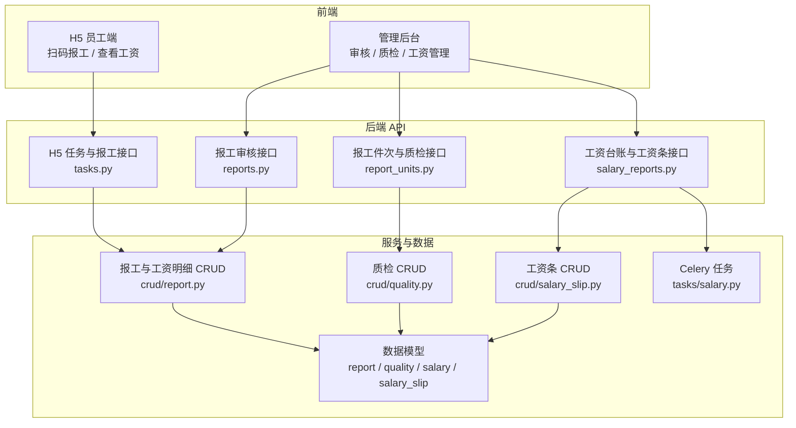
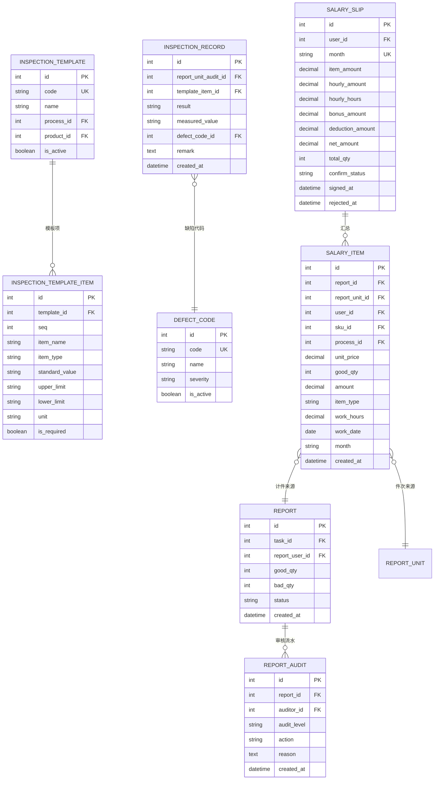
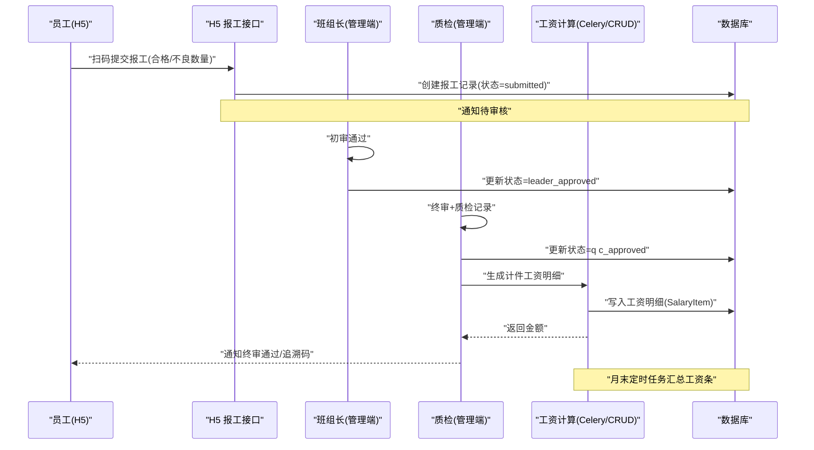
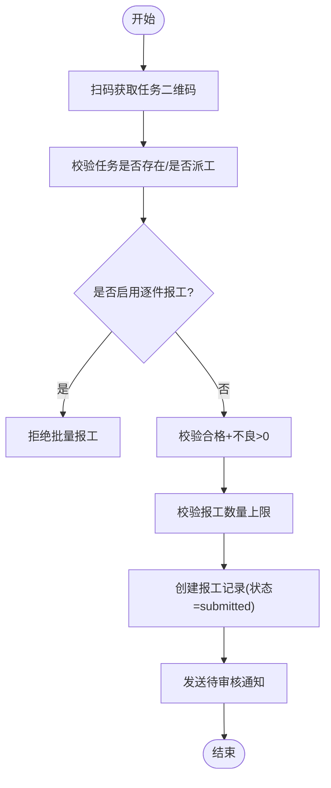
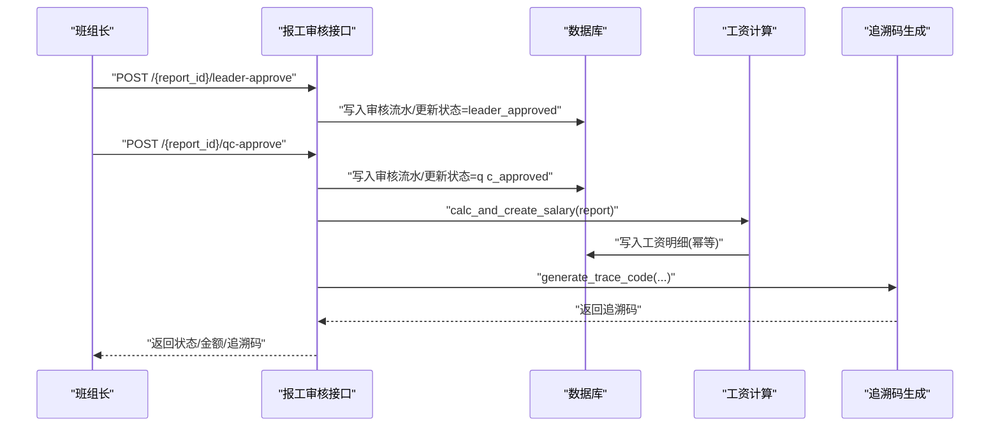
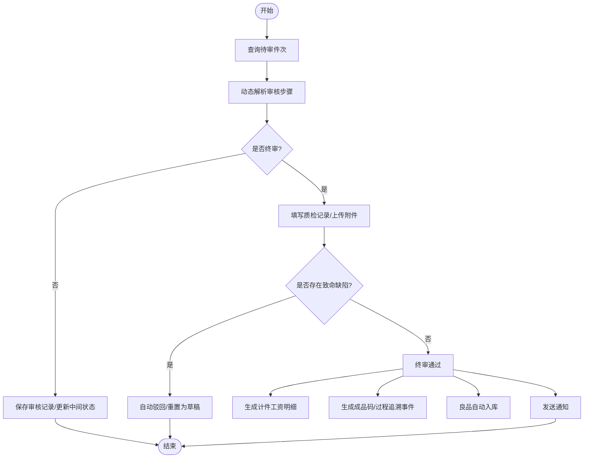
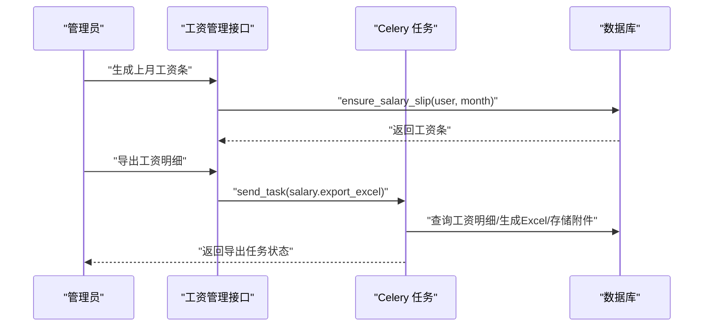
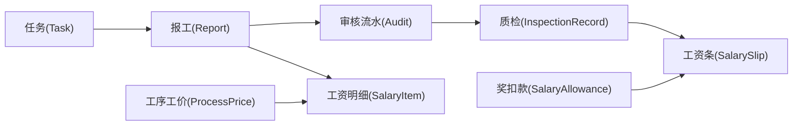

# 报工·质检与自动算薪

<cite>
**本文引用的文件**   
- [backend/app/api/h5/tasks.py](file://backend/app/api/h5/tasks.py)
- [backend/app/api/admin/production/reports.py](file://backend/app/api/admin/production/reports.py)
- [backend/app/api/admin/production/report_units.py](file://backend/app/api/admin/production/report_units.py)
- [backend/app/api/admin/production/salary_reports.py](file://backend/app/api/admin/production/salary_reports.py)
- [backend/app/crud/report.py](file://backend/app/crud/report.py)
- [backend/app/crud/quality.py](file://backend/app/crud/quality.py)
- [backend/app/crud/salary_slip.py](file://backend/app/crud/salary_slip.py)
- [backend/app/models/report.py](file://backend/app/models/report.py)
- [backend/app/models/quality.py](file://backend/app/models/quality.py)
- [backend/app/models/salary.py](file://backend/app/models/salary.py)
- [backend/app/models/salary_slip.py](file://backend/app/models/salary_slip.py)
- [backend/app/tasks/salary.py](file://backend/app/tasks/salary.py)
</cite>

## 目录
1. [引言](#引言)
2. [项目结构与职责边界](#项目结构与职责边界)
3. [核心数据模型](#核心数据模型)
4. [端到端业务流程总览](#端到端业务流程总览)
5. [详细组件分析](#详细组件分析)
6. [依赖关系分析](#依赖关系分析)
7. [性能与并发特性](#性能与并发特性)
8. [故障排查指南](#故障排查指南)
9. [结论](#结论)

## 引言
本文围绕 CenkorMES 的“扫码报工 → 审核 → 质检 → 自动算薪”主链路，梳理从员工扫码提交报工、班组长初审、质检终审、到计件工资明细与月度工资条生成的完整数据流与业务规则。文档同时覆盖批量报工与逐件报工两条路径，并说明质检模板、缺陷代码、追溯码、库存入库等联动动作。

## 项目结构与职责边界
后端采用 FastAPI + SQLAlchemy + Alembic + Celery 分层架构：
- API 层：按多端划分路由，H5 端负责员工报工与个人薪资查询；管理端生产模块负责报工审核、质检、工资台账与工资条管理。
- CRUD 层：封装数据库操作，如报工、质检、工资明细、工资条计算。
- 模型层：定义报工记录、审核流水、质检模板与记录、工资明细与工资条等实体。
- 任务层：Celery 异步任务用于批量补漏计件工资、生成工资条、导出 Excel、计时工资日结与月初汇总。

**图示来源**
- [backend/app/api/h5/tasks.py:193-265](file://backend/app/api/h5/tasks.py#L193-L265)
- [backend/app/api/admin/production/reports.py:132-214](file://backend/app/api/admin/production/reports.py#L132-L214)
- [backend/app/api/admin/production/report_units.py:231-408](file://backend/app/api/admin/production/report_units.py#L231-L408)
- [backend/app/api/admin/production/salary_reports.py:208-351](file://backend/app/api/admin/production/salary_reports.py#L208-L351)
- [backend/app/crud/report.py:18-161](file://backend/app/crud/report.py#L18-L161)
- [backend/app/crud/quality.py:18-159](file://backend/app/crud/quality.py#L18-L159)
- [backend/app/crud/salary_slip.py:20-180](file://backend/app/crud/salary_slip.py#L20-L180)
- [backend/app/tasks/salary.py:31-163](file://backend/app/tasks/salary.py#L31-L163)

**章节来源**
- [backend/app/api/h5/tasks.py:1-343](file://backend/app/api/h5/tasks.py#L1-L343)
- [backend/app/api/admin/production/reports.py:1-333](file://backend/app/api/admin/production/reports.py#L1-L333)
- [backend/app/api/admin/production/report_units.py:1-451](file://backend/app/api/admin/production/report_units.py#L1-L451)
- [backend/app/api/admin/production/salary_reports.py:1-447](file://backend/app/api/admin/production/salary_reports.py#L1-L447)

## 核心数据模型
- 报工记录与审核流水
  - 报工记录：关联任务、报工人、合格数、不良数、附件、状态（submitted → leader_approved → qc_approved / rejected）。
  - 审核流水：记录审核层级（leader / qc）、动作（approve / reject）与原因。
- 质检体系
  - 质检模板与模板项：支持合格/不合格、测量值、文本描述，可绑定工序或产品。
  - 缺陷代码：致命/主要/次要等级。
  - 检测记录：每次 QC 审核逐项填写结果、测量值、缺陷代码与备注。
- 工资明细与工资条
  - 工资明细：计件或计时来源，包含型号、工序、单价、合格数量、金额、月份。
  - 工资条：按月汇总计件、计时、奖金、扣款，得到实发金额，支持签名确认与拒签流程。

**图示来源**
- [backend/app/models/report.py:11-52](file://backend/app/models/report.py#L11-L52)
- [backend/app/models/quality.py:15-123](file://backend/app/models/quality.py#L15-L123)
- [backend/app/models/salary.py:12-46](file://backend/app/models/salary.py#L12-L46)
- [backend/app/models/salary_slip.py:12-41](file://backend/app/models/salary_slip.py#L12-L41)

**章节来源**
- [backend/app/models/report.py:1-53](file://backend/app/models/report.py#L1-L53)
- [backend/app/models/quality.py:1-123](file://backend/app/models/quality.py#L1-L123)
- [backend/app/models/salary.py:1-46](file://backend/app/models/salary.py#L1-L46)
- [backend/app/models/salary_slip.py:1-41](file://backend/app/models/salary_slip.py#L1-L41)

## 端到端业务流程总览
整体流程分为两条主线：
- 批量报工主线：员工扫码提交批量报工 → 班组长初审 → 质检终审 → 自动生成计件工资明细与追溯码 → 月末汇总工资条。
- 逐件报工主线：员工逐件报工 → 动态审批步骤 → 质检逐项检查 → 终审通过后生成计件工资、成品码/过程追溯事件、自动入库。

**图示来源**
- [backend/app/api/h5/tasks.py:193-265](file://backend/app/api/h5/tasks.py#L193-L265)
- [backend/app/api/admin/production/reports.py:132-214](file://backend/app/api/admin/production/reports.py#L132-L214)
- [backend/app/crud/report.py:107-161](file://backend/app/crud/report.py#L107-L161)
- [backend/app/tasks/salary.py:31-117](file://backend/app/tasks/salary.py#L31-L117)

**章节来源**
- [backend/app/api/h5/tasks.py:193-265](file://backend/app/api/h5/tasks.py#L193-L265)
- [backend/app/api/admin/production/reports.py:132-214](file://backend/app/api/admin/production/reports.py#L132-L214)
- [backend/app/crud/report.py:107-161](file://backend/app/crud/report.py#L107-L161)
- [backend/app/tasks/salary.py:31-117](file://backend/app/tasks/salary.py#L31-L117)

## 详细组件分析

### 员工扫码报工（批量报工）
- 入口：H5 端 `/tasks/{task_code}/qr` 获取二维码载荷，员工在报工页面调用 `/reports` 提交报工。
- 校验逻辑：
  - 任务存在且已派工给当前用户。
  - 若启用逐件报工模式，则禁止批量报工。
  - 任务未完成且合格数+不良数大于 0。
  - 报工数量不超过派工限额。
- 结果：创建报工记录，状态为 submitted，并发送待审核通知。

**图示来源**
- [backend/app/api/h5/tasks.py:176-191](file://backend/app/api/h5/tasks.py#L176-L191)
- [backend/app/api/h5/tasks.py:193-265](file://backend/app/api/h5/tasks.py#L193-L265)

**章节来源**
- [backend/app/api/h5/tasks.py:176-265](file://backend/app/api/h5/tasks.py#L176-L265)

### 班组长初审与质检终审（批量报工）
- 初审：将状态由 submitted 更新为 leader_approved，并记录审核流水。
- 终审：将状态更新为 qc_approved，记录审核流水，触发以下联动：
  - 自动生成计件工资明细（幂等保护）。
  - 模具模次累加。
  - 生成追溯码（订单→型号→工序→员工→报工ID）。
  - 发送终审通过通知。

**图示来源**
- [backend/app/api/admin/production/reports.py:132-214](file://backend/app/api/admin/production/reports.py#L132-L214)
- [backend/app/crud/report.py:107-161](file://backend/app/crud/report.py#L107-L161)

**章节来源**
- [backend/app/api/admin/production/reports.py:132-214](file://backend/app/api/admin/production/reports.py#L132-L214)
- [backend/app/crud/report.py:107-161](file://backend/app/crud/report.py#L107-L161)

### 逐件报工与质检流程
- 列表与详情：支持按任务、人员、状态、预检等级筛选，支持高风险优先排序。
- 动态审批步骤：根据配置决定当前审核层级与是否终审。
- 质检记录：终审时必填质检附件，逐项填写检测结果；若存在致命缺陷，自动驳回并重置为草稿。
- 终审通过后的联动：
  - 生成计件工资明细。
  - 良品件次生成成品码或过程追溯事件。
  - 良品自动入库。
  - 模具模次累加。
  - 发送通知。

**图示来源**
- [backend/app/api/admin/production/report_units.py:139-171](file://backend/app/api/admin/production/report_units.py#L139-L171)
- [backend/app/api/admin/production/report_units.py:231-408](file://backend/app/api/admin/production/report_units.py#L231-L408)
- [backend/app/crud/quality.py:133-159](file://backend/app/crud/quality.py#L133-L159)

**章节来源**
- [backend/app/api/admin/production/report_units.py:139-408](file://backend/app/api/admin/production/report_units.py#L139-L408)
- [backend/app/crud/quality.py:133-159](file://backend/app/crud/quality.py#L133-L159)

### 自动算薪与工资条
- 计件工资明细生成：
  - 实时：终审通过后立即生成（幂等保护）。
  - 批量补漏：Celery 任务扫描当月已终审报工，补漏生成缺失的工资明细。
- 工资条汇总：
  - 按月汇总计件工资、计时工资、奖金、扣款，计算实发金额。
  - 支持员工签名确认与管理员拒签重置。
- 导出与提醒：
  - 支持导出工资明细 Excel（异步任务）。
  - 支持批量催签未签名工资条。

**图示来源**
- [backend/app/api/admin/production/salary_reports.py:208-351](file://backend/app/api/admin/production/salary_reports.py#L208-L351)
- [backend/app/tasks/salary.py:175-283](file://backend/app/tasks/salary.py#L175-L283)
- [backend/app/crud/salary_slip.py:76-180](file://backend/app/crud/salary_slip.py#L76-L180)

**章节来源**
- [backend/app/api/admin/production/salary_reports.py:208-351](file://backend/app/api/admin/production/salary_reports.py#L208-L351)
- [backend/app/tasks/salary.py:31-163](file://backend/app/tasks/salary.py#L31-L163)
- [backend/app/crud/salary_slip.py:76-180](file://backend/app/crud/salary_slip.py#L76-L180)

## 依赖关系分析
- 报工与审核依赖任务与派工信息，确保报工归属与数量限制。
- 质检依赖质检模板与缺陷代码，支持按工序匹配模板。
- 工资明细依赖型号与工序的工价配置，确保计件金额正确。
- 工资条依赖工资明细、计时工资与奖扣款，实现综合汇总。

**图示来源**
- [backend/app/models/report.py:11-52](file://backend/app/models/report.py#L11-L52)
- [backend/app/models/quality.py:92-123](file://backend/app/models/quality.py#L92-L123)
- [backend/app/models/salary.py:12-46](file://backend/app/models/salary.py#L12-L46)
- [backend/app/models/salary_slip.py:12-41](file://backend/app/models/salary_slip.py#L12-L41)

**章节来源**
- [backend/app/models/report.py:11-52](file://backend/app/models/report.py#L11-L52)
- [backend/app/models/quality.py:92-123](file://backend/app/models/quality.py#L92-L123)
- [backend/app/models/salary.py:12-46](file://backend/app/models/salary.py#L12-L46)
- [backend/app/models/salary_slip.py:12-41](file://backend/app/models/salary_slip.py#L12-L41)

## 性能与并发特性
- 幂等保护：同一报工仅生成一条工资明细，避免重复终审导致唯一约束冲突。
- 并发安全：使用嵌套事务捕获唯一约束冲突，回滚后返回已存在的工资明细，避免 500。
- 批量处理：Celery 任务批量扫描当月已终审报工，补漏生成工资明细与工资条。
- 分页与过滤：列表接口普遍支持 offset/limit 与多维度过滤，提升大数据量下的查询性能。

**章节来源**
- [backend/app/crud/report.py:121-161](file://backend/app/crud/report.py#L121-L161)
- [backend/app/tasks/salary.py:31-117](file://backend/app/tasks/salary.py#L31-L117)

## 故障排查指南
- 报工被拒绝：
  - 检查任务是否已完成或报工数量超限。
  - 若启用逐件报工模式，需切换到逐件报工页面。
- 审核失败：
  - 确认当前状态允许操作（submitted/leader_approved）。
  - 检查审核流水是否正确记录。
- 质检自动驳回：
  - 检查质检记录中是否存在致命缺陷代码。
  - 确认后重新报工。
- 工资明细缺失：
  - 检查是否缺少工序工价配置。
  - 手动触发批量补漏任务。
- 工资条异常：
  - 检查员工是否已有签名或拒签状态。
  - 管理员可重置确认状态并重新签名。

**章节来源**
- [backend/app/api/h5/tasks.py:211-231](file://backend/app/api/h5/tasks.py#L211-L231)
- [backend/app/api/admin/production/reports.py:217-243](file://backend/app/api/admin/production/reports.py#L217-L243)
- [backend/app/api/admin/production/report_units.py:278-303](file://backend/app/api/admin/production/report_units.py#L278-L303)
- [backend/app/tasks/salary.py:72-85](file://backend/app/tasks/salary.py#L72-L85)
- [backend/app/crud/salary_slip.py:99-158](file://backend/app/crud/salary_slip.py#L99-L158)

## 结论
本系统以“扫码报工 → 审核 → 质检 → 自动算薪”为核心闭环，通过批量报工与逐件报工双路径支撑不同制造场景。审核与质检环节严格的状态机与规则保障数据质量，工资明细与工资条的实时与批量机制确保薪酬计算的准确性与可追溯性。建议在实施中重点关注工序工价配置、质检模板与缺陷代码维护，以及 Celery 任务的运行监控，以保证整条链路的稳定与高效。