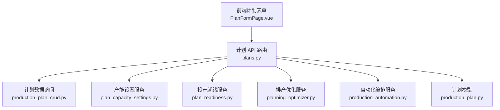
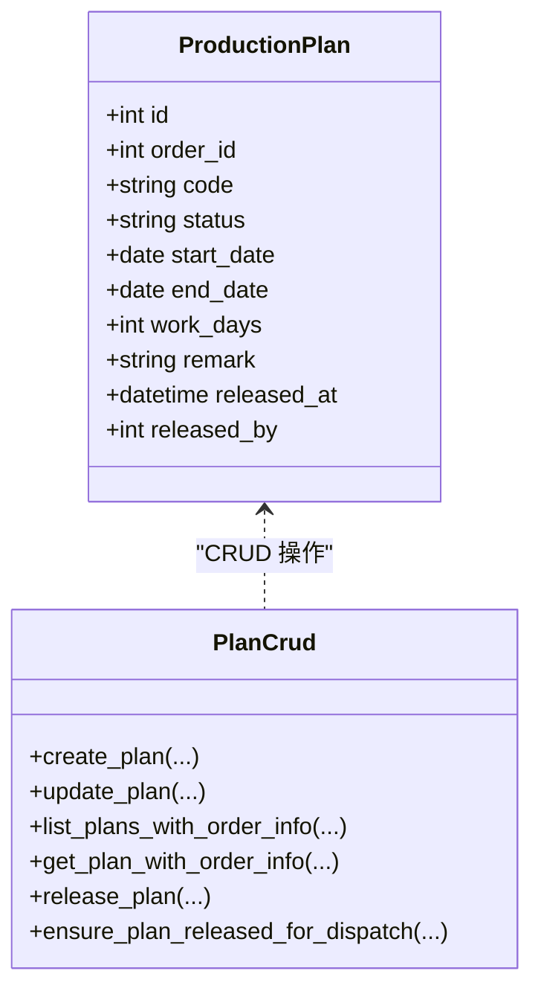
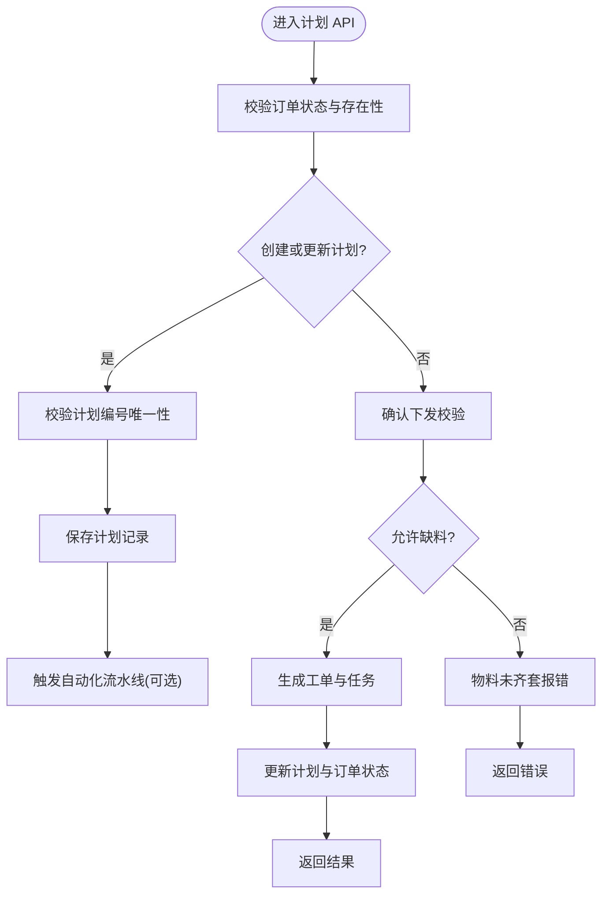
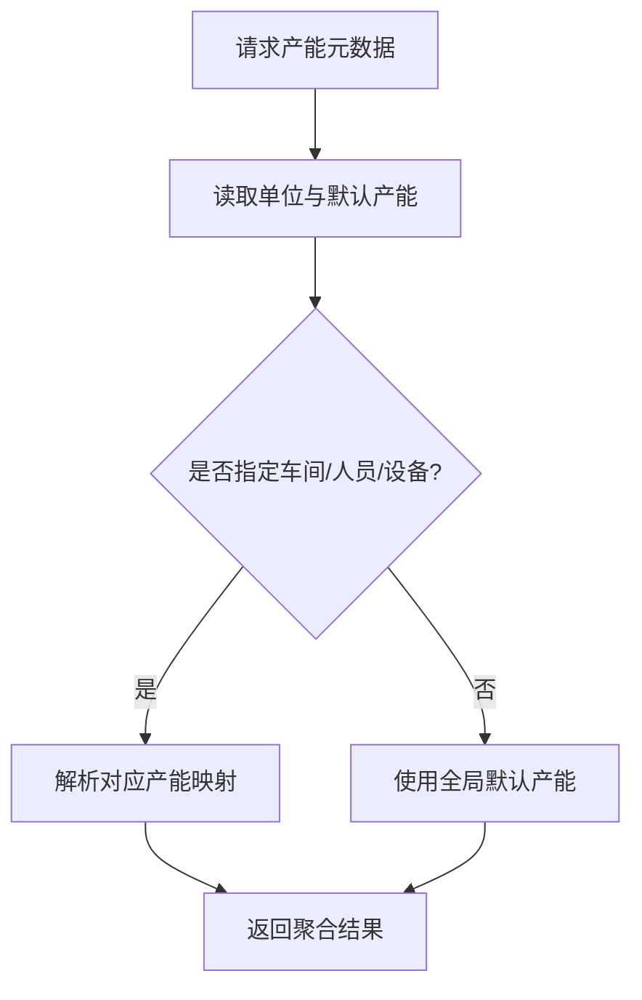
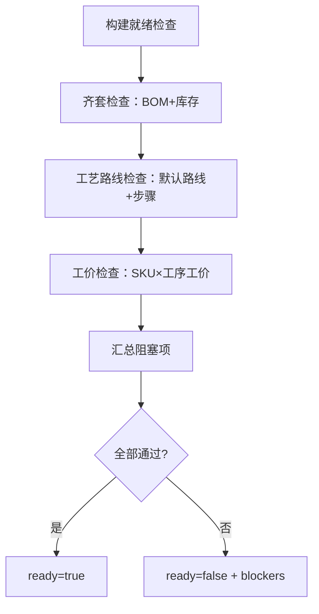
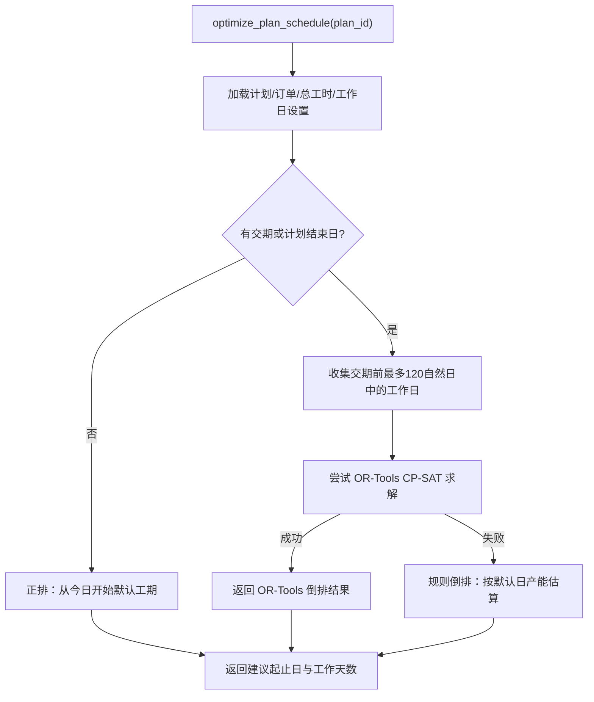
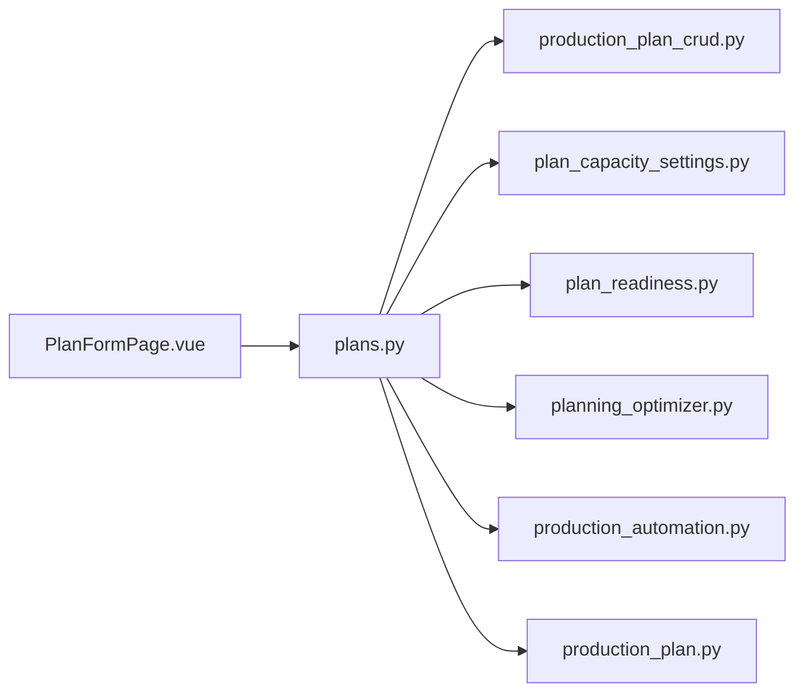

# 排产计划与产能

<cite>
**本文引用的文件**   
- [plans.py](file://backend/app/api/admin/production/plans.py)
- [production_plan.py](file://backend/app/models/production_plan.py)
- [production_plan_crud.py](file://backend/app/crud/production_plan.py)
- [production_plan_schema.py](file://backend/app/schemas/production_plan.py)
- [planning_optimizer.py](file://backend/app/services/planning_optimizer.py)
- [plan_capacity_settings.py](file://backend/app/services/plan_capacity_settings.py)
- [plan_readiness.py](file://backend/app/services/plan_readiness.py)
- [production_automation.py](file://backend/app/services/production_automation.py)
- [PlanFormPage.vue](file://frontend-admin-pro/src/pages/production/PlanFormPage.vue)
</cite>

## 目录
1. [引言](#引言)
2. [项目结构定位](#项目结构定位)
3. [核心组件](#核心组件)
4. [架构总览](#架构总览)
5. [详细组件分析](#详细组件分析)
6. [依赖关系分析](#依赖关系分析)
7. [性能与容量特性](#性能与容量特性)
8. [故障排查指南](#故障排查指南)
9. [结论](#结论)

## 引言
本文聚焦 CenkorMES 中“生产计划”的编制、产能配置与算法能力接入点，重点说明：
- 计划的创建、更新、确认下发与自动派工流程；
- 日产能、日历、车间/人员/设备产能的配置与查询；
- OR-Tools 约束排产与规则回退策略；
- 投产前就绪检查（齐套、工艺路线、工价）；
- 前端计划表单与 AI/算法建议的交互入口。

## 项目结构定位
计划相关代码集中在后端 FastAPI 路由层、领域服务层、数据访问层与模型层，同时在前端管理后台提供计划表单与能力调用入口。



**图表来源**
- [plans.py:1-69](file://backend/app/api/admin/production/plans.py#L1-L69)
- [production_plan.py:11-30](file://backend/app/models/production_plan.py#L11-L30)
- [planning_optimizer.py:104-229](file://backend/app/services/planning_optimizer.py#L104-L229)
- [plan_capacity_settings.py:1-140](file://backend/app/services/plan_capacity_settings.py#L1-L140)
- [plan_readiness.py:176-218](file://backend/app/services/plan_readiness.py#L176-L218)
- [production_automation.py:29-29](file://backend/app/services/production_automation.py#L29-L29)

**章节来源**
- [plans.py:1-69](file://backend/app/api/admin/production/plans.py#L1-L69)
- [production_plan.py:11-30](file://backend/app/models/production_plan.py#L11-L30)

## 核心组件
- 计划模型与数据访问：定义生产计划实体及增删改查、确认下发等逻辑。
- 计划 API：暴露计划列表、创建、更新、确认下发、自动排程、自动派工、产能与日历接口。
- 产能设置服务：统一读取/保存单位、默认产能、按车间/人员/设备的产能映射。
- 投产就绪服务：校验 BOM 齐套、工艺路线与工序工价是否完备。
- 排产优化服务：基于 OR-Tools CP-SAT 或规则倒排/正排，输出建议起止日期与工作日数。
- 自动化编排服务：在计划创建/更新时触发自动化流水线，支持选择 OR-Tools 引擎。
- 前端计划表单：提供计划编辑、自动排程、AI 建议与采纳执行入口。

**章节来源**
- [production_plan.py:11-30](file://backend/app/models/production_plan.py#L11-L30)
- [production_plan_crud.py:95-257](file://backend/app/crud/production_plan.py#L95-L257)
- [plans.py:172-297](file://backend/app/api/admin/production/plans.py#L172-L297)
- [plan_capacity_settings.py:1-140](file://backend/app/services/plan_capacity_settings.py#L1-L140)
- [plan_readiness.py:176-218](file://backend/app/services/plan_readiness.py#L176-L218)
- [planning_optimizer.py:104-229](file://backend/app/services/planning_optimizer.py#L104-L229)
- [production_automation.py:29-29](file://backend/app/services/production_automation.py#L29-L29)
- [PlanFormPage.vue:395-477](file://frontend-admin-pro/src/pages/production/PlanFormPage.vue#L395-L477)

## 架构总览
计划从“订单 → 计划 → 工单/任务 → 报工/算薪”的主链路中承担“时间窗口与资源分配”的关键角色。排产算法以“总工时 + 日历产能”为输入，优先使用 OR-Tools 求解器寻找可行区间，失败则回退到规则计算。

```mermaid
sequenceDiagram
participant FE as "前端计划表单"
participant API as "计划 API"
participant CR as "计划 CRUD"
participant OPT as "排产优化服务"
participant AUT as "自动化编排服务"
participant DB as "数据库"
FE->>API : "POST /plans/{id}/auto-schedule"
API->>CR : "读取计划与订单信息"
API->>OPT : "optimize_plan_schedule(plan_id)"
OPT->>DB : "查询任务工时/日历/设置"
OPT-->>API : "返回建议起止日与工作天数"
API->>CR : "更新计划 start/end/work_days"
API-->>FE : "返回更新后的计划"
Note over FE,AUT : "计划创建/更新可触发自动化流水线"
FE->>API : "POST /plans 或 PUT /plans/{id}"
API->>AUT : "maybe_trigger_plan_automation(...)"
AUT->>OPT : "run_auto_schedule(..., engine=ortools)"
OPT-->>AUT : "OR-Tools 或规则结果"
```

**图表来源**
- [plans.py:906-977](file://backend/app/api/admin/production/plans.py#L906-L977)
- [planning_optimizer.py:104-229](file://backend/app/services/planning_optimizer.py#L104-L229)
- [production_automation.py:147-196](file://backend/app/services/production_automation.py#L147-L196)

## 详细组件分析

### 计划模型与数据访问
- 计划实体包含订单关联、编号、状态、起止日期、工作天数、备注、释放时间与操作人等字段。
- CRUD 提供创建、更新、分页查询、按条件过滤、确认下发与“仅计划态可下发”的校验。
- 确认下发会检查订单状态、物料齐套（可选允许缺料），并生成工单与任务。



**图表来源**
- [production_plan.py:11-30](file://backend/app/models/production_plan.py#L11-L30)
- [production_plan_crud.py:95-257](file://backend/app/crud/production_plan.py#L95-L257)

**章节来源**
- [production_plan.py:11-30](file://backend/app/models/production_plan.py#L11-L30)
- [production_plan_crud.py:95-257](file://backend/app/crud/production_plan.py#L95-L257)

### 计划 API 与业务流程
- 计划列表、详情、创建、更新：校验订单状态、编号唯一性、状态流转限制。
- 确认下发：调用 release_plan，必要时生成工单/任务，更新订单状态。
- 自动排程：根据 mode（backward/forward）与日历工作日用 shift 计算起止日。
- 自动派工：按车间分组、技能匹配、熟练度评分、负载均衡进行任务分配。
- 产能与日历：提供全局/车间/人员/设备产能配置与查询，以及日历工作日与每日产能维护。



**图表来源**
- [plans.py:1262-1383](file://backend/app/api/admin/production/plans.py#L1262-L1383)
- [production_plan_crud.py:193-257](file://backend/app/crud/production_plan.py#L193-L257)

**章节来源**
- [plans.py:1262-1383](file://backend/app/api/admin/production/plans.py#L1262-L1383)
- [production_plan_crud.py:193-257](file://backend/app/crud/production_plan.py#L193-L257)

### 产能与日历配置
- 产能单位：件/天或分钟/天，默认值与历史兼容处理。
- 默认产能：全局默认，支持按车间、人员、设备维度覆盖。
- 日历：工作日开关与每日产能分钟数，用于排产与负荷计算。
- 接口：获取/设置产能单位、默认产能、车间/人员/设备产能映射、日历查询与更新。



**图表来源**
- [plan_capacity_settings.py:23-75](file://backend/app/services/plan_capacity_settings.py#L23-L75)
- [plans.py:172-297](file://backend/app/api/admin/production/plans.py#L172-L297)

**章节来源**
- [plan_capacity_settings.py:1-140](file://backend/app/services/plan_capacity_settings.py#L1-L140)
- [plans.py:172-297](file://backend/app/api/admin/production/plans.py#L172-L297)

### 投产前就绪检查
- 齐套检查：汇总订单 SKU 需求，展开有效 BOM，对比库存得出缺料项。
- 工艺路线与工价：检查产品默认工艺路线是否存在且含步骤，检查型号-工序工价是否有效。
- 阻塞项汇总：BOM 缺失、缺料、工艺路线缺失、工价缺失均作为阻塞提示。



**图表来源**
- [plan_readiness.py:20-75](file://backend/app/services/plan_readiness.py#L20-L75)
- [plan_readiness.py:78-165](file://backend/app/services/plan_readiness.py#L78-L165)
- [plan_readiness.py:176-218](file://backend/app/services/plan_readiness.py#L176-L218)

**章节来源**
- [plan_readiness.py:176-218](file://backend/app/services/plan_readiness.py#L176-L218)

### 排产算法与 OR-Tools 接入点
- 目标：基于订单交期与计划结束日，结合总工时与日历产能，求可行起止日与工作天数。
- 算法路径：
  - 若无可用的订单交期/计划结束日：从今日正排默认工期。
  - 优先尝试 OR-Tools CP-SAT：构造布尔变量表示是否占用某工作日，约束总产能≥总工时，最大化靠后（接近交期）。
  - 若 OR-Tools 不可用或求解失败：回退规则倒排，按默认日产能估算工期。
- 前端交互：计划表单支持“自动排程”，并可对接 AI 建议（suggest_start_date/suggest_end_date），用户确认后执行“调整日期→自动下发→自动派工”。



**图表来源**
- [planning_optimizer.py:20-67](file://backend/app/services/planning_optimizer.py#L20-L67)
- [planning_optimizer.py:76-101](file://backend/app/services/planning_optimizer.py#L76-L101)
- [planning_optimizer.py:104-229](file://backend/app/services/planning_optimizer.py#L104-L229)

**章节来源**
- [planning_optimizer.py:104-229](file://backend/app/services/planning_optimizer.py#L104-L229)
- [PlanFormPage.vue:395-477](file://frontend-admin-pro/src/pages/production/PlanFormPage.vue#L395-L477)

### 自动化编排与算法引擎选择
- 自动化配置：支持在计划创建/更新时触发自动化流水线，其中排产引擎可选择 OR-Tools。
- 运行入口：run_auto_schedule 调用 optimize_plan_schedule，将算法结果写入计划。
- 前端：计划表单支持 AI 建议与采纳执行，内部顺序为“调整计划日期 → 未下发则自动确认下发 → 自动派工”。

```mermaid
sequenceDiagram
participant FE as "前端"
participant API as "计划 API"
participant AUT as "自动化编排"
participant OPT as "排产优化"
FE->>API : "创建/更新计划"
API->>AUT : "maybe_trigger_plan_automation(...)"
AUT->>OPT : "run_auto_schedule(engine=ortools)"
OPT-->>AUT : "返回建议起止日"
AUT-->>API : "完成自动化流程"
API-->>FE : "返回计划结果"
```

**图表来源**
- [production_automation.py:29-29](file://backend/app/services/production_automation.py#L29-L29)
- [production_automation.py:147-196](file://backend/app/services/production_automation.py#L147-L196)
- [plans.py:1294-1298](file://backend/app/api/admin/production/plans.py#L1294-L1298)
- [plans.py:1371-1375](file://backend/app/api/admin/production/plans.py#L1371-L1375)

**章节来源**
- [production_automation.py:147-196](file://backend/app/services/production_automation.py#L147-L196)
- [plans.py:1294-1298](file://backend/app/api/admin/production/plans.py#L1294-L1298)
- [plans.py:1371-1375](file://backend/app/api/admin/production/plans.py#L1371-L1375)

## 依赖关系分析
- API 层依赖：
  - 计划 CRUD：负责计划实体的持久化与业务校验。
  - 产能设置服务：提供统一的产能单位、默认产能与维度化产能映射。
  - 投产就绪服务：提供齐套、工艺路线、工价检查。
  - 排产优化服务：封装 OR-Tools 与规则算法。
  - 自动化编排服务：在计划生命周期事件触发排产与派工。
- 模型层：ProductionPlan 为核心实体，关联 Order、WorkOrder、Task 等业务对象。
- 前端：PlanFormPage 调用计划 API 与 AI 能力，驱动计划编制与执行。



**图表来源**
- [plans.py:1-69](file://backend/app/api/admin/production/plans.py#L1-L69)
- [production_plan_crud.py:1-257](file://backend/app/crud/production_plan.py#L1-L257)
- [plan_capacity_settings.py:1-140](file://backend/app/services/plan_capacity_settings.py#L1-L140)
- [plan_readiness.py:1-218](file://backend/app/services/plan_readiness.py#L1-L218)
- [planning_optimizer.py:1-229](file://backend/app/services/planning_optimizer.py#L1-L229)
- [production_automation.py:29-29](file://backend/app/services/production_automation.py#L29-L29)
- [production_plan.py:11-30](file://backend/app/models/production_plan.py#L11-L30)
- [PlanFormPage.vue:395-477](file://frontend-admin-pro/src/pages/production/PlanFormPage.vue#L395-L477)

**章节来源**
- [plans.py:1-69](file://backend/app/api/admin/production/plans.py#L1-L69)
- [production_plan.py:11-30](file://backend/app/models/production_plan.py#L11-L30)

## 性能与容量特性
- 排产求解：OR-Tools 求解器设置最大耗时 5 秒，避免长时间阻塞；不可用时快速回退规则计算。
- 日历窗口：倒排搜索限定在交期前最多 120 自然日，工作日最多取 60 个，控制计算规模。
- 产能聚合：按日/车间/人员/设备维度聚合负荷，便于前端可视化与过载预警。
- 批量接口：计划负荷查询限制日期范围不超过 370 天，防止过大查询导致性能问题。

[本节为通用性能讨论，不直接分析具体文件]

## 故障排查指南
- 计划无法创建：
  - 检查订单是否为已审核状态；
  - 检查该订单是否已下发投产。
- 计划无法确认下发：
  - 检查订单状态是否为 confirmed/producing；
  - 若不允许缺料，需先补齐物料或勾选允许缺料。
- 排产无结果：
  - 检查 OR-Tools 是否安装可用；
  - 检查日历是否配置工作日与产能；
  - 检查订单交期与计划结束日是否缺失。
- 自动派工失败：
  - 检查是否有可用员工（具备员工角色与技能标签）；
  - 检查计划起止日是否已设置；
  - 检查车间/人员产能配置是否合理。

**章节来源**
- [plans.py:1262-1383](file://backend/app/api/admin/production/plans.py#L1262-L1383)
- [plans.py:979-1182](file://backend/app/api/admin/production/plans.py#L979-L1182)
- [planning_optimizer.py:104-229](file://backend/app/services/planning_optimizer.py#L104-L229)

## 结论
CenkorMES 的计划模块以“订单→计划→工单/任务”为主线，围绕产能与日历构建排产能力。OR-Tools 提供强约束求解，规则算法保证可用性；产能配置支持全局与维度化覆盖；投产就绪检查确保齐套与工艺完备；自动化编排打通计划生命周期与算法执行。前端计划表单提供直观的操作入口，支持自动排程与 AI 建议采纳，形成完整的计划编制与产能管理能力闭环。