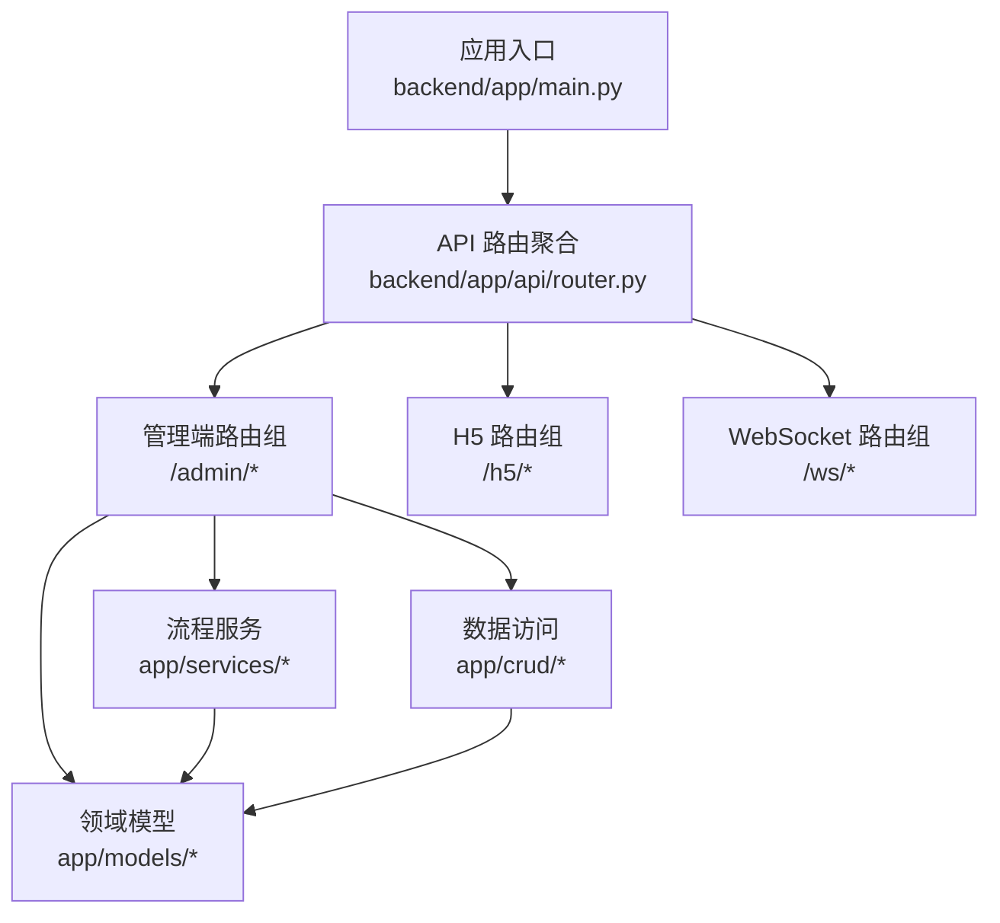
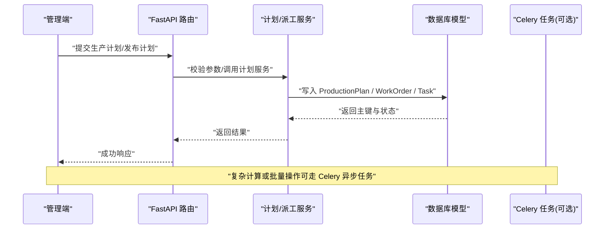
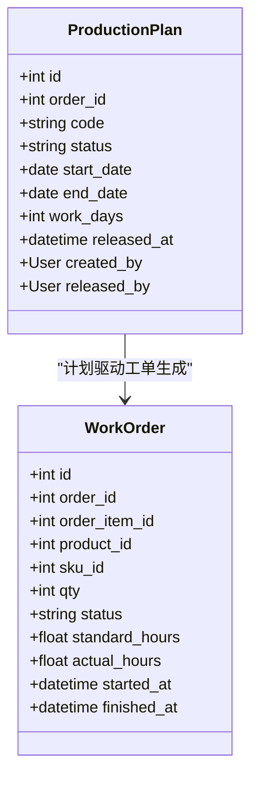
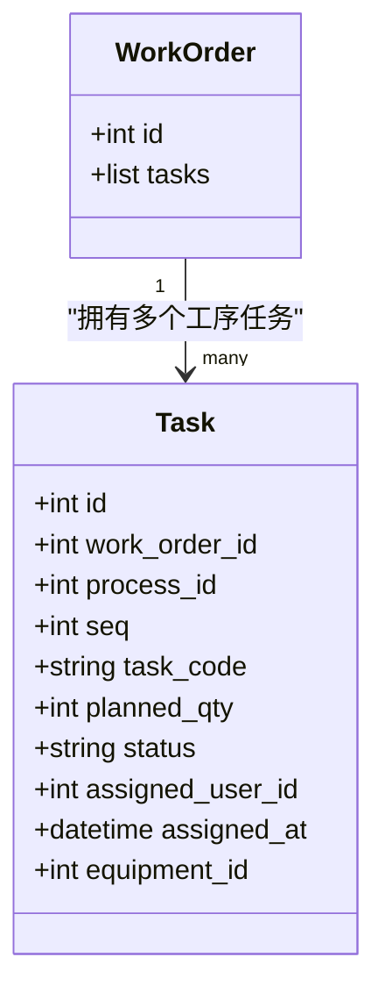
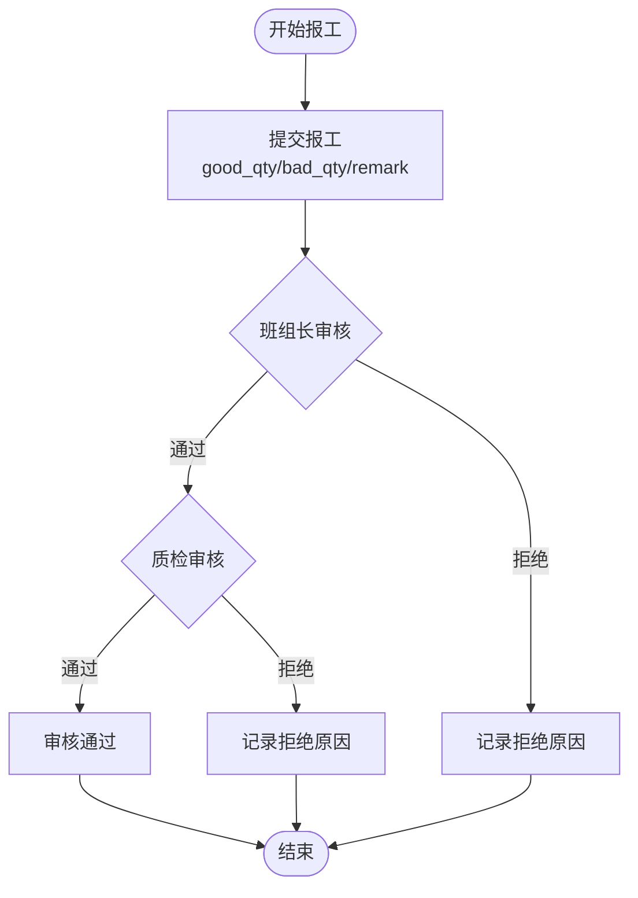
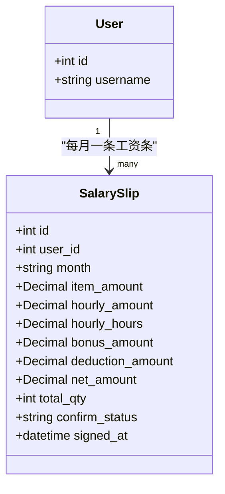
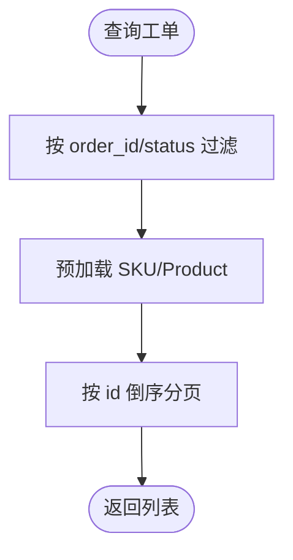
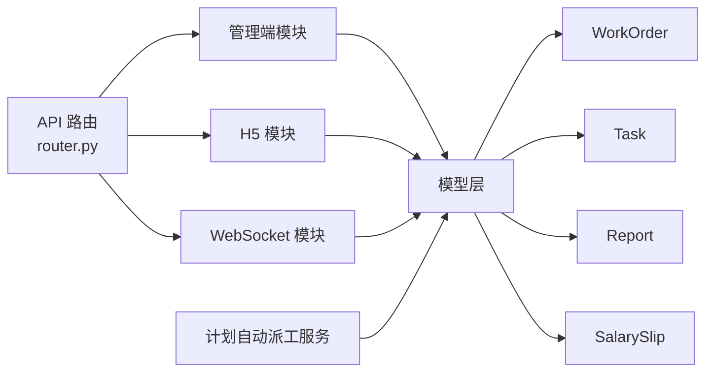

# 核心业务模型与生产闭环

<cite>
**本文引用的文件**   
- [backend/app/main.py](file://backend/app/main.py)
- [backend/app/api/router.py](file://backend/app/api/router.py)
- [backend/app/models/work_order.py](file://backend/app/models/work_order.py)
- [backend/app/models/production_plan.py](file://backend/app/models/production_plan.py)
- [backend/app/models/task.py](file://backend/app/models/task.py)
- [backend/app/models/report.py](file://backend/app/models/report.py)
- [backend/app/models/salary_slip.py](file://backend/app/models/salary_slip.py)
- [backend/app/crud/work_order.py](file://backend/app/crud/work_order.py)
- [backend/app/services/plan_auto_dispatch.py](file://backend/app/services/plan_auto_dispatch.py)
</cite>

## 目录
1. [引言](#引言)
2. [项目结构](#项目结构)
3. [核心组件](#核心组件)
4. [架构总览](#架构总览)
5. [详细组件分析](#详细组件分析)
6. [依赖关系分析](#依赖关系分析)
7. [性能考虑](#性能考虑)
8. [故障排查指南](#故障排查指南)
9. [结论](#结论)

## 引言
本文件以“产品/型号 → 工序/工价 → 客户/订单 → 排产计划 → 工单 → 任务派驻 → 扫码报工 → 审核 → 自动算薪”的生产闭环为主线，串联各业务域的数据模型与服务协作。目标是帮助开发者快速理解：
- 数据模型如何承载从订单到薪资的完整流转；
- API 路由如何组织不同端（管理后台、H5、小程序）的请求；
- 服务层如何驱动计划、派工、报工与薪资计算；
- 异常处理、权限与安全在系统中的位置与作用。

## 项目结构
后端采用 FastAPI + SQLAlchemy + Alembic + Celery 的分层架构：
- app/main.py：应用启动、全局中间件、统一异常处理、启动时初始化租户/权限/默认管理员等；
- app/api/router.py：聚合所有 API 路由分组，按 admin/h5/ws/v1 等前缀组织；
- app/models：领域实体与数据库映射；
- app/crud：数据访问逻辑；
- app/services：跨实体的业务流程编排；
- app/tasks：Celery 异步任务；
- app/core：配置、安全、数据库连接、错误定义、中间件等横切能力。

图表来源
- [backend/app/main.py:26-47](file://backend/app/main.py#L26-L47)
- [backend/app/api/router.py:36-65](file://backend/app/api/router.py#L36-L65)

章节来源
- [backend/app/main.py:26-47](file://backend/app/main.py#L26-L47)
- [backend/app/api/router.py:36-65](file://backend/app/api/router.py#L36-L65)

## 核心组件
围绕生产闭环的核心数据模型如下：
- 生产计划 ProductionPlan：将订单转化为可执行的时间段计划，记录计划状态、起止日期、工作日与发布人；
- 工单 WorkOrder：由订单明细生成，绑定产品/SKU、数量、标准工时与实际工时，并关联任务序列；
- 任务 Task：按工艺路线拆分的工序级任务，包含计划数量、状态、指派人与设备；
- 报工 Report 与审核 ReportAudit：员工扫码报工，经班组长/质检审核形成有效产出；
- 工资条 SalarySlip：基于报工与计件/计时规则生成的月度薪资汇总。

这些模型共同构成“计划→工单→任务→报工→审核→薪资”的主干链路。

章节来源
- [backend/app/models/production_plan.py:11-30](file://backend/app/models/production_plan.py#L11-L30)
- [backend/app/models/work_order.py:11-39](file://backend/app/models/work_order.py#L11-L39)
- [backend/app/models/task.py:11-39](file://backend/app/models/task.py#L11-L39)
- [backend/app/models/report.py:11-53](file://backend/app/models/report.py#L11-L53)
- [backend/app/models/salary_slip.py:12-41](file://backend/app/models/salary_slip.py#L12-L41)

## 架构总览
系统通过 FastAPI 暴露多端接口，并由服务层协调跨模块的业务流程。关键路径包括：
- 管理端：创建/发布计划、生成工单、派发任务、查看报工与审核、导出薪资；
- H5/小程序：扫码报工、查看个人任务与工资条；
- 自动化：计划自动派工、定时任务与异步处理。

图表来源
- [backend/app/api/router.py:36-65](file://backend/app/api/router.py#L36-L65)
- [backend/app/services/plan_auto_dispatch.py](file://backend/app/services/plan_auto_dispatch.py)

## 详细组件分析

### 生产计划与工单生成
- 生产计划用于将订单分解为可执行的计划区间，支持状态管理与发布审计；
- 工单由订单明细驱动，绑定产品与 SKU，维护标准工时与实际工时，并作为任务集合的父实体。

图表来源
- [backend/app/models/production_plan.py:11-30](file://backend/app/models/production_plan.py#L11-L30)
- [backend/app/models/work_order.py:11-39](file://backend/app/models/work_order.py#L11-L39)

章节来源
- [backend/app/models/production_plan.py:11-30](file://backend/app/models/production_plan.py#L11-L30)
- [backend/app/models/work_order.py:11-39](file://backend/app/models/work_order.py#L11-L39)

### 任务派工与执行
- 任务按工艺路线拆分，绑定工序、计划数量与状态；
- 支持指派人员与设备，便于现场扫码与执行追踪；
- 任务集合与工单一对多，保证工单下任务的有序执行。

图表来源
- [backend/app/models/task.py:11-39](file://backend/app/models/task.py#L11-L39)
- [backend/app/models/work_order.py:33-39](file://backend/app/models/work_order.py#L33-L39)

章节来源
- [backend/app/models/task.py:11-39](file://backend/app/models/task.py#L11-L39)
- [backend/app/models/work_order.py:33-39](file://backend/app/models/work_order.py#L33-L39)

### 报工与审核流程
- 员工对任务进行报工，记录良品数、不良品数与备注；
- 报工需经过班组长与质检两级审核，审核流水独立记录；
- 审核通过后，报工数据可用于计件/计时薪资计算。

图表来源
- [backend/app/models/report.py:11-53](file://backend/app/models/report.py#L11-L53)

章节来源
- [backend/app/models/report.py:11-53](file://backend/app/models/report.py#L11-L53)

### 薪资计算与确认
- 工资条按月汇总员工的计件金额、计时金额、奖金、扣款与净额；
- 支持签名附件与确认状态，便于员工在线确认与异议处理；
- 工资条与用户一对一多月份，确保薪资数据的唯一性与可追溯性。

图表来源
- [backend/app/models/salary_slip.py:12-41](file://backend/app/models/salary_slip.py#L12-L41)

章节来源
- [backend/app/models/salary_slip.py:12-41](file://backend/app/models/salary_slip.py#L12-L41)

### 数据访问与查询优化
- 工单查询支持按订单与状态过滤，并预加载 SKU 与产品信息，减少 N+1 查询；
- 获取单个工单时可按需加载任务及工序信息，提升展示性能。

图表来源
- [backend/app/crud/work_order.py:11-38](file://backend/app/crud/work_order.py#L11-L38)

章节来源
- [backend/app/crud/work_order.py:11-38](file://backend/app/crud/work_order.py#L11-L38)

### 计划自动派工服务
- 计划自动派工服务负责根据计划与资源情况，自动生成或调整任务分配；
- 该服务通常由管理端触发或通过定时任务调度，结合 Celery 实现异步化。

章节来源
- [backend/app/services/plan_auto_dispatch.py](file://backend/app/services/plan_auto_dispatch.py)

## 依赖关系分析
- 路由层依赖：router.py 聚合了管理端、H5、WebSocket、认证、文件、公共配置、飞书集成、CRM 适配器、推送监控、小程序认证等路由；
- 模型依赖：WorkOrder 依赖 Order/OrderItem/Product/Sku，Task 依赖 Process/Equipment/User，Report 依赖 Task/User，SalarySlip 依赖 User/Attachment；
- 服务依赖：计划自动派工服务依赖生产计划与任务模型，可能间接依赖仓库、采购、设备等资源模型。

图表来源
- [backend/app/api/router.py:36-65](file://backend/app/api/router.py#L36-L65)
- [backend/app/models/work_order.py:11-39](file://backend/app/models/work_order.py#L11-L39)
- [backend/app/models/task.py:11-39](file://backend/app/models/task.py#L11-L39)
- [backend/app/models/report.py:11-53](file://backend/app/models/report.py#L11-L53)
- [backend/app/models/salary_slip.py:12-41](file://backend/app/models/salary_slip.py#L12-L41)
- [backend/app/services/plan_auto_dispatch.py](file://backend/app/services/plan_auto_dispatch.py)

章节来源
- [backend/app/api/router.py:36-65](file://backend/app/api/router.py#L36-L65)

## 性能考虑
- 使用 selectinload 预加载关联数据，避免 N+1 查询问题；
- 对高频查询字段建立索引（如 status、order_id、task_code、assigned_user_id）；
- 将耗时计算（如批量派工、薪资汇总）放入 Celery 异步任务，降低请求延迟；
- 合理分页与过滤条件，控制单次返回数据量。

## 故障排查指南
- 启动阶段：检查 JWT 密钥是否安全、数据库是否自动创建表、默认租户与权限是否正确初始化；
- 路由注册：确认各模块路由已正确 include，避免 404；
- 异常处理：统一异常处理器会将 HTTPException、参数校验失败、业务异常转换为统一 JSON 格式；
- 日志定位：未捕获异常会记录到 uvicorn.error 日志，开发环境返回详细错误信息，生产环境仅返回通用错误。

章节来源
- [backend/app/main.py:88-130](file://backend/app/main.py#L88-L130)
- [backend/app/main.py:55-85](file://backend/app/main.py#L55-L85)

## 结论
通过将生产计划、工单、任务、报工与薪资模型串联起来，CenkorMES 实现了从订单到薪资的端到端闭环。API 路由清晰分层，服务层负责跨模块协作，模型层提供稳定数据结构。配合 Celery 异步任务与统一异常处理，系统在中小加工厂场景下具备可追溯、可扩展与易维护的特点。