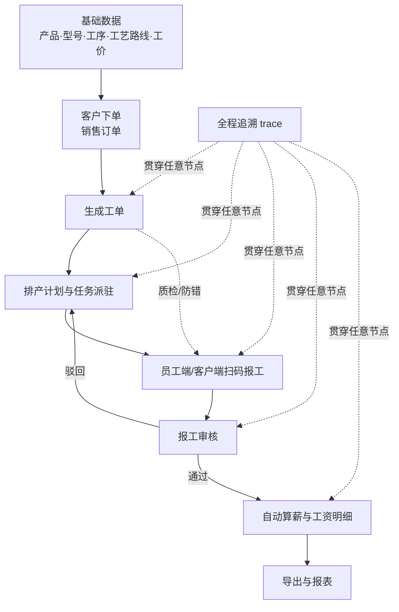
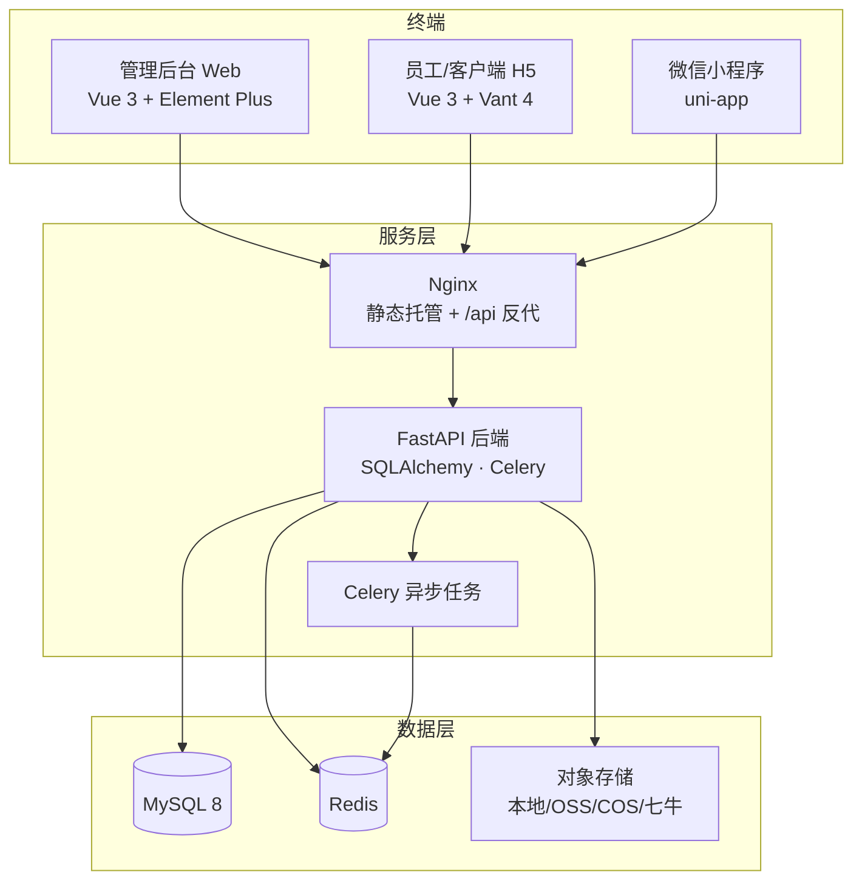
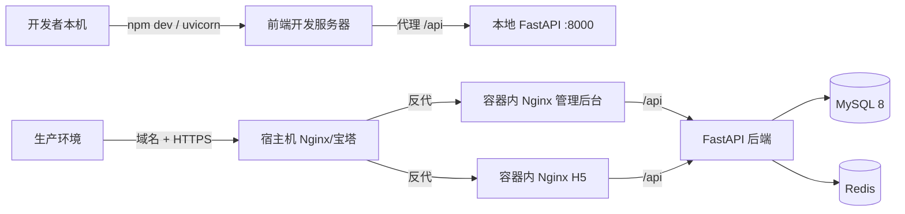
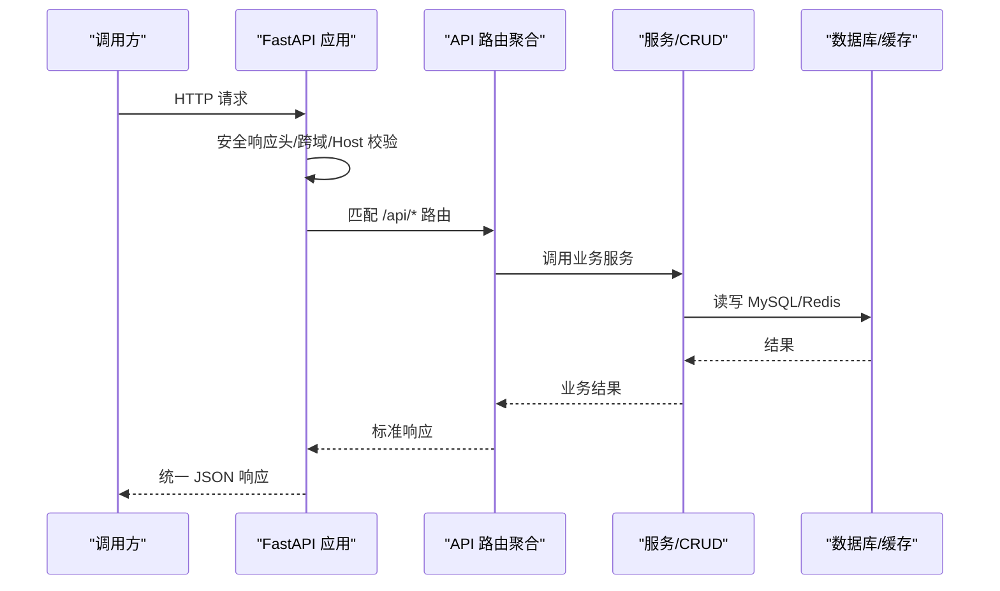
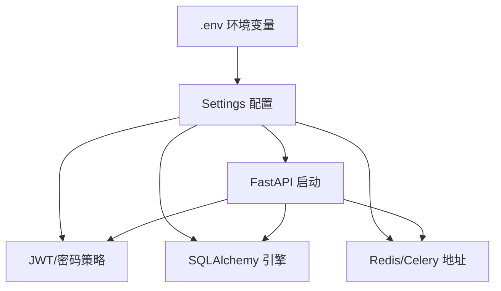
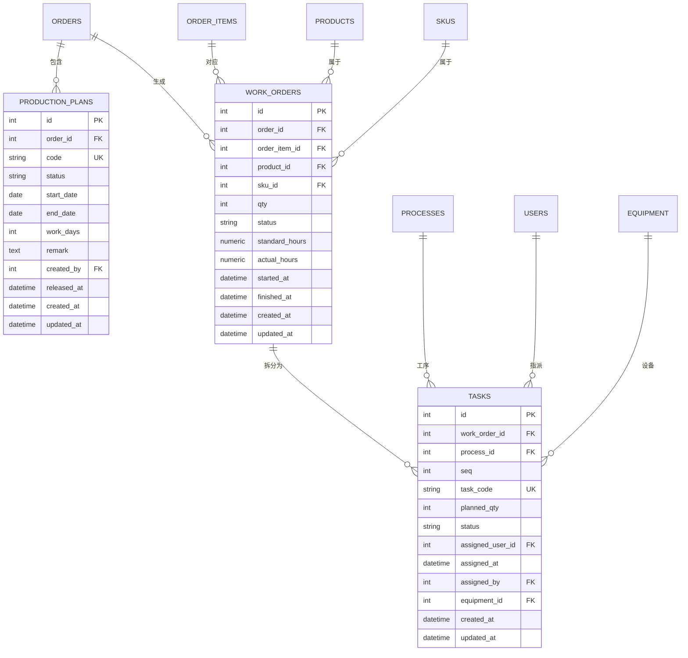
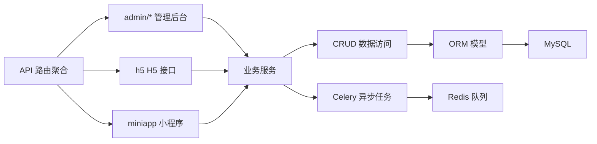

# 系统总览与架构全景

<cite>
**本文引用的文件**   
- [README.md](file://README.md)
- [docker-compose.yml](file://docker-compose.yml)
- [backend/app/main.py](file://backend/app/main.py)
- [backend/app/core/config.py](file://backend/app/core/config.py)
- [backend/app/core/db.py](file://backend/app/core/db.py)
- [backend/app/core/security.py](file://backend/app/core/security.py)
- [backend/app/api/router.py](file://backend/app/api/router.py)
- [backend/app/models/work_order.py](file://backend/app/models/work_order.py)
- [backend/app/models/task.py](file://backend/app/models/task.py)
- [backend/app/models/production_plan.py](file://backend/app/models/production_plan.py)
</cite>

## 目录
1. [定位与产品边界](#定位与产品边界)
2. [核心生产闭环](#核心生产闭环)
3. [多端与服务/数据层拓扑](#多端与服务数据层拓扑)
4. [技术选型与部署形态](#技术选型与部署形态)
5. [后端入口、路由与安全基线](#后端入口路由与安全基线)
6. [关键业务模型与数据关系](#关键业务模型与数据关系)
7. [依赖关系与扩展点](#依赖关系与扩展点)
8. [常见问题与排障要点](#常见问题与排障要点)
9. [结论](#结论)

## 定位与产品边界
CenkorMES 是面向中小型加工厂的轻量制造执行系统，明确采用单租户私有部署模式：一个实例对应一家企业的数据与权限空间，不内置 SaaS 多租户平台层。其价值主张是“开箱即用、安全可控、多端协同”，围绕产品/型号、工序/工价、客户/订单、工单、任务派驻、扫码报工、审核与自动算薪形成完整闭环，并通过追溯贯穿任意节点。

该定位体现在仓库根说明中：强调一条命令拉起后端、数据库、缓存与管理后台/H5；同时明确开源独立版与商业 SaaS 版的差异，本仓库为 AGPL-3.0 的独立私有部署版本。

**章节来源**
- [README.md:1-22](file://README.md#L1-L22)
- [README.md:25-43](file://README.md#L25-L43)
- [README.md:227-240](file://README.md#L227-L240)

## 核心生产闭环
核心流程从基础数据出发，到计划、工单、派工、报工、审核与算薪，最终沉淀可追溯的生产记录。

该流程图直接对应仓库 README 中的核心闭环描述，并在后续模型与 API 路由中得到落地：生产计划、工单、任务、报工与薪资等模块分别由后端服务与前端页面承载。

**章节来源**
- [README.md:25-43](file://README.md#L25-L43)

## 多端与服务/数据层拓扑
整体拓扑分为终端、服务层与数据层三层：

- 终端层：PC 管理后台（Vue 3 + Element Plus）、员工与客户端 H5（Vue 3 + Vant 4）、微信小程序（uni-app）。
- 服务层：Nginx 负责静态资源托管与 `/api` 反向代理；FastAPI 提供 REST/WS 接口；Celery 处理异步任务与定时任务。
- 数据层：MySQL 8 作为主数据库，Redis 作为缓存与 Celery 队列，对象存储支持本地磁盘或云厂商 OSS/COS/七牛。

该拓扑与 docker-compose 定义的服务一致：backend 暴露 API，web-admin 与 web-h5 分别托管两个前端，mysql 与 redis 作为依赖服务，前端容器内已内置 Nginx 将 `/api` 反代到 backend。

**图表来源**
- [docker-compose.yml:1-15](file://docker-compose.yml#L1-L15)
- [docker-compose.yml:18-115](file://docker-compose.yml#L18-L115)

**章节来源**
- [README.md:47-72](file://README.md#L47-L72)
- [docker-compose.yml:1-15](file://docker-compose.yml#L1-L15)
- [docker-compose.yml:50-107](file://docker-compose.yml#L50-L107)

## 技术选型与部署形态
### 技术栈
- 后端：FastAPI、SQLAlchemy、Alembic、Pydantic、Celery。
- 数据库与缓存：MySQL 8、Redis。
- 前端：PC 管理后台使用 Vue 3 + Element Plus；H5 移动端使用 Vue 3 + Vant 4；小程序使用 uni-app。
- 部署：Docker Compose 一键拉起全栈；Nginx 在容器内托管静态资源并反向代理 `/api`；支持宿主机 Nginx 或宝塔面板做域名与 HTTPS 入口。

### 部署形态
- Docker 一键启动：`docker compose up -d --build`，默认端口包括后端 API、管理后台与 H5。
- 手动启动：后端 uvicorn、前端 npm dev，开发环境 vite 代理 `/api` 到后端。
- 对外发布：推荐在宿主机加一层 Nginx 或宝塔反代，绑定域名与 HTTPS，并根据需要配置 `TRUSTED_HOSTS`、`PUBLIC_BASE_URL` 与 `X-Forwarded-Proto`。

**图表来源**
- [README.md:90-169](file://README.md#L90-L169)
- [docker-compose.yml:50-107](file://docker-compose.yml#L50-L107)

**章节来源**
- [README.md:76-87](file://README.md#L76-L87)
- [README.md:90-169](file://README.md#L90-L169)
- [docker-compose.yml:18-115](file://docker-compose.yml#L18-L115)

## 后端入口、路由与安全基线
### FastAPI 应用入口
后端入口在 `backend/app/main.py`，完成以下职责：
- 创建 FastAPI 应用并挂载全局中间件：安全响应头、可选 CORS、可选 Host 白名单。
- 挂载统一 API 路由前缀 `/api`。
- 统一异常处理：HTTP 异常、参数校验异常、业务异常与未捕获异常均返回统一 JSON 结构。
- 启动时初始化：JWT 密钥安全检查、自动建表、默认租户与权限、默认管理员账号、系统版本种子同步。

**图表来源**
- [backend/app/main.py:26-47](file://backend/app/main.py#L26-L47)
- [backend/app/main.py:50-85](file://backend/app/main.py#L50-L85)
- [backend/app/api/router.py:36-84](file://backend/app/api/router.py#L36-L84)

### API 路由分组
`backend/app/api/router.py` 集中注册各功能模块路由，按领域划分：
- 认证与验证码：`/api/auth`、`/api/auth/captcha`
- 公共能力：`/api/files`、`/api/public-config`
- 看板与仪表盘：`/api/dashboard`、`/api/ws`
- 管理后台领域：`/api/admin/master`、`/api/admin/production`、`/api/admin/system`、`/api/admin/trace`、`/api/admin/equipment`、`/api/admin/dictionary`、`/api/admin/reports`、`/api/admin/plans`、`/api/admin/shift`、`/api/admin/exec-dashboard`、`/api/admin/cron-jobs`、`/api/admin/export-jobs`、`/api/admin/automation`、`/api/admin/finance`、`/api/admin/purchase`、`/api/admin/warehouse`、`/api/admin/approval`、`/api/admin/mrp`、`/api/admin/subcontract`、`/api/admin/push-monitor`
- 多端接口：`/api/h5`、`/api/miniapp/auth`
- 集成与开放：`/api/feishu`、`/api/crm-adapter/*`、`/api/ai-compat/*`

所有管理后台路由默认依赖当前用户鉴权，体现 RBAC 控制面。

**章节来源**
- [backend/app/api/router.py:36-84](file://backend/app/api/router.py#L36-L84)

### 配置与安全
- 配置中心：`backend/app/core/config.py` 使用 Pydantic Settings 加载 `.env`，包含应用名、环境、端口、数据库连接串、JWT 策略、CORS、Host 白名单、登录失败限流、对象存储驱动、Redis/Celery 地址等。
- 数据库连接：`backend/app/core/db.py` 基于 SQLAlchemy 创建引擎与 SessionLocal，启用连接池预检查与回收。
- 安全基线：`backend/app/core/security.py` 实现密码强度校验、JWT 强密钥 fail-fast、bcrypt 密码哈希、JWT 签发与解码。

**图表来源**
- [backend/app/core/config.py:6-50](file://backend/app/core/config.py#L6-L50)
- [backend/app/core/db.py:9-16](file://backend/app/core/db.py#L9-L16)
- [backend/app/core/security.py:20-70](file://backend/app/core/security.py#L20-L70)

**章节来源**
- [backend/app/core/config.py:6-50](file://backend/app/core/config.py#L6-L50)
- [backend/app/core/db.py:9-16](file://backend/app/core/db.py#L9-L16)
- [backend/app/core/security.py:20-70](file://backend/app/core/security.py#L20-L70)
- [backend/app/main.py:26-47](file://backend/app/main.py#L26-L47)
- [backend/app/main.py:88-130](file://backend/app/main.py#L88-L130)

## 关键业务模型与数据关系
围绕生产闭环的核心模型包括生产计划、工单与任务：

- 生产计划：关联订单，记录计划编号、状态、起止日期、工作日、备注、创建与释放信息。
- 工单：关联订单与订单项、产品与 SKU，记录数量、状态、标准工时与实际工时、开工与完工时间，并关联任务与计件明细。
- 任务：关联工单与工序，记录任务编码、计划数量、状态、指派人与设备，并关联任务分配。

**图表来源**
- [backend/app/models/production_plan.py:11-30](file://backend/app/models/production_plan.py#L11-L30)
- [backend/app/models/work_order.py:11-39](file://backend/app/models/work_order.py#L11-L39)
- [backend/app/models/task.py:11-39](file://backend/app/models/task.py#L11-L39)

**章节来源**
- [backend/app/models/production_plan.py:11-30](file://backend/app/models/production_plan.py#L11-L30)
- [backend/app/models/work_order.py:11-39](file://backend/app/models/work_order.py#L11-L39)
- [backend/app/models/task.py:11-39](file://backend/app/models/task.py#L11-L39)

## 依赖关系与扩展点
- 分层组织：`app/api` 聚合多端路由，`app/core` 提供配置、数据库、安全、中间件与错误处理，`app/models` 定义实体，`app/schemas` 定义请求/响应结构，`app/crud` 封装数据访问，`app/services` 封装业务逻辑，`app/tasks` 封装 Celery 异步任务。
- 外部依赖：MySQL 8 为主库，Redis 用于缓存与 Celery 队列，对象存储支持本地与主流云厂商。
- 扩展点：
  - 新增管理后台模块：在 `app/api/admin/<module>/router.py` 定义路由，并在 `router.py` 中 include。
  - 新增 H5/小程序接口：在 `app/api/h5` 或 `app/api/miniapp` 下扩展。
  - 新增异步任务：在 `app/tasks` 下定义 Celery 任务，并通过服务层触发。
  - 新增对象存储：在 `app/storage` 扩展驱动，并通过配置切换。

**图表来源**
- [backend/app/api/router.py:36-84](file://backend/app/api/router.py#L36-L84)
- [docker-compose.yml:50-107](file://docker-compose.yml#L50-L107)

**章节来源**
- [backend/app/api/router.py:36-84](file://backend/app/api/router.py#L36-L84)
- [docker-compose.yml:50-107](file://docker-compose.yml#L50-L107)

## 常见问题与排障要点
- JWT 密钥不安全：生产环境若未设置强随机密钥，FastAPI 启动时会 fail-fast 报错，需设置长度不小于配置的强密钥。
- Host 白名单拦截：若配置了 `TRUSTED_HOSTS`，未加入的域名会被 403 拦截；需在宿主机 Nginx/宝塔正确转发 Host。
- HTTPS 链接问题：若后端生成 http 链接，需在入口反代追加 `X-Forwarded-Proto https`，并配置 `PUBLIC_BASE_URL`/`H5_PUBLIC_BASE_URL` 为 HTTPS。
- 端口冲突：若宿主 8000 被占用，可在 `.env` 覆盖 `APP_PORT`；管理后台与 H5 端口也可通过 `WEB_ADMIN_PORT`/`WEB_H5_PORT` 覆盖。
- 演示数据：首次启动自动建表与默认管理员；演示数据可通过脚本幂等注入。

**章节来源**
- [backend/app/core/security.py:29-39](file://backend/app/core/security.py#L29-L39)
- [backend/app/main.py:42-45](file://backend/app/main.py#L42-L45)
- [README.md:161-169](file://README.md#L161-L169)
- [docker-compose.yml:50-74](file://docker-compose.yml#L50-L74)

## 结论
CenkorMES 以单租户私有部署为核心定位，围绕“产品/型号 → 工序/工价 → 客户/订单 → 工单 → 任务派驻 → 扫码报工 → 审核 → 自动算薪”的闭环构建轻量 MES。系统采用 FastAPI + SQLAlchemy + Alembic + Celery 的后端架构，配合 Vue 3 多端前端，通过 Docker Compose 与 Nginx 反代实现一键部署与对外发布。数据层以 MySQL 8 为主库、Redis 为缓存与队列，对象存储灵活可扩展。对于中小型加工厂而言，该系统在交付速度、安全合规与私有可控之间提供了平衡方案。