# CRM 适配器与第三方通道

<cite>
**本文引用的文件**   
- [backend/app/integration/crm_adapter/__init__.py](file://backend/app/integration/crm_adapter/__init__.py)
- [backend/app/integration/crm_adapter/router.py](file://backend/app/integration/crm_adapter/router.py)
- [backend/app/integration/crm_adapter/client.py](file://backend/app/integration/crm_adapter/client.py)
- [backend/app/integration/crm_adapter/models.py](file://backend/app/integration/crm_adapter/models.py)
- [backend/app/integration/crm_adapter/schemas.py](file://backend/app/integration/crm_adapter/schemas.py)
- [backend/app/integration/crm_adapter/security.py](file://backend/app/integration/crm_adapter/security.py)
- [backend/app/api/feishu/router.py](file://backend/app/api/feishu/router.py)
- [backend/app/services/feishu/callbacks.py](file://backend/app/services/feishu/callbacks.py)
- [backend/app/services/feishu/oauth.py](file://backend/app/services/feishu/oauth.py)
- [backend/app/services/feishu/settings.py](file://backend/app/services/feishu/settings.py)
- [backend/app/services/notify_channels.py](file://backend/app/services/notify_channels.py)
- [backend/app/services/notify_dispatcher.py](file://backend/app/services/notify_dispatcher.py)
</cite>

## 目录
1. [引言](#引言)
2. [项目结构定位](#项目结构定位)
3. [核心组件总览](#核心组件总览)
4. [架构总览](#架构总览)
5. [CRM 适配器适配层设计](#crm-适配器适配层设计)
6. [飞书消息通道接入](#飞书消息通道接入)
7. [企微与钉钉通道的扩展点](#企微与钉钉通道的扩展点)
8. [依赖关系分析](#依赖关系分析)
9. [性能与可靠性特征](#性能与可靠性特征)
10. [故障排查指南](#故障排查指南)
11. [结论](#结论)

## 引言
本文件聚焦后端 `backend/app/integration/crm_adapter` 的适配层设计，并说明其与飞书、企业微信、钉钉等消息通道的接入方式。整体目标是：
- 让 CenkorMES 作为“分支系统”对接外部 CRM（当前代码以 ck_crm 为典型集成对象）。
- 通过统一的消息通道抽象，把业务事件分发到飞书、企微、钉钉或系统内通知。
- 在开源版中，飞书是已完整实现的消息通道；企微和钉钉在通道枚举与目标模型中预留扩展点。

## 项目结构定位
`integration/crm_adapter` 是一个独立的集成子模块，对外暴露两类路由：
- 入站路由：供 CRM 主动推送订单、查询状态。
- 管理路由：供 MES 管理员配置 CRM 连接、查看入站订单、维护产品映射、回写订单状态。

同时，消息通道能力集中在 `app/services` 下的飞书服务与统一分发器中，`crm_adapter` 通过 HTTP webhook 的方式与外部系统集成，而不是直接复用飞书 SDK。

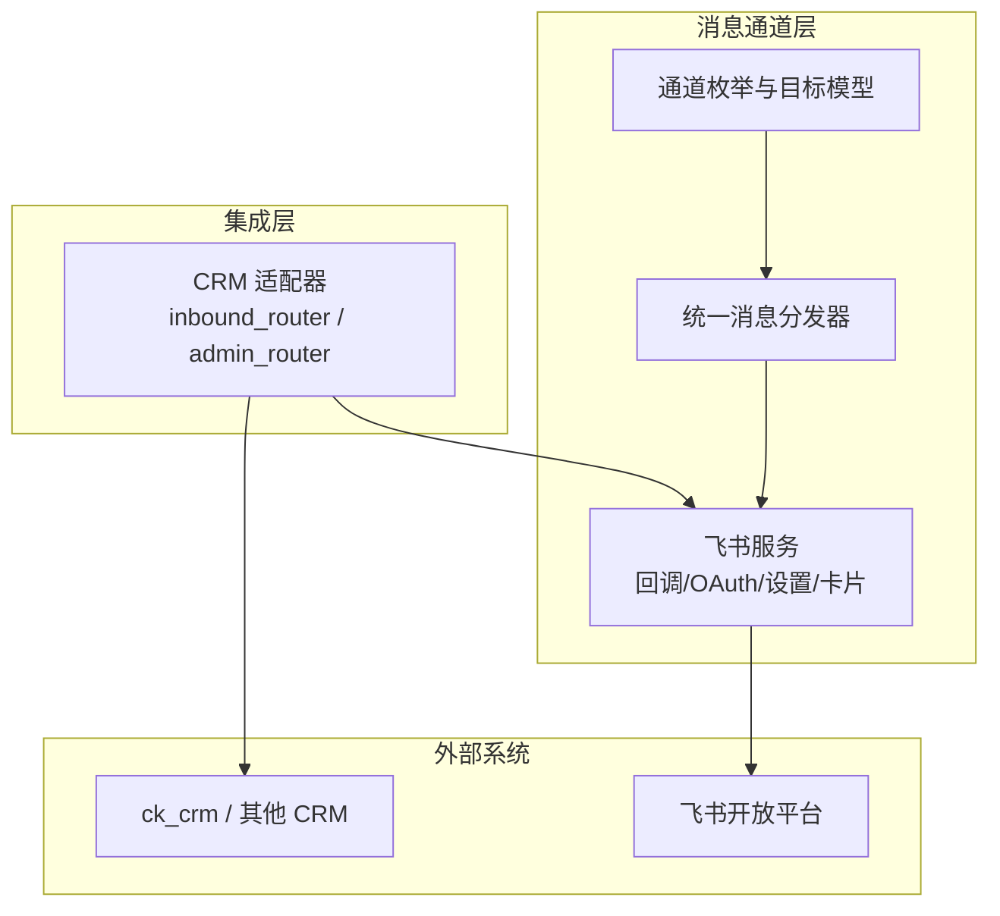

**图表来源** 
- [backend/app/integration/crm_adapter/router.py:1-16](file://backend/app/integration/crm_adapter/router.py#L1-L16)
- [backend/app/services/notify_channels.py:11-47](file://backend/app/services/notify_channels.py#L11-L47)
- [backend/app/services/notify_dispatcher.py:1-6](file://backend/app/services/notify_dispatcher.py#L1-L6)
- [backend/app/api/feishu/router.py:1-18](file://backend/app/api/feishu/router.py#L1-L18)

**章节来源**
- [backend/app/integration/__init__.py:5](file://backend/app/integration/__init__.py#L5)
- [backend/app/integration/crm_adapter/__init__.py:1-6](file://backend/app/integration/crm_adapter/__init__.py#L1-L6)

## 核心组件总览
| 组件 | 职责 | 关键文件 |
|---|---|---|
| CRM 适配器路由 | 接收 CRM 订单、查询订单状态、管理配置、回写订单状态、维护产品映射 | [router.py](file://backend/app/integration/crm_adapter/router.py) |
| CRM 适配器客户端 | 将 MES 订单状态变化异步回传给 CRM webhook | [client.py](file://backend/app/integration/crm_adapter/client.py) |
| CRM 适配器安全 | HMAC-SHA256 双向验签、时间戳窗口校验 | [security.py](file://backend/app/integration/crm_adapter/security.py) |
| CRM 适配器数据模型 | 连接配置、入站订单、产品映射表 | [models.py](file://backend/app/integration/crm_adapter/models.py) |
| CRM 适配器请求响应模型 | Pydantic 校验 CRM 订单、配置、产品映射、状态更新 | [schemas.py](file://backend/app/integration/crm_adapter/schemas.py) |
| 飞书公开回调路由 | 处理飞书事件订阅、OAuth 绑定 | [api/feishu/router.py](file://backend/app/api/feishu/router.py) |
| 飞书事件处理 | 解密事件、卡片回调、机器人私聊、欢迎语 | [services/feishu/callbacks.py](file://backend/app/services/feishu/callbacks.py) |
| 飞书 OAuth | 用户绑定 open_id、授权链接、回调解析 | [services/feishu/oauth.py](file://backend/app/services/feishu/oauth.py) |
| 飞书设置 | 租户级飞书配置、默认规则、群分组、事件目录 | [services/feishu/settings.py](file://backend/app/services/feishu/settings.py) |
| 通道枚举与目标 | 定义 feishu/wecom/dingtalk/in_app 及 PushTarget | [services/notify_channels.py](file://backend/app/services/notify_channels.py) |
| 统一消息分发器 | 根据事件类型、用户绑定、群组规则生成推送日志并投递 Celery | [services/notify_dispatcher.py](file://backend/app/services/notify_dispatcher.py) |

**章节来源**
- [backend/app/integration/crm_adapter/router.py:1-16](file://backend/app/integration/crm_adapter/router.py#L1-L16)
- [backend/app/integration/crm_adapter/client.py:1-8](file://backend/app/integration/crm_adapter/client.py#L1-L8)
- [backend/app/integration/crm_adapter/security.py:1-7](file://backend/app/integration/crm_adapter/security.py#L1-L7)
- [backend/app/integration/crm_adapter/models.py:1-7](file://backend/app/integration/crm_adapter/models.py#L1-L7)
- [backend/app/integration/crm_adapter/schemas.py:1-7](file://backend/app/integration/crm_adapter/schemas.py#L1-L7)
- [backend/app/api/feishu/router.py:1-18](file://backend/app/api/feishu/router.py#L1-L18)
- [backend/app/services/feishu/callbacks.py:1-21](file://backend/app/services/feishu/callbacks.py#L1-L21)
- [backend/app/services/feishu/oauth.py:1-20](file://backend/app/services/feishu/oauth.py#L1-L20)
- [backend/app/services/feishu/settings.py:1-11](file://backend/app/services/feishu/settings.py#L1-L11)
- [backend/app/services/notify_channels.py:1-47](file://backend/app/services/notify_channels.py#L1-L47)
- [backend/app/services/notify_dispatcher.py:1-36](file://backend/app/services/notify_dispatcher.py#L1-L36)

## 架构总览
CRM 适配器与消息通道采用“分层 + 协议解耦”的设计：
- 集成层：`crm_adapter` 负责与外部 CRM 的 HTTP 协议交互，包括签名、订单落库、状态回传。
- 通道层：`notify_channels` 定义通道枚举和目标模型；`notify_dispatcher` 按事件类型决定个人、群组或混合推送。
- 飞书层：`services/feishu/*` 提供飞书事件回调、OAuth、设置、卡片动作、消息发送等能力。
- 外部系统：ck_crm 通过 webhook 与 MES 同步订单状态；飞书开放平台通过事件订阅与 MES 交互。

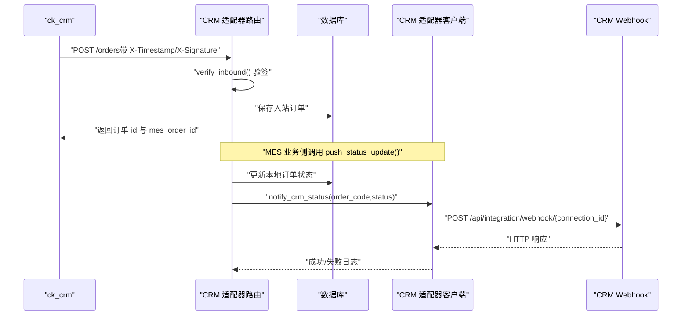

**图表来源** 
- [backend/app/integration/crm_adapter/router.py:61-91](file://backend/app/integration/crm_adapter/router.py#L61-L91)
- [backend/app/integration/crm_adapter/router.py:197-237](file://backend/app/integration/crm_adapter/router.py#L197-L237)
- [backend/app/integration/crm_adapter/client.py:32-55](file://backend/app/integration/crm_adapter/client.py#L32-L55)
- [backend/app/integration/crm_adapter/security.py:20-38](file://backend/app/integration/crm_adapter/security.py#L20-L38)

## CRM 适配器适配层设计
### 设计原则
- 入站接口无登录鉴权，但强制 HMAC 验签，防止伪造请求。
- 出站回传使用“尽力而为”策略：失败仅记录日志，不阻塞 MES 主流程。
- 配置单行化：`CrmAdapterConfig` 固定 id=1，便于简单部署场景。
- 状态映射可配置：通过 `status_map_json` 把 MES 自定义状态映射为标准状态。
- 产品映射独立维护：避免自动创建占位 SKU，保证 CRM 产品名与 MES SKU 精确对应。

### 数据模型关系
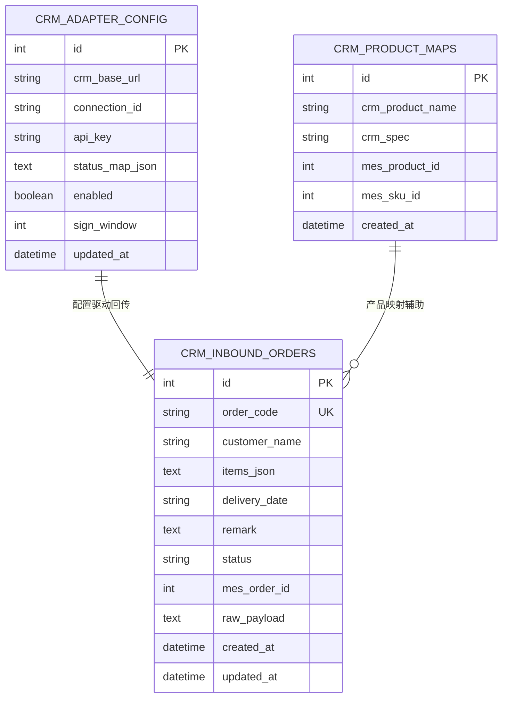

**图表来源** 
- [backend/app/integration/crm_adapter/models.py:16-67](file://backend/app/integration/crm_adapter/models.py#L16-L67)

### 入站订单流程
- 接收 CRM 推送的订单 JSON。
- 使用 `verify_inbound` 校验 `X-Timestamp` 与 `X-Signature`。
- 校验通过后写入 `crm_inbound_orders`，重复 `order_code` 会覆盖更新。
- 返回订单 id、业务单号以及关联的 MES 订单 id。

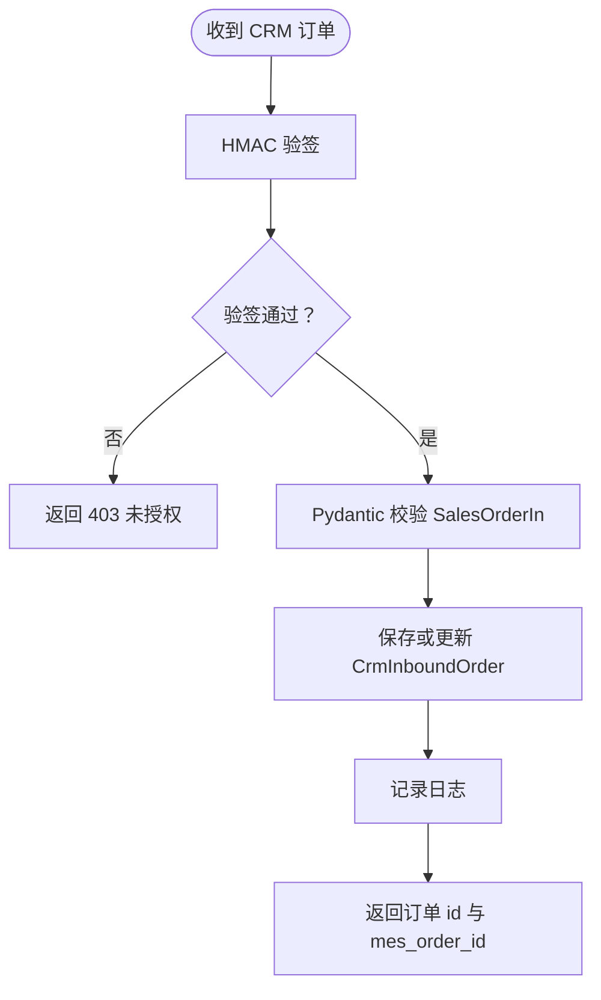

**图表来源** 
- [backend/app/integration/crm_adapter/router.py:61-91](file://backend/app/integration/crm_adapter/router.py#L61-L91)
- [backend/app/integration/crm_adapter/security.py:20-38](file://backend/app/integration/crm_adapter/security.py#L20-L38)
- [backend/app/integration/crm_adapter/schemas.py:13-26](file://backend/app/integration/crm_adapter/schemas.py#L13-L26)

### 出站状态回传流程
- 业务侧调用 `push_status_update(db, order_code, status)`。
- 更新本地订单状态。
- 从配置读取 `status_map`，将 MES 状态映射为标准状态。
- 调用 `notify_crm_status`，向 CRM webhook 发送签名后的 JSON。
- 使用 `asyncio.to_thread` 执行同步 httpx 请求，避免阻塞事件循环。

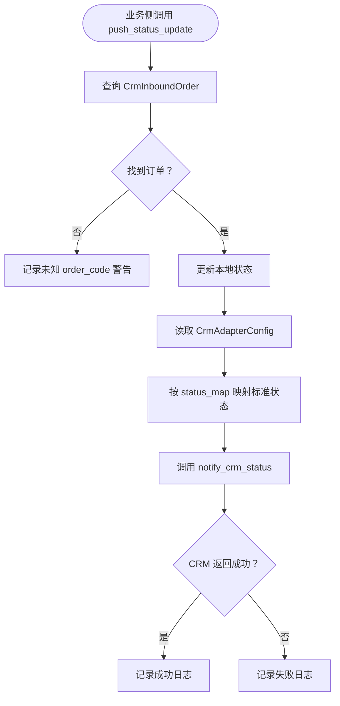

**图表来源** 
- [backend/app/integration/crm_adapter/router.py:197-237](file://backend/app/integration/crm_adapter/router.py#L197-L237)
- [backend/app/integration/crm_adapter/client.py:32-55](file://backend/app/integration/crm_adapter/client.py#L32-L55)

### 安全机制
- 入站验签：`verify_inbound` 要求 `X-Timestamp` 与 `X-Signature`，并校验时间戳窗口。
- 出站签名：`sign(api_key, timestamp, body)` 计算 HMAC-SHA256，并通过 `X-Signature` 头传递。
- 密钥保护：配置输出不返回明文 `api_key`。

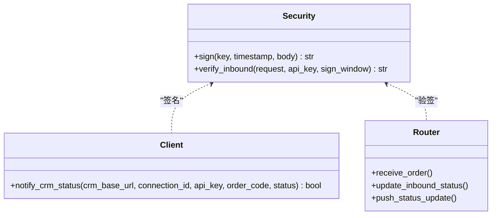

**图表来源** 
- [backend/app/integration/crm_adapter/security.py:15-38](file://backend/app/integration/crm_adapter/security.py#L15-L38)
- [backend/app/integration/crm_adapter/client.py:15-55](file://backend/app/integration/crm_adapter/client.py#L15-L55)
- [backend/app/integration/crm_adapter/router.py:61-91](file://backend/app/integration/crm_adapter/router.py#L61-L91)
- [backend/app/integration/crm_adapter/router.py:174-237](file://backend/app/integration/crm_adapter/router.py#L174-L237)

**章节来源**
- [backend/app/integration/crm_adapter/router.py:1-300](file://backend/app/integration/crm_adapter/router.py#L1-L300)
- [backend/app/integration/crm_adapter/client.py:1-56](file://backend/app/integration/crm_adapter/client.py#L1-L56)
- [backend/app/integration/crm_adapter/security.py:1-39](file://backend/app/integration/crm_adapter/security.py#L1-L39)
- [backend/app/integration/crm_adapter/models.py:1-67](file://backend/app/integration/crm_adapter/models.py#L1-L67)
- [backend/app/integration/crm_adapter/schemas.py:1-80](file://backend/app/integration/crm_adapter/schemas.py#L1-L80)

## 飞书消息通道接入
### 入口与回调
飞书公开回调路由位于 `api/feishu/router.py`，主要能力：
- `/events`：接收飞书事件，支持加密事件解密、事件分发。
- `/oauth/callback`：完成飞书 OAuth 绑定，返回 HTML 提示页。

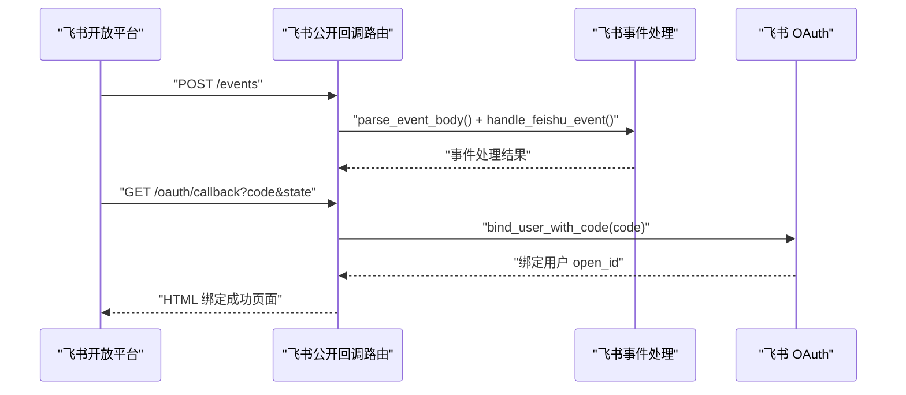

**图表来源** 
- [backend/app/api/feishu/router.py:27-84](file://backend/app/api/feishu/router.py#L27-L84)
- [backend/app/services/feishu/callbacks.py:36-39](file://backend/app/services/feishu/callbacks.py#L36-L39)
- [backend/app/services/feishu/callbacks.py:116-182](file://backend/app/services/feishu/callbacks.py#L116-L182)
- [backend/app/services/feishu/oauth.py:74-93](file://backend/app/services/feishu/oauth.py#L74-L93)

### 事件处理与卡片回调
`callbacks.py` 承担飞书事件的核心处理逻辑：
- 解密事件体：使用 AES-CBC + PKCS7 解密飞书加密事件。
- 卡片回调：处理 `card.action.trigger`，调用审核动作并返回 toast 与卡片内容。
- 机器人私聊：处理 `im.message.receive_v1`，转发到 AI 员工或返回帮助信息。
- 进入聊天欢迎：处理 `bot_p2p_chat_entered_v1`，发送欢迎语。

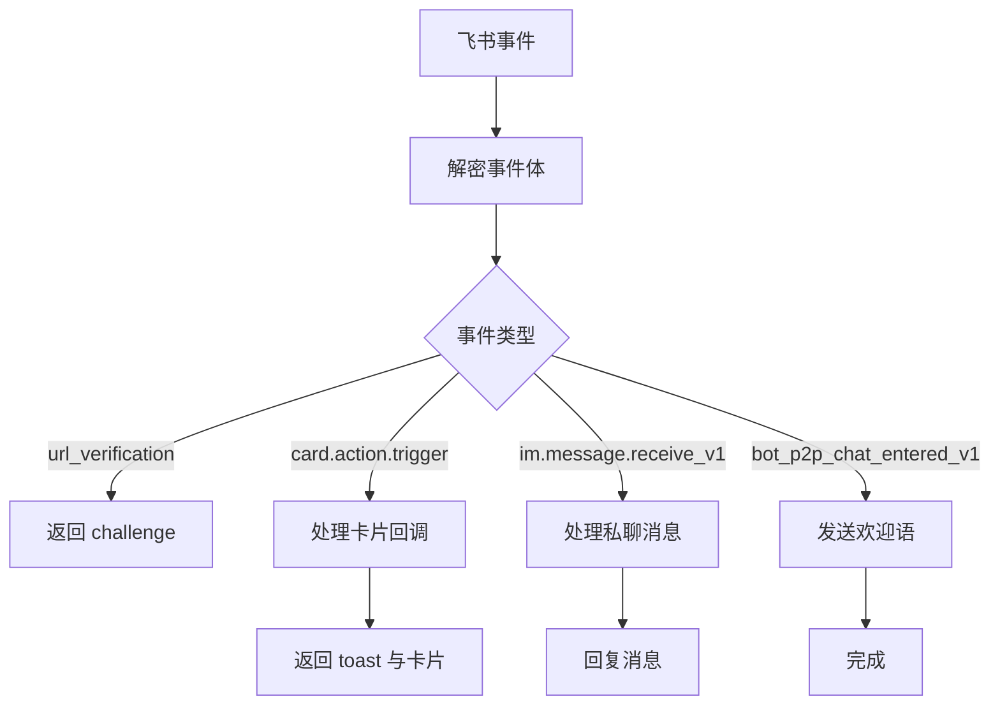

**图表来源** 
- [backend/app/services/feishu/callbacks.py:24-39](file://backend/app/services/feishu/callbacks.py#L24-L39)
- [backend/app/services/feishu/callbacks.py:116-182](file://backend/app/services/feishu/callbacks.py#L116-L182)

### 用户绑定与配置
- OAuth：`oauth.py` 负责生成授权链接、交换 code 获取用户信息、绑定 `feishu_open_id`。
- 设置：`settings.py` 提供租户级飞书配置，包括 app_id、secret、encrypt_key、groups、rules、quiet_hours 等。
- 通道开关：`is_feishu_enabled` 判断是否启用飞书推送。

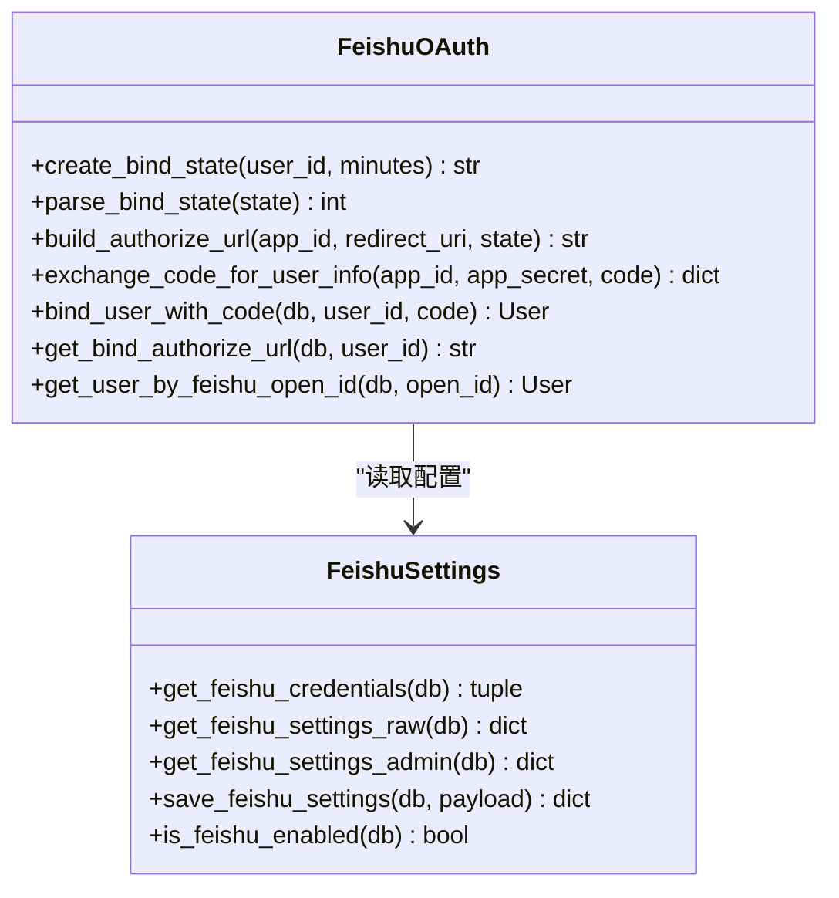

**图表来源** 
- [backend/app/services/feishu/oauth.py:23-116](file://backend/app/services/feishu/oauth.py#L23-L116)
- [backend/app/services/feishu/settings.py:167-266](file://backend/app/services/feishu/settings.py#L167-L266)

**章节来源**
- [backend/app/api/feishu/router.py:1-85](file://backend/app/api/feishu/router.py#L1-L85)
- [backend/app/services/feishu/callbacks.py:1-183](file://backend/app/services/feishu/callbacks.py#L1-L183)
- [backend/app/services/feishu/oauth.py:1-116](file://backend/app/services/feishu/oauth.py#L1-L116)
- [backend/app/services/feishu/settings.py:1-266](file://backend/app/services/feishu/settings.py#L1-L266)

## 企微与钉钉通道的扩展点
当前开源版的消息通道实现以飞书为主，但通道抽象已经预留了企业微信与钉钉的位置：
- `Channel.WECOM = "wecom"`
- `Channel.DINGTALK = "dingtalk"`
- `PushTarget.webhook` 支持 webhook 类型的群推送，适合企微/钉钉的群机器人 webhook。
- `notify_dispatcher` 当前仅映射 `feishu` 到 Celery 任务，新增通道需补充 `_CHANNEL_TASK_MAP` 与对应发送逻辑。

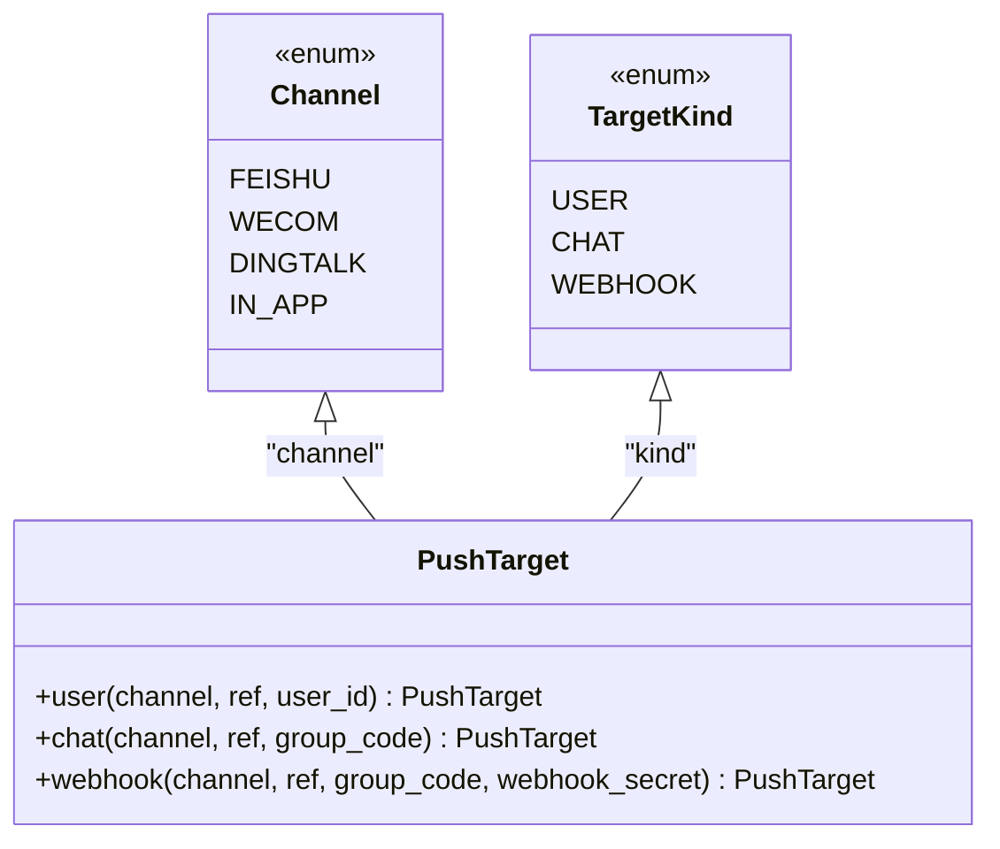

**图表来源** 
- [backend/app/services/notify_channels.py:11-47](file://backend/app/services/notify_channels.py#L11-L47)

**章节来源**
- [backend/app/services/notify_channels.py:1-103](file://backend/app/services/notify_channels.py#L1-L103)
- [backend/app/services/notify_dispatcher.py:33-48](file://backend/app/services/notify_dispatcher.py#L33-L48)

## 依赖关系分析
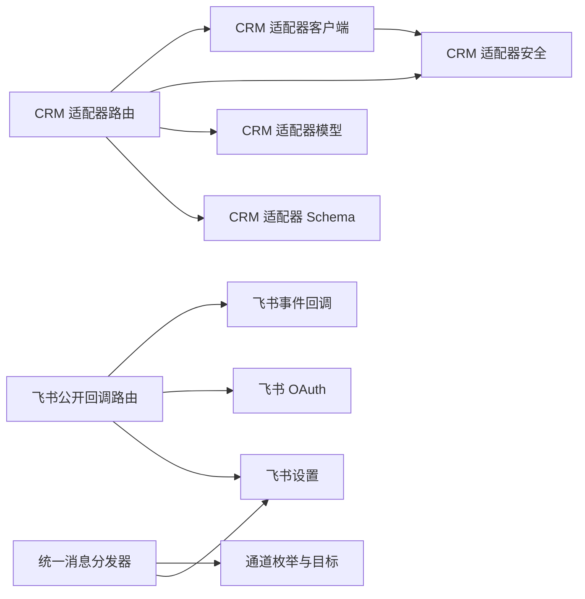

**图表来源** 
- [backend/app/integration/crm_adapter/router.py:21-38](file://backend/app/integration/crm_adapter/router.py#L21-L38)
- [backend/app/api/feishu/router.py:9-17](file://backend/app/api/feishu/router.py#L9-L17)
- [backend/app/services/notify_dispatcher.py:21-28](file://backend/app/services/notify_dispatcher.py#L21-L28)

**章节来源**
- [backend/app/integration/crm_adapter/router.py:1-300](file://backend/app/integration/crm_adapter/router.py#L1-L300)
- [backend/app/api/feishu/router.py:1-85](file://backend/app/api/feishu/router.py#L1-L85)
- [backend/app/services/notify_dispatcher.py:1-330](file://backend/app/services/notify_dispatcher.py#L1-L330)

## 性能与可靠性特征
- 入站验签与订单落库在 FastAPI 异步处理器中完成，避免阻塞。
- 出站状态回传使用 `asyncio.to_thread` 执行同步 httpx 请求，降低对事件循环的影响。
- 回传失败仅记录日志，不抛出异常，保证 MES 主流程不被外部系统拖垮。
- 消息分发器通过 Celery 异步任务发送飞书消息，避免同步网络 IO 阻塞业务事务。
- 事务提交后延迟入队，确保 worker 能查到刚创建的推送日志。

**章节来源**
- [backend/app/integration/crm_adapter/client.py:22-55](file://backend/app/integration/crm_adapter/client.py#L22-L55)
- [backend/app/integration/crm_adapter/router.py:220-237](file://backend/app/integration/crm_adapter/router.py#L220-L237)
- [backend/app/services/notify_dispatcher.py:52-70](file://backend/app/services/notify_dispatcher.py#L52-L70)

## 故障排查指南
| 现象 | 可能原因 | 排查建议 |
|---|---|---|
| CRM 推送订单返回 403 | 缺少 `X-Timestamp` 或 `X-Signature`，或签名错误 | 检查 CRM 端签名算法是否与 `security.sign` 一致 |
| 签名时间戳过期 | 客户端时间与服务器时间偏差超过 `sign_window` | 校准 NTP 时间，或增大 `sign_window` |
| 状态回传失败 | CRM webhook 不可达或返回非 2xx | 检查 `crm_base_url`、`connection_id`、`api_key` 配置 |
| 飞书事件无法解密 | 未配置 `encrypt_key` 或配置不一致 | 检查飞书后台加密配置与 `settings.encrypt_key` |
| 飞书 OAuth 绑定失败 | 未配置 `app_id`/`app_secret` 或回调地址不正确 | 检查 `get_feishu_credentials` 与 `PUBLIC_BASE_URL` |
| 消息未发送到飞书 | 飞书未启用或未绑定用户 open_id | 检查 `is_feishu_enabled` 与用户 `feishu_open_id` |

**章节来源**
- [backend/app/integration/crm_adapter/security.py:20-38](file://backend/app/integration/crm_adapter/security.py#L20-L38)
- [backend/app/integration/crm_adapter/client.py:39-55](file://backend/app/integration/crm_adapter/client.py#L39-L55)
- [backend/app/services/feishu/callbacks.py:24-39](file://backend/app/services/feishu/callbacks.py#L24-L39)
- [backend/app/services/feishu/oauth.py:74-93](file://backend/app/services/feishu/oauth.py#L74-L93)
- [backend/app/services/feishu/settings.py:260-266](file://backend/app/services/feishu/settings.py#L260-L266)

## 结论
`integration/crm_adapter` 提供了轻量而清晰的 CRM 适配层：入站订单通过 HMAC 验签保障安全，出站状态回传采用尽力而为策略提升鲁棒性。飞书通道在开源版中已完整实现，包括事件回调、OAuth 绑定、租户配置与消息分发；企微与钉钉在通道枚举与目标模型中预留扩展点，后续可通过补充 Celery 任务与 webhook 发送逻辑接入。整体架构强调协议解耦、配置驱动与异步可靠，适合中小型制造企业在私有部署场景下快速集成外部 CRM 与即时通讯通道。