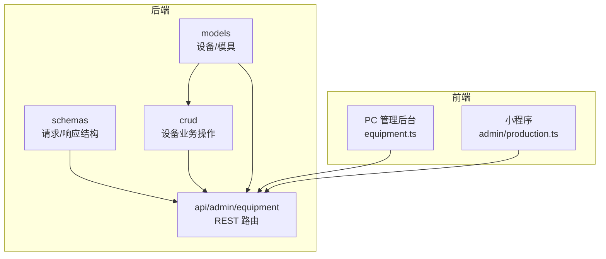
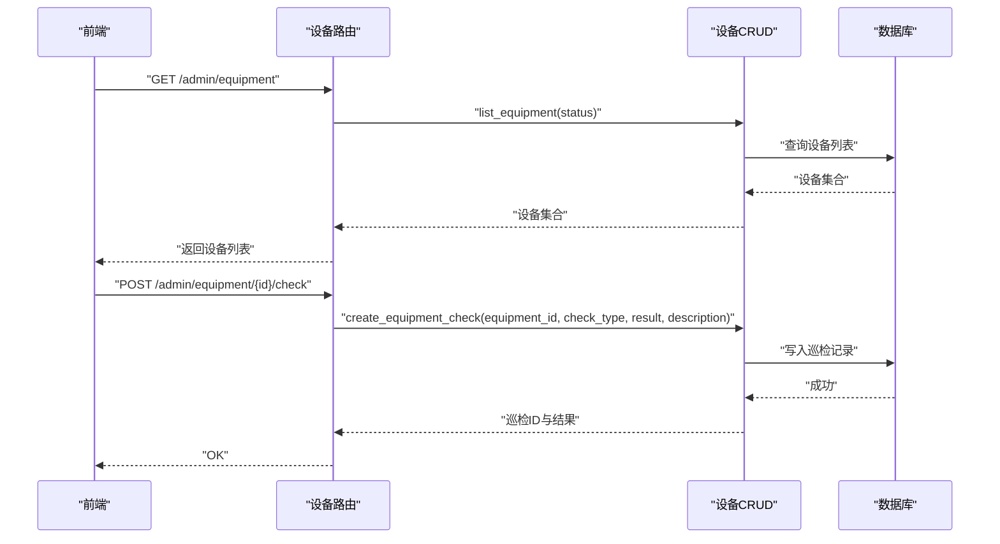
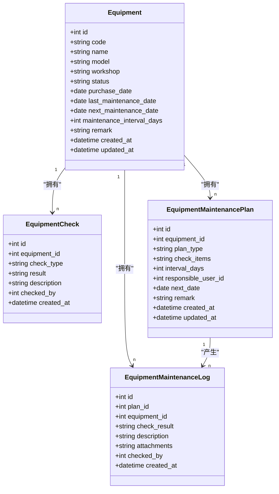
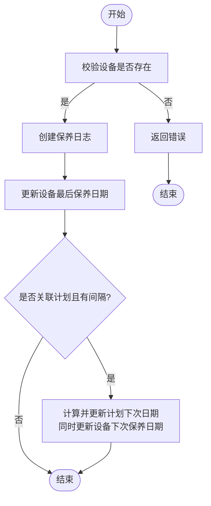
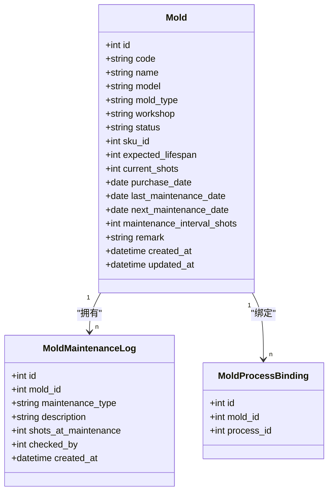
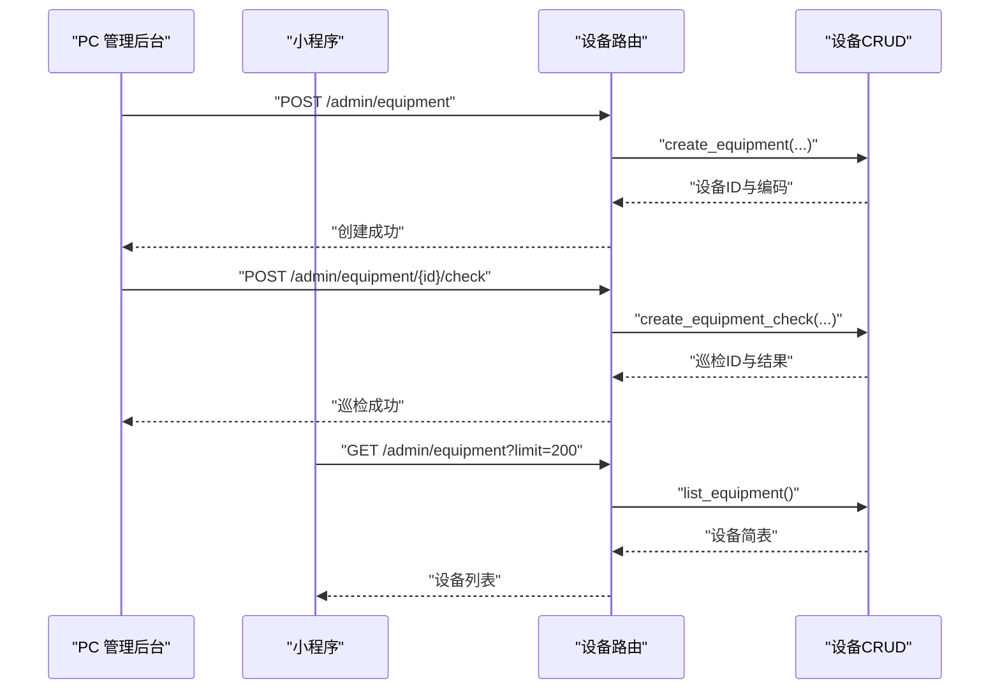
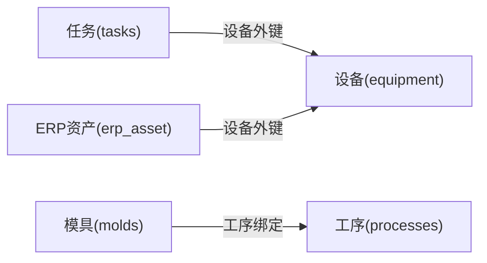

# 设备对接与外部集成

<cite>
**本文引用的文件**   
- [backend/app/models/equipment.py](file://backend/app/models/equipment.py)
- [backend/app/crud/equipment.py](file://backend/app/crud/equipment.py)
- [backend/app/schemas/equipment.py](file://backend/app/schemas/equipment.py)
- [backend/app/api/admin/equipment/router.py](file://backend/app/api/admin/equipment/router.py)
- [backend/app/models/mold.py](file://backend/app/models/mold.py)
- [frontend-admin-pro/src/api/equipment.ts](file://frontend-admin-pro/src/api/equipment.ts)
- [lightmes-miniapp/src/api/admin/production.ts](file://lightmes-miniapp/src/api/admin/production.ts)
</cite>

## 目录
1. [引言](#引言)
2. [项目结构定位](#项目结构定位)
3. [核心组件](#核心组件)
4. [架构总览](#架构总览)
5. [详细组件分析](#详细组件分析)
6. [依赖关系分析](#依赖关系分析)
7. [性能与可靠性考虑](#性能与可靠性考虑)
8. [故障排查指南](#故障排查指南)
9. [结论](#结论)

## 引言
本文聚焦 CenkorMES 中“设备/工装管理”及其与生产环节的关系，并明确对外集成边界。系统以 FastAPI 后端、SQLAlchemy 模型、Pydantic Schema、CRUD 层与 API 路由分层组织；设备与模具作为制造资源，贯穿排产、派工、报工、质检与成本核算等生产流程。对外集成主要通过 REST API 暴露设备台账、巡检、保养计划与日志能力，前端覆盖 PC 管理后台与小程序端。

## 项目结构定位
围绕设备/工装管理的代码主要分布在以下位置：
- 数据模型：设备与模具的实体定义位于 models 层。
- 业务操作：设备 CRUD、检查、保养计划与日志逻辑位于 crud 层。
- 接口契约：输入输出结构体位于 schemas 层。
- 对外接口：设备相关 REST 路由集中在 admin/equipment 模块。
- 前端调用：PC 管理后台与小程序分别通过 api 封装调用设备接口。

**图表来源**
- [backend/app/models/equipment.py:11-75](file://backend/app/models/equipment.py#L11-L75)
- [backend/app/models/mold.py:12-65](file://backend/app/models/mold.py#L12-L65)
- [backend/app/crud/equipment.py:16-269](file://backend/app/crud/equipment.py#L16-L269)
- [backend/app/schemas/equipment.py:9-102](file://backend/app/schemas/equipment.py#L9-L102)
- [backend/app/api/admin/equipment/router.py:41-282](file://backend/app/api/admin/equipment/router.py#L41-L282)
- [frontend-admin-pro/src/api/equipment.ts:42-80](file://frontend-admin-pro/src/api/equipment.ts#L42-L80)
- [lightmes-miniapp/src/api/admin/production.ts:60-76](file://lightmes-miniapp/src/api/admin/production.ts#L60-L76)

**章节来源**
- [backend/app/models/equipment.py:11-75](file://backend/app/models/equipment.py#L11-L75)
- [backend/app/models/mold.py:12-65](file://backend/app/models/mold.py#L12-L65)
- [backend/app/crud/equipment.py:16-269](file://backend/app/crud/equipment.py#L16-L269)
- [backend/app/schemas/equipment.py:9-102](file://backend/app/schemas/equipment.py#L9-L102)
- [backend/app/api/admin/equipment/router.py:41-282](file://backend/app/api/admin/equipment/router.py#L41-L282)
- [frontend-admin-pro/src/api/equipment.ts:42-80](file://frontend-admin-pro/src/api/equipment.ts#L42-L80)
- [lightmes-miniapp/src/api/admin/production.ts:60-76](file://lightmes-miniapp/src/api/admin/production.ts#L60-L76)

## 核心组件
- 设备主数据（Equipment）：编码、名称、型号、车间、状态、采购日期、最后/下次保养日期、保养间隔天数、备注。
- 设备巡检（EquipmentCheck）：记录每次点检类型、结果、描述与执行人。
- 设备保养计划（EquipmentMaintenancePlan）：按日/周/月周期维护检查项、间隔天数、责任人、下次计划日期。
- 设备保养日志（EquipmentMaintenanceLog）：关联计划或独立执行，记录检查结果、附件、执行人，并联动更新设备与计划的下次保养时间。
- 模具主数据（Mold）：编码、名称、型号、类型、车间、状态、关联 SKU、寿命与模次、维保间隔、维保记录。
- 模具工序绑定（MoldProcessBinding）：将模具与具体工序关联，用于工艺约束与产能规划。

这些组件共同构成“设备/工装”主数据与生命周期管理能力，为生产排程、派工、报工与质量追溯提供资源维度。

**章节来源**
- [backend/app/models/equipment.py:11-75](file://backend/app/models/equipment.py#L11-L75)
- [backend/app/models/mold.py:12-65](file://backend/app/models/mold.py#L12-L65)

## 架构总览
设备/工装管理在系统中的职责边界如下：
- 对外边界：通过 admin/equipment 路由暴露设备台账、巡检、保养计划与日志的增删改查接口，统一受权限控制。
- 对内边界：与生产任务（tasks）、工单（work_orders）、报工（reports/report_units）、物料（material_issue）、ERP 资产（erp_asset）等存在间接关联，但设备/工装本身不直接驱动生产事件，而是作为资源被引用。
- 前端边界：PC 管理后台负责设备全量管理与保养计划配置；小程序侧提供设备列表查询，供现场作业场景使用。

**图表来源**
- [backend/app/api/admin/equipment/router.py:46-57](file://backend/app/api/admin/equipment/router.py#L46-L57)
- [backend/app/api/admin/equipment/router.py:128-149](file://backend/app/api/admin/equipment/router.py#L128-L149)
- [backend/app/crud/equipment.py:24-34](file://backend/app/crud/equipment.py#L24-L34)
- [backend/app/crud/equipment.py:95-112](file://backend/app/crud/equipment.py#L95-L112)

## 详细组件分析

### 设备主数据与生命周期
- 字段设计强调可运维性：包含采购日期、最后/下次保养日期与保养间隔天数，便于计划与预警。
- 唯一约束保证设备编码全局唯一，避免重复录入。
- 状态字段支持启用/停用等生命周期管理。

**图表来源**
- [backend/app/models/equipment.py:11-75](file://backend/app/models/equipment.py#L11-L75)

**章节来源**
- [backend/app/models/equipment.py:11-75](file://backend/app/models/equipment.py#L11-L75)

### 设备巡检与保养计划/日志
- 巡检：记录点检类型（如日常/专项）、结果与描述，关联当前用户。
- 保养计划：支持按日/周/月设置检查项与间隔天数，指定责任人与下次计划日期。
- 保养日志：可关联计划执行，也可独立记录；创建日志时自动更新设备的“最后保养日期”，若关联计划且含间隔天数，则同步更新“下次保养日期”。

**图表来源**
- [backend/app/crud/equipment.py:238-269](file://backend/app/crud/equipment.py#L238-L269)

**章节来源**
- [backend/app/crud/equipment.py:95-112](file://backend/app/crud/equipment.py#L95-L112)
- [backend/app/crud/equipment.py:153-174](file://backend/app/crud/equipment.py#L153-L174)
- [backend/app/crud/equipment.py:238-269](file://backend/app/crud/equipment.py#L238-L269)

### 模具与工序绑定
- 模具台账：包含类型（注塑/压铸/冲压/其他）、状态、SKU 关联、寿命与模次、维保间隔等。
- 模具维保记录：记录预防性/纠正性/点检类维保及模次信息。
- 模具与工序绑定：将模具与具体工序关联，用于工艺约束与排产参考。

**图表来源**
- [backend/app/models/mold.py:12-65](file://backend/app/models/mold.py#L12-L65)

**章节来源**
- [backend/app/models/mold.py:12-65](file://backend/app/models/mold.py#L12-L65)

### 对外集成边界（API 与前端）
- 权限边界：设备路由整体受权限控制，需具备“equipment.manage”权限。
- 设备管理接口：
  - 列表查询：支持按状态过滤，导出 Excel。
  - 新增/更新：编码自动生成或校验唯一性，支持基础信息与保养参数更新。
  - 巡检记录：提交点检结果并记录执行人。
- 保养计划接口：
  - 列表/新增/更新/删除：支持按设备筛选，维护检查项、间隔与责任人。
- 保养日志接口：
  - 列表/新增：支持关联计划，记录检查结果与附件。
- 前端调用：
  - PC 管理后台：完整设备管理、保养计划与日志操作。
  - 小程序：提供设备列表查询，供现场作业快速选择设备。

**图表来源**
- [backend/app/api/admin/equipment/router.py:71-93](file://backend/app/api/admin/equipment/router.py#L71-L93)
- [backend/app/api/admin/equipment/router.py:128-149](file://backend/app/api/admin/equipment/router.py#L128-L149)
- [backend/app/api/admin/equipment/router.py:46-57](file://backend/app/api/admin/equipment/router.py#L46-L57)
- [frontend-admin-pro/src/api/equipment.ts:42-80](file://frontend-admin-pro/src/api/equipment.ts#L42-L80)
- [lightmes-miniapp/src/api/admin/production.ts:60-76](file://lightmes-miniapp/src/api/admin/production.ts#L60-L76)

**章节来源**
- [backend/app/api/admin/equipment/router.py:41-282](file://backend/app/api/admin/equipment/router.py#L41-L282)
- [frontend-admin-pro/src/api/equipment.ts:42-80](file://frontend-admin-pro/src/api/equipment.ts#L42-L80)
- [lightmes-miniapp/src/api/admin/production.ts:60-76](file://lightmes-miniapp/src/api/admin/production.ts#L60-L76)

## 依赖关系分析
- 设备与生产任务的关联：任务模型中包含设备外键，表示任务可在特定设备上执行，从而将设备能力纳入派工与排产。
- 设备与 ERP 资产的关联：ERP 资产模型中包含设备外键，用于财务视角的设备资产管理。
- 模具与工序绑定：将模具与工序关联，影响工艺路线与产能评估。
- 设备与仓库领料无直接外键，但设备运行消耗物料可通过工单与领料单间接体现。

**图表来源**
- [backend/app/models/task.py:28-28](file://backend/app/models/task.py#L28-L28)
- [backend/app/models/erp_asset.py:24-24](file://backend/app/models/erp_asset.py#L24-L24)
- [backend/app/models/mold.py:55-65](file://backend/app/models/mold.py#L55-L65)

**章节来源**
- [backend/app/models/task.py:28-28](file://backend/app/models/task.py#L28-L28)
- [backend/app/models/erp_asset.py:24-24](file://backend/app/models/erp_asset.py#L24-L24)
- [backend/app/models/mold.py:55-65](file://backend/app/models/mold.py#L55-L65)

## 性能与可靠性考虑
- 列表查询分页：设备、保养计划与日志均支持 offset/limit 分页，避免大数据量一次性加载。
- 唯一性与一致性：设备编码唯一约束，新增/更新时进行重复校验，减少脏数据。
- 事务与回滚：API 层在写入后提交事务，异常路径抛出 HTTP 错误，保证数据一致性。
- 前端缓存：小程序侧设备列表采用有限条数限制，降低网络与渲染压力。

[本节为通用指导，不直接分析具体文件]

## 故障排查指南
- 设备不存在：更新/巡检/保养计划/日志接口在找不到设备时返回错误，需确认设备 ID 与状态。
- 编码冲突：新增或修改设备编码时若已存在，会返回冲突错误，应更换编码或修正输入。
- 保养计划不存在：更新/删除保养计划时若计划不存在，返回错误，需核对计划 ID。
- 权限不足：设备路由整体受权限控制，缺少“equipment.manage”权限将无法访问。

**章节来源**
- [backend/app/api/admin/equipment/router.py:103-107](file://backend/app/api/admin/equipment/router.py#L103-L107)
- [backend/app/api/admin/equipment/router.py:187-190](file://backend/app/api/admin/equipment/router.py#L187-L190)
- [backend/app/api/admin/equipment/router.py:212-214](file://backend/app/api/admin/equipment/router.py#L212-L214)
- [backend/app/api/admin/equipment/router.py:236-238](file://backend/app/api/admin/equipment/router.py#L236-L238)
- [backend/app/api/admin/equipment/router.py:41-41](file://backend/app/api/admin/equipment/router.py#L41-L41)

## 结论
CenkorMES 的设备/工装管理以清晰的模型与分层实现，提供设备台账、巡检、保养计划与日志的全生命周期管理能力，并通过权限控制的 REST API 暴露给 PC 管理后台与小程序。设备与任务、ERP 资产、模具与工序之间存在明确的关联关系，支撑排产、派工、报工与成本核算等生产环节。对外集成边界清晰，适合中小型加工厂私有部署与二次扩展。