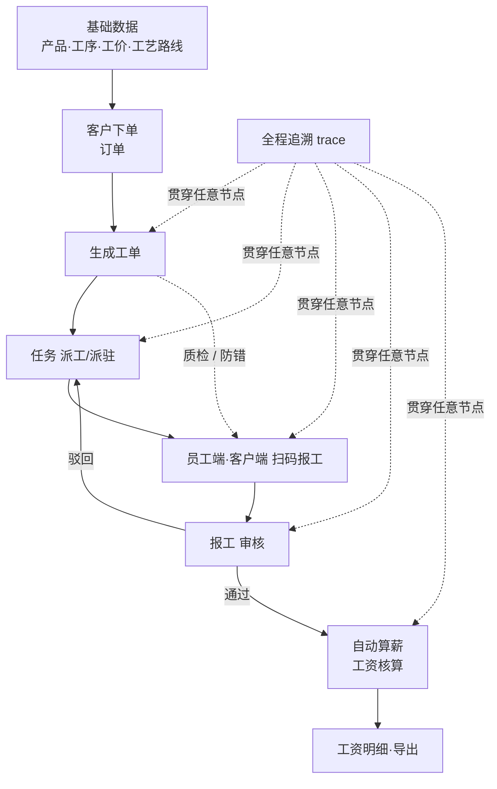
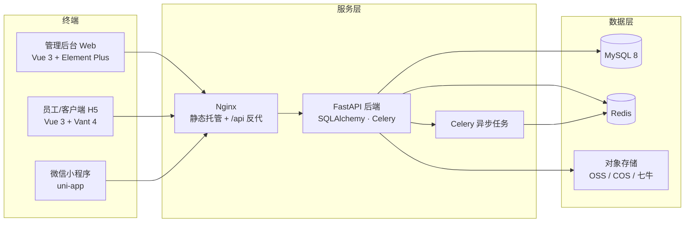

# CenkorMES

> 轻量化的单租户**私有部署 MES** —— 聚焦中小型加工厂的核心生产管理闭环。
> 基于开源的制造执行系统重构，强调开箱即用、安全可控、多端协同。

[](LICENSE)
[](backend/requirements.txt)
[](#)
[](#)
[](#)
[](#)

---

## 为什么选择 CenkorMES

- **一条命令开箱即用**：`docker compose up -d --build` 拉起 后端 + MySQL 8 + Redis + 管理后台 + 员工 H5，前端内置 Nginx 自动 `/api` 反代。
- **核心生产闭环完整**：排产 / 工单 / 派工 / 扫码报工 / 质检 / 自动算薪 / 全程追溯，交付即用。
- **多端协同**：PC 管理后台、员工与客户端 H5、微信小程序，扫码报工即得。
- **安全合规打磨**：登录失败限流（Redis 可回退）、上传文件类型与活动内容检测、日志脱敏、生产环境 JWT 强密钥校验。
- **私有部署可控**：单租户，数据完全自持；支持 Docker、手动、宝塔/ Nginx 多种部署；可导出离线安装包、跨架构构建。

---

## 核心业务闭环

```
产品/型号 → 工序/工价 → 客户/订单 → 工单 → 任务派驻 → 扫码报工 → 审核 → 自动算薪
```



---

## 系统架构



---

## 技术栈

| 层 | 技术 |
|----|------|
| 后端 | FastAPI · SQLAlchemy · Celery · Pydantic · Alembic |
| 数据库 / 缓存 | MySQL 8 · Redis |
| PC 管理后台 | Vue 3 · Element Plus · Pinia · ECharts · bpmn-js |
| 移动端 H5 | Vue 3 · Vant 4 |
| 小程序 | uni-app |
| 智能化 / 排产 | Google OR-Tools · Prophet · scikit-learn · OpenAI SDK |
| 部署 | Docker Compose · Nginx · Buildx（多架构） |

---

## 快速开始

### 环境要求

| 方式 | 依赖 |
|------|------|
| Docker 部署 | Docker 20+ / Compose v2 |
| 手动部署 | Python 3.10+ · Node.js 18+ · MySQL 5.7+/8.x，Redis（可选） |

### 方式一：Docker 一键启动（推荐，开箱即用）

```bash
docker compose up -d --build
```

- 首启自动建表并创建默认管理员 `admin / admin123`。
- 未设置 `JWT_SECRET` 时自动生成临时随机密钥保证一键可起；**正式部署请在仓库根 `.env` 配置固定强密钥**（≥32 位）。
- 访问地址（可在仓库根 `.env` 覆盖端口 `APP_PORT` / `WEB_ADMIN_PORT` / `WEB_H5_PORT`）：

| 服务 | 地址 |
|------|------|
| 后端 API（含 `/docs`） | `http://localhost:8000` |
| 管理后台 | `http://localhost:8080` |
| 员工 H5 | `http://localhost:8081` |

注入完整演示数据（可选、幂等，可重复执行）：

```bash
bash docker/scripts/init-demo.sh
```

### 方式二：手动启动

**1) 后端**

```bash
cd backend
python -m venv venv && source venv/bin/activate
pip install -r requirements.txt
cp env.example .env        # 编辑 DB_URL 与 JWT_SECRET
uvicorn app.main:app --host 0.0.0.0 --port 8000 --reload
```

**2) PC 管理后台**

```bash
cd frontend-admin-pro
npm install
npm run dev -- --port 5174   # 访问 http://localhost:5174
```

**3) H5 移动端**

```bash
cd frontend-h5
npm install
npm run dev -- --port 5173   # 访问 http://localhost:5173
```

> vite 开发代理默认将 `/api` 转发到 `127.0.0.1:8000`；可用 `VITE_API_PROXY` 指定其它后端地址（如本机 8000 被占用时），`./start.sh` 会自动跟随后端端口。

### 方式三：一条命令（本地开发 / 演示）

```bash
./start.sh                          # dev：后端 :8000 + 管理后台 :5174 + H5 :5173
./start.sh --prod                   # prod：后端无热重载，前端 build 后 preview 托管
BACKEND_PORT=8500 ./start.sh        # 后端端口被占用时，前端自动跟随
```

---

## 绑定域名与 HTTPS（Docker 部署 · 可选）

容器内 nginx 已内置「静态托管 + `/api` 反代」，默认通过 `IP:端口`（`8080` 管理后台 / `8081` H5 / `8000` API）访问。要对外使用**域名 + HTTPS**，在后端默认**不校验 Host** 的前提下，只需在宿主机加一层**入口代理**把域名转发到对应端口即可：

- **宝塔面板**：DNS 把两个子域名 A 记录指向服务器 IP → 添加两个站点绑定域名 → 各自在「反向代理」填 `http://127.0.0.1:8080`（管理后台）/ `http://127.0.0.1:8081`（H5）→ 站点 SSL 申请 Let's Encrypt 证书并强制 HTTPS。
- **系统 Nginx**：反代到 `127.0.0.1:8080 / 8081`，用 `certbot --nginx` 自动签发证书。
- 若在 `.env` 配置了 `TRUSTED_HOSTS`（Host 白名单），务必把域名加入，否则访问会被 403 拦截。
- 需要后端识别 HTTPS（避免生成 `http://` 链接）时，在入口反代追加 `proxy_set_header X-Forwarded-Proto https;`，并将 `PUBLIC_BASE_URL` / `H5_PUBLIC_BASE_URL` 指向 HTTPS 地址。

> 完整配置示例与 `TRUSTED_HOSTS` 说明见 [`docs/DEPLOYMENT.md`](docs/DEPLOYMENT.md) 第 4 节。

---

## 默认账号

| 账号 | 说明 |
|------|------|
| `admin` / `admin123` | 系统管理员（首启自动创建，**请及时修改密码**） |
| `123456` | 演示数据账号（执行 `seed_demo.py` / `init-demo.sh` 后可用） |

---

## 常用配置（`.env`）

| 项 | 说明 |
|----|------|
| `JWT_SECRET` | JWT 密钥，生产建议 ≥32 位随机串，缺失时容器入口自动生成临时密钥 |
| `APP_PORT` / `WEB_ADMIN_PORT` / `WEB_H5_PORT` | Docker 部署的对外端口 |
| `DB_URL` | MySQL 连接串 |
| `STORAGE_DRIVER` | 本地磁盘 / 阿里云 OSS / 腾讯云 COS / 七牛 |
| `REDIS_URL` / `CELERY_*` | 缓存与异步任务 |

---

## 项目结构

```
cenkormes/
├── backend/                 # FastAPI 后端
│   ├── app/                 #   ├─ api / core / models / schemas
│   │                        #   └─ crud / services / tasks
│   ├── alembic/             # 数据库迁移
│   ├── Dockerfile           # 后端镜像（已精简，纯 PyMySQL）
│   └── requirements.txt
├── frontend-admin-pro/      # PC 管理后台 (Vue 3 + Element Plus)
├── frontend-h5/             # H5 移动端 (Vue 3 + Vant 4)
├── lightmes-miniapp/        # 微信小程序 (uni-app, 员工版)
├── docker/
│   ├── frontend/            # 前端多阶段构建镜像
│   ├── nginx/               # 前端容器 nginx 配置（/api 反代）
│   └── scripts/             # 容器入口 / 演示数据 / 离线导出
├── docker-compose.yml       # 全栈一键部署
└── docs/                    # 部署指南等
```

---

## 文档

- [部署指南 `docs/DEPLOYMENT.md`](docs/DEPLOYMENT.md) —— Docker 一键部署、手动部署、端口覆盖、Nginx 反代、离线安装包与多架构构建
- [与商业版对比 `docs/cenkormes-vs-lightmes.html`](docs/cenkormes-vs-lightmes.html) —— 开源独立版与商业 SaaS 版的完整能力差异
- [安全公告 `SECURITY.md`](SECURITY.md) —— 安全策略与漏洞上报
- [版本说明 `VERSION`](VERSION)

---

## 生态与商业版

本仓库为 **开源独立版**（单租户私有部署，AGPL-3.0）。与之配套的商业 **SaaS 版** 采用多租户云模式并面向商用收费：

| 维度 | 开源独立版（本仓库 cenkormes） | 商业 SaaS 版 |
|------|------------------------------|--------------|
| 部署 | 单租户自部署 | 多租户云 SaaS |
| 许可 | ✅ 开源（AGPL-3.0） | 商业授权 |
| SaaS 平台层（租户/套餐/订阅） | ✕ | ✅ |
| AI 员工 / 行业模板 / 报价 | ✕ | ✅ |
| 核心制造闭环 | ✅ | ✅ |
| 飞书 / 钉钉 / 企微消息通道 | ✅ | ✅ |

完整差异见 [`docs/cenkormes-vs-lightmes.html`](docs/cenkormes-vs-lightmes.html)。

---

## 贡献

欢迎提交 Issue 与 Pull Request。请遵循既有代码风格，并在修改后运行后端测试：

```bash
cd backend && source venv/bin/activate
pytest tests
```

---

## 许可证与致谢

本项目采用 **AGPL-3.0** 开源协议，详见 [LICENSE](LICENSE)。

系统深度构建于 Vue、Element Plus、FastAPI、SQLAlchemy、Celery、Apache ECharts 等众多优秀开源项目之上，我们严格按照各上游许可证（MIT / Apache-2.0 / BSD-3-Clause / ISC / HPND）分发并保留版权声明。完整、逐条的第三方依赖许可证与版权信息，请参阅 [THIRD_PARTY_NOTICES.md](THIRD_PARTY_NOTICES.md) 与 [LICENSE](LICENSE)。